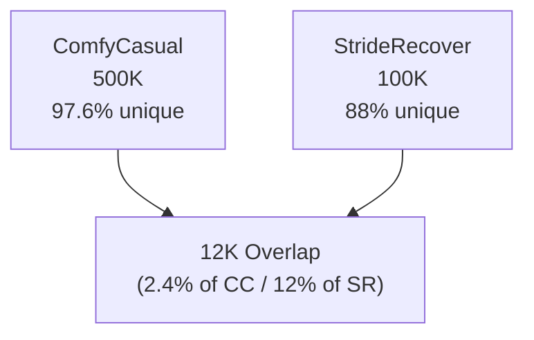
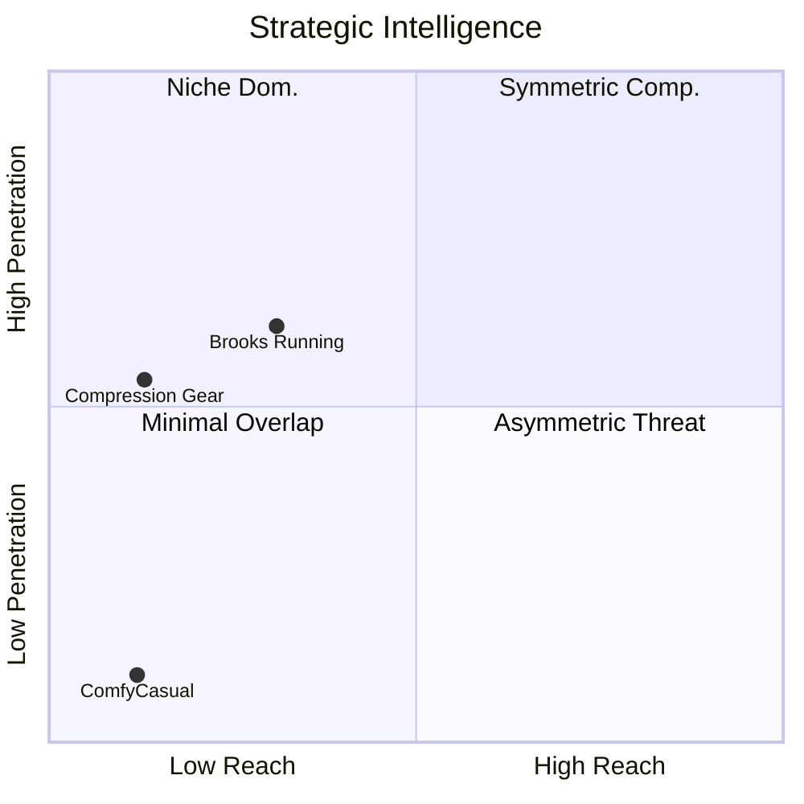
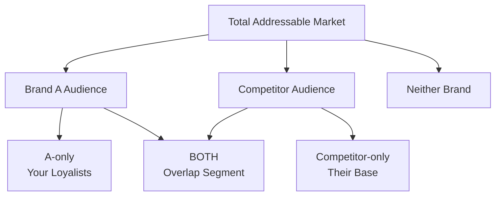

# 3 Layer 1 - Strategic Intelligence



### 3.1 What Strategic Intelligence Answers

Before we can understand what our audience wants or how to reach them, we need to understand where we actually sit in the competitive landscape. Strategic Intelligence answers the foundational questions that shape everything else:

* **Who are our real competitors?** Not the brands in our category, but the brands competing for our audience's attention and wallet.  
* **Where does our audience overlap with other brands?** Which brands touch our customers, and how much of their audience have we captured?  
* **How vulnerable are we to competitive threats?** Are competitors pulling our audience away, or are we operating in different markets?  
* **What does our competitive landscape actually look like?** Beyond market share charts and feature comparisons, what does the battlefield reveal?

These aren't questions about product features or pricing. They're questions about audience dynamics: who's actually fighting for the same people, and who just looks like they are.

### 3.2 Why Traditional Competitive Analysis Can Fall Short

Many traditional competitive analyses focus on metrics that don’t fully capture the dynamics that drive customer behavior. While they provide useful context, they can overlook the audience, motivations, and actionable insights that inform strategy.

Traditional frameworks compare:

* **Market share** (who sells more units)  
* **Product features** (who has better specs)  
* **Price positioning** (premium vs. value)  
* **Category membership** (we're both "athletic footwear" or "comfort brands")  
* **Distribution overlap** (we both sell on Amazon)

The assumption underlying all of this is: *we're competing for the same customers.*

But what if that assumption is wrong?

What if two brands that look like direct competitors - same category, similar products, overlapping price points, shared retail channels - are actually serving almost entirely different audiences with entirely different needs?

This is where *Strategic Intelligence* separates perception from reality.

### 3.3 The StrideRecover vs. ComfyCasual Case

Let me show you what this looks like with a detailed example.

#### The Setup: Perceived Competition

Imagine you're the CMO of **StrideRecover**, a recovery-focused athletic footwear brand. Your products are foam-based slides and sandals with biomechanical arch support, positioned as "Active Recovery for Serious Athletes". Price point: $60-100. Your messaging emphasizes *impact absorption*, *recovery benefits*, and *getting athletes back to training faster*.

You're in a quarterly strategy meeting, reviewing your competitive landscape. The analysis shows:

**Market Category:** `Comfort Footwear - Athletic/Casual`

**Key Competitors:**
1. ComfyCasual  
2. \[Other recovery brands\]  
3. \[Traditional athletic footwear\]

**ComfyCasual** is a massive player in all-day comfort footwear - foam clogs and slides in bold colors, highly customizable, positioned as *"Comfort That Moves With You"*. They have 5x your marketing budget, celebrity endorsements, viral social media presence, and distribution everywhere.

The competitive logic seems well founded:

* Both brands make foam-based comfort footwear  
* Both emphasize "all-day comfort" in messaging  
* Both use similar materials and manufacturing processes  
* Both sell through Amazon, specialty retailers, and some big-box stores  
* Price points overlap significantly ($45-100 range)  
* Both target comfort-seeking consumers

Your board asks the obvious question: **"How do we compete with ComfyCasual? They're crushing us in brand awareness. Should we add more colors? Launch celebrity collaborations? Pivot our messaging to be more lifestyle-focused like theirs?"**

This is the moment when brands risk making a critical strategic error.

They see *category* similarity and assume *audience* similarity. They see a bigger competitor with successful tactics and try to copy those tactics. They chase *brand awareness* and *market share* without understanding who they're actually fighting for.

*Strategic Intelligence* reveals something completely different.

#### The Analysis: What the Data Actually Shows

Let's examine the audience overlap using the three key metrics: **Reach, Penetration, and Affinity**.

**The basic numbers:**

* StrideRecover audience: 100,000 engaged followers (social platforms)  
* ComfyCasual audience: 500,000 engaged followers  
* People who engage with **both** brands: 12,000

At first glance, 12,000 overlapping customers seems significant. That's a lot of people\! Surely this confirms they're competing for the same audience.

But let's apply the Strategic Intelligence framework.

**REACH: What percentage of StrideRecover's audience also engages with ComfyCasual?**

*Calculation*: 12,000 overlap ÷ 100,000 StrideRecover audience \= **12% reach**

*Translation*: ComfyCasual touches only 12% of StrideRecover's audience. That means **88% of StrideRecover's customers don't care about ComfyCasual at all.** They're not following them, not engaging with them, not considering them.

**PENETRATION: What percentage of ComfyCasual's audience also engages with StrideRecover?**

*Calculation*: 12,000 overlap ÷ 500,000 ComfyCasual audience \= **2.4% penetration**

*Translation*: StrideRecover has captured only 2.4% of ComfyCasual's massive audience. StrideRecover is **barely on their radar.** Despite being in the same category, StrideRecover isn't successfully converting ComfyCasual's customers.

**The strategic picture:**



This is **asymmetric non-competition.**

ComfyCasual isn't stealing StrideRecover's audience (only 12% overlap). StrideRecover isn't winning ComfyCasual's audience (only 2.4% penetration). They're operating in markets that happen to have a small intersection.

It's like saying Mercedes and Honda compete because some households own cars from both brands. The overlap exists, but they're fundamentally serving different audiences with different needs, different purchase criteria, and different use cases.

But the real insight - the *why* behind these numbers - comes from examining what each audience actually cares about.

#### The Pattern Divergence: Who These Audiences Really Are

When we analyze **affinity patterns** (what each audience engages with far more than the general population) two distinct psychographic profiles emerge.

<div style="border-left:5px solid #4F46E5; background-color:#F3F4F6; padding:1em; margin-bottom:1em; border-radius:8px;">
<h4 style="margin-top:0;">StrideRecover Audience: The Active Family Manager</h4>

**Key Affinities:**  

**Running Ecosystem:**  
- **Brooks Running:** 31x affinity, 30.7% reach  
- **Saucony:** 44x affinity, 18.2% reach  
- **HOKA ONE ONE:** 55x affinity, 13.2% reach  
- **Boston Marathon:** 20x affinity, 20.5% reach  
- **Runner's World magazine:** 12x affinity, 30.7% reach  
- **Running Times:** 37x affinity, 21.8% reach  

**Performance & Recovery:**  
- **Sports nutrition brands:** 83x affinity, 23.1% reach  
- **Performance tracking devices:** 35x affinity, 18.7% reach  
- **Compression gear:** 119x affinity, 12.7% reach  
- **Physical therapy & recovery content:** 28x affinity  

**Wellness & Health:**  
- **Organic and natural foods:** 8x affinity, 43.9% reach  
- **Vitamins and supplements:** 6x affinity, 48% reach  
- **Whole Foods Market:** 5x affinity, 30.1% reach  
- **Health-focused meal prep:** 15x+ affinity  

**Demographics:**  
- Age 35-55 (Gen X), 1.7x affinity, 47.5% reach  
- Married: 1.5x affinity, 61% reach  
- Has children: 1.5x affinity, 50.1% reach  
- Employed full-time: 1.2x affinity, 83.6% reach  

**Lifestyle Indicators:**  
- Premium home comfort brands: 100x affinity, 15.3% reach  
- Home goods: 60x affinity, 20.3% reach  
- Family retailers: Target 4.2x (32% reach), Amazon 3.8x (39.8% reach)  
- News sources: NYT 1.4x (60.3% reach), WSJ 1.5x (45.4% reach)  


These aren’t casual joggers. They are highly committed endurance athletes who invest in performance, recovery, and wellness. Moderate-affinity, high-reach wellness brands show this orientation is pervasive, not niche.


**Who are they?**  
- Gen X adults, married, full-time employed with children  
- Identity-defining runners, structuring life around training  

**Motivations:**  
- Performance optimization, holistic wellness  
- Recovery is as important as training; they invest in products with measurable benefits  

**Comfort = Recovery:**  
- Functional support (joint impact reduction, arch support, foam technology)  
- Not casual; comfort is a tool for performance
</div>


<div style="border-left:5px solid #02C2BB; background-color:#EFF3F3; padding:1em; margin-bottom:1em; border-radius:8px;">
<h4 style="margin-top:0;">ComfyCasual Audience: The Social-First Youth</h4>

**Key Affinities:**  

**Entertainment & Pop Culture:**  
- **Taylor Swift:** 1.7x affinity  
- **Disney properties:** 3.5x affinity  
- **Marvel:** 2.5x affinity  
- **YouTube personalities:** 1.7x affinity  
- **MrBeast:** 3.4x affinity  
- **Gaming content & streamers:** 2-3x affinity  

**Fast Food & Casual Dining:**  
- McDonald’s: 4.6x affinity  
- Domino’s Pizza: 5.9x affinity  
- Taco Bell: 3.7x affinity  
- Chipotle: 4.7x affinity  
- Wendy’s: 3.3x affinity  

**Beverages & Snacks:**  
- Pepsi: 5.5x affinity  
- Coca-Cola: 4.9x affinity  
- Doritos: 7.8x affinity  
- Reese’s: 10x affinity  
- Energy drinks: 4-5x affinity  

**Fashion & Self-Expression:**  
- Fast fashion: 3-4x affinity  
- Sneaker culture (fashion-focused): 2-3x affinity  
- Beauty & makeup influencers: 2-4x affinity  
- TikTok fashion trends: high engagement  

**Demographics:**  
- Age 18-28 (Gen Z), students, single, urban/suburban  

**Lifestyle Indicators:**  
- Streaming platforms: Netflix 2-3x, gaming streams 3x  
- Social media natives: TikTok, Instagram  
- Mobile gaming: 3x affinity  
- Music festivals/concerts: 2-3x affinity  


This audience is *digitally native*, *pop-culture engaged*, and *lifestyle-driven*. Moderate affinities at high reach indicate mainstream touchpoints, while high snack/brand affinities show distinctive, trend-driven preferences.


**Who are they?**  
- Gen Z, students or early career, social and trend-oriented  
- Social media is their lens for culture  

**Motivations:**  
- Self-expression, social belonging, cultural relevance  
- Brands act as badges of identity; authenticity matters  

**Comfort = Ease & Versatility:**  
- All-day wearability for classes, hangouts, errands  
- Slip-on convenience, fun colors, customization  
- Comfort is casual, social, effortless
</div>


#### The Side-by-Side Reality

Let me put this in stark relief:

| Dimension | StrideRecover Audience | ComfyCasual Audience |
| ----- | ----- | ----- |
| **Age** | Gen X (35-55), 1.7x affinity, 47.5% reach | Gen Z (18-28), 1.3x affinity |
| **Life Stage** | Married (1.5x, 61%), Children (1.5x, 50%), Employed (1.2x, 84%) | Students (1.5x), Single |
| **Top Brand Affinities** | Brooks Running (31x, 30.7%), Saucony (44x, 18.2%), Boston Marathon (20x, 20.5%), Sports nutrition (83x, 23.1%), Whole Foods (5x, 30.1%) | McDonald's (4.6x), Disney (3.5x), Taylor Swift (1.7x), Doritos (7.8x), Pepsi (5.5x) |
| **Core Motivation** | Performance optimization, health & recovery, family wellbeing | Self-expression & belonging, cultural relevance, social connection |
| **"Comfort" Definition** | Biomechanical support, recovery-enabling, injury prevention | All-day ease, versatile casualness, comfortable self-expression |
| **Media Consumption** | Runner's World (12x, 30.7%), NYT/WSJ (1.4-1.5x, 45-60%), fitness podcasts, training content | YouTube creators (1.7x), TikTok (high engagement), gaming streams, entertainment news |
| **Spending Patterns** | Premium performance gear, specialized nutrition, fitness tech, quality home goods | Fast food & casual dining, entertainment & streaming, fashion & beauty, social experiences |

**Audience Overlap:** Only 12% of StrideRecover audience / 2.4% of ComfyCasual audience

The same word, "**comfort**", means **completely different things** to these two groups:
- For StrideRecover's audience, comfort is a functional attribute measured in impact absorption and recovery time.
- For ComfyCasual's audience, comfort is an aesthetic and lifestyle attribute measured in versatility and self-expression.

#### The Strategic Insight


StrideRecover and ComfyCasual are not competitors.


They use similar materials. They occupy similar price points. They both market "comfort". But they serve fundamentally different audiences with fundamentally different needs:

- **StrideRecover \= Functional recovery for performance athletes**  
- **ComfyCasual \= Casual versatility for social-first youth**

The 12% audience overlap exists, but it's **not competitive overlap**. It exists because:

1. Some younger athletes wear ComfyCasual for casual, non-athletic occasions (they wouldn't wear recovery footwear to a concert)  
2. Some older casual wearers appreciate StrideRecover's comfort for everyday use (even if they're not training)  
3. Families buy both brands for different household members: parents wear StrideRecover, kids wear ComfyCasual

These are **different purchase occasions, different use cases, different decision criteria**. The overlap is *incidental*, not competitive.

#### The Implications: What This Changes

Understanding this fundamentally reshapes StrideRecover's strategy.

##### What StrideRecover **should** do

###### Stop worrying about ComfyCasual's marketing budget

They're playing a different game. Their brand awareness doesn't threaten your positioning.


###### Stop considering "fun colors and customization" to compete

Your audience doesn't care about that. They care about recovery science and performance benefits.


###### Double down on recovery science and performance positioning

This is your differentiation. Own it completely. Talk about impact absorption, biomechanics, injury prevention, getting back to training faster.


###### Focus competitive energy on other performance-recovery brands

Your real threats are brands competing for the same serious athlete audience - other recovery footwear, compression gear, sports massage tools, premium athletic footwear.


###### Partner with running events, sports nutrition brands, fitness tech

Your audience shows massive affinity for these brands at meaningful reach levels (Boston Marathon 20x at 20.5%, sports nutrition 83x at 23.1%, GPS devices 35x at 18.7%). These are natural, authentic partnerships.


###### Message to "active adults who take recovery seriously"

Not casual wearers. Not youth culture. Your core is established athletes (Gen X 1.7x at 47.5%, married 1.5x at 61%, children 1.5x at 50%) who understand that recovery is *performance*.


##### What StrideRecover should **not** do

###### Chase ComfyCasual's youth market

Wrong demographics (Gen Z vs. Gen X), wrong psychographics (pop culture vs. performance), wrong motivations (self-expression vs. optimization). You'll dilute your brand trying to appeal to an audience that doesn't value what you offer.


###### Add celebrity collaborations trying to compete on pop culture

Your audience follows elite marathon runners (20-30x affinity), not pop stars (1.7x affinity). Stay authentic to your positioning.


###### Dilute recovery messaging to be more "lifestyle"

The moment you become vague about your purpose, you lose your competitive advantage with the serious athlete segment.


###### Compete on social media trends vs. performance content

Your audience consumes training content, race recaps, recovery tips - not viral dances. They're on news platforms (NYT 1.4x at 60%, WSJ 1.5x at 45%) seeking information, not entertainment.


###### Lower prices to match their perceived competition

Your audience has high disposable income (employed 1.2x at 84%) and will pay premium prices for proven performance benefits. They invest heavily in specialized gear (Brooks 31x, HOKA 55x). Price competition signals you don't believe in your value.


#### The Competitive Landscape StrideRecover Actually Faces

When you look through the lens of audience dynamics, a very different competitive map emerges.

##### Real Threats: Where You Actually Lose Spend & Attention


These are the brands and solutions capturing the same recovery dollars or athlete attention


- **Compression gear** (119x affinity, 12.7% reach) - competes directly for recovery spend  
- **Recovery-focused footwear** - fights for the same post-workout budget  
- **Premium performance shoes** (Brooks 31x / Saucony 44x / HOKA 55x) - primary spend of serious athletes  
- **Physical therapy & wellness services** - alternative recovery solutions

##### Partnership Opportunities: Complementary, Not Competitive


These brands share your audience but serve different needs. Collaborations amplify your reach


- **Brooks / Saucony** (18–31% reach) → performance *during*, you deliver recovery *after*  
- **Sports nutrition** (83x affinity, 23.1% reach) → same performance optimization mindset  
- **Garmin & tracking tech** (35x affinity, 18.7% reach) → shared love of data and measurement 
- **Marathons & race events** (Boston 20x / Rock 'n' Roll 34x) → direct access to core audiences

##### Strategic Whitespace: Underserved Audiences with Potential


These segments are often overlooked by competitors but match your value proposition


- **“Everyday recovery”** - nurses, teachers, retail workers standing all day  
- **Family recovery** - active parents balancing fitness and family (married 1.5x, children 1.5x)  
- **Travel comfort** - active adventurers needing recovery on the move


Intelligence reframes the field: not “category competitors,” but **who actually competes for the same motivation and wallet**


#### The Counterfactual: What Would Have Happened

Let's imagine the alternate timeline: what would have happened if StrideRecover's board, lacking Strategic Intelligence, decided to compete directly with ComfyCasual?

##### The Misguided Strategy


Without Strategic Intelligence, the brand risks alienating its core audience and wasting marketing budget.


| Month | Misguided Actions |
|-------|-----------------|
| 1     | Launch "StrideRecover Colors" line with bright, customizable options to match ComfyCasual's aesthetic |
| 3     | Partner with a pop music influencer (2M followers, Gen Z, **zero running affinity**) for six-figure endorsement deal |
| 6     | Run "fun, casual comfort" TikTok campaign with viral dance challenge |
| 9     | Poor conversion rates despite high impressions; blame execution rather than strategy |
| 12    | Consider full rebrand to be more "lifestyle and fun" to capture youth market |

**Consequences:**

- **Brand confusion:** Performance vs lifestyle messaging mix, positioning becomes muddy  
- **Core audience alienation:** Serious athletes (**Gen X 1.7x at 47.5%**, marathon runners **20–37x affinity at 20–22% reach**) switch to competitors  
- **New audience doesn’t convert:** Pop influencer partnerships and TikTok campaigns fall flat (**McDonald's 4.6x**, **Disney 3.5x**, **Taylor Swift 1.7x**)  
- **Wasted marketing budget:** Six-figure spend on wrong influencers, channels, and creative  
- **Weakened competitive position:** Lost credibility, lost marathon partnerships, and lost specialty retail presence  

##### The Actual Strategy (With Strategic Intelligence)


Strategic Intelligence identifies the **real audience, their motivations, and the channels that actually convert**.


| Month | Real Strategy Actions |
|-------|--------------------|
| 1     | Double down on "Active Recovery for Serious Athletes"; focus on recovery science content and biomechanics education |
| 3     | Partner with 3 elite marathon runners (**20–30x affinity at 15–20% reach**) and 2 running coaches (**42x affinity at 15.7%**) who authentically use the product |
| 6     | Launch "The Science of Recovery" series; distribute via Runner's World (**12x affinity at 30.7%**), running podcasts, NYT (**1.4x at 60%**), WSJ (**1.5x at 45%**) |
| 9     | Become official recovery footwear partner of Boston Marathon (**20x affinity at 20.5%**) |
| 12    | Expand into adjacent categories: travel recovery, home premium slides (**100x affinity at 15.3%**, **60x at 20.3%**), professional recovery for nurses & teachers |

**Results:**

- **Brand clarity:** Positioning sharp, defensible; "We're the recovery footwear for serious athletes who understand that recovery is performance"  
- **Core audience deepening:** Loyalty increases (**repeat purchase 60% → 78%**), **NPS +45 → +67**  
- **Strategic positioning strengthened:** Competitors cannot attack; brand recommended by sports medicine professionals; marathon partnerships secured  
- **Marketing spend optimized:** Channels over-index (**running media 12–37x**, marathon events 20–34x, sports nutrition co-marketing 83x), **CAC -40%**, **LTV +30%**  
- **Natural expansion:** Growth from adjacent needs within same psychographic audience (travel, everyday, professional recovery); total addressable market expands while remaining focused  


Strategic Intelligence prevents chasing attractive but misaligned audiences, ensuring **every dollar of marketing spend converts with real ROI**.


### 3.4 The Broader Lesson

The StrideRecover vs. ComfyCasual case illustrates the fundamental value of Strategic Intelligence: **category labels hide more than they reveal**.

Traditional competitive analysis would have kept StrideRecover stuck in a false paradigm, wasting resources fighting a competitor that wasn’t actually competing for their audience. **Strategic Intelligence**, using audience overlap metrics and affinity analysis, revealed the truth: they’re solving different problems with similar materials for fundamentally different people.


Category is often a lie. Audience dynamics tell the truth.


#### Repeatable Patterns Across Industries

- **Coffee brands**: Could serve completely different lifestyle segments: productivity hustle culture vs. artisan slow-living appreciation  
- **Productivity apps**: Appeal to different work styles: collaborative team coordination vs. solo deep-work focus  
- **Athletic apparel brands**: Target different identities: fashion-athlete street culture vs. performance-athlete training obsession  

This is why **Strategic Intelligence** is the foundation of the **Audience Intelligence Stack**. Until you understand who you’re actually competing with (not who sells similar products, but who’s fighting for the same audience) you **cannot make sound strategic decisions** about positioning, partnerships, messaging, or resource allocation.


Getting this wrong doesn’t just waste marketing budget. It can fundamentally damage your brand by creating confusion about who you serve and why you exist.


Every dollar spent chasing the wrong competitor is a dollar not spent deepening your relationship with your actual audience. Every message crafted for the wrong psychographic is a message that **alienates your core**.


**Strategic Intelligence prevents this.** It reveals the battlefield as it actually is, not as category definitions suggest it should be.


### 3.5 Understanding the Metrics: A Sophisticated View

The **Strategic Intelligence** framework rests on three interconnected metrics. Understanding them properly requires moving beyond thresholds to **contextual interpretation**.

#### REACH: Breadth of Overlap

**Definition:** Percentage of *your audience* that engages with *them*.  

**Formula:** (Overlapping audience ÷ Your total audience) × 100 = **Reach %**


High reach means a brand occupies space in your audience’s attention: competitor, complement, or cultural touchpoint.  
Reach alone doesn’t indicate differentiation. For that, consider **affinity**.


<div style="border-left:5px solid #4F46E5; background-color:#F3F4F6; padding:1em; margin-bottom:1em; border-radius:8px;">

**Example:**  

- If 32% of your audience shops at Target, that’s *significant reach*
- But if Target reaches 28% of the general population, the affinity is only 1.14x
- This suggests *Target is a relevant channel but not a **defining characteristic***
- **Compare to**: 20.5% of your audience follows Boston Marathon, but only 1% of general population does (20x affinity) - *this is a **defining characteristic** despite lower absolute reach*
</div>

#### PENETRATION: Depth of Conquest

**Definition:** Percentage of *their audience* that engages with *you*.  

**Formula:** (Overlapping audience ÷ Their total audience) × 100 = **Penetration %**


Penetration percentages must be evaluated with **absolute audience sizes**. A small percentage of a huge audience can be more strategically important than a large percentage of a tiny audience.


<div style="border-left:5px solid #4F46E5; background-color:#F3F4F6; padding:1em; margin-bottom:1em; border-radius:8px;">

**Example:**  

- Small brand A (100K audience) achieves 15% penetration into mega-brand B (5M audience)
	- Absolute overlap: 750,000 people - *this is huge strategic success*
- Same brand A achieves 60% penetration into micro-brand C (5K audience)
	- Absolute overlap: 3,000 people - *impressive percentage but limited strategic impact*
</div>

#### AFFINITY: Intensity of Connection

**Definition:** How much MORE likely is your audience to engage compared to the general population?  

**Formula:** (% of your audience engaging ÷ % of general population engaging) = **Affinity multiplier**

> 
Affinity separates “signal” from “noise.” High usage by everyone (e.g. Amazon) produces low affinity: *not a differentiator*.



<div style="border-left:5px solid #4F46E5; background-color:#F3F4F6; padding:1em; margin-bottom:1em; border-radius:8px;">

**Example 1: The Ubiquitous Brand**

Amazon reaches 85% of the general population.

If 90% of your audience uses Amazon:
> **Affinity** \= 90% ÷ 85% \= **1.06x**

Even though most of your audience uses Amazon, the affinity is low because most of *everyone* uses Amazon. **This isn't a differentiating characteristic.**

Maximum possible affinity with Amazon: \~1.18x (if literally 100% of your audience used it)


Despite the low affinity, Amazon might still be strategically relevant, but for *channel and distribution strategy*, not for *audience differentiation*. The low affinity tells you this isn't what makes your audience unique.

</div>

<div style="border-left:5px solid #02C2BB; background-color:#EFF3F3; padding:1em; margin-bottom:1em; border-radius:8px;">

**Example 2: The Niche Defining Brand**

A specialized running magazine reaches 0.5% of the general population.

If 25% of your audience follows this magazine:

> **Affinity** \= 25% ÷ 0.5% \= **50x**

This is a powerful signal. Your audience is *50 times more likely* to engage with this brand than the average person. This defines who they are.


This high affinity, even at modest absolute reach (25%), *reveals something fundamental about your audience's identity and interests*.

</div>


Fixed thresholds (e.g. “5x = high”) are meaningless without considering **base rate**, **absolute numbers**, and **statistical significance**.



#### Combining Metrics: The Relevance Filter

Sophisticated audience intelligence requires combining all three considerations to filter for signals that are both statistically robust and strategically meaningful.

High strategic relevance requires:

- Elevated **affinity** relative to base rate  
- **Meaningful absolute reach** (>5-10% of audience or >5,000 people for 100K+ audiences)  
- **Statistical significance** (confidence interval excludes 1.0x)

**Filters out:**  

- Ubiquitous brands with low differentiation  
- Tiny brands with high but noisy affinity  
- Patterns with low statistical confidence

#### The Quadrant Framework: Integrating All Three Metrics



**Strategic Implications by Quadrant:**

- **Symmetric Competition:** Both brands over-index in each other’s audiences
	**→ direct competition; differentiate on values, identity, community**
    
- **Asymmetric Threat:** They have high affinity with your audience; you lack presence in theirs **→ urgent competitive threat**
    
- **Niche Dominance:** You own a segment of their audience **→ protect and deepen niche; expand adjacently**
    
- **Minimal Overlap:** No meaningful shared audience **→ not competitors despite category similarity; focus resources elsewhere**
    

  
The goal isn’t the highest affinity or reach in isolation. It is **finding connections that are statistically robust and strategically meaningful**.  



### 3.6 Beyond the Single Example: The Framework Generalizes

The StrideRecover vs. ComfyCasual case illustrated **Minimal Overlap**, but the **Strategic Intelligence framework** applies across all four quadrants. Each quadrant signals a different type of competitive response. (See Appendix for detailed examples of different scenarios.)

What matters is that the framework: **reach, penetration, and affinity, filtered for relevance**, applies universally:

- **Coffee brands** can discover they’re serving **productivity culture** vs. **artisan culture**, despite selling the same product
- **Productivity apps** can see they’re competing in **team collaboration** vs. **individual deep-work** markets
- **Athletic apparel** brands can understand they’re fighting for **fashion-athlete** vs. **performance-athlete** identities


The category label tells you where products sit on a shelf. **Strategic Intelligence tells you where brands sit in the minds and lives of their audiences.**



### 3.7 Strategic Intelligence in Practice

Once you know your competitive position through audience dynamics, **specific strategic actions become clear**:

<div class="quadrant-cards">

<div class="card symmetric">

**Symmetric Competition**  
- Differentiation is critical; price competition is dangerous  
- Focus on dimensions that matter to this audience  
- Partnership opportunities are limited  
- Monitor closely; they’re your real threat  
</div>

<div class="card asymmetric">

**Asymmetric Threat**  
- Understand what they’re doing right that you’re not  
- Implement defensive strategies to prevent further audience loss  
- Decide whether to match or differentiate sharply  
- Immediate strategic response required  
</div>

<div class="card niche">

**Niche Dominance**  
- Protect and deepen your position  
- Consider expansion to adjacent niches, not mass market  
- Watch if dominant players target your niche  
- Leverage specialized expertise and community  
</div>

<div class="card minimal">

**Minimal Overlap**  
- Stop wasting resources competing  
- Refocus on actual threats within your psychographic segment  
- Explore occasional partnerships (non-competitive overlap)  
- Confidently pursue distinct positioning  
</div>

</div>


This is **Strategic Intelligence**, the foundation upon which everything else builds.



### 3.8 Deep-Dive: Four-Segment Competitive Analysis

Understanding overlap metrics (reach, penetration, affinity) tells you *who* competes for your audience's attention. But a single overlap percentage hides crucial strategic nuances: Are overlapping customers loyal to you, evaluating both, or moving toward the competitor? Are non-overlapping customers addressable conquest targets or fundamentally different audiences?

The four-segment framework reveals these dynamics by analyzing not just the overlap, but the distinctive characteristics of four audience segments:


#### The Four Segments

**Segment 1: A-only (Your Non-Overlap Base)**

These customers chose you and *not* the competitor (or haven't discovered them yet). Understanding what makes them different from the BOTH segment reveals your defensible moat.

**Key questions:**
- What psychographics distinguish A-only from BOTH?
- What values do they hold that the overlap segment doesn't?
- Is this segment growing, stable, or shrinking?

**Strategic significance:** If A-only is large (>70% of your base) and psychographically distinct, you have a strong moat. If it's shrinking or becoming similar to BOTH, you're losing distinctiveness.


**Segment 2: BOTH (The Overlap)**

These customers engage with both brands. Understanding whether they use both simultaneously (complementary) or are evaluating to choose one (competitive) determines your strategic response.

**Key questions:**
- Are they using both for different jobs? (complementary)
- Are they evaluating which to consolidate to? (competitive)
- Psychographically, are they closer to A-only or Competitor-only?

**Strategic significance:** If BOTH resembles A-only psychographically, they're moving toward you (opportunity). If they resemble Competitor-only, they're moving away (threat).


**Segment 3: Competitor-only (Their Non-Overlap Base)**

Not everyone in the competitor's base is a realistic target. Segmenting them into addressable (psychographic fit) vs. non-addressable (fundamental mismatch) determines conquest potential.

**Key questions:**
- What % have psychographics similar to your A-only segment? (addressable)
- What % chose competitor specifically for what you don't offer? (non-addressable)
- What barriers prevent addressable segments from discovering/choosing you?

**Strategic significance:** Addressable Competitor-only represents conquest opportunity. Non-addressable represents their defensible position, don't waste resources chasing them.


**Segment 4: Neither (General Population Baseline)**

Comparing all three segments to the general population reveals category-level patterns vs. brand-specific differentiation.

**Key questions:**
- What do A-only, BOTH, and Competitor-only all share? (category appeal)
- Where do they diverge? (brand differentiation within category)

**Strategic significance:** Category-level patterns inform category marketing. Segment-specific patterns inform brand positioning.


#### Strategic Patterns: What Segment Dynamics Reveal

**Pattern 1: Strong Moat (Defensive Position)**
```
Brand A: 100K audience
- A-only: 75K (75%)
- BOTH: 25K (25%)

Competitor: 120K audience  
- Competitor-only: 95K (79%)
- BOTH: 25K (21%)

A-only psychographics: Highly distinct from BOTH
Competitor-only psychographics: Highly distinct from BOTH
```

**Interpretation:** Both brands have strong, differentiated bases. The 25K overlap represents a small contested middle, but 75% of each base is loyal. This is healthy competition with clear differentiation.

**Strategic implication:** Maintain differentiation. Don't chase BOTH segment preferences if it alienates A-only.


**Pattern 2: Eroding Moat (Defensive Urgency)**
```
Brand A: 100K audience
Quarter 1:
- A-only: 70K (70%)
- BOTH: 30K (30%)

Quarter 4:
- A-only: 55K (55%)  
- BOTH: 45K (45%)

Trend: A-only shrinking, BOTH growing
BOTH psychographics: Becoming more similar to Competitor-only
```

**Interpretation:** You're losing distinctiveness. More customers are evaluating both options, and they're leaning toward the competitor's value proposition.

**Strategic implication:** **Urgent defensive response needed.** Understand why A-only customers are moving to BOTH, strengthen differentiation, or risk losing them entirely.


**Pattern 3: Conquest Opportunity (Offensive Position)**
```
Competitor: 150K audience
- Competitor-only: 120K
  - Addressable (psychographic match): 75K (63%)
  - Non-addressable (fundamental mismatch): 45K (37%)

Brand A: 80K audience
- Can realistically target 75K addressable segment
```

**Interpretation:** Large portion of competitor's base has psychographics similar to your loyal customers. They use competitor but would value what you offer.

**Strategic implication:** **Conquest campaign opportunity.** Focus resources on addressable 75K, not the full 120K. Understand barriers (awareness? perception? switching costs?) and address them.


**Pattern 4: Complementary Partnership (Collaboration Opportunity)**
```
Brand A: 100K audience
- A-only: 60K
- BOTH: 40K

Partner Brand: 130K audience
- Partner-only: 90K  
- BOTH: 40K

BOTH segment behavior: Use A for Job X, Partner for Job Y (simultaneously)
BOTH psychographics: Similar to both A-only and Partner-only
```

**Interpretation:** The overlap isn't competitive, it's complementary. Customers use both brands for different parts of the same workflow.

**Strategic implication:** **Partnership opportunity, not competitive threat.** Explore integration, co-marketing, or bundled offerings.


#### When to Run Four-Segment Analysis

Not every competitive relationship warrants deep segment analysis. Use it strategically:

**High priority for 4-segment analysis:**
- Symmetric competition (high mutual overlap, >20%)
- Asymmetric threats (they're winning your audience)
- Key partnership candidates (high overlap, unclear if competitive or complementary)
- Strategic decisions (M&A evaluation, positioning changes, product roadmap)

**Low priority:**
- Minimal overlap (<5% reach)
- Clearly complementary relationships (obviously different jobs)
- Clearly non-addressable (fundamental segment mismatch)

**The workflow:**

1. **Strategic Intelligence (basic overlap):** Identify competitive relationships via reach, penetration, affinity
2. **Classify relationships:** Competitor, partner, channel, or signal
3. **Four-segment deep-dive:** For top 5-10 competitors/partners, understand segment dynamics
4. **Strategic response:** Defend moat, compete for overlap, conquest addressable base, or partner


#### Example: Applying Four-Segment Analysis

Let's revisit the StrideRecover vs. ComfyCasual case with segment lens:

**Basic overlap (from Section 3.3):**
- Reach: 12% (minimal)
- Penetration: 2.4% (minimal)
- Pattern: Minimal overlap
- Conclusion: Not competitors

**Four-segment analysis adds depth:**
```
StrideRecover: 100K audience
- StrideRecover-only: 88K (88%)
- BOTH: 12K (12%)

ComfyCasual: 500K audience
- ComfyCasual-only: 488K (97.6%)
- BOTH: 12K (2.4%)
```

**Segment psychographics:**

**StrideRecover-only (88K):**
- Gen X endurance athletes (1.7x)
- Performance running brands (30-50x affinity)
- Sports nutrition (83x affinity)
- Marathon events (20x affinity)
- *Core motivation: Athletic performance and recovery*

**BOTH segment (12K):**
- Younger athletes (millennials)
- Moderate affinity for running (12-15x)
- Also care about casual comfort and style (6-8x)
- *Dual motivation: Performance training + everyday comfort*

**ComfyCasual-only (488K):**
- Gen Z, students, younger demographics
- Fast food, pop culture (5-10x affinity)
- Entertainment, fashion (3-8x affinity)
- *Core motivation: Casual comfort and self-expression*

**The segment insight:**

The 12K BOTH segment is **not a competitive battleground**. These customers use:
- StrideRecover for training/recovery (performance context)
- ComfyCasual for casual wear (social/everyday context)

They're not choosing one over the other, they're using both for **different jobs**.

**The addressability question:**

Could StrideRecover conquest the 488K ComfyCasual-only base?

**Psychographic comparison:**
- ComfyCasual-only values: Style, pop culture, casual comfort, affordability
- StrideRecover-only values: Performance, recovery science, athletic achievement

**Addressable: <5%** (maybe young athletes who prioritize style, but this is tiny and not core to either brand)

**Strategic implication validated:**

The four-segment analysis **confirms** the basic overlap conclusion: minimal competition, don't allocate competitive resources here. But it adds strategic clarity about *why*: fundamentally different audiences with different core motivations, and the small overlap uses both brands for non-competing purposes.


#### The Defensive vs. Offensive Question

Four-segment analysis directly informs resource allocation:

**Invest in defense (protect A-only) when:**
- A-only segment is large and distinct
- BOTH segment is growing (potential erosion)
- BOTH psychographics drifting toward competitor
- Your moat is at risk

**Invest in offense (conquest Competitor-only) when:**
- Large addressable segment (>30% of their base)
- Psychographic fit with your A-only
- Clear barriers you can overcome (awareness, onboarding, switching costs)
- Growth opportunity justifies investment

**Invest in neither (coexist) when:**
- Strong mutual moats (A-only and Competitor-only both distinct)
- Small BOTH segment, stable
- Non-addressable bases (fundamental mismatches)
- Resources better spent elsewhere


#### Connecting to Psychographic Intelligence (Layer 2)

Four-segment analysis bridges Strategic Intelligence (Layer 1) and Psychographic Intelligence (Layer 2):

- **Layer 1** identifies *who* overlaps (the BOTH segment)
- **Layer 2** reveals *why* audiences make choices (motivations, values, culture)
- **Four-segment analysis** uses Layer 2 techniques to deepen Layer 1 insights

**The flow:**
```
Layer 1: "We have 30% overlap with Competitor X"
→ Question: Is this competitive or complementary? 

Four-segment analysis: "Let's compare psychographics"
→ Uses Layer 2 methods (affinity patterns, values, motivations)

Insight: "BOTH segment uses each brand for different jobs,
         psychographically balanced between A-only and Competitor-only"

Strategic decision: "Complementary, explore partnership"
```

**This analysis becomes critical input for Layer 3 (Activation Intelligence):**
- If defending moat → strengthen messaging to A-only's values
- If conquesting → target addressable Competitor-only with relevant messages
- If partnering → create integrated offerings for BOTH segment


The four-segment framework transforms overlap percentages from simple metrics into strategic intelligence, revealing not just *that* audiences overlap, but *why*, *how*, and *what to do about it*.

For tactical implementation of four-segment analysis at scale, see the companion article: **"Deep-Dive Competitive Analysis Through Overlap Segments"** in the tactical JTBD series.