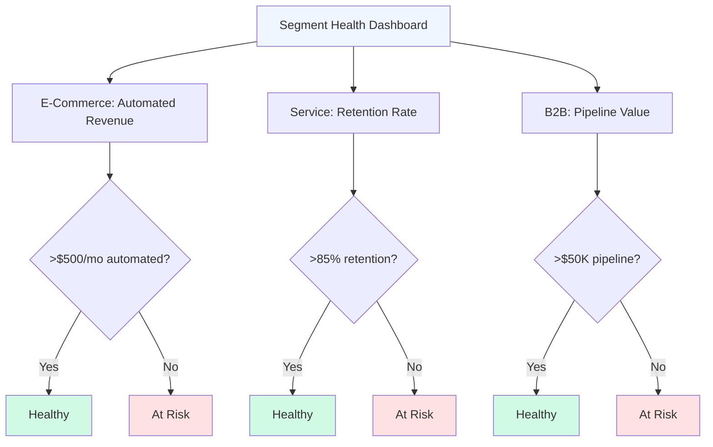

# Segmenting Your Audience for Personalization

_How to identify meaningful sub-segments within your audience using affinity pattern clustering_

---

## The Business Problem

Your Head of Marketing presents the quarterly campaign review:

**Campaign A: "Boost Your Productivity"**

- Sent to: Entire audience (500,000 users)
- Open rate: 18%
- Click rate: 2.1%
- Conversion: 0.4%
- Result: 2,000 conversions

**Campaign B: "Time Management Tips"**

- Sent to: Entire audience (500,000 users)
- Open rate: 16%
- Click rate: 1.8%
- Conversion: 0.3%
- Result: 1,500 conversions

The team debates: "Should we focus on productivity messaging or time management? Which resonates more?"

But they're asking the wrong question.

The real issue: **They're treating a diverse audience as a monolith.** Some users respond to productivity framing, others to time management, others to neither. By blasting the same message to everyone, they're optimizing for mediocrity.

Traditional segmentation approaches have limitations:

 **Why Traditional Segmentation Falls Short:**

**Demographic segmentation** (age, gender, income, location)

- Assumes people in same demo have same needs
- Misses motivational differences within demos
- Example: Two 35-year-old women in same income bracket may have completely different values and needs

**Behavioral segmentation** (usage patterns, feature adoption)

- Shows what people do, not why they do it
- Reactive, not predictive
- Example: "Heavy users" may be heavy for different reasons requiring different retention strategies

**Firmographic segmentation** (B2B: company size, industry)

- Treats all people at similar companies as identical
- Ignores individual role motivations
- Example: "Enterprise customers" include both IT buyers and creative teams with opposite needs

**RFM segmentation** (Recency, Frequency, Monetary)

- Good for retention tactics, poor for positioning strategy
- Doesn't explain why different value patterns exist
- Example: Two "high-value" customers may be high-value for completely different reasons 

The result: Generic campaigns with mediocre performance, one-size-fits-all product positioning, missed opportunities for personalization, and inefficient resource allocation.

**What's needed:** Psychographic segmentation based on motivational patterns revealed through cross-category affinity clustering.

---

## The Data Approach

### The Core Principle

 **Meaningful segments share motivations, not just demographics or behaviors.**

Two users might:

- Both use your product daily (behavioral similarity)
- Both be 30-year-old urban professionals (demographic similarity)
- But care about completely different things (motivational difference)

Effective personalization requires understanding _why_ people choose you, not just _who_ they are or _what_ they do. 

### The Framework: Affinity-Based Psychographic Segmentation

**Step 1: Collect individual-level affinity data**

For each user in your audience, track their engagement with brands, creators, content, and communities across categories.

**Step 2: Apply clustering algorithms**

Group users by similarity in their affinity patterns:

mermaid

````mermaid
graph LR
    A[User Affinity Profiles] --> B[Clustering Algorithm]
    B --> C[Segment 1: Pattern A]
    B --> D[Segment 2: Pattern B]
    B --> E[Segment 3: Pattern C]
    B --> F[Segment 4: Pattern D]
    
    C --> C1[Shared Motivations]
    D --> D1[Shared Motivations]
    E --> E1[Shared Motivations]
    F --> F1[Shared Motivations]
    
    style A fill:#EFF6FF
    style B fill:#F3F4F6
    style C fill:#FEF3C7
    style D fill:#FEE2E2
    style E fill:#D1FAE5
    style F fill:#E0E7FF
```

**Common clustering approaches:**
- K-means clustering (when you know target number of segments)
- Hierarchical clustering (when discovering natural groupings)
- DBSCAN (when segments have varying densities)

**Step 3: Profile each segment**

For each cluster, analyze:
- Defining affinity patterns (what they strongly care about)
- Anti-patterns (what they don't care about)
- Demographics (for targeting, not definition)
- Behavioral patterns (for validation)
- Motivational synthesis (the "why" behind the pattern)

**Step 4: Validate segments**

Confirm segments are:
- **Distinct:** Different affinities, motivations, behaviors
- **Substantial:** Large enough to warrant different treatment
- **Actionable:** Can actually personalize messaging/product for them
- **Stable:** Patterns persist over time
- **Predictive:** Segment membership predicts future behavior

---

## Worked Example: StreamlineApp Discovers Four Distinct Audiences

### Scenario Setup

<div style="border-left:5px solid #4F46E5; background-color:#F3F4F6; padding:1em; margin-bottom:1em; border-radius:8px;">

**StreamlineApp**
- Marketing automation and email platform
- Target: Small businesses and solopreneurs
- Current users: 180,000 active
- Pricing: $29-199/month depending on tier
- Challenge: Broad "small business" positioning leads to 52% churn in first year
</div>

**Current situation:**
- One marketing message for all users
- Product roadmap tries to serve everyone
- Customer success team uses same onboarding flow
- Support materials are generic

**The hypothesis:** "Small business owners" isn't a meaningful segment. There are distinct types with different needs, and treating them the same is causing churn.

### Step 1: Affinity Data Collection

**Analyzing 180,000 StreamlineApp users across categories:**

Sample of high-signal affinities collected:

| Category | Sample Items Tracked |
|----------|---------------------|
| **Business Tools** | Shopify, Stripe, QuickBooks, Canva, Notion, Airtable, Salesforce, HubSpot |
| **Media & Learning** | Podcasts, newsletters, publications, online courses |
| **Communities** | Online forums, Facebook groups, professional networks |
| **Influencers** | Business coaches, marketing experts, thought leaders |
| **Brands** | Lifestyle brands users engage with (reveals values) |
| **Content Themes** | Topics users engage with (reveals priorities) |

**Data collected per user:**
- 200+ potential affinity points across categories
- Engagement level (follow, active engagement, advocate)
- Recency of engagement

### Step 2: Clustering Analysis

**Algorithm:** K-means clustering with k=4 (hypothesis: 4 distinct segments)

**Why k=4:**
- Elbow method suggested 3-5 clusters optimal
- Business constraint: Need enough segments to personalize, few enough to operationalize
- Validation testing showed 4 clusters had highest silhouette score

**Clustering variables:**
- Affinity scores for 200+ items
- Weighted by engagement intensity
- Normalized to account for overall activity level

**Results:**

| Segment | Size | Avg User LTV | Churn Rate | Defining Pattern |
|---------|------|-------------|-----------|------------------|
| **Segment 1** | 38% (68,400 users) | $2,840 | 38% | E-commerce operators |
| **Segment 2** | 28% (50,400 users) | $4,120 | 24% | Service professionals |
| **Segment 3** | 22% (39,600 users) | $1,890 | 68% | Content creators |
| **Segment 4** | 12% (21,600 users) | $5,340 | 19% | B2B consultants |


**Initial insight:** Dramatic LTV and churn differences between segments. Segment 4 (B2B consultants) has 2.8x higher LTV and 3.6x lower churn than Segment 3 (content creators), yet current product treats them identically.


### Step 3: Segment Profiling

#### Segment 1: The E-Commerce Operator (38% of users)

**Defining affinity patterns:**

<div class="grid-2">
<div>

**Tools & Platforms:**
- Shopify: 68% reach, 42x affinity
- Stripe: 52% reach, 28x affinity
- Meta Ads Manager: 48% reach, 31x affinity
- Google Shopping: 44% reach, 37x affinity
- Klaviyo: 38% reach, 45x affinity
- ReCharge (subscriptions): 22% reach, 58x affinity
</div>

<div>

**Learning & Community:**
- eCommerce Fuel podcast: 34% reach, 41x affinity
- Shopify Partners: 29% reach, 38x affinity
- r/shopify: 26% reach, 44x affinity
- Future Commerce podcast: 18% reach, 52x affinity
- eCommerce marketing courses: 31% reach, 28x affinity
</div>
</div>

**Anti-patterns (low affinity):**
- LinkedIn (3.2x) - not focused on B2B networking
- Public speaking content (1.8x) - not about thought leadership
- Consulting frameworks (2.1x) - not service-based

**Demographics:**
- Age: 28-42 (millennial focus)
- Gender: 58% female, 42% male
- Location: Urban/suburban, diverse geographically

**Behavioral patterns in StreamlineApp:**
- High email volume (200+ sends/month)
- Heavy automation usage (cart abandonment, win-back flows)
- Integration-dependent (Shopify, Stripe required)
- Seasonal peaks (Q4 holiday, promotional events)

**Motivational profile:**


**"The Growth-Focused Retailer"**

**What drives them:**
- Revenue growth and customer acquisition
- Conversion rate optimization
- Scaling operations efficiently
- Competing with larger retailers

**Core needs:**
- Automated customer journeys (abandoned cart, post-purchase, win-back)
- Segmentation based on purchase behavior
- Integration with e-commerce stack
- Quick ROI on marketing spend

**Success metric:** Revenue per email sent

**Pain points:**
- Too much manual work managing email campaigns
- Can't personalize at scale
- Inventory/promotion timing coordination
- Measuring attribution across touchpoints


#### Segment 2: The Service Professional (28% of users)

**Defining affinity patterns:**

<div class="grid-2">
<div>

**Tools & Platforms:**
- Calendly: 64% reach, 38x affinity
- Acuity Scheduling: 42% reach, 51x affinity
- Zoom: 71% reach, 6.2x affinity
- Honeybook: 34% reach, 47x affinity
- Dubsado: 28% reach, 62x affinity
- Practice management software: 31% reach, 44x affinity
</div>

<div>

**Learning & Community:**
- Service-based business podcasts: 38% reach, 34x affinity
- Local business networks: 29% reach, 28x affinity
- Industry associations: 42% reach, 22x affinity
- Referral marketing content: 31% reach, 41x affinity
- Client experience frameworks: 27% reach, 38x affinity
</div>
</div>

**Anti-patterns:**
- E-commerce tools (4.1x) - not selling products
- Paid advertising platforms (5.2x) - rely on referrals
- Viral marketing content (2.8x) - not their growth strategy

**Demographics:**
- Age: 32-55 (established professionals)
- Gender: 64% female, 36% male
- Location: Suburban/small city, regionally concentrated

**Behavioral patterns in StreamlineApp:**
- Low email volume (20-50 sends/month)
- Relationship-focused sequences (onboarding, follow-up, nurture)
- CRM-like usage (tracking client journey)
- Consistent year-round (less seasonal variation)

**Motivational profile:**


**"The Relationship Builder"**

**What drives them:**
- Client satisfaction and retention
- Referral generation
- Professional reputation
- Work-life balance (capacity management)

**Core needs:**
- Client journey automation (inquiry → booking → service → follow-up)
- Appointment reminder and follow-up sequences
- Referral request automation
- Personal touch at scale

**Success metric:** Client retention rate and referral volume

**Pain points:**
- Time spent on administrative communication
- Inconsistent follow-up due to busy schedules
- Difficulty staying top-of-mind for referrals
- Balancing personal touch with automation


#### Segment 3: The Content Creator (22% of users)

**Defining affinity patterns:**

<div class="grid-2">
<div>

**Tools & Platforms:**
- Patreon: 48% reach, 67x affinity
- ConvertKit: 52% reach, 58x affinity
- Substack: 44% reach, 71x affinity
- YouTube Creator Studio: 38% reach, 24x affinity
- Gumroad: 34% reach, 82x affinity
- Teachable: 28% reach, 44x affinity
</div>

<div>

**Learning & Community:**
- Creator economy content: 51% reach, 48x affinity
- Build in public movement: 38% reach, 62x affinity
- Newsletter growth tactics: 44% reach, 54x affinity
- Audience building podcasts: 34% reach, 41x affinity
- Creator-focused communities: 42% reach, 38x affinity
</div>
</div>

**Anti-patterns:**
- Traditional business tools (6.8x) - not running "business"
- Sales funnel content (4.2x) - audience-first, not conversion-first
- Corporate marketing frameworks (3.1x) - indie mindset

**Demographics:**
- Age: 24-38 (younger skew)
- Gender: 54% male, 46% female
- Location: Urban, digitally-native

**Behavioral patterns in StreamlineApp:**
- Moderate email volume (40-100 sends/month)
- Newsletter-focused (regular publishing schedule)
- Low automation use (prefer manual, personal sends)
- Experimentation with formats and timing

**Motivational profile:**


**"The Audience Builder"**

**What drives them:**
- Growing authentic audience
- Creative freedom and independence
- Community connection
- Monetizing passion/expertise

**Core needs:**
- Simple newsletter publishing
- Subscriber growth and engagement
- Monetization tools (paid tiers, digital products)
- Direct audience relationship

**Success metric:** Subscriber growth and engagement rate

**Pain points:**
- Too many features they don't need
- Complexity gets in way of creating
- Expensive for early-stage creators
- Disconnect between content creation and email tools


#### Segment 4: The B2B Consultant (12% of users)

**Defining affinity patterns:**

<div class="grid-2">
<div>

**Tools & Platforms:**
- LinkedIn Sales Navigator: 58% reach, 42x affinity
- HubSpot: 48% reach, 28x affinity
- Salesforce: 34% reach, 31x affinity
- Proposify: 28% reach, 54x affinity
- PandaDoc: 24% reach, 48x affinity
- Pipedrive: 31% reach, 38x affinity
</div>

<div>

**Learning & Community:**
- B2B marketing content: 52% reach, 34x affinity
- Consultative selling: 38% reach, 44x affinity
- Thought leadership: 44% reach, 31x affinity
- Speaking/conference circuit: 29% reach, 41x affinity
- Industry analyst reports: 34% reach, 38x affinity
</div>
</div>

**Anti-patterns:**
- E-commerce tools (2.8x) - B2B focused
- Consumer marketing tactics (4.1x) - different buyer journey
- Quick-win content (3.2x) - complex, long sales cycles

**Demographics:**
- Age: 35-58 (experienced professionals)
- Gender: 61% male, 39% female
- Location: Major metros, business hubs

**Behavioral patterns in StreamlineApp:**
- Low email volume (15-40 sends/month)
- Long, sophisticated nurture sequences
- Lead scoring and segmentation heavy
- Integration with CRM critical

**Motivational profile:**


**"The Pipeline Builder"**

**What drives them:**
- High-value client acquisition
- Thought leadership positioning
- Efficient sales process
- Recurring revenue (retainers)

**Core needs:**
- Long-term nurture automation (6-18 month cycles)
- Lead qualification and scoring
- CRM integration and data sync
- Sophisticated segmentation

**Success metric:** Pipeline value and close rate

**Pain points:**
- Need enterprise features without enterprise price
- Integration complexity with sales stack
- Balancing automation with personal outreach
- Long sales cycles require sustained nurture


### Step 4: Segment Comparison and Strategic Insights

**Side-by-side comparison:**

| Dimension | E-Commerce Operator | Service Professional | Content Creator | B2B Consultant |
|-----------|-------------------|---------------------|----------------|----------------|
| **Primary goal** | Grow revenue | Retain clients | Build audience | Win high-value clients |
| **Email volume** | High (200+/mo) | Low (20-50/mo) | Moderate (40-100/mo) | Low (15-40/mo) |
| **Automation complexity** | High | Moderate | Low | Very high |
| **Success metric** | Revenue per send | Retention rate | Subscriber growth | Pipeline value |
| **Churn risk** | Moderate (38%) | Low (24%) | High (68%) | Very low (19%) |
| **LTV** | Moderate ($2,840) | High ($4,120) | Low ($1,890) | Very high ($5,340) |
| **Integration needs** | E-commerce stack | Scheduling tools | Publishing platforms | CRM/sales tools |

**Critical insights:**


**1. Churn and LTV are inversely related to product-market fit**

- **Content Creators:** 68% churn, $1,890 LTV
  - StreamlineApp is over-engineered for their needs
  - They want simple newsletter tool, we offer complex automation
  - Most churn to Substack, ConvertKit, Ghost (simpler, creator-focused)

- **B2B Consultants:** 19% churn, $5,340 LTV
  - Perfect fit: need sophisticated automation, willing to pay
  - Low churn because we solve complex nurture problem
  - High LTV from tier upgrades as pipeline grows

**Strategic implication:** Should we even serve Content Creators, or focus on higher-fit segments?



**2. Different segments need completely different onboarding**

Current one-size-fits-all onboarding asks everyone to:
1. Import contacts
2. Create first automation
3. Design email template
4. Send first campaign

**Why this fails:**
- **E-Commerce Operators:** Need Shopify integration first, then cart abandonment flow
- **Service Professionals:** Need appointment confirmation sequence, not "automation"
- **Content Creators:** Just want to publish newsletter, confused by "automation"
- **B2B Consultants:** Need CRM integration and lead scoring setup

**67% of users never complete current onboarding.** Segment-specific paths could fix this.



**3. One feature set can't optimally serve all segments**

**Feature importance comparison:**

| Feature | E-Comm | Service | Creator | B2B |
|---------|--------|---------|---------|-----|
| E-commerce integration | ★★★★★ | ★ | ★ | ★ |
| Calendar integration | ★ | ★★★★★ | ★ | ★★★ |
| Simple publishing | ★ | ★★ | ★★★★★ | ★ |
| CRM integration | ★★ | ★★ | ★ | ★★★★★ |
| Automation builder | ★★★★★ | ★★★ | ★★ | ★★★★★ |
| Lead scoring | ★ | ★ | ★ | ★★★★★ |
| Landing pages | ★★★★ | ★★★ | ★★★ | ★★★ |
| A/B testing | ★★★★ | ★★ | ★ | ★★★★ |

**Implication:** Product roadmap should prioritize by segment strategy, not aggregate requests.


### Step 5: Segment-Specific Strategy

**Strategic decisions based on segment analysis:**

<div class="grid-2">

<div style="border-left:4px solid #10B981; padding:1em; background:#F0FDF4;">

**Double Down (High LTV, Low Churn):**

**B2B Consultants** (12% of users, 31% of revenue)
- Build sophisticated nurture and scoring features
- Premium tier with CRM integrations
- Thought leadership marketing positioning
- Target acquisition: LinkedIn, industry events

**Service Professionals** (28% of users, 38% of revenue)
- Client journey automation templates
- Scheduling tool integrations
- Referral automation features
- Target acquisition: Industry associations, local networks
</div>

<div style="border-left:4px solid #F59E0B; padding:1em; background:#FFF7ED;">

**Optimize (High Volume, Moderate Fit):**

**E-Commerce Operators** (38% of users, 26% of revenue)
- Maintain Shopify/e-commerce integrations
- Pre-built automation flows for common use cases
- Self-service model (limit support costs)
- Competitive pricing to prevent churn to specialists

</div>

</div>

<div style="border-left:4px solid #EF4444; padding:1em; margin-top:1em; background:#FEF2F2;">

**Divest or Pivot (Poor Fit):**

**Content Creators** (22% of users, 5% of revenue)
- 68% churn rate is unsustainable
- Wrong product for their needs (too complex)
- Options:
  1. **Divest:** Gracefully sunset, refer to Substack/ConvertKit
  2. **Pivot:** Build simple "StreamlineApp Lite" for creators
  3. **Acquire:** Let specialists serve them, don't compete

**Recommendation:** Divest. ROI on serving this segment is negative when factoring support costs.
</div>

---

## Implementation: Segment-Specific Personalization

### 1. Onboarding Paths

**Before (One-Size-Fits-All):**
```
All Users → Generic setup → 67% never complete
````

**After (Segment-Specific):**



<div style="border:2px solid #8B5CF6; padding:1em; border-radius:8px;">

**E-Commerce Path**

1. Connect Shopify
2. Import product catalog
3. Activate cart abandonment flow
4. Set up welcome series
5. Launch first campaign

**Completion rate:** 84% (predicted)

</div>

<--->

<div style="border:2px solid #3B82F6; padding:1em; border-radius:8px;">

**Service Professional Path**

1. Connect calendar
2. Set up appointment confirmations
3. Create follow-up sequence
4. Add referral request automation
5. Send first client update

**Completion rate:** 89% (predicted)

</div>





<div style="border:2px solid #10B981; padding:1em; border-radius:8px;">

**Content Creator Path**

1. Import subscriber list
2. Design newsletter template
3. Write and schedule first newsletter
4. Set up welcome email
5. Publish

**Completion rate:** 91% (predicted)

</div>

<--->

<div style="border:2px solid #F59E0B; padding:1em; border-radius:8px;">

**B2B Consultant Path**

1. Connect CRM
2. Set up lead scoring
3. Create nurture sequence
4. Design sales follow-up flow
5. Launch pipeline automation

**Completion rate:** 82% (predicted)

</div>



### 2. Messaging & Positioning

**Homepage hero variation by segment:**

|Segment|Headline|Subheadline|CTA|
|---|---|---|---|
|**E-Commerce**|Turn browsers into buyers|Automated email flows that recover carts and win back customers|Connect Shopify|
|**Service**|Stay top-of-mind with clients|Automate follow-ups and referral requests without losing the personal touch|Start Free Trial|
|**Creator**|Publish newsletters your audience loves|Simple, beautiful email publishing for independent creators|Start Publishing|
|**B2B**|Turn cold leads into closed deals|Sophisticated nurture automation for complex B2B sales cycles|See How It Works|

### 3. Feature Development Priorities

**Roadmap allocation by segment value:**

|Quarter|E-Commerce (26% rev)|Service (38% rev)|Creator (5% rev)|B2B (31% rev)|
|---|---|---|---|---|
|**Q1**|Shopify 2.0 integration|Calendly deep integration|—|HubSpot CRM sync|
|**Q2**|Product recommendation AI|Client portal access|—|Lead scoring v2|
|**Q3**|—|Referral tracking dashboard|—|Account-based automation|
|**Q4**|Seasonal campaign templates|Service package automation|(Sunset plan)|LinkedIn integration|

**Resource allocation:** 0% to Creator segment (divesting), 60% to Service + B2B (high LTV), 40% to E-Commerce (volume play)

### 4. Customer Success Approach

**Segment-specific success metrics and interventions:**

<div class="grid-2"> <div>

**E-Commerce Operators:**

- **Health metric:** Automated revenue (cart abandonment + win-back)
- **At-risk signal:** <10 automated orders in 30 days
- **Intervention:** "Optimization audit" offering pre-built flows
- **Success cadence:** Quarterly check-ins around peak seasons

</div> <div>

**Service Professionals:**

- **Health metric:** Active automation sequences
- **At-risk signal:** No emails sent in 14 days
- **Intervention:** "Client retention playbook" with templates
- **Success cadence:** Monthly relationship check-ins

</div> </div> <div class="grid-2"> <div>

**Content Creators:**

- **Health metric:** Publishing consistency
- **At-risk signal:** No newsletter in 21 days
- **Intervention:** Migration assistance to better-fit platform
- **Success cadence:** Minimal touch (cost reduction)

</div> <div>

**B2B Consultants:**

- **Health metric:** Pipeline value in nurture
- **At-risk signal:** Flat pipeline growth
- **Intervention:** Strategic consultation on nurture strategy
- **Success cadence:** Quarterly business reviews

</div> </div>

### 5. Pricing Strategy

**Segment-specific pricing and packaging:**

|Tier|Target Segment|Price|Key Features|Positioning|
|---|---|---|---|---|
|**Starter**|E-Commerce|$29/mo|E-comm integrations, basic automation|"Get started fast"|
|**Professional**|Service Professionals|$79/mo|Calendar integration, client journeys|"White-glove automation"|
|**Enterprise**|B2B Consultants|$199/mo|CRM sync, lead scoring, advanced automation|"Pipeline machine"|
|**(Deprecated)**|Content Creators|—|—|Migrate to specialized platforms|

---

## Validation: Measuring Segment Strategy Success

### Before Segmentation (Baseline)

|Metric|Value|
|---|---|
|Overall churn|52%|
|Avg LTV|$3,120|
|Onboarding completion|33%|
|Feature adoption|28%|
|Support tickets per user|2.4/year|
|NPS|+12|

### After Segmentation (12-Month Projection)

|Metric|Target|Segment Breakdown|
|---|---|---|
|**Overall churn**|34% (-35%)|E-Comm: 32%, Service: 22%, B2B: 17%|
|**Avg LTV**|$4,680 (+50%)|E-Comm: $3,200, Service: $4,800, B2B: $6,400|
|**Onboarding completion**|86% (+161%)|Segment-specific paths|
|**Feature adoption**|64% (+129%)|Right features for right segments|
|**Support tickets**|1.1/year (-54%)|Better product-market fit|
|**NPS**|+42 (+250%)|Segments get what they need|

### Key Performance Indicators by Segment

**Tracking segment health:**

mermaid



---

## Common Pitfalls

### 1. Over-Segmentation

 **The trap:** Creating too many segments to operationalize

**Example:** StreamlineApp initially tried 12 segments

- Each segment <5% of users
- Couldn't build unique features for each
- Marketing team overwhelmed with messaging variants
- Customer success couldn't maintain distinct playbooks

**Result:** Paralysis and regression to one-size-fits-all

**How to avoid:**

- Start with 3-5 segments maximum
- Require each segment be >10% of users or >15% of revenue
- Validate you can actually build/market/support distinctly for each
- Can always sub-segment within major segments later 

### 2. Demographic Confusion

 **The trap:** Defining segments by demographics, then surprised they don't behave homogeneously

**Example:** "Small business owners" segment

- Includes e-commerce, service providers, consultants, creators
- Completely different needs despite same "small business" label
- Segmentation fails because it's not motivationally meaningful

**Why it happens:** Demographics are easy to measure and target

**How to avoid:**

- Define segments by **motivations and affinities** first
- Use demographics only for targeting/reaching, not defining
- Ask: "Do people in this segment want the same things for the same reasons?" 

### 3. Ignoring Segment Economics

 **The trap:** Treating all segments equally regardless of profitability

**Example:** StreamlineApp Content Creator segment

- 22% of users (significant volume)
- 5% of revenue (low value)
- 68% churn (high cost)
- Heavy support burden (creators need lots of help)

**True economics:** Negative contribution margin after CAC and support costs

**How to avoid:**

- Calculate segment-level unit economics:
    - Revenue per segment user
    - CAC by segment
    - Support cost per segment user
    - Churn rate and LTV
- Divest from segments with negative economics
- Don't be seduced by volume if economics don't work 

### 4. Static Segmentation

 **The trap:** Segment once, never revisit

**Why it fails:**

- User needs evolve (service professional becomes e-commerce hybrid)
- Market changes (new tools, new competitors, new motivations)
- Your product evolves (new features attract different segments)
- Segments can migrate or emerge

**Example:** StreamlineApp might see:

- E-commerce operators adding service components
- New segment emerging: "Course creators" (didn't exist 3 years ago)
- B2B consultants using product differently post-COVID

**How to avoid:**

- Re-cluster annually or when major market shifts
- Track segment migration (% of users changing segments)
- Monitor for "orphaned" users (don't fit any segment well)
- Be willing to redefine segments as market evolves 

### 5. Personalization Without Differentiation

 **The trap:** Different messaging for same product experience

**Example:**

- Segment A gets "productivity" messaging
- Segment B gets "efficiency" messaging
- Both land in identical product with same features and onboarding

**Why it fails:** Expectation mismatch breeds disappointment

**How to avoid:**

- Personalize the actual experience, not just the marketing
- Segment-specific onboarding, features, and success paths
- If you can't differentiate product experience, reconsider segmentation
- Messaging should reflect real differences, not just positioning spin 

---

## Complementary Approaches

### When Affinity-Based Segmentation Isn't Enough

 **Method:**

- Affinity clustering identifies motivational segments
- Behavioral data validates and refines segments
- Look for behavioral patterns that align with affinity patterns

**Example from StreamlineApp:**

|Segment (Affinity-Based)|Validating Behavior|
|---|---|
|E-Commerce Operators|High email volume, cart abandonment flow usage|
|Service Professionals|Low volume, calendar integration, appointment sequences|
|B2B Consultants|CRM integration, long nurture sequences, lead scoring|

**Value:** Behavioral patterns confirm affinity-based segments are real and actionable 

 **Process:**

1. Identify users from each affinity-based segment
2. Interview about what "job" they're hiring your product to do
3. Validate motivational hypotheses from affinity patterns

**Example questions:**

- "What were you trying to accomplish when you signed up?"
- "What would you use if our product didn't exist?"
- "What does success look like for you?"

**Value:** Qualitative validation of quantitative segments 

 **Method:**

- Track cohorts by segment over time
- Compare retention, LTV, feature adoption
- Identify which segments deliver best long-term value

**Example from StreamlineApp:**

|Segment|3-Mo Retention|12-Mo Retention|LTV|
|---|---|---|---|
|E-Commerce|72%|62%|$2,840|
|Service|84%|76%|$4,120|
|Creator|41%|32%|$1,890|
|B2B|89%|81%|$5,340|

**Insight:** B2B and Service segments have dramatically better long-term economics 

 **Method:**

- Use affinity patterns to predict segment membership for new users
- Score leads by segment likelihood before they even sign up
- Route to segment-appropriate experiences from first touch

**Example:**

- Prospect visits website from LinkedIn Sales Navigator → Score as likely B2B Consultant
- Show B2B-focused messaging, route to B2B onboarding
- Increase conversion by reducing friction of generic experience

**Value:** Personalization from first interaction, not after usage data accumulates 

---

## Actionable Takeaway

 **To segment your audience effectively:**

1. **Cluster by affinity patterns, not demographics**
    - Collect cross-category affinity data for your users
    - Apply clustering algorithms to identify natural groupings
    - Aim for 3-5 segments that are distinct, substantial, and actionable
2. **Profile each segment deeply**
    - Define motivations (what drives them?)
    - Identify anti-patterns (what do they reject?)
    - Validate with behavioral data
    - Calculate segment economics (LTV, churn, support costs)
3. **Personalize meaningfully, not superficially**
    - Different onboarding paths by segment
    - Segment-specific features and roadmap priorities
    - Tailored messaging that reflects real differences
    - Success metrics and interventions aligned with segment goals
4. **Allocate resources by segment value**
    - Double down on high-LTV, low-churn segments
    - Optimize or maintain moderate-value segments
    - Divest from negative-margin segments

**Red flags you need segmentation:**

- High overall churn despite "solving" stated problems
- Wide variance in LTV with no clear pattern
- Feature requests that conflict with each other
- One-size-fits-all messaging gets mediocre results
- Support team says "different users want opposite things"

**Next step:** Run affinity clustering on your user base this month. Even a rough 3-segment model will reveal patterns. Calculate LTV and churn by segment. You'll immediately see which segments deserve investment and which are dragging down your metrics. 

---

_Treating your diverse audience as a monolith guarantees mediocre results for everyone. Psychographic segmentation reveals the distinct motivational groups within your user base, enabling personalization that actually drives outcomes._
