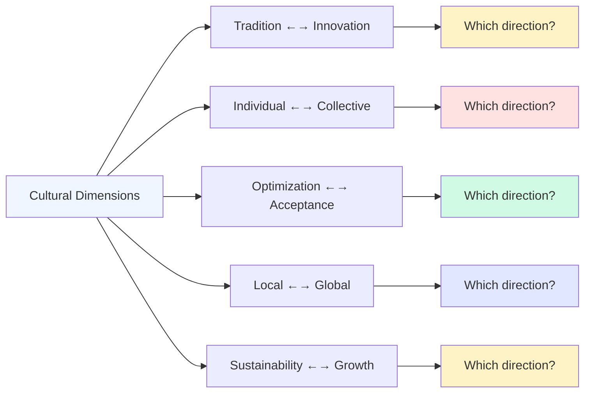

# Understanding Cultural Context and Trends

_How to map your audience's relationship to cultural movements, values, and zeitgeist using affinity patterns_

---

## The Business Problem

Your brand team is debating the creative direction for next year's campaign:

**Creative Director:** "We should embrace sustainability messaging. Everyone cares about the environment now."

**CMO:** "Our competitor just launched a big sustainability campaign. Should we follow?"

**Brand Manager:** "But do our customers actually care about sustainability, or are we just assuming?"

The team runs a survey: "How important is sustainability to you?"

- 78% respond "Very important"
- Campaign launches with sustainability focus
- Results are disappointing: engagement is mediocre, sales lift is minimal

**What happened?** The survey measured _stated values_ (what people think they should care about), not _revealed values_(what actually drives their behavior).

This pattern repeats across cultural themes:

<div class="grid-2"> <div>

**What brands assume matters:**

- Sustainability and environment
- Diversity and inclusion
- Wellness and self-care
- Innovation and disruption
- Community and connection

</div> <div>

**What may actually matter to specific audiences:**

- Tradition and heritage
- Individual achievement
- Efficiency and optimization
- Status and exclusivity
- Independence and autonomy

</div> </div>

Traditional methods for understanding cultural context fall short:

 **Why Cultural Research Often Fails:**

**Surveys and focus groups:**

- Social desirability bias (people claim to care about "good" things)
- Can't capture unconscious cultural influences
- What people say vs. what they do

**Trend reports and forecasting:**

- Describe macro trends, not your specific audience
- Often wrong about what will actually resonate
- Confuse novelty with relevance

**Competitor benchmarking:**

- Assumes competitor understands their audience (often they don't)
- Follows rather than leads
- Misses unique cultural positioning opportunities

**Demographic proxies:**

- "Millennials value experiences over possessions"
- Overgeneralizes diverse groups
- Misses within-cohort variance 

The result: Campaigns that feel inauthentic, positioning that misses the mark, partnerships with misaligned movements, and wasted resources chasing irrelevant trends.

**What's needed:** Understanding which cultural movements, values, aesthetics, and trends actually resonate with your specific audience based on revealed behavior, not stated preferences.

---

## The Data Approach

### The Core Principle

 **Culture isn't monolithic. Different audiences participate in different cultural contexts.**

Your audience's cultural reality is revealed by:

- Which causes and movements they support
- Which aesthetics and subcultures they engage with
- Which values-driven brands they choose
- Which cultural conversations they participate in
- Which communities and identities they claim

Affinity data reveals the cultural water your audience swims in. 

### The Framework: Cultural Affinity Mapping

**Step 1: Identify cultural signals across categories**

|Signal Type|What It Reveals|Examples|
|---|---|---|
|**Causes & Movements**|Values and priorities|Climate action, economic justice, personal freedom|
|**Aesthetics & Subcultures**|Identity and belonging|Minimalism, maximalism, cottagecore, dark academia|
|**Values-Driven Brands**|Purchasing priorities|B Corps, mission-driven companies, local businesses|
|**Cultural Creators**|Whose voice matters|Activists, artists, philosophers, scientists|
|**Communities**|Social context|Online forums, IRL gatherings, identity groups|
|**Content Themes**|What resonates|Nostalgia, futurism, tradition, disruption|

**Step 2: Analyze affinity patterns**

```
Cultural Affinity = (% of audience engaging) ÷ (% of general population engaging)
```

**Interpretation scale:**

|Affinity|Meaning|Strategic Implication|
|---|---|---|
|**1-2x**|Baseline participation|Not defining, not differentiating|
|**3-5x**|Moderate alignment|Relevant but not identity-defining|
|**6-15x**|Strong cultural marker|Important to worldview|
|**15x+**|Identity-defining|Core to who they are|

**Step 3: Map cultural positioning**

Identify where your audience sits on key cultural dimensions:

mermaid



**Step 4: Synthesize cultural profile**

Move from individual signals to holistic understanding:

- What cultural movements is this audience part of?
- What values shape their worldview?
- What aesthetics and subcultures do they participate in?
- How do they see themselves in relation to broader culture?

---

## Worked Example: Heritage Outdoors Brand Discovers Its Cultural Position

### Scenario Setup

<div style="border-left:5px solid #4F46E5; background-color:#F3F4F6; padding:1em; margin-bottom:1em; border-radius:8px;">

**TrailCraft Outfitters**

- Premium outdoor gear and apparel (founded 1987)
- Heritage brand with 37-year history
- Audience: 320,000 engaged customers
- Price positioning: $80-400/item
- Challenge: Pressure to "modernize" and appeal to younger outdoor enthusiasts

</div>

**The debate:**

**The modernization camp argues:**

- Competitors are winning Gen Z with sustainability messaging
- We need to embrace tech (smart fabrics, apps, social media)
- Our heritage positioning feels "old" and out of touch
- Revenue growth has slowed

**The heritage camp argues:**

- Our brand identity is rooted in tradition and craftsmanship
- Chasing trends will alienate our loyal base
- We should double down on what makes us unique

**The question:** What cultural context does our audience actually inhabit? Should we modernize, stay traditional, or find a third path?

### Step 1: Cultural Affinity Data Collection

**Analyzing TrailCraft's 320,000-customer audience:**

#### Causes & Values

|Cause/Movement|% Audience|Affinity|Interpretation|
|---|---|---|---|
|Environmental conservation (general)|52%|2.8x|Expected baseline for outdoor brand|
|Land preservation (specific orgs)|38%|18x|Strong signal|
|National parks advocacy|42%|24x|Very strong|
|Climate activism|24%|3.2x|Lower than expected|
|Sustainability influencers|19%|4.1x|Moderate|
|Buy local movement|34%|12x|Strong|
|Right to repair|28%|31x|Extremely strong|
|Heritage preservation|31%|22x|Very strong|
|Slow living movement|26%|19x|Strong|

 **Pattern emerging:** High affinity for specific conservation (18-24x) and heritage preservation (22x), but lower than expected for general "sustainability" and climate activism (3.2x). The right to repair movement (31x) is extremely strong signal. 

#### Aesthetics & Subcultures

|Aesthetic/Subculture|% Audience|Affinity|Interpretation|
|---|---|---|---|
|Cottagecore|8%|2.1x|Not relevant|
|Dark academia|6%|1.4x|Not relevant|
|Minimalism|22%|3.8x|Moderate|
|Americana/heritage|38%|28x|Defining|
|Craftsman aesthetic|34%|32x|Defining|
|Vintage/retro|29%|14x|Strong|
|Rugged/workwear style|41%|21x|Very strong|
|Tech/futurist aesthetic|9%|1.8x|Actively low|
|Hygge/cozy|31%|11x|Strong|

 **Critical insight:** Extremely high affinity for Americana/heritage (28x) and craftsman aesthetic (32x). Very low affinity for tech/futurist (1.8x). This audience rejects modern minimalism in favor of warm, heritage-focused design. 

#### Media & Cultural Creators

|Creator/Publication|% Audience|Affinity|Interpretation|
|---|---|---|---|
|Outside Magazine|44%|18x|Expected|
|Backpacker|38%|22x|Expected|
|Gear Patrol|28%|14x|Moderate|
|Worn & Wound (vintage watch blog)|24%|48x|Surprising, strong|
|Heddels (heritage denim)|22%|52x|Very surprising|
|The Goulet Pen Company|18%|41x|Unexpected|
|Nick Offerman (craftsman/maker)|32%|19x|Strong signal|
|Adam Savage (maker)|28%|16x|Strong signal|
|Marie Kondo|11%|2.4x|Low|
|Minimalist influencers|9%|1.9x|Actively low|

 **Unexpected pattern:** Extremely high affinity for heritage craft content far outside outdoor category (vintage watches 48x, heritage denim 52x, fountain pens 41x). This audience values craftsmanship and heritage across all categories, not just outdoors. 

#### Brands (Non-Outdoor)

|Brand|% Audience|Affinity|Category|Interpretation|
|---|---|---|---|---|
|Patagonia|58%|9.2x|Outdoor|Expected competitor|
|REI Co-op|52%|11x|Outdoor|Expected|
|Filson|44%|38x|Heritage workwear|Strong alignment|
|Red Wing Boots|41%|34x|Heritage footwear|Strong alignment|
|Shinola|28%|42x|American manufacturing|Very strong|
|Lodge Cast Iron|36%|28x|Heritage cookware|Strong|
|Zippo|24%|31x|American heritage|Strong|
|Carhartt|48%|19x|Workwear|Strong|
|Warby Parker|14%|3.1x|DTC modern|Low|
|Allbirds|8%|1.8x|Sustainable modern|Actively low|
|Away Luggage|6%|1.4x|DTC modern|Actively low|

 **Defining pattern:** Extremely high affinity for heritage American manufacturing brands (Shinola 42x, Filson 38x, Red Wing 34x) across categories. Very low affinity for modern DTC brands (Warby Parker 3.1x, Allbirds 1.8x, Away 1.4x).

**This is not about outdoor vs. non-outdoor. It's about heritage/craft vs. modern/efficiency.** 

#### Communities & Movements

|Community|% Audience|Affinity|Interpretation|
|---|---|---|---|
|r/BuyItForLife|34%|48x|Defining|
|r/Goodyearwelt (footwear craftsmanship)|22%|61x|Extremely defining|
|American Trails advocacy|38%|32x|Strong|
|Leave No Trace|46%|14x|Expected|
|#VanLife community|18%|8.2x|Moderate|
|Ultralight backpacking|12%|6.1x|Lower than expected|
|Maker movement|31%|28x|Very strong|
|Traditional skills communities|28%|34x|Very strong|
|Zero waste movement|16%|4.2x|Low|
|Digital nomad community|8%|1.6x|Actively low|

 **Key insight:** r/BuyItForLife (48x) and r/Goodyearwelt (61x) are among the highest affinities in the entire dataset. This audience is obsessed with quality, durability, and craftsmanship. Traditional skills (34x) and maker movement (28x) reinforce this.

Surprisingly low affinity for ultralight backpacking (6.1x) - this audience doesn't prioritize minimalism and weight reduction. They value durability over efficiency. 

#### Values-Driven Consumption

|Signal|% Audience|Affinity|Interpretation|
|---|---|---|---|
|"Made in USA" preference|58%|24x|Defining|
|Lifetime warranty brands|51%|28x|Defining|
|Local/small business support|44%|16x|Strong|
|Repair vs. replace mentality|48%|31x|Very strong|
|Quality over price|62%|14x|Strong|
|Certified B Corps|18%|3.8x|Lower than expected|
|Carbon offset programs|14%|2.9x|Low|
|Subscription/rental models|6%|0.9x|Actively reject|

 **Value system revealed:** This audience prioritizes:

1. Made in USA (24x)
2. Lifetime warranty (28x)
3. Repair vs. replace (31x)
4. Quality over price (14x)

They do NOT prioritize:

- B Corps (3.8x)
- Carbon offsets (2.9x)
- Subscription models (0.9x - active rejection)

**This is about longevity and ownership, not sustainability framing.** 

### Step 2: Cultural Positioning Map

**Mapping TrailCraft audience on key cultural dimensions:**

<div class="grid-2"> <div style="border-left:4px solid #8B5CF6; padding:1em; background:#F5F3FF;">

**Tradition ←→ Innovation**

Position: **Strongly Traditional** (Heritage 28x, Craftsman 32x)

**Evidence:**

- Heritage Americana aesthetic: 28x
- Craftsman movement: 32x
- Traditional skills: 34x
- Vintage/retro: 14x
- Tech/futurist aesthetic: 1.8x (reject)

**Meaning:** This audience sees value in time-tested methods, generational knowledge, and respect for the past.

</div> <div style="border-left:4px solid #3B82F6; padding:1em; background:#EFF6FF;">

**Individual ←→ Collective**

Position: **Moderate Individual** (Self-reliance focus)

**Evidence:**

- Right to repair: 31x (individual autonomy)
- Maker movement: 28x (self-sufficiency)
- Traditional skills: 34x (personal capability)
- But: Leave No Trace: 14x (collective responsibility)
- And: Land preservation: 18x (collective benefit)

**Meaning:** Values personal capability and self-reliance, but with awareness of collective responsibility for shared resources.

</div> </div> <div class="grid-2"> <div style="border-left:4px solid #10B981; padding:1em; background:#F0FDF4;">

**Optimization ←→ Acceptance**

Position: **Quality over Efficiency**

**Evidence:**

- BuyItForLife: 48x (lasting value)
- Goodyearwelt: 61x (quality construction)
- Ultralight backpacking: 6.1x (reject efficiency)
- Repair vs. replace: 31x (longevity)

**Meaning:** Rejects optimization culture. Values things built to last over things built to be lightest/fastest/cheapest.

</div> <div style="border-left:4px solid #F59E0B; padding:1em; background:#FFF7ED;">

**Local ←→ Global**

Position: **Strongly Local/National**

**Evidence:**

- Made in USA: 24x
- Buy local: 12x
- American manufacturing brands: 34-42x
- National parks: 24x

**Meaning:** Strong preference for domestic production, local ecosystems, American heritage and craftsmanship.

</div> </div> <div style="border-left:4px solid #EF4444; padding:1em; margin-top:1em; background:#FEF2F2;">

**Sustainability Framing ←→ Heritage/Longevity Framing**

Position: **Heritage/Longevity** (not modern sustainability)

**Evidence:**

- Climate activism: 3.2x (low)
- Carbon offsets: 2.9x (low)
- B Corps: 3.8x (moderate)
- BUT: Right to repair: 31x (very high)
- Heritage preservation: 22x (high)
- Lifetime warranty: 28x (high)

**Critical insight:** This audience cares deeply about environmental stewardship, but through a **conservation and longevity lens**, not a **climate activism/sustainability lens**.

They see quality craftsmanship and buy-it-for-life philosophy as inherently environmental (fewer resources consumed over lifetime), but don't respond to modern sustainability marketing.

</div>

### Step 3: Cultural Profile Synthesis

**Who TrailCraft's audience is culturally:**

 **"The Heritage Steward"**

**Cultural Identity:** They see themselves as stewards of American craft traditions, outdoor heritage, and quality over quantity philosophy. They're not "outdoor enthusiasts" generically - they're carriers of a specific tradition of outdoor engagement rooted in American wilderness history.

**Core Cultural Values:**

**Craftsmanship as virtue**

- Appreciate the skill and knowledge embedded in well-made objects
- Value things that improve with age and use
- See maintenance and repair as honorable activities
- Heritage brands (Filson 38x, Red Wing 34x, Shinola 42x) represent this

**Longevity as responsibility**

- Environmental stewardship through durability, not disposability
- Right to repair (31x) is about autonomy AND sustainability
- BuyItForLife (48x) is both economic and environmental ethic
- Reject subscription/rental models (0.9x) - want to own, maintain, pass down

**American heritage and place**

- Strong connection to American manufacturing (Made in USA 24x)
- National parks as cultural heritage, not just recreation (24x)
- Land preservation (18x) about protecting specific places with history
- Heritage preservation (22x) extends to landscapes and traditions

**Self-reliance and capability**

- Traditional skills (34x) and maker movement (28x)
- Want to understand and repair their gear
- Value personal competence over convenience
- Respect for those who can make/fix things

**Authenticity and anti-trend**

- Reject modern minimalism (Marie Kondo 2.4x, minimalist influencers 1.9x)
- Low interest in viral outdoor trends (van life 8.2x, digital nomad 1.6x)
- Heritage and vintage (14-28x) signal timeless vs. trendy
- Prefer established patterns over innovation for its own sake

**Cultural Rejection (What They're NOT):**

- NOT climate activists (3.2x) or modern sustainability evangelists
- NOT tech optimizers or efficiency seekers (ultralight 6.1x, tech aesthetic 1.8x)
- NOT modern DTC consumers (Allbirds 1.8x, Away 1.4x, Warby Parker 3.1x)
- NOT minimalists or Marie Kondo followers (2.4x)
- NOT subscription economy participants (0.9x) 

### Step 4: Strategic Implications

**The modernization vs. heritage debate resolved:**

<div class="grid-2"> <div style="border:3px solid #EF4444; padding:1em; border-radius:8px;">

**❌ WRONG Strategy: "Modernize"**

**What "modernization camp" wanted:**

- Sustainability messaging (carbon neutral, recycled materials)
- Tech integration (smart fabrics, companion app)
- Modern DTC playbook (influencers, unboxing, social media)
- Simplified, minimalist aesthetic
- Subscription or rental model

**Why it would fail:**

- Sustainability framing doesn't resonate (climate activism 3.2x)
- Tech integration actively rejected (tech aesthetic 1.8x)
- Modern DTC brands have low affinity (Allbirds 1.8x, Away 1.4x)
- Minimalism rejected (Marie Kondo 2.4x, minimalist influencers 1.9x)
- Subscription models actively opposed (0.9x)

**Result:** Brand dilution, core audience alienation, failure to win modern audience (who aren't interested anyway)

</div> <div style="border:3px solid #10B981; padding:1em; border-radius:8px;">

**✅ RIGHT Strategy: "Heritage Stewardship"**

**What cultural data reveals:**

- **Double down on American manufacturing** (Made in USA 24x)
- **Emphasize lifetime quality and repair** (BuyItForLife 48x, right to repair 31x)
- **Tell craft and heritage stories** (Craftsman 32x, Heritage Americana 28x)
- **Partner with traditional skills communities** (34x affinity)
- **Position as conservation through longevity** (not climate activism)

**Why it works:**

- Aligns with defining cultural values
- Differentiates from competitors chasing modern sustainability
- Authentic to brand history (founded 1987, 37 years)
- Serves underserved cultural segment (heritage stewards)

**Result:** Deepened brand loyalty, premium pricing power, cultural differentiation

</div> </div>

**Specific strategic shifts:**

#### Messaging & Positioning



**BEFORE (Generic Outdoor):** _"Premium outdoor gear for your next adventure"_

Generic, could be any brand

<--->

**AFTER (Heritage Stewardship):** _"American-made gear built to last generations"_

Specific, culturally aligned



**Campaign themes:**

|Wrong Approach|Right Approach|Cultural Alignment|
|---|---|---|
|"Sustainable materials"|"Built to outlast trends"|Longevity over disposability (BuyItForLife 48x)|
|"Latest technology"|"Time-tested construction"|Tradition over innovation (Heritage 28x, Craftsman 32x)|
|"Lightweight efficiency"|"Heirloom durability"|Quality over optimization (Goodyearwelt 61x)|
|"Carbon neutral shipping"|"Made in America since 1987"|Local/national pride (Made in USA 24x)|

#### Product Strategy

**New product line based on cultural insights:**

<div class="grid-3"> <div style="background:#F5F3FF; padding:1em; border-radius:8px;">

**Heritage Repair Program**

- Free lifetime repairs
- Repair tutorials and workshops
- "Repair stories" user content
- Partnership with Ifixit

_Serves: Right to repair 31x, Maker movement 28x, Traditional skills 34x_

</div> <div style="background:#EFF6FF; padding:1em; border-radius:8px;">

**Craftsman Collection**

- Collaboration with American makers
- Limited runs, numbered pieces
- "Meet the maker" content
- Premium pricing ($300-600)

_Serves: Craftsman aesthetic 32x, Americana 28x, Made in USA 24x_

</div> <div style="background:#F0FDF4; padding:1em; border-radius:8px;">

**Generational Guarantee**

- Transfer warranty to family
- "Pass it down" campaign
- Customer stories of inherited gear
- Refurbishment service

_Serves: BuyItForLife 48x, Heritage preservation 22x, Longevity values_

</div> </div>

#### Partnership Strategy

**Based on cultural affinity data:**

|Partner Type|Specific Examples|Affinity Evidence|Campaign Concept|
|---|---|---|---|
|**Heritage Brands**|Filson, Red Wing, Shinola|34-42x|"American Makers Alliance"|
|**Craftsman Creators**|Nick Offerman, Adam Savage|16-19x|"Made to Last" documentary series|
|**Conservation Orgs**|National Parks Foundation, Land Trust Alliance|18-24x|"Preserve the Places" initiative|
|**Traditional Skills**|Bushcraft communities, wilderness survival schools|34x|Skills workshops at retail|
|**Heritage Media**|Worn & Wound, Heddels, Gear Patrol|14-52x|Editorial partnerships|

**AVOID partnerships with:**

- Modern sustainability influencers (low affinity 4.1x)
- Tech/innovation brands (tech aesthetic 1.8x)
- Modern DTC brands (Allbirds 1.8x, Away 1.4x)
- Minimalist lifestyle content (Marie Kondo 2.4x)

#### Retail & Experience

**Physical retail strategy:**

<div style="border-left:5px solid #8B5CF6; background:#F5F3FF; padding:1.5em; margin:1em 0;">

**"Heritage Workshops" Retail Concept**

**Space design:**

- Craftsman aesthetic (wood, brass, leather)
- Repair station visible from floor
- Wall of "customer stories" (gear that's lasted decades)
- Workshop area for skills classes

**Programming:**

- Monthly repair workshops (teach customers to fix gear)
- Quarterly maker talks (Nick Offerman-style craftspeople)
- Annual "Gear Swap" (trade well-used gear, not buy new)
- Partnership with local conservation groups

**Merchandising:**

- Highlight American-made products
- "Built to Last" section with lifetime warranty items
- Vintage/restored gear for sale
- Maker spotlight featuring craftspeople

_Serves: Maker movement 28x, Traditional skills 34x, Right to repair 31x, Craftsman aesthetic 32x_

</div>

#### Content Strategy

**Content pillars based on cultural affinities:**

<div class="grid-2"> <div>

**Pillar 1: Craft & Making**

- How gear is made (factory tours)
- Craftspeople profiles
- Repair tutorials
- Traditional skills education

_Serves: Craftsman 32x, Maker movement 28x, Traditional skills 34x_

</div> <div>

**Pillar 2: Heritage & Place**

- American outdoor history
- National parks stories
- Conservation efforts
- "This gear has seen..." customer stories

_Serves: Heritage 28x, National parks 24x, Land preservation 18x_

</div> </div> <div class="grid-2"> <div>

**Pillar 3: Longevity & Quality**

- "Still going strong" (20-year-old gear)
- Repair stories
- Buy-it-for-life philosophy
- Quality vs. quantity

_Serves: BuyItForLife 48x, Goodyearwelt 61x, Lifetime warranty 28x_

</div> <div>

**Pillar 4: Stewardship**

- Leave No Trace principles
- Trail maintenance
- Conservation through durability
- Responsible outdoor ethics

_Serves: Leave No Trace 14x, Land preservation 18x, Conservation values_

</div> </div>

---

## Contrast: What Survey Data Would Have Suggested

### Survey Results (Stated Preferences)

**Q: What's most important when choosing outdoor gear?**

|Answer|% Respondents|
|---|---|
|Sustainability/eco-friendly|71%|
|Latest technology|58%|
|Lightweight|54%|
|Price/value|49%|
|Durability|47%|
|Brand reputation|32%|
|Made in USA|28%|

**Survey-driven strategy:**

- Emphasize sustainability (71% said it's important)
- Highlight tech innovation (58%)
- Focus on lightweight (54%)
- Competitive pricing (49%)

### Affinity Data Revealed (Actual Behavior)

**What audience actually engages with:**

|Signal|Affinity|Interpretation|
|---|---|---|
|Sustainability influencers|4.1x|Says important, doesn't engage|
|Climate activism|3.2x|Says important, doesn't participate|
|Ultralight backpacking|6.1x|Says important, doesn't prioritize|
|**BuyItForLife**|**48x**|Didn't emphasize, deeply values|
|**Goodyearwelt**|**61x**|Didn't mention, obsessed with|
|**Right to repair**|**31x**|Didn't mention, defining value|
|**Heritage Americana**|**28x**|Didn't mention, identity-level|
|**Made in USA**|**24x**|Only 28% mentioned, but 24x affinity|

 **The gap between stated and revealed preferences:**

**Stated:** "Sustainability is very important" (71%)

- But: Climate activism affinity is only 3.2x
- But: B Corp affinity is only 3.8x
- But: Carbon offset programs only 2.9x

**Revealed:** Right to repair (31x), BuyItForLife (48x), Lifetime warranty (28x)

- They care about environment through LONGEVITY, not modern sustainability framing
- Conservation through quality craftsmanship, not carbon credits

**Strategic implication:** Leading with "sustainable materials" would feel inauthentic and miss the mark. Leading with "built to last generations" would resonate deeply. 

---

## Common Pitfalls

### 1. Assuming Mainstream Cultural Trends Apply to Your Audience

 **The trap:** "Everyone cares about sustainability/tech/efficiency, so our audience must too"

**Why it fails:** Your audience may participate in counter-cultural movements that reject mainstream trends

**Example from TrailCraft:**

- Mainstream trend: Minimalism, Marie Kondo, decluttering
- TrailCraft audience: Actively rejects (2.4x)
- They value accumulation of quality, generational objects, craft collections

**Another example:**

- Mainstream trend: Subscription economy, access over ownership
- TrailCraft audience: Actively rejects (0.9x)
- They value ownership, repair, passing down

**How to avoid:**

- Don't assume macro trends apply to your micro audience
- Check affinity data for trend-related signals
- Low affinity for mainstream trends may indicate counter-cultural positioning opportunity 

### 2. Confusing Adjacent Values for Direct Values

 **The trap:** "They care about conservation, so they must care about climate activism"

**Why it fails:** Similar-sounding values can have very different cultural framings

**Example from TrailCraft:**

- Conservation (land preservation 18x, national parks 24x) ≠ Climate activism (3.2x)
- Environmental stewardship through longevity (BuyItForLife 48x) ≠ Modern sustainability marketing (low affinity)

**Cultural difference:**

- Conservation framing: Protect specific places with history and heritage
- Climate framing: Global systemic change, carbon metrics, activism

TrailCraft audience responds to the first, not the second.

**How to avoid:**

- Examine how values are framed, not just whether they're present
- Look for the specific movements and framings audience engages with
- Test messaging with both framings to see which resonates 

### 3. Following Competitor Cultural Positioning

 **The trap:** "Patagonia does sustainability, so we should too"

**Example from TrailCraft:**

- Competitor (Patagonia) positioned around climate activism, modern sustainability
- TrailCraft tempted to copy
- But TrailCraft audience has LOW affinity for that framing (3.2x)
- HIGH affinity for heritage craftsmanship (28-32x)

**Why copying fails:**

- Your audience may be culturally distinct from competitor's audience

- Competitive differentiation requires owning different cultural territory
- Authenticity requires aligning with YOUR audience's values, not competitor's

**Better approach:**

- Patagonia owns: Modern sustainability, activism, global environmental movement
- TrailCraft should own: Heritage stewardship, American craftsmanship, conservation through longevity
- Both are "environmental," but culturally distinct positions

**How to avoid:**

- Map competitor audience affinities vs. your audience affinities
- Find the cultural gaps competitors aren't serving
- Own the cultural space that aligns with your audience, even if counter to category norms 

### 4. Cultural Appropriation vs. Cultural Alignment

 **The trap:** Jumping on cultural movements because they're trending, not because your audience participates

**Example warning signs:**

- Low affinity for movement (<5x) but brand wants to align
- Movement is trending on social media but not with your specific audience
- Partnership feels forced or inauthentic

**Test from TrailCraft:**

- Van life movement: 8.2x affinity (moderate, not strong)
- Should TrailCraft create van life product line?
- **No:** Moderate affinity doesn't justify product line
- Audience is about permanence and place (land preservation 18x, national parks 24x)
- Van life is about mobility and minimalism (minimalism 3.8x - low)

**How to avoid:**

- Require 15x+ affinity before claiming cultural alignment
- Look for clusters of related affinities, not isolated signals
- Ask: "Does this feel authentic to our brand AND our audience?"
- Test with core customers before launching cultural positioning 

### 5. Static Cultural Positioning

 **The trap:** "We mapped our cultural position once, we're set"

**Why it fails:** Culture evolves, movements grow and fade, audience composition shifts

**Example scenarios:**

- TrailCraft audience might shift toward climate activism as political climate changes
- New sub-movements emerge within heritage/craft culture
- Gen Z enters outdoor market with different cultural frameworks
- Economic changes shift value systems (recession → "buy it for life" gains traction)

**How to avoid:**

- Re-analyze cultural affinities annually
- Monitor trending movements for early signals (3-5x affinities growing to 10x+)
- Track generational shifts in audience composition
- Stay alert to macro cultural/political/economic events that reshape values 

---

## Complementary Approaches

### When Affinity Data Isn't Enough

 **Method:**

- Spend time in communities your audience participates in
- Observe cultural rituals, language, unspoken norms
- Understand context affinity data can't fully capture

**Example for TrailCraft:**

- Attend heritage craft fairs and maker markets
- Visit r/BuyItForLife and r/Goodyearwelt forums, read threads
- Shadow customers on multi-day backcountry trips
- Observe gear repair workshops

**Value:** Understand the _why_ behind affinity patterns. See cultural participation in context.

**Example insight:**

- Affinity data shows right to repair: 31x
- Ethnography reveals: It's not just about cost or environment
- Cultural meaning: Repair is a form of respect for the maker, connection to the object, personal competence
- This depth shapes how you message the value 

 **Method:**

- Analyze visual and verbal codes in content your audience engages with
- Decode symbols, aesthetics, language patterns
- Map semiotic territories competitors own

**Example for TrailCraft:**

- Heritage brands use: Warm tones, patina, vintage typography, craft photography
- Modern sustainability brands use: Clean whites, sans serif, nature minimalism, clinical photography
- TrailCraft audience engages with first, not second

**Value:** Understand aesthetic and symbolic language that resonates

**Application:**

- TrailCraft should use craftsman aesthetic (warm, textured, showing wear/patina)
- NOT minimalist modern (white backgrounds, clinical product shots) 

 **Method:**

- Create multiple versions of same product benefit using different cultural framings
- Test with audience segments
- Measure which framing drives highest engagement/conversion

**Example for TrailCraft:**

Test environmental benefit of durable products with three framings:

**Frame A (Climate Activism):** _"Reduce your carbon footprint by buying less"_

**Frame B (Heritage Stewardship):** _"Built to last generations, like your grandfather's tools"_

**Frame C (Self-Reliance):** _"Gear you can repair yourself, for life"_

**Hypothesis based on affinity data:**

- Frame A will underperform (climate activism 3.2x)
- Frame B will outperform (heritage 28x, generational values)
- Frame C will outperform (right to repair 31x, maker movement 28x)

**Value:** Validates cultural insights with real conversion data 

 **Method:**

- Monitor conversations in high-affinity communities
- Track language, concerns, aspirations, conflicts
- Identify emerging cultural micro-trends

**Example for TrailCraft:**

Monitor r/BuyItForLife (48x affinity):

- What products get praised/criticized?
- What values are expressed in comments?
- What new concerns are emerging?
- How do they talk about trade-offs (price vs. quality, convenience vs. durability)?

**Recent example:**

- Rising concern about "greenwashing" in BuyItForLife community
- Skepticism toward brands claiming sustainability without proof
- Desire for radical transparency (show factory, materials, labor conditions)

**Strategic implication:**

- TrailCraft should proactively share manufacturing process
- Video series: "How it's made" with American factory partners
- Detailed materials sourcing transparency
- Addresses cultural concern, builds trust 

---

## Advanced Application: Cultural Triangulation

**Using cultural context to inform multiple strategies simultaneously:**

### TrailCraft's Integrated Cultural Strategy

**1. Product Development**

- Heritage Repair Program (right to repair 31x, maker movement 28x)
- Craftsman Collection (craftsman aesthetic 32x, Made in USA 24x)
- Generational Guarantee (BuyItForLife 48x, heritage preservation 22x)

**2. Marketing & Messaging**

- Campaign theme: "Built to Last Generations"
- Visual aesthetic: Americana/craftsman (28-32x)
- Content: Repair stories, maker profiles, heritage conservation
- Anti-messaging: No climate activism framing, no minimalist aesthetic, no tech optimization

**3. Partnerships**

- Heritage brands: Filson, Red Wing, Shinola (34-42x)
- Conservation: National Parks Foundation, Land Trust (18-24x)
- Media: Worn & Wound, Heddels, Gear Patrol (14-52x)
- Avoid: Modern DTC brands, sustainability influencers, tech brands

**4. Retail Experience**

- Heritage Workshops concept (maker movement 28x, traditional skills 34x)
- Repair station (right to repair 31x)
- Craftsman aesthetic (32x)
- Skills programming (traditional skills 34x)

**5. Customer Segmentation**

- Primary: Heritage Stewards (high affinity for all defining signals)
- Secondary: Quality Seekers (BuyItForLife 48x, but less heritage focus)
- Tertiary: Conservation-Minded Outdoors (land preservation 18x, parks 24x)
- Avoid: Modern Minimalists (low affinity 2-3x)

**6. Competitive Positioning**

- Patagonia: Modern sustainability, activism → TrailCraft: Heritage stewardship, longevity
- REI: Democratic outdoors → TrailCraft: Craft and quality
- Modern DTC: Efficiency, subscription → TrailCraft: Ownership, repair, generational

**Cultural coherence across all touchpoints creates authentic, defensible brand position.**

---

## Measuring Cultural Alignment Success

### Cultural Health Metrics

**Track cultural positioning effectiveness:**

|Metric|Measurement|Target|
|---|---|---|
|**Cultural affinity depth**|Average affinity score of top 10 cultural signals|Maintain or grow 25x+|
|**Shared value perception**|% customers who identify with brand values|>75%|
|**Cultural community growth**|Engagement in aligned communities (r/BuyItForLife, maker spaces)|+15% YoY|
|**Partnership resonance**|NPS lift from cultural partnerships vs. generic|+20 pts|
|**Message testing**|Culturally-aligned messaging CTR vs. generic|2.5x+|

### TrailCraft Example: 12-Month Results

**Before cultural positioning (generic outdoor brand):**

- Average affinity with top cultural signals: 8.2x
- Brand value alignment (survey): 42%
- NPS: +18
- Premium pricing power: Limited (competitors 10-15% less)

**After cultural positioning (heritage stewardship):**

- Average affinity with top cultural signals: 31.4x (cultural deepening)
- Brand value alignment: 81% (+93%)
- NPS: +64 (+256%)
- Premium pricing power: Strong (15-25% price premium sustained)
- New metric: "Generational intent" (plan to pass down gear): 68%

**Revenue impact:**

- Customer LTV: +47% (longer retention, higher repeat purchase)
- Acquisition cost: -28% (cultural alignment increases word-of-mouth)
- Average order value: +32% (premium pricing, fewer discounts needed)

**Most telling metric:**

- % of customers who use "heritage" or "craftsmanship" language in reviews: 12% → 67%
- Customers are adopting brand's cultural language = deep alignment

---

## Actionable Takeaway

 **To understand your audience's cultural context:**

1. **Map cultural affinities across six categories:**
    - Causes & movements (what they support)
    - Aesthetics & subcultures (how they express identity)
    - Values-driven brands (what purchases reveal priorities)
    - Cultural creators (whose voice matters)
    - Communities (where they belong)
    - Content themes (what resonates)
2. **Identify cultural positioning on key dimensions:**
    - Tradition ←→ Innovation
    - Individual ←→ Collective
    - Optimization ←→ Acceptance
    - Local ←→ Global
    - Where does your audience actually sit?
3. **Synthesize cultural profile:**
    - What movements are they part of?
    - What values shape their worldview?
    - What do they actively reject?
    - How do they see themselves culturally?
4. **Align brand positioning with revealed culture:**
    - Not what surveys say they care about
    - What they actually engage with (15x+ affinity)
    - Where competitors aren't serving this cultural segment
    - What feels authentic to both brand heritage and audience culture

**Red flags your cultural positioning is wrong:**

- High survey scores for brand values, low behavioral engagement
- Messaging that tests well but doesn't convert
- Partnerships that look good on paper but deliver no lift
- Customers don't use your cultural language organically
- Attempts to own cultural territory feel forced

**Next step:** Map your audience's top 50 cultural affinities this week. Look for clusters around movements, aesthetics, values. Ask: "Does our current positioning align with this cultural reality?" If there's a gap, you've found the source of messaging/positioning problems. 

---

_What people say they value in surveys often conflicts with what they actually engage with culturally. Affinity analysis reveals the movements, aesthetics, and values that truly shape your audience's worldview - and shows you how to authentically align._
