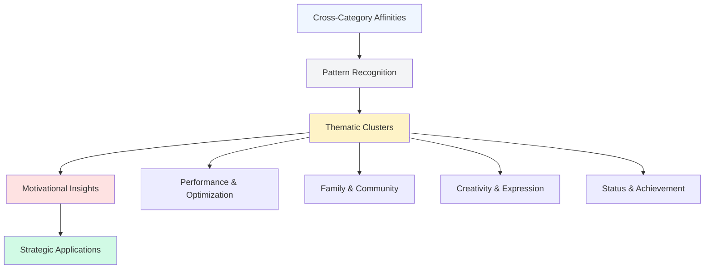

# Discovering What Your Audience Actually Cares About

_How to map audience interests and values beyond your category using cross-category affinity analysis_

---

## The Business Problem

Your product team is planning next year's roadmap. The discussion centers on which features to prioritize:

**Option A:** Enhanced analytics dashboard (requested by 15% of users in surveys) **Option B:** Mobile app redesign (identified in UX research) **Option C:** Integration with popular productivity tools (top feature request)

The team votes for Option C because it's the most-requested feature. Seems logical.

But six months and $500K later, adoption is disappointing. Only 8% of users actually use the integration. The team is confused: "But they asked for it! Why aren't they using it?"

**The core problem:** People are unreliable narrators of their own needs.

<div class="grid-2"> <div>

**What customers say they want:**

- "I need better integrations"
- "I want more analytics"
- "Give me advanced features"

</div> <div>

**What they actually use:**

- Simple, intuitive workflows
- Quick wins with minimal setup
- Features that fit existing habits

</div> </div>

Traditional methods for understanding what customers care about have significant limitations:

 **Why Traditional Research Falls Short:**

**Surveys and interviews:**

- People report what they think they _should_ want
- Can't articulate needs they don't consciously recognize
- Biased by how questions are framed

**Feature requests:**

- Vocal minority dominates feedback
- Requests reflect conscious pain points, not deeper motivations
- Users describe solutions, not underlying needs

**Usage analytics:**

- Show _what_ people do, not _why_ they do it
- Past behavior doesn't always predict future needs
- Can't reveal adjacent opportunities outside current product

**Focus groups:**

- Social dynamics bias responses
- Small sample size limits reliability
- Participants perform for facilitators 

The result: Product teams build features nobody uses, marketing teams create campaigns that don't resonate, and strategy teams miss adjacent market opportunities.

**What's missing:** Understanding what your audience cares about _beyond your category_ - the interests, values, communities, and lifestyle choices that reveal their deeper motivations.

Cross-category affinity analysis reveals the truth about what drives your audience.

---

## The Data Approach

### The Core Principle

 **Your audience isn't defined by your product category. Your category is just one expression of their deeper interests and values.**

Understanding what else they care about reveals:

- Why they chose you in the first place
- What adjacent needs exist
- How to communicate authentically
- Where to expand strategically 

### The Framework: Cross-Category Affinity Mapping

**The question:** What does your audience engage with across all categories, and what patterns emerge?

**Step 1: Collect affinity data across categories**

|Category|What It Reveals|
|---|---|
|**Media & Content**|Information diet, cultural touchpoints, learning style|
|**Brands & Products**|Purchase priorities, value systems, lifestyle choices|
|**Influencers & Creators**|Who they trust, what voices resonate, community belonging|
|**Causes & Movements**|Values, political/social alignment, identity expression|
|**Platforms & Tools**|How they work, communicate, organize their lives|
|**Events & Communities**|Participation patterns, social contexts, aspirations|

**Step 2: Calculate affinity for each item**

```
Affinity = (% of your audience engaging with item) ÷ (% of general population engaging with item)
```

**Interpretation:**

- **1x affinity:** Your audience engages at general population rate (not distinctive)
- **3-5x affinity:** Moderate over-indexing (relevant but not defining)
- **10x+ affinity:** Strong signal (potentially identity-defining)
- **30x+ affinity:** Extremely strong signal (core to who they are)

**Step 3: Cluster affinities into thematic patterns**

Group high-affinity items by underlying motivation:

mermaid



**Step 4: Synthesize into psychographic profile**

Move from "what they engage with" to "why they engage" - the motivations, values, and identity that drive behavior.

---

## Worked Example: TechFlow Productivity App Discovery

### Scenario Setup

<div style="border-left:5px solid #4F46E5; background-color:#F3F4F6; padding:1em; margin-bottom:1em; border-radius:8px;">

**TechFlow**

- Project management and productivity platform
- Target: Knowledge workers and creative professionals
- Current users: 250,000 active
- Revenue: $15/month subscription
- Challenge: Churn is high after 3 months, engagement plateaus quickly

</div>

**The mystery:** Users sign up excited, use heavily for 2-4 weeks, then engagement drops sharply. Exit surveys cite "doesn't fit my workflow" but don't explain why.

**Traditional research findings:**

- Surveys: "I need better integrations" (top request)
- Usage data: Most-used features are simple task lists and calendars
- Churn interviews: "Too complex," "Didn't integrate with my work style"

**The hypothesis:** We're building features users say they want, but missing what they actually need. Cross-category affinity analysis might reveal the disconnect.

### Step 1: Cross-Category Affinity Data Collection

**Analyzing TechFlow's 250,000-user audience across all categories:**

#### Media & Content Consumption

|Item|% of Audience|Affinity|Category|
|---|---|---|---|
|The New York Times|48%|1.4x|News|
|Wired Magazine|31%|18x|Tech Culture|
|Podcast: How I Built This|28%|22x|Entrepreneurship|
|Podcast: Creative Pep Talk|24%|41x|Creative Process|
|Podcast: The Tim Ferriss Show|22%|15x|Optimization|
|Medium (platform)|38%|8x|Content/Ideas|
|Brain Pickings newsletter|19%|38x|Ideas/Curation|
|Fast Company|27%|12x|Business/Innovation|

 **Pattern emerging:** High affinity for content about creative process, ideas, and entrepreneurial thinking. Lower affinity for pure business/productivity content than expected. 

#### Brands & Products (Non-Productivity)

|Item|% of Audience|Affinity|Category|
|---|---|---|---|
|Moleskine notebooks|32%|28x|Analog Tools|
|Field Notes|21%|45x|Analog Tools|
|Leuchtturm1917|18%|52x|Analog Tools|
|Patagonia|29%|8x|Values/Sustainability|
|Apple (brand affinity)|67%|3.2x|Design/Ecosystem|
|Muji|23%|19x|Minimalism/Design|
|Local coffee shops|41%|11x|Experience/Community|
|Independent bookstores|28%|14x|Curation/Discovery|

 **Unexpected pattern:** Extremely high affinity (28-52x) for premium analog notebooks. This audience values physical, tactile tools despite using digital productivity software. 

#### Productivity & Work Tools

|Item|% of Audience|Affinity|Category|
|---|---|---|---|
|Notion|44%|21x|Flexible/Personal|
|Bear (notes app)|28%|35x|Simple/Beautiful|
|Things (task manager)|24%|31x|Design-Forward|
|Todoist|19%|8x|Structured/Systematic|
|Slack|52%|4.2x|Team Communication|
|Figma|31%|18x|Design/Collaboration|
|VS Code|27%|12x|Development|
|Obsidian|22%|67x|Knowledge Management|

 **Critical insight:** Highest affinities are for tools that emphasize _flexibility, beauty, and personal knowledge systems_ (Notion 21x, Bear 35x, Obsidian 67x) over rigid, enterprise-focused tools. 

#### Influencers & Thought Leaders

|Item|% of Audience|Affinity|Category|
|---|---|---|---|
|Austin Kleon (author/artist)|26%|48x|Creative Process|
|James Clear (habits)|31%|19x|Systems/Habits|
|Cal Newport (deep work)|28%|24x|Focus/Craft|
|Anne-Laure Le Cunff (neuroscience)|18%|61x|Learning/Thinking|
|Tiago Forte (BASB)|22%|38x|Knowledge Systems|
|David Allen (GTD)|14%|8x|Traditional Productivity|
|Marie Forleo|12%|6x|Motivation/Success|
|Gary Vaynerchuk|8%|2.1x|Hustle Culture|

 **Motivation pattern revealed:** High affinity for influencers focused on _creative process, deep work, and knowledge systems_ (Austin Kleon 48x, Anne-Laure Le Cunff 61x). Low affinity for traditional productivity gurus and hustle culture (David Allen 8x, Gary Vee 2.1x).

**What this means:** This audience doesn't want to "optimize output." They want to "think better and create meaningful work." 

#### Communities & Movements

|Item|% of Audience|Affinity|Category|
|---|---|---|---|
|Indie Hackers|24%|42x|Independent Creation|
|r/ProductivityApps|18%|28x|Tool Exploration|
|Zettelkasten community|16%|73x|Knowledge Systems|
|Digital minimalism|21%|31x|Intentional Tech|
|Slow productivity movement|19%|58x|Anti-Hustle|
|PKM (Personal Knowledge Mgmt)|23%|51x|Learning Systems|
|Building in public|17%|38x|Transparency/Creation|

 **Cultural alignment:** Extremely high affinity for communities around _knowledge systems, slow productivity, and independent creation_ (Zettelkasten 73x, Slow productivity 58x, PKM 51x).

**This is not a "get more done" audience. This is a "do meaningful work thoughtfully" audience.** 

#### Creative & Learning Tools

|Item|% of Audience|Affinity|Category|
|---|---|---|---|
|Skillshare|28%|16x|Learning|
|MasterClass|24%|11x|Aspirational Learning|
|Coursera|19%|6x|Formal Education|
|Readwise|27%|48x|Reading/Retention|
|Goodreads|34%|8x|Reading|
|Blinkist|11%|4x|Efficiency|
|Audible|31%|3.2x|Audio Learning|
|Kindle Unlimited|18%|5x|Reading Volume|

 **Learning pattern:** High affinity for tools about _retaining and connecting ideas_ (Readwise 48x) over consuming volume (Blinkist 4x, Kindle Unlimited 5x). Quality and depth over quantity. 

### Step 2: Pattern Recognition and Clustering

**Grouping high-affinity items by underlying theme:**

<div class="grid-2"> <div style="border-left:4px solid #8B5CF6; padding:1em; background:#F5F3FF;">

**Cluster 1: Knowledge Cultivation**

- Zettelkasten: 73x
- Obsidian: 67x
- Anne-Laure Le Cunff: 61x
- PKM community: 51x
- Readwise: 48x
- Tiago Forte: 38x

**Pattern:** Building personal knowledge systems, connecting ideas, long-term learning

</div> <div style="border-left:4px solid #3B82F6; padding:1em; background:#EFF6FF;">

**Cluster 2: Thoughtful Creation**

- Slow productivity: 58x
- Leuchtturm notebooks: 52x
- Austin Kleon: 48x
- Field Notes: 45x
- Creative Pep Talk: 41x
- Indie Hackers: 42x

**Pattern:** Making things carefully, valuing process, independent creative work

</div> </div> <div class="grid-2"> <div style="border-left:4px solid #10B981; padding:1em; background:#F0FDF4;">

**Cluster 3: Deep Focus & Craft**

- Bear app: 35x
- Digital minimalism: 31x
- Things: 31x
- Moleskine: 28x
- Cal Newport: 24x
- Notion: 21x

**Pattern:** Distraction-free environments, beautiful tools, sustained attention

</div> <div style="border-left:4px solid #F59E0B; padding:1em; background:#FFF7ED;">

**Cluster 4: Design & Aesthetics**

- Muji: 19x
- Figma: 18x
- Wired: 18x
- Brain Pickings: 38x
- Independent bookstores: 14x
- Local coffee shops: 11x

**Pattern:** Appreciation for design, curation, thoughtful spaces

</div> </div>

### Step 3: Synthesizing the Psychographic Profile

**Who the TechFlow audience actually is:**

 **"The Thoughtful Maker"**

**Identity:** Creative knowledge workers who see their work as craft, not output. They're building things (products, businesses, ideas, content) independently or in small teams.

**Core values:**

- **Quality over quantity:** Would rather create one excellent thing than ten mediocre things
- **Process over productivity:** The _how_ matters as much as the _what_
- **Knowledge as craft:** Building personal systems for thinking, not just capturing tasks
- **Independence:** Want control over how they work, skeptical of corporate productivity culture
- **Aesthetics matter:** Tools should be beautiful and thoughtful, not just functional

**Motivations:**

- **Create meaningful work:** Not "get more done" but "do better work"
- **Think clearly:** Build systems for deeper thinking and idea connection
- **Work sustainably:** Avoid burnout, embrace slower, more intentional pace
- **Learn continuously:** Build long-term knowledge, not consume quick tips
- **Express individuality:** Tools should adapt to them, not force conformity

**Anti-motivations (what they reject):**

- Hustle culture and "grind" mentality (Gary Vee 2.1x)
- Rigid, corporate productivity systems
- Efficiency for efficiency's sake
- One-size-fits-all workflows
- Optimization without purpose 

### Step 4: Strategic Implications - Why TechFlow Is Failing

**The disconnect revealed:**

<div class="grid-2"> <div style="border:2px solid #EF4444; padding:1em; border-radius:8px;">

**What TechFlow Built:**

- Structured project management
- Team collaboration features
- Enterprise integrations
- Workflow automation
- Productivity metrics and tracking
- Template-based workflows

**Positioning:** _"Get your team aligned and shipping faster"_

</div> <div style="border:2px solid #10B981; padding:1em; border-radius:8px;">

**What the Audience Actually Wants:**

- Flexible, personal knowledge systems
- Space for thinking, not just doing
- Beautiful, distraction-free interface
- Tools that adapt to individual processes
- Connection between ideas, not just tasks
- Support for slow, deep work

**Desired positioning:** _"Think clearly, create meaningfully"_

</div> </div>

**Why users churn after 3 months:**



1. **Product-audience mismatch:** TechFlow built for "efficient team execution." Audience wants "thoughtful individual creation."
2. **Feature priorities backward:** Users requested "integrations" because they're trying to force TechFlow to fit their workflow. They actually need TechFlow to _be_ more flexible, not integrate with more tools.
3. **Messaging disconnect:** Marketing emphasizes "ship faster, stay aligned." Audience values "think deeper, work sustainably."
4. **UI/UX philosophy clash:** Product is structured and systematic. Audience has 52x affinity for beautiful analog notebooks - they want aesthetics and tactile pleasure in their digital tools.
5. **Missing the core need:** Audience isn't trying to "manage projects." They're trying to "cultivate knowledge and create meaningful work." TechFlow solves the wrong problem. 

### Step 5: Product Strategy Transformation

**Armed with psychographic understanding, TechFlow can pivot:**

#### Immediate Changes (0-3 months)



<div>

**Messaging Overhaul:**

- FROM: _"Get your team aligned and shipping faster"_
- TO: _"A thinking space for creative work"_

**Homepage copy:**

- FROM: "Track projects, align teams, ship on time"
- TO: "Where ideas connect and meaningful work happens"

</div>

<--->

<div>

**Visual Redesign:**

- Embrace minimalism (Muji 19x affinity)
- Beautiful typography and whitespace
- Distraction-free writing interface
- Remove aggressive productivity language

</div>



#### Medium-term Product Changes (3-9 months)

**Feature Reprioritization:**

|Priority|Feature|Why (Based on Affinity Data)|
|---|---|---|
|**P0**|Flexible note-linking system|Zettelkasten 73x, Obsidian 67x, PKM 51x|
|**P0**|Beautiful writing interface|Bear 35x, Things 31x, analog notebooks 28-52x|
|**P0**|Personal knowledge graph|Anne-Laure Le Cunff 61x, Tiago Forte 38x|
|**P1**|Focus mode / distraction-free|Cal Newport 24x, digital minimalism 31x|
|**P1**|Slow productivity features|Slow productivity movement 58x|
|**P2**|Team features (de-emphasize)|Low affinity for collaboration-first tools|

**New Features Aligned with Audience:**

<div class="grid-3"> <div style="background:#F5F3FF; padding:1em; border-radius:8px;">

**Knowledge Connections**

- Bi-directional linking
- Visual knowledge graph
- Tag relationships
- Idea evolution tracking

_Serves: Zettelkasten 73x, Obsidian 67x, PKM 51x_

</div> <div style="background:#EFF6FF; padding:1em; border-radius:8px;">

**Thoughtful Creation**

- Long-form writing mode
- Version history as creative evolution
- Export to beautiful formats
- Integration with publishing platforms

_Serves: Austin Kleon 48x, Creative Pep Talk 41x, slow productivity 58x_

</div> <div style="background:#F0FDF4; padding:1em; border-radius:8px;">

**Deep Focus Support**

- Pomodoro + deep work modes
- Distraction blocking
- Ambient soundscapes
- Daily intention setting

_Serves: Cal Newport 24x, digital minimalism 31x, slow productivity 58x_

</div> </div>

#### Long-term Strategic Pivot (9-18 months)

**Repositioning TechFlow:**

<div style="border-left:5px solid #8B5CF6; background:#F5F3FF; padding:1.5em; margin:1em 0;">

**FROM:** Team productivity and project management platform **TO:** Personal knowledge and creative work environment

**New value proposition:** _"TechFlow is where thoughtful makers build their life's work. It's a space for deep thinking, idea cultivation, and creating things that matter - not a to-do list with bells and whistles."_

**Target customer evolution:**

- FROM: "Teams shipping software products"
- TO: "Independent creators, researchers, writers, and knowledge workers building meaningful work"

**Competitive position:**

- NOT competing with: Asana, Monday, Jira (project management)
- IS competing with: Notion, Obsidian, Roam (personal knowledge)
- DIFFERENTIATOR: "Beautiful, focused, and thoughtful vs. powerful but overwhelming"

</div>

#### Validation Through Affinity Data

**Confirming the pivot makes sense:**

|Strategic Decision|Supporting Affinity Evidence|
|---|---|
|De-emphasize team features|Low affinity for Slack (4.2x), enterprise tools|
|Focus on personal knowledge|Zettelkasten 73x, Obsidian 67x, PKM 51x|
|Emphasize beauty & design|Analog notebooks 28-52x, Muji 19x, Things 31x|
|Anti-hustle positioning|Slow productivity 58x, low Gary Vee 2.1x|
|Long-form thinking support|Cal Newport 24x, Brain Pickings 38x|
|Independent creator focus|Indie Hackers 42x, Building in public 38x|

---

## Contrast: What Traditional Research Missed

### The Survey Data Said:

**Top 3 Feature Requests:**

1. "Better integrations with other tools" (32% of respondents)
2. "More automation options" (28%)
3. "Team collaboration improvements" (24%)

**Why users thought they wanted these:**

- Integrations: Trying to connect TechFlow to their actual workflow tools
- Automation: Productivity culture says "automate everything"
- Team features: Assumed productivity app = team tool

### What Affinity Data Revealed:

**What users actually need:**

1. **Flexible thinking space** (not rigid project management)
    - Evidence: Obsidian 67x, Zettelkasten 73x
2. **Beautiful, distraction-free environment** (not more features)
    - Evidence: Analog notebooks 28-52x, Bear 35x
3. **Personal knowledge cultivation** (not team alignment)
    - Evidence: PKM 51x, Anne-Laure Le Cunff 61x

 **The gap:**

**Survey answers:** Users describing _solutions_ to surface problems

**Affinity patterns:** Data revealing _deeper motivations_ and needs

**Example:**

- User says: "I need Slack integration"
- User means: "I need TechFlow to fit my communication-heavy workflow"
- User actually needs: "I need a quiet space separate from constant communication"

Affinity data shows low engagement with communication tools (Slack 4.2x) and high engagement with focus/deep work content (Cal Newport 24x, digital minimalism 31x).

**The real need:** Less integration with distracting tools, more support for focused thinking. 

---

## Common Pitfalls

### 1. Taking Affinities at Face Value Without Pattern Recognition

 **The trap:** "Our audience has 18x affinity for Wired Magazine. Let's do tech news content!"

**Why it's shallow:** Individual affinities are data points. Patterns across affinities reveal motivations.

**Better approach:**

- Wired 18x + Brain Pickings 38x + Independent bookstores 14x = ?
- Pattern: Curated, thoughtful content about ideas and culture
- NOT: Breaking tech news or product reviews
- IS: Long-form essays about technology's cultural impact 

**How to avoid:**

- Never act on single affinities
- Group affinities into thematic clusters
- Ask: "What underlying motivation connects these?"

### 2. Ignoring Anti-Affinities

 **The trap:** Only looking at high affinities, missing what audience rejects

**Example from TechFlow:**

- Gary Vaynerchuk: 2.1x (near general population)
- David Allen (GTD): 8x (moderate, not strong)
- Blinkist: 4x (efficiency-focused reading)

**What low affinities reveal:**

- Audience actively rejects hustle culture
- Not interested in traditional productivity methods
- Values depth over efficiency

**Strategic implication:** Positioning as "anti-productivity productivity tool" could resonate 

**How to avoid:**

- Examine low affinity items (1-3x) in categories where you expect high
- Ask: "What popular things in our category does our audience NOT care about?"
- Use anti-affinities to define what you're NOT

### 3. Confirmation Bias in Pattern Interpretation

 **The trap:** Seeing patterns that confirm existing beliefs, missing contradictory signals

**Example:**

- Team sees Notion (21x) and thinks: "They want powerful, all-in-one tools!"
- Misses that actual highest affinities are specialized, focused tools:
    - Zettelkasten (73x) - focused on knowledge
    - Obsidian (67x) - focused on linking
    - Bear (35x) - focused on beautiful writing

**Correct interpretation:** Notion's appeal is _flexibility and personalization_, not comprehensiveness 

**How to avoid:**

- Have multiple people interpret patterns independently
- Actively look for disconfirming evidence
- Test interpretations with qualitative research

### 4. Category Over-Fitting

 **The trap:** Only examining affinities within your category

**Example:** TechFlow only analyzing productivity tools

- Sees: Notion 21x, Todoist 8x, Things 31x
- Concludes: "We need to be more like Notion!"
- Misses: Analog notebooks 28-52x, slow productivity 58x, Austin Kleon 48x

**What cross-category analysis reveals:**

- Audience uses digital tools but _values_ analog thinking
- Wants productivity app that feels like working in a beautiful notebook
- Strategic opportunity: "Digital with soul of analog" 

**How to avoid:**

- Always analyze across 6-8 categories minimum
- Look for unexpected affinities (analog tools for digital product users)
- Ask: "What categories would we never think to examine?"

---

## Complementary Approaches

### When Affinity Data Isn't Enough

**Combine with:**

 **Method:**

- Shadow users in their actual work environment
- Observe how they use analog + digital tools together
- See where TechFlow fits (or doesn't) in real workflow

**Value:** Validates affinity-based hypotheses about behavior 

 **Questions based on affinity insights:**

- "You use both Obsidian and TechFlow. What job does each do?"
- "You have high affinity for analog notebooks. How do they fit with digital tools?"
- "What are you really trying to accomplish when you use productivity tools?"

**Value:** Connects observed affinities to conscious motivations 

 **Process:**

1. Affinity data suggests audience values knowledge linking (Zettelkasten 73x)
2. Build basic bidirectional linking prototype
3. Test with users who show high affinity for knowledge management
4. Measure adoption vs. users without those affinities

**Value:** Validates that affinity patterns predict feature adoption 

 **Method:**

- Cluster users by affinity patterns
- Compare retention, engagement, LTV across clusters
- Identify which affinity profiles predict best customers

**Example from TechFlow:**

|Segment|Defining Affinities|6-Month Retention|LTV|
|---|---|---|---|
|Knowledge Cultivators|Zettelkasten, Obsidian, PKM|78%|$340|
|Team Collaborators|Slack, Asana, structured tools|34%|$110|
|Creative Makers|Austin Kleon, slow productivity|81%|$380|

**Insight:** Focus product development on Knowledge Cultivators and Creative Makers (high retention, high LTV). Current product serves Team Collaborators (who churn). 

### What Affinity Data Can't Tell You

**Limitations:**

- **Intensity of engagement:** Shows they follow/engage, not frequency or depth
- **Causation vs. correlation:** Affinities reveal associations, not causal relationships
- **Future behavior:** Past patterns don't guarantee future needs
- **Conscious vs. unconscious:** Some motivations may not surface in observable behavior

**Integration approach:**

1. Use affinity data to **generate hypotheses** about motivations
2. **Validate hypotheses** with qualitative research
3. **Test product changes** based on insights
4. **Measure outcomes** and refine understanding

---

## Actionable Takeaway

 **To discover what your audience actually cares about:**

1. **Map cross-category affinities:** Examine what your audience engages with across 6-8 categories beyond your product
2. **Identify affinity patterns:** Cluster high affinities (10x+) into thematic groups based on underlying motivation
3. **Synthesize psychographic profile:** Move from "what they engage with" to "why they engage" - the values, motivations, and identity that drive behavior
4. **Compare to current positioning:** Where does your product/messaging align or misalign with revealed motivations?

**Red flags you're missing audience motivations:**

- Features requested but not used after launch
- High churn despite solving stated problems
- Competitor success you can't explain
- Marketing that generates awareness but not conversion

**Next step:** Run cross-category affinity analysis on your audience this week. Map the top 50 affinities across all categories. Look for patterns. Ask: "Does our product/positioning align with these revealed motivations?" If not, you've found the gap. 

---

_What people say they want (surveys, feature requests) often conflicts with what they actually care about (behavioral affinities). Cross-category analysis reveals the deeper motivations that drive real behavior._