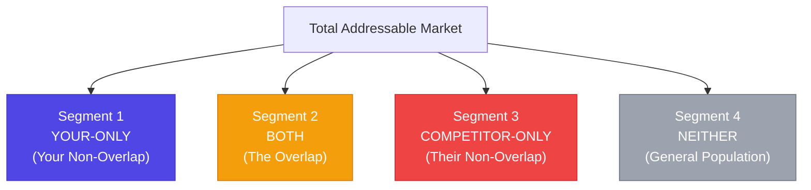
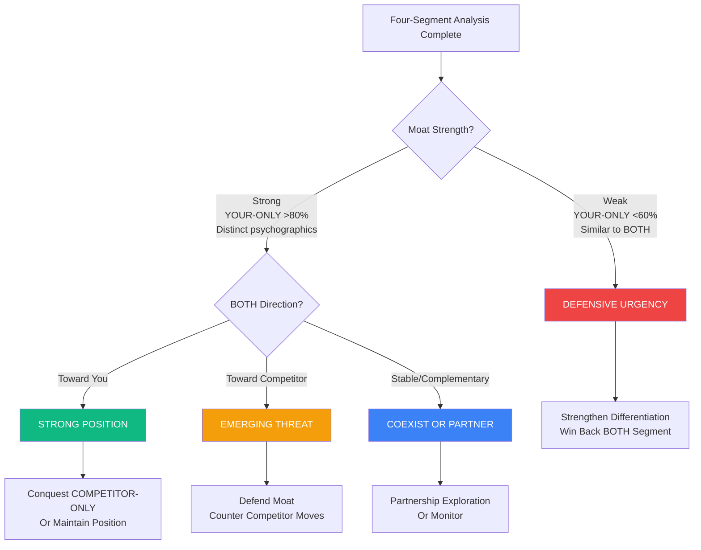

# Deep-Dive Competitive Analysis Through Overlap Segments

## The Business Problem

Your competitive analysis shows 30% audience overlap with Competitor X. Your team debates what this means:

- **Product team:** "30% overlap means they're a major threat, we need to match their features"
- **Marketing team:** "We should conquest their customers, they're already familiar with the category"
- **Strategy team:** "Maybe we should partner instead of compete, could be complementary"
- **Executive team:** "Is 30% a lot? Should we be worried?"

A single overlap percentage can't answer these questions. **Everyone is guessing because the number hides critical strategic nuances:**

- Are the overlapping 30% using both products simultaneously (complementary) or evaluating which to choose (competitive)?
- Are they loyal to you, loyal to them, or genuinely switching between both?
- Of the competitor's 70% non-overlap base, how many are realistic conquest targets vs. fundamentally different audiences?
- Of your 70% non-overlap base, what makes them loyal to you (your moat) vs. just unaware of alternatives (defensive vulnerability)?


**The cost of guessing wrong:**

**Scenario 1: You treat complementary overlap as competitive**
- Invest resources fighting a "threat" that isn't actually threatening
- Damage potential partnership opportunity
- Alienate loyal customers by chasing overlap segment preferences

**Scenario 2: You treat competitive overlap as minimal**
- Miss early warning signs of customers migrating to competitor
- Fail to defend eroding moat
- Lose market share before threat becomes obvious

**Scenario 3: You conquest non-addressable segments**
- Waste marketing budget on customers who will never convert
- Wrong message to wrong audience
- Opportunity cost of not targeting addressable segments


What's needed is **systematic four-segment analysis**: understanding not just the overlap, but the distinctive characteristics of customers in each segment of the competitive landscape.

## The Data Approach

The four-segment framework decomposes any competitive relationship into four distinct audiences, each revealing different strategic insights:

### The Four Segments




#### Segment 1: YOUR-ONLY
**Your non-overlap base**

These customers use your product but not the competitor's (or aren't aware of it).

**What it reveals:**
- Your defensible moat
- What makes customers loyal to you specifically
- Whether you're losing distinctiveness

<--->

#### Segment 2: BOTH
**The overlap**

These customers engage with both brands.

**What it reveals:**
- Complementary vs. competitive usage
- Swing voter dynamics
- Who's winning the evaluation





#### Segment 3: COMPETITOR-ONLY
**Their non-overlap base**

These customers use competitor but not you.

**What it reveals:**
- Addressable conquest targets
- Non-addressable (fundamentally different)
- What competitor offers that you don't

<--->

#### Segment 4: NEITHER
**General population baseline**

People using neither product.

**What it reveals:**
- Category-level patterns
- What defines category participation
- Brand differentiation within category



---

### Two Approaches: At-Scale Screening vs. Pairwise Deep-Dive

Depending on your goal, you can run four-segment analysis at two levels:

<div class="grid-2">

<div class="approach-card screening">

#### At-Scale Screening

**When to use:**  
You want to understand your competitive ecosystem broadly

**Process:**  
Run lightweight 4-segment analysis across all high-affinity entities (500-2000 entities)

**Output:**  
- Classification: competitive, complementary, or neutral
- Prioritization: which relationships deserve deep analysis
- Conquest ranking: addressable audience sizes

**Time investment:** Hours (automated/LLM-assisted)

**Best for:** Ecosystem mapping, opportunity screening

</div>

<div class="approach-card deepdive">

#### Pairwise Deep-Dive

**When to use:**  
You need to understand a specific competitive relationship deeply

**Process:**  
Full psychographic analysis of all 4 segments for Brand A vs. Brand B

**Output:**  
- Detailed segment profiles
- Strategic positioning recommendations
- Conquest/defense/partnership playbook

**Time investment:** 4-8 hours per relationship

**Best for:** Strategic decisions, competitive response, M&A evaluation

</div>

</div>


**Recommended workflow:** At-scale screening (identify top 5-10 relationships) → Pairwise deep-dive (understand those relationships strategically)


---

## Worked Example 1: Pairwise Deep-Dive (TechFlow vs. FlowLab)

Let's walk through a complete four-segment analysis for a specific competitive relationship.

### The Setup

**TechFlow:** Enterprise project management platform
- 180,000 users
- Positioning: "Enterprise-grade project management with powerful features"
- Price: $40/user/month
- Target: Mid-market companies (50-500 employees)

**FlowLab:** Lightweight task management for creative teams
- 82,000 users (growing 60% annually)
- Positioning: "Project management that doesn't get in the way of creativity"
- Price: $25/user/month
- Target: Creative agencies, design teams

**Basic overlap metrics:**
- Overlap: 14,200 users
- Reach (TechFlow → FlowLab): 7.9%
- Penetration (FlowLab → TechFlow): 17.3%
- Pattern: Asymmetric (FlowLab winning TechFlow customers, TechFlow not winning theirs)

**The strategic question:** Is FlowLab a threat? Should we compete, ignore, or partner?

---

### Step 1: Calculate Segment Sizes
```
SEGMENT 1: TechFlow-only
- Size: 165,800 users (92.1% of TechFlow base)
- These customers use TechFlow but not FlowLab

SEGMENT 2: BOTH
- Size: 14,200 users
- 7.9% of TechFlow base
- 17.3% of FlowLab base

SEGMENT 3: FlowLab-only
- Size: 67,800 users (82.7% of FlowLab base)
- These customers use FlowLab but not TechFlow

SEGMENT 4: Neither
- General population not using either platform
```

**Initial observation:** Large TechFlow-only segment (92.1%) suggests strong moat. But FlowLab is growing fast (60% annually), and asymmetric pattern (they're winning you, you're not winning them) is concerning.

---

### Step 2: Psychographic Profiling (Each Segment)

#### TechFlow-only Segment (165,800 users)

**Top brand affinities:**

| Category | Example Brands | Affinity | Reach |
|----------|----------------|----------|-------|
| Enterprise tools | Salesforce, Workday, SAP | 12-15x | 35-45% |
| Technical platforms | AWS, Azure, GitHub | 15-20x | 40-50% |
| Business intelligence | Tableau, Looker, Power BI | 10-14x | 30-40% |
| Process optimization | Six Sigma content, lean methodologies | 8-12x | 25-35% |

**Demographics:**
- Company size: 100-500 employees (median: 180)
- Roles: Project managers, operations, IT leadership
- Age: 35-50 (established professionals)

**Values & motivations:**
- **Comprehensive features** over simplicity
- **Data and reporting** for stakeholder visibility
- **Enterprise grade** (security, compliance, scalability)
- **Process rigor** and methodology
- **ROI justification** (metrics, dashboards, reporting)


**TechFlow-only persona:**

"Enterprise Operations Manager" - Manages complex projects across multiple teams, needs robust reporting for executives, values comprehensive features and integration with enterprise stack.

**Core motivation:** Control, visibility, and scalability


---

#### BOTH Segment (14,200 users)

**Top brand affinities:**

| Category | Example Brands | Affinity | Reach |
|----------|----------------|----------|-------|
| Design tools | Figma, Adobe CC, Sketch | 18-25x | 55-65% |
| Creative platforms | Behance, Dribbble | 12-18x | 40-50% |
| Project management | Mix of enterprise and lightweight | 8-15x | varies |
| Collaboration | Slack, Notion, Miro | 10-16x | 50-60% |

**Demographics:**
- Company size: 25-150 employees (median: 60)
- Roles: Creative directors, design leads, hybrid roles
- Age: 28-40 (younger than TechFlow-only)

**Values & motivations:**
- **Balance** between features and ease of use
- **Creative workflow** specific needs
- **Team collaboration** over process enforcement
- **Flexibility** over rigid methodology

**Current usage pattern (from interviews):**



**How they use TechFlow:**
- Complex projects with external stakeholders
- Projects requiring detailed reporting
- When client demands enterprise PM tool
- Legacy projects already in TechFlow

<--->

**How they use FlowLab:**
- Internal creative projects
- Fast-moving agency work
- Design-specific workflows
- When team prefers lightweight tool




**BOTH segment persona:**

"Creative Operations Hybrid" - Works in creative agency but needs to balance creative workflow with client expectations. Uses TechFlow when required by client/stakeholders, uses FlowLab when team has choice.

**Core motivation:** Flexibility to match tool to project type

**Critical insight:** This is **transitional usage**, not permanent dual-tool strategy. Interviews reveal 68% would prefer to consolidate to one tool if it served both needs.


**Psychographic drift analysis:**

Comparing BOTH segment to TechFlow-only and FlowLab-only:
```
Affinity similarity scores:

BOTH vs. TechFlow-only: 62% overlap in top brands
BOTH vs. FlowLab-only: 78% overlap in top brands

INTERPRETATION: BOTH segment psychographics are closer to 
FlowLab-only than TechFlow-only.

They're gravitating toward FlowLab's value system 
(simplicity, design-centric, creative workflow).
```


**This is the early warning signal:**

The overlap segment looks more like FlowLab's base than TechFlow's. Combined with:
- Asymmetric pattern (FlowLab reaching TechFlow customers, not reverse)
- FlowLab growing 60% annually
- BOTH segment expressing desire to consolidate

**Trend:** BOTH segment is likely to consolidate to FlowLab over next 12-24 months if FlowLab adds the missing enterprise features they need.

**This is an emerging threat, not a stable complementary relationship.**


---

#### FlowLab-only Segment (67,800 users)

**Top brand affinities:**

| Category | Example Brands | Affinity | Reach |
|----------|----------------|----------|-------|
| Design tools | Figma, Adobe CC, Sketch | 22-30x | 70-80% |
| Creative communities | Behance, Dribbble, Design communities | 18-25x | 55-65% |
| Simple tools | Notion, Airtable, Canva | 15-22x | 60-70% |
| Indie software | Small indie apps, design-focused products | 12-18x | 45-55% |

**Demographics:**
- Company size: 5-50 employees (median: 15)
- Roles: Designers, creatives, freelancers, small agency teams
- Age: 25-35 (younger, earlier career)

**Values & motivations:**
- **Simplicity** over comprehensive features
- **Design and aesthetics** matter (tool should be beautiful)
- **Speed** over process rigor
- **Team happiness** over stakeholder reporting
- **Modern** over enterprise


**FlowLab-only persona:**

"Creative Team Lead" - Runs small creative team or freelance operation, prioritizes keeping team productive and happy over complex project management processes.

**Core motivation:** Keep work flowing, don't get bogged down in PM overhead


**Addressability analysis:**
FlowLab-only: 67,800 users

ADDRESSABLE (could convert to TechFlow):

- Size: ~12,000 users (18%)
- Profile: Growing agencies (25-50 employees) who will eventually need enterprise features as they scale
- Barriers: Perception ("TechFlow is too complex"), price, switching costs

NON-ADDRESSABLE (will not convert):

- Size: ~55,800 users (82%)
- Profile: Small teams, freelancers, those who chose FlowLab specifically for simplicity over TechFlow's power
- Why: Fundamentally value simplicity, company size won't require enterprise features, price-sensitive

INSIGHT: Only 18% of FlowLab's base is realistically addressable by TechFlow. The remaining 82% chose FlowLab specifically because TechFlow offers what they DON'T want (complexity, enterprise features).

---

### Step 3: Segment Comparison & Strategic Insights

**The complete picture:**

<div class="segment-summary">

| Segment | Size | Psychographic Lean | Trend | Strategic Meaning |
|---------|------|-------------------|-------|-------------------|
| **TechFlow-only** | 165,800 (92.1%) | Enterprise, process, comprehensive | Stable | Your defensible moat |
| **BOTH** | 14,200 (7.9%) | Creative-leaning, transitional | → FlowLab | Eroding, at risk |
| **FlowLab-only** | 67,800 (82.7%) | Creative, simplicity, small teams | Growing fast | Mostly non-addressable |
| **Neither** | Population | Baseline | N/A | Category context |

</div>

**Key insights:**


**Insight 1: Your moat is strong but segment-specific**

92.1% of your base (TechFlow-only) is not at risk from FlowLab. They need enterprise features, reporting, and integration that FlowLab doesn't offer.

**BUT:** This moat only protects you in the **enterprise mid-market segment** (100-500 employee companies).



**Insight 2: You're losing the creative agency segment**

The 7.9% overlap (BOTH segment) is:
- Psychographically closer to FlowLab-only (78% similarity) than TechFlow-only (62%)
- Expressing desire to consolidate tools
- Currently using TechFlow only when forced by clients
- Likely to fully migrate to FlowLab if they add missing features

**This represents ~$2.3M ARR at risk** (14,200 users × $40/user × 12 months × realistic churn rate)



**Insight 3: Conquest opportunity is small**

Only 12,000 of FlowLab's 67,800 users (18%) are addressable.

**Conquest economics:**
- Addressable: 12,000 users
- Realistic conversion: 15-20% = 1,800-2,400 users
- Revenue potential: $860K-1.15M ARR

vs.

**Defense economics:**
- At-risk BOTH segment: 14,200 users
- Potential churn: 50-70% = 7,100-9,940 users
- Revenue at risk: $3.4M-4.8M ARR

**Defense is 3-4x more valuable than conquest.**



**Insight 4: FlowLab's threat is segment-specific, not total**

FlowLab isn't a threat to your core enterprise business (92.1% of base). They're a threat to the **creative agency segment** specifically (7.9% of base, but growing).

**The strategic question isn't "should we compete with FlowLab overall?"**

**It's "should we defend the creative agency segment, or cede it and focus on enterprise?"**


---

### Step 4: Strategic Recommendations

Based on four-segment analysis, here are TechFlow's options:

<div class="grid-3">

<div class="strategy-card defend">

#### Option A: Defend Creative Segment

**Strategy:**  
Build "TechFlow Lite" for creative teams

**Pros:**
- Defend $2.3M at-risk ARR
- Block FlowLab from expanding upmarket
- Serve creative segment you already have

**Cons:**
- Product complexity (two SKUs)
- Brand confusion (enterprise vs. creative)
- May cannibalize main product
- FlowLab has head start on creative UX

**ROI:** Moderate  
**Risk:** Medium-high

</div>

<div class="strategy-card cede">

#### Option B: Cede Segment, Focus Enterprise

**Strategy:**  
Let FlowLab own creative agencies (<50 employees), double down on enterprise (100-500 employees)

**Pros:**
- Clear positioning (enterprise-only)
- No product dilution
- Resources focused on defensible 92.1%
- Creative segment is only 7.9% of base

**Cons:**
- Lose $2.3M ARR (creative segment)
- FlowLab might expand upmarket later
- Signals retreat

**ROI:** Depends on enterprise doubling-down success  
**Risk:** Low-medium

</div>

<div class="strategy-card acquire">

#### Option C: Acquire FlowLab

**Strategy:**  
Buy the threat, keep as separate brand

**Pros:**
- Eliminates competitive threat
- Gains FlowLab's creative positioning
- Serves both segments under portfolio
- FlowLab's 60% growth becomes yours

**Cons:**
- Expensive (FlowLab valued at $80M+)
- Integration risk
- Cultural clash
- May not maintain FlowLab's appeal post-acquisition

**ROI:** High if integration successful  
**Risk:** High

</div>

</div>

**TechFlow's decision (based on this analysis):**

**Option B: Cede creative segment, strengthen enterprise positioning**

**Rationale:**
- Creative segment is 7.9% of base ($2.3M ARR)
- Enterprise segment is 92.1% of base ($28M+ ARR)
- Defending creative would dilute enterprise positioning (risk to $28M)
- FlowLab's addressable base is only 12K (not worth major product investment)
- Better to own 92.1% clearly than risk both segments through confusion

**Actions:**
1. **Positioning shift:** "TechFlow is enterprise project management for complex workflows and reporting needs" (explicitly NOT for small creative teams)
2. **Pricing/packaging:** Remove starter tiers that attracted creative agencies, focus on enterprise features
3. **Partnership exploration:** Could TechFlow and FlowLab partner? (TechFlow for enterprise clients, FlowLab for creative work, data integration between them)
4. **Monitor:** Track FlowLab quarterly - if they start successfully moving upmarket (winning 100-500 employee companies), reassess

---

## Worked Example 2: At-Scale Screening (DataFlow's Ecosystem)

Now let's look at how to run four-segment analysis at scale across an entire ecosystem.

### The Setup

**DataFlow:** B2B analytics platform, 85,000 customers

**Question:** "We want to understand our competitive ecosystem. Who are the real threats, who are potential partners, and where are conquest opportunities?"

**Challenge:** 842 brands/tools show meaningful affinity (>2x) with DataFlow's audience. Can't run deep 4-segment analysis on all 842.

---

### Step 1: At-Scale Segment Calculation

For each of the 842 entities, calculate:
# Pseudo-code for at-scale screening

for entity in high_affinity_entities:
    # Calculate segments
    dataflow_only = dataflow_audience - overlap
    both = overlap
    entity_only = entity_audience - overlap
    
    # Quick metrics
    overlap_pct = overlap / dataflow_audience
    moat_strength = dataflow_only / dataflow_audience
    addressable_estimate = entity_only × psychographic_match_score
    
    # Store for classification
    entity_profile = {
        'overlap_pct': overlap_pct,
        'moat_strength': moat_strength,
        'addressable': addressable_estimate,
        'pattern': determine_pattern(metrics)
    }
```

**Output:** 842 entities with calculated segment patterns

---

### Step 2: Automated Classification (LLM-Assisted)

For each entity, use LLM to quickly classify based on segment patterns + basic psychographic comparison:
```
Prompt template:
"Entity: [ChartBuilders]
DataFlow audience: 85,000
ChartBuilders audience: 42,000
Overlap: 4,100 (4.8% of DataFlow, 9.8% of ChartBuilders)

DataFlow-only top affinities: [Technical tools, data engineering, analytics]
BOTH segment top affinities: [Mix of technical and design tools]
ChartBuilders-only top affinities: [Design tools, presentation software, marketing tools]

Based on this, is ChartBuilders:
A) Competitive threat (BOTH segment moving toward them, high addressable ChartBuilders-only)
B) Conquest opportunity (BOTH stable/toward us, high addressable ChartBuilders-only)
C) Complementary partner (BOTH uses simultaneously, different jobs)
D) Minimal competition (fundamentally different audiences, low addressable)

Provide classification and 2-sentence rationale."
```

**LLM Response:**
```
Classification: D) Minimal competition

Rationale: The psychographic divergence is stark - DataFlow serves technical/data 
professionals while ChartBuilders serves non-technical business users prioritizing 
visual presentation. The small overlap (4.8%) represents edge cases where technical 
users need to create executive-friendly visualizations, but this is complementary 
usage (use both for different purposes) rather than competitive evaluation.
```

---

### Step 3: Aggregate Results & Prioritize

After classifying all 842 entities:

**Classification distribution:**
```
A) Competitive Threats: 23 entities (2.7%)
   - High overlap + BOTH moving toward them + growing
   - Examples: [Competitor X, Y, Z]
   - Action: Strategic response needed

B) Conquest Opportunities: 41 entities (4.9%)
   - Moderate overlap + BOTH stable/toward us + large addressable base
   - Examples: [Target A, B, C]
   - Action: Evaluate conquest campaigns

C) Complementary Partners: 87 entities (10.3%)
   - Moderate/high overlap + simultaneous usage + different jobs
   - Examples: [Partner 1, 2, 3]
   - Action: Explore partnerships

D) Minimal Competition: 691 entities (82.0%)
   - Low overlap or fundamentally different audiences
   - Examples: [Most of ecosystem]
   - Action: Ignore from competitive standpoint
```

**Prioritized action list:**

<div class="priority-list">

**🔴 Priority 1: Competitive Threats (23 entities)**

Top 5 for immediate deep-dive:

1. Competitor X: 28% overlap, growing 45% annually, BOTH psychographically closer to them
2. Competitor Y: 22% overlap, symmetric competition, feature parity race
3. Competitor Z: 18% overlap, asymmetric (winning our customers), need defensive response

**Action:** Run full 4-segment pairwise analysis for top 5

---

**🟡 Priority 2: Conquest Opportunities (41 entities)**

Top 10 for conquest evaluation:

1. Target A: 15% overlap, 95K addressable (68% psychographic match)
2. Target B: 12% overlap, 78K addressable (71% psychographic match)

**Action:** Evaluate conquest economics, launch pilot campaigns for top 3-5

---

**🟢 Priority 3: Partnership Candidates (87 entities)**

Top 15 for partnership exploration:

1. Partner 1: 19% overlap, complementary workflow, high retention when used together
2. Partner 2: 16% overlap, integration requested by customers, clear value add

**Action:** BD team reaches out to top 15, explore integration/co-marketing

---

**⚪ Priority 4: Monitor (691 entities)**

No immediate action, quarterly review for changes

</div>

---

### Step 4: Deep-Dive on Top Priorities

Now that at-scale screening identified the top 5 competitive threats, DataFlow runs full pairwise four-segment analysis on each (using the process from Worked Example 1).

**Result:** Strategic playbook for each of 5 threats:

- Threat 1: Defensive positioning strategy
- Threat 2: Differentiation roadmap
- Threat 3: Acquisition exploration
- Threat 4: Monitor closely, prepare contingencies
- Threat 5: Niche competition, minimal action

---

### The Efficiency Gain

**Without at-scale screening:**

- 842 entities × 6 hours deep-dive each = 5,052 hours
- Impractical, so team evaluates top 20 based on gut feel
- Miss threats in positions 21-100

**With at-scale screening:**

- 842 entities × 5 minutes automated analysis = 70 hours
- Top 23 threats × 6 hours deep-dive = 138 hours
- **Total: 208 hours**
- All threats identified and prioritized systematically

**96% time reduction while improving coverage**

---

## Implementation Guide

### For Pairwise Deep-Dive

**Week 1: Data Collection & Segment Calculation**

<div class="checklist">

- [ ]  Identify the specific competitive relationship to analyze
- [ ]  Calculate overlap (absolute numbers and percentages)
- [ ]  Determine segment sizes:
    - YOUR-ONLY (your audience - overlap)
    - BOTH (overlap)
    - COMPETITOR-ONLY (their audience - overlap)
- [ ]  Gather affinity data for each segment (if available)

</div>

**Week 2: Psychographic Profiling**

<div class="checklist">

- [ ]  Profile YOUR-ONLY segment:
    - Top 30-50 brand affinities
    - Demographics (age, role, company size, etc.)
    - Values & motivations (from affinity patterns)
    - "What makes them loyal to you?"
- [ ]  Profile BOTH segment:
    - Top 30-50 brand affinities
    - Compare to YOUR-ONLY and COMPETITOR-ONLY
    - Determine: complementary or competitive usage?
    - "Are they moving toward you or competitor?"
- [ ]  Profile COMPETITOR-ONLY segment:
    - Top 30-50 brand affinities
    - Segment into addressable vs. non-addressable
    - "What % could realistically convert?"
- [ ]  Profile NEITHER (baseline):
    - General population affinities
    - "What makes all three segments different from baseline?"

</div>

**Week 3: Customer Research Validation**

<div class="checklist">

- [ ]  Interview 15-20 customers from BOTH segment:
    - How do you use each product?
    - For what jobs/use cases?
    - Would you consolidate to one? Which?
    - What would make you choose one over the other?
- [ ]  Interview 10-15 customers from YOUR-ONLY:
    - Are you aware of competitor?
    - Why do you use us and not them?
    - What would make you switch?
- [ ]  (Optional) Interview 5-10 from COMPETITOR-ONLY:
    - Why do you use competitor and not us?
    - What would make you consider us?

</div>

**Week 4: Strategic Synthesis & Recommendations**

<div class="checklist">

- [ ]  Compare all four segments psychographically
- [ ]  Identify patterns:
    - Moat strength (YOUR-ONLY distinctiveness)
    - Swing dynamics (BOTH direction)
    - Addressability (COMPETITOR-ONLY segments)
- [ ]  Calculate economics:
    - Defense value (ARR at risk in BOTH)
    - Conquest value (addressable COMPETITOR-ONLY × conversion rate)
    - Partnership value (if complementary usage)
- [ ]  Generate strategic recommendations:
    - Defend (protect YOUR-ONLY, win BOTH)
    - Cede (let competitor own segment, focus elsewhere)
    - Conquest (target addressable COMPETITOR-ONLY)
    - Partner (if complementary usage)

</div>

---

### For At-Scale Screening

**Phase 1: Data Preparation (Week 1)**

<div class="checklist">

- [ ]  Identify all entities with meaningful affinity (>2x, >1% reach, statistically significant)
- [ ]  Calculate basic overlap metrics for each
- [ ]  Prepare entity metadata (bios, descriptions, categories)

</div>

**Phase 2: Automated Classification (Week 2)**

<div class="checklist">

- [ ]  For each entity, calculate:
    - Segment sizes (YOUR-ONLY, BOTH, ENTITY-ONLY)
    - Overlap percentage
    - Moat strength
- [ ]  Run LLM-assisted classification:
    - Competitive threat
    - Conquest opportunity
    - Complementary partner
    - Minimal competition
- [ ]  Aggregate results by classification

</div>

**Phase 3: Prioritization & Deep-Dive Selection (Week 3)**

<div class="checklist">

- [ ]  Rank competitive threats by:
    - Overlap size
    - Growth rate
    - BOTH segment psychographic drift
    - Strategic importance
- [ ]  Select top 5-10 for pairwise deep-dive
- [ ]  Rank conquest opportunities by addressable audience size
- [ ]  Identify top partnership candidates

</div>

**Phase 4: Execute Deep-Dives (Weeks 4-8)**

<div class="checklist">

- [ ]  Run full four-segment pairwise analysis for top priorities
- [ ]  Generate strategic recommendations for each
- [ ]  Create action plans (defend, conquest, partner, monitor)

</div>

---

## Strategic Decision Framework

Use this framework to translate segment analysis into action:

### Decision Tree



---

### Action Matrix

|Moat Strength|BOTH Direction|COMPETITOR-ONLY Addressable|Recommended Action|
|---|---|---|---|
|**Strong** (>80%)|Toward You|High (>40%)|**Conquest** - Target their addressable base|
|**Strong** (>80%)|Stable|Any|**Maintain** - Protect moat, don't overreact|
|**Strong** (>80%)|Toward Them|Low (<20%)|**Monitor** - Threat is real but small|
|**Moderate** (60-80%)|Toward You|High (>40%)|**Balanced** - Light defense + conquest|
|**Moderate** (60-80%)|Toward Them|Any|**Defend** - Strengthen differentiation|
|**Weak** (<60%)|Toward Them|Any|**Crisis** - Urgent defensive response|
|Any|Complementary use|Any|**Partner** - Explore integration/co-marketing|

---

## Common Pitfalls

### Pitfall 1: Treating All of COMPETITOR-ONLY as Addressable

 **The Error:** "Competitor has 200K customers, we have 10% overlap. We should conquest the other 180K."

**The Reality:** Large portion of their base chose them specifically for what you DON'T offer. 

**Example from TechFlow:**

- FlowLab-only: 67,800 users
- Addressable (psychographic match): 12,000 (18%)
- Non-addressable: 55,800 (82%)

The 82% chose FlowLab specifically for simplicity. They don't want TechFlow's enterprise features.

**How to avoid:** Always segment COMPETITOR-ONLY into addressable vs. non-addressable based on psychographic compatibility.

---

### Pitfall 2: Ignoring Temporal Trends

 **The Error:** "We have 30% overlap, it's been stable for a year, no threat."

**The Reality:** Stable overlap % can hide segment migration. YOUR-ONLY shrinking + BOTH growing = threat even if total overlap % is flat. 

**Track over time:**

|Quarter|YOUR-ONLY|BOTH|Pattern|
|---|---|---|---|
|Q1 2024|85%|15%|Baseline|
|Q2 2024|82%|18%|Slight erosion ⚠️|
|Q3 2024|78%|22%|Accelerating erosion 🚨|
|Q4 2024|73%|27%|Crisis - losing moat 🔴|

Overlap grew from 15% → 27%, but if you only looked at quarterly snapshots, Q1→Q2 (+3%) seemed minor.

**How to avoid:** Track segment sizes quarterly, not just overlap percentage.

---

### Pitfall 3: Chasing BOTH at Expense of YOUR-ONLY

 **The Error:** "The BOTH segment wants Feature X. Let's build it to win them over."

**The Reality:** If Feature X conflicts with YOUR-ONLY's values, you risk alienating 80% to chase 20%. 

**Example:**

YOUR-ONLY (80% of base): Values comprehensive features, enterprise-grade BOTH (20% of base): Wants simpler UX, complains about complexity

If you simplify to win BOTH, you risk:

- YOUR-ONLY churning ("they're removing features we need")
- Still losing BOTH to competitor ("they're still not as simple as Competitor")
- Ending up with neither segment satisfied

**How to avoid:** Before chasing BOTH, ensure it doesn't alienate YOUR-ONLY. Sometimes it's better to let BOTH go than destroy your moat.

---

### Pitfall 4: Assuming Complementary Use is Permanent

 **The Error:** "BOTH segment uses us for Job X and competitor for Job Y. This is stable complementary usage."

**The Reality:** Complementary usage can become competitive if either product expands scope. 

**Example (DataFlow + MetricPulse):**

Current (complementary):

- DataFlow for deep analysis
- MetricPulse for operational dashboards
- BOTH uses both simultaneously

**Future scenario (becomes competitive):**

- DataFlow adds dashboard builder
- MetricPulse adds deeper analytics
- Now BOTH evaluates: which one can replace the other?

**How to avoid:** Even for complementary relationships, monitor for scope expansion that could create competition.

---

### Pitfall 5: Over-Investing in At-Scale Screening

 **The Error:** "We'll run perfect 4-segment analysis on all 842 entities."

**The Reality:** Diminishing returns. 80% of value comes from analyzing top 10-20 relationships deeply. 

**The efficient approach:**

- At-scale screening (842 entities): 70 hours → Identifies top 23 threats
- Deep-dive (top 10): 60 hours → Strategic playbooks for key relationships
- **Total: 130 hours, covers all high-value relationships**

vs. Trying to deep-dive everything:

- 842 entities × 6 hours = 5,052 hours
- Impractical, so you give up and analyze nothing systematically

**How to avoid:** Use at-scale screening for prioritization, not for strategic decisions. Save deep analysis for relationships that matter.

---

## Complementary Approaches

### Customer Churn Analysis

Four-segment analysis shows _who_ might churn (BOTH segment with psychographic drift). Churn analysis shows _why_they actually churned.

**Combine:**

- Predict: "BOTH segment psychographically drifting toward competitor → likely churn"
- Validate: "Churned customers were from BOTH segment → prediction confirmed"
- Improve: "Exit surveys reveal specific reasons → inform defensive strategy"

---

### Win/Loss Analysis

Four-segment analysis reveals addressability. Win/loss reveals what actually converts (or doesn't).

**Combine:**

- Segment prediction: "40% of COMPETITOR-ONLY are addressable"
- Win/loss reality: "We win 25% of those we pitch, lose 75%"
- Insight: "Addressable doesn't mean easy to convert, need better messaging/positioning"

---

### Temporal Cohort Analysis

Track how segment membership changes over time:

**Questions to answer:**

- Do customers start in YOUR-ONLY and migrate to BOTH? (losing stickiness)
- Do BOTH customers eventually consolidate to you or competitor? (who wins long-term)
- Are new customers more likely to be BOTH vs. YOUR-ONLY? (weakening moat for new cohorts)

---

## Actionable Takeaway

 **A single overlap percentage tells you almost nothing strategic.**

30% overlap could mean:

- ✅ Complementary partnership (BOTH uses simultaneously for different jobs)
- ⚠️ Stable coexistence (strong mutual moats, minimal threat)
- 🚨 Emerging threat (BOTH growing, moving toward competitor)
- 🔴 Crisis (YOUR-ONLY shrinking, losing distinctiveness)

**Four-segment analysis transforms overlap from a metric into strategic intelligence.**

It reveals:

1. **YOUR-ONLY:** What's your defensible moat?
2. **BOTH:** Complementary or competitive? Who's winning?
3. **COMPETITOR-ONLY:** Who's addressable? What's conquest potential?
4. **Strategic action:** Defend, conquest, partner, or cede? 

### Run Your Own Four-Segment Analysis

**For a specific competitor (pairwise deep-dive):**

**Week 1:** Calculate segments, gather affinity data  
**Week 2:** Profile each segment psychographically  
**Week 3:** Interview customers for validation  
**Week 4:** Generate strategic recommendations

**For your ecosystem (at-scale screening):**

**Week 1:** Calculate segments for all high-affinity entities  
**Week 2:** LLM-assisted classification (threat, opportunity, partner, minimal)  
**Week 3:** Prioritize and select top 5-10 for deep-dive  
**Weeks 4-8:** Run pairwise analysis on priorities

 **The ROI of four-segment analysis:**

**TechFlow example:**

- Analysis time: 32 hours
- Insight: Creative segment (7.9% of base, $2.3M ARR) at risk
- Decision: Cede segment, protect $28M enterprise base
- Value: Prevented product dilution that could have risked entire business

**DataFlow example:**

- At-scale screening: 70 hours
- Identified: 23 competitive threats (vs. 5 gut-feel guesses)
- Deep-dive on top 10: 60 hours
- Result: Strategic playbook for all meaningful competitive relationships
- Total: 130 hours vs. 5,052 hours for full deep-dive approach

**The investment pays for itself in the first strategic decision it informs.** 