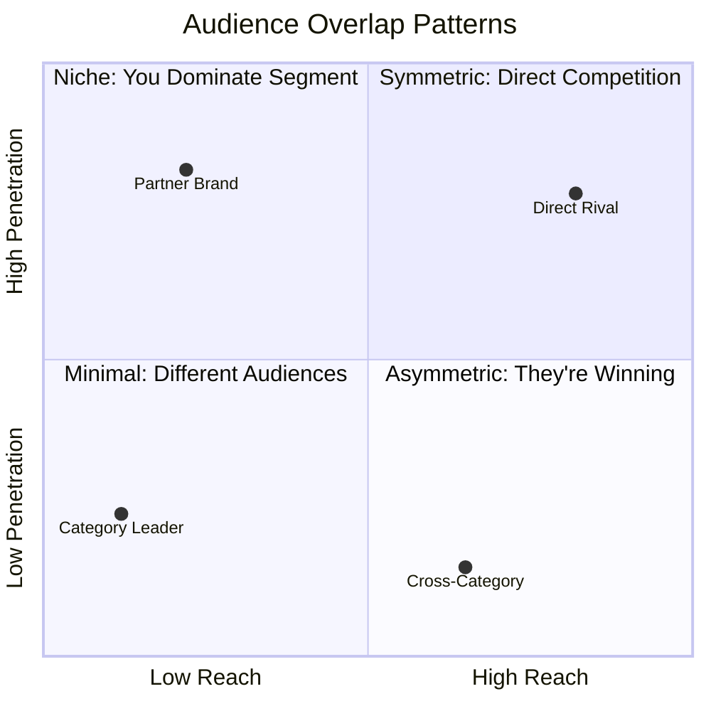
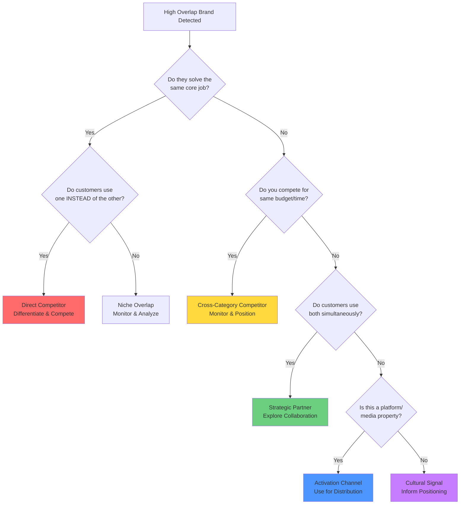

# Mapping Your Audience Ecosystem

## The Business Problem

Every quarter, marketing teams conduct competitive analysis. They benchmark against category peers, track market share, monitor pricing, and analyze feature sets. The logic seems sound: if you sell coffee, your competitors are other coffee brands. If you make productivity software, you compete with other productivity tools. If you're in athletic footwear, you track Nike, Adidas, and the other sneaker brands.

But this category-based competitive framework often misses the actual dynamics at play. The brands that matter to your audience aren't necessarily those in your industry analyst reports. They're whoever commands your audience's attention, budget, and loyalty, regardless of category.


**The stakes of getting this wrong:**
- You waste resources fighting battles that don't matter
- You miss actual threats until they've captured significant market share  
- You overlook valuable partnership opportunities
- You benchmark against the wrong players and copy strategies that won't work for your audience


Traditional competitive analysis asks "who else makes similar products?" Audience intelligence asks "who else has our audience's attention, and what role do they play?" 

The answers are often radically different.

## The Data Approach

Mapping your audience ecosystem requires analyzing three interconnected metrics that reveal audience dynamics:

### The Three Core Metrics

{}

**REACH**  
What percentage of *your audience* also engages with another brand?

This tells you how much of your audience's attention they command.

<--->

**PENETRATION**  
What percentage of *their audience* also engages with you?

This tells you how successfully you've captured their customers.

<--->

**AFFINITY**  
How much more likely is your audience to engage compared to the general population?

This separates true signals from noise.

{}


**The power emerges when you combine all three.** Reach tells you *breadth*, penetration tells you *conquest*, and affinity tells you *intensity*. Together, they reveal not just *who* matters to your audience, but *how* they matter.


### Four Overlap Patterns

When you plot brands by reach (x-axis) and penetration (y-axis), four distinct patterns emerge:

#### Symmetric Competition
**High reach, high penetration**

You're fighting for the same audience. True head-to-head competition requiring clear differentiation.

#### Asymmetric Threat
**High reach, low penetration**

They're winning your audience but you haven't captured theirs. Dangerous. They're pulling your customers away.

#### Niche Dominance  
**Low reach, high penetration**

You own a valuable segment of their audience. Defensible positioning worth protecting.

#### Minimal Overlap
**Low reach, low penetration**

Despite appearing to be competitors, you're serving different audiences. Resources spent here are wasted.


**The critical insight:** Category labels predict minimal overlap far more often than symmetric competition. Most brands that *seem* like competitors fall into minimal overlap. Finding your actual competitive threats requires looking beyond category boundaries.


## Beyond Competition: The Ecosystem Framework

Here's the crucial distinction that traditional competitive analysis misses:


**High overlap doesn't automatically mean "competitor."**  
It means "this brand matters to your audience."  
But brands can matter in very different ways.


### Six Types of High-Overlap Relationships

When you find a brand with significant audience overlap, ask: **"Do customers use this INSTEAD of us or ALONGSIDE us?"**

#### 1. Direct Competitors
*Substitutes*

**Pattern:** High overlap + solve same job + mutually exclusive usage

**Test:** If they win a customer, do you lose that customer?

**Action:** Differentiate, compete, monitor closely

#### 2. Cross-Category Competitors  
*Budget/attention competition*

**Pattern:** High overlap + different jobs + compete for budget/time

**Test:** Do you compete for the same wallet or mindshare?

**Action:** Monitor, consider positioning that addresses broader need

#### 3. Strategic Partners
*Complements*

**Pattern:** High overlap + different jobs + simultaneous usage

**Test:** Do customers use both together?

**Action:** Explore co-marketing, bundles, referrals

#### 4. Activation Channels
*Platforms/media*

**Pattern:** High overlap + where audience congregates

**Test:** Is this where you reach them, not who you compete with?

**Action:** Media planning, content distribution

#### 5. Expansion Opportunities
*Adjacencies*

**Pattern:** Moderate overlap + adjacent jobs + different positioning

**Test:** Could you serve this need with new offerings?

**Action:** Consider product extensions, new categories

#### 6. Cultural Signals
*Psychographic markers*

**Pattern:** Overlap reveals values, not functional needs

**Test:** Does this tell you who they are, not what they buy?

**Action:** Inform messaging, brand positioning, values alignment

## Worked Example: BrightPath Learning

Let me show you how this works with a detailed example.

**BrightPath Learning** is an online education platform offering courses in creative skills: photography, graphic design, writing, video production. Their audience is 250,000 engaged users (social media followers, email subscribers, active students).

### The Setup: Assumed Competition

The team conducts their annual competitive analysis. The category competitors seem obvious:

- **SkillSphere** (general online learning, 800,000 audience)
- **CreativeHub** (creative skills focus, 180,000 audience)  
- **MasterCourse** (expert-led courses, 400,000 audience)

BrightPath's VP of Marketing asks: "How do we compete more effectively against SkillSphere? They have 3x our budget and are stealing market share."

But before allocating resources to that battle, the team runs an audience overlap analysis.

### Analysis 1: SkillSphere (The Assumed Competitor)

{}

**The Numbers**
- BrightPath: 250,000
- SkillSphere: 800,000
- Overlap: 18,000

**Metrics**
- **Reach:** 7.2%
- **Penetration:** 2.25%
- **Affinity:** 0.48x

<--->

**Calculations**

*Reach:*  
18,000 ÷ 250,000 = **7.2%**

*Penetration:*  
18,000 ÷ 800,000 = **2.25%**

*Affinity:*  
If SkillSphere reaches 15% of general population:  
7.2% ÷ 15% = **0.48x**

{}


**Interpretation:**

Only 7.2% of BrightPath's audience engages with SkillSphere. That's **low reach**, meaning SkillSphere doesn't occupy significant mindshare with BrightPath's customers.

BrightPath has captured only 2.25% of SkillSphere's massive audience. That's **very low penetration**.

The affinity of 0.48x is **below baseline** (1.0x), meaning BrightPath's audience is actually *less likely* than average to engage with SkillSphere.


**The Verdict:** **Minimal Overlap**

Despite being in the same category (online learning) and appearing to compete directly, these brands serve fundamentally different audiences.


SkillSphere's audience is broad: business skills, tech skills, personal development, creative skills. BrightPath's audience is narrow: creative professionals and hobbyists.

The small overlap (18,000 people) exists because some creative professionals use SkillSphere for adjacent skills like project management or marketing, but this isn't competitive collision. It's incidental overlap.
{}

**Ecosystem Classification:** **Not a competitor**  


Stop worrying about SkillSphere. Resources spent "defending against SkillSphere" are wasted.


### Analysis 2: CreativeHub (The Real Competitor)

{}

**The Numbers**
- BrightPath: 250,000
- CreativeHub: 180,000
- Overlap: 67,000

**Metrics**
- **Reach:** 26.8%
- **Penetration:** 37.2%
- **Affinity:** 8.9x

<--->

**Calculations**

*Reach:*  
67,000 ÷ 250,000 = **26.8%**

*Penetration:*  
67,000 ÷ 180,000 = **37.2%**

*Affinity:*  
If CreativeHub reaches 3% of general population:  
26.8% ÷ 3% = **8.9x**

{}


**Interpretation:**

Over a quarter of BrightPath's audience also engages with CreativeHub. That's **substantial reach**.

BrightPath has captured over a third of CreativeHub's audience. That's **high penetration**.

BrightPath's audience is **8.9x more likely** than the general population to engage with CreativeHub. This is a strong signal, not noise.


**The Verdict:** **Symmetric Competition**

This is true head-to-head competition. Both platforms are fighting for the same creative learners. Customers are actively comparison shopping.


The high mutual overlap means **every customer won is a customer taken from the competitor**. This is a ***zero-sum battle***.


**Ecosystem Classification:** **Direct Competitor (Substitute)**  


This is where competitive focus belongs. Differentiation from CreativeHub is critical. Price competition would be mutually destructive. Understanding what drives customers to choose one platform over the other becomes paramount.


### Analysis 3: FlowState (The Unexpected Finding)

While analyzing the data, the team notices something unexpected. A meditation and productivity app called **FlowState** shows up with unusual patterns:

{}

**The Numbers**
- BrightPath: 250,000
- FlowState: 320,000
- Overlap: 52,000

**Metrics**
- **Reach:** 20.8%
- **Penetration:** 16.25%
- **Affinity:** 4.16x

<--->

**And yet...**

FlowState isn't in the online learning category at all. It's a meditation app with productivity features.

Yet **20.8% of BrightPath's audience** uses it, with **4.16x affinity**.

{}

The team digs deeper into the psychographic patterns:

{}

**BrightPath's audience shows high affinity for:**
- Deep work and focus techniques (12x)
- Creative process optimization (15x)
- Freelance lifestyle content (9x)
- Time management for creators (11x)
- Avoiding burnout resources (8x)

<--->

**FlowState's positioning:**  
*"Find your creative flow state. Meditation and focus tools for makers, writers, and artists."*

{}


**The Insight:**

BrightPath and FlowState are competing for the same audience's **"creative productivity"** budget and attention.

A freelance photographer might:
- Use BrightPath to learn new techniques
- Use FlowState to maintain focus during editing sessions
- Have limited time/budget for self-improvement tools
- View both as solutions to "be a more productive creative professional"


**The Verdict:** **Cross-Category Competition**

This is competition that category analysis would never reveal. FlowState isn't stealing photography course purchases. They're competing for mindshare, time, and the broader "invest in my creative practice" budget allocation.

**Ecosystem Classification:** **Cross-Category Competitor (Budget/Attention Competition)**  


BrightPath's real competitive set includes not just other learning platforms, but tools that help creative professionals be more productive, focused, and successful.


{}
Partnership opportunities exist: bundle BrightPath courses with FlowState subscriptions for a "complete creative productivity toolkit."

But there's also genuine competition for:
- Limited attention and time
- Self-improvement budget allocation  
- Mindshare in the "how I optimize my creative practice" mental category

The relationship is complex: potential partner *and* cross-category competitor.
{}

### Analysis 4: ArtSupplyCo (The Partnership Opportunity)

The data reveals one more surprising pattern:

{}

**The Numbers**
- BrightPath: 250,000
- ArtSupplyCo: 420,000
- Overlap: 48,000

**Metrics**
- **Reach:** 19.2%
- **Penetration:** 11.4%
- **Affinity:** 2.4x

<--->

**The Context**

ArtSupplyCo is a retailer selling art and design supplies, both physical and digital. Not a learning platform at all.

But the overlap is significant (19.2% reach) with meaningful affinity (2.4x).

{}


**The Pattern:**

BrightPath's creative learners are actively practicing their crafts. They buy supplies, tools, and equipment. ArtSupplyCo serves the same creative hobbyist and professional audience.

A graphic designer might:
- Take BrightPath courses to learn new techniques
- Buy supplies from ArtSupplyCo to practice those techniques

The overlap represents **opportunity, not threat**.


**The Verdict:** **Complementary, Not Competitive**

**Ecosystem Classification:** **Strategic Partner (Complement)**


Partnership potential is high. Co-marketing campaigns, bundled offers, content collaboration.



- **Co-marketing:** "Learn design with BrightPath, get 20% off supplies at ArtSupplyCo"
- **Content collaboration:** BrightPath course includes ArtSupplyCo supply list
- **Bundled offerings:** "Complete photography starter kit: BrightPath course + camera accessories"
- **Cross-promotion:** ArtSupplyCo customers get free BrightPath trial, BrightPath students get supply discounts


### The Complete Ecosystem Map

After analyzing the full landscape, here's what BrightPath discovers:

#### Category Competitors That DON'T Matter
**Minimal Overlap Pattern**
- SkillSphere: 7.2% reach  
- MasterCourse: 8.1% reach  
- Different audience psychographics despite category similarity

#### Real Competitors  
**Symmetric or Cross-Category Competition**
- **CreativeHub:** 26.8% reach, symmetric competition (direct substitute)
- **FlowState:** 20.8% reach, cross-category competition (productivity/focus)
- **Other creative productivity tools:** 15-18% reach each

#### Partnership Opportunities
**Complementary Relationships**
- **ArtSupplyCo:** 19.2% reach, complementary (supplies)
- **Design software companies:** 22% reach, complementary (tools)
- **Creative community platforms:** 16% reach, complementary (networking)

#### Activation Channels
**Where Audience Congregates**
- Creative podcasts: 18% reach
- Design YouTube channels: 24% reach
- Photography Instagram accounts: 21% reach


**The Strategic Shift:**

Instead of obsessing over SkillSphere's massive marketing budget, BrightPath should:

1. **Differentiate aggressively from CreativeHub** (the real symmetric competitor)
2. **Monitor FlowState and similar productivity tools** (cross-category threats)
3. **Explore partnerships with ArtSupplyCo** and adjacent creative ecosystem brands
4. **Leverage creative media channels** for activation
5. **Stop benchmarking against SkillSphere** (they serve different audiences)

This reallocation of competitive focus and resources comes directly from understanding audience dynamics, not category labels.


## The Interpretation Framework

Finding high overlap is just the first step. The strategic value comes from correctly categorizing each relationship.

### Decision Tree: Categorizing High-Overlap Brands

### Four Key Questions

For each high-overlap brand, systematically evaluate:

{}

#### 1. Functional Overlap Test
**Do we solve the same problem?**

- Same job = potential competitor
- Different jobs = potential partner or signal

*Example:*  
- BrightPath (learn photography) vs CreativeHub (learn photography) = **same job** ➔ competitor  
- BrightPath vs ArtSupplyCo (buy supplies) = **different jobs** ➔ partner

<--->

#### 2. Budget Competition Test  
**Do we compete for the same dollars?**

- Same budget = competitive
- Different budgets = complementary

*Example:*  
- BrightPath (learning budget) vs FlowState (productivity budget) = **fuzzy** ➔ cross-category competitor  
- BrightPath vs camera equipment = **different** ➔ complement

{}

{}

#### 3. Usage Timing Test
**Do customers use both or choose one?**

- Simultaneous usage = complement
- Mutually exclusive = substitute

*Example:*  
- BrightPath course + ArtSupplyCo supplies = **simultaneous** ➔ partner  
- BrightPath vs CreativeHub = **choose one** ➔ competitor

<--->

#### 4. Zero-Sum Test
**If they succeed, do we fail?**

- Their win = our loss = competitive
- Both can win = complementary

*Example:*  
- CreativeHub wins customer = **BrightPath loses** ➔ competitor  
- ArtSupplyCo wins customer = **both can win** ➔ partner

{}

## Common Pitfalls

### Pitfall 1: Confusing Correlation with Competition


**The Error:** Assuming all audience overlap indicates competition.

**The Reality:** BrightPath and ArtSupplyCo overlap significantly (19.2% reach), but they're complementary, not competitive.


**The key distinction:** Are they substitutes or complements? Do customers choose one *instead of* the other, or do they use both for different purposes?

**How to avoid:** Examine the affinity patterns more deeply. If high-overlap brands serve different use cases (learning vs. supplies, content vs. tools, planning vs. execution), they're likely complementary despite the overlap.

### Pitfall 2: Ignoring Affinity, Focusing Only on Reach


**The Error:** Treating all high-reach brands as strategically significant.

**The Reality:** A brand might have high reach simply because they're ubiquitous (e.g. Amazon, Spotify, major social platforms). But if affinity is low (close to 1.0x), this isn't a meaningful signal.


**What low-affinity, high-reach tells you:** Where your audience shops or listens to music, not who competes for their attention in your domain.

**How to avoid:** Always check affinity alongside reach.

- High reach + low affinity = **not strategic** (just popular everywhere)
- Moderate reach + very high affinity = **potentially very strategic** (defines your audience)

### Pitfall 3: Treating All Overlap as Equally Valuable


**The Error:** Assuming the 18,000 people who use both BrightPath and SkillSphere are all worth competing for.

**The Reality:** Not all overlapping customers are created equal.


The overlap might include:
- Low-value, price-sensitive course collectors (bad overlap to compete for)
- High-value professionals investing in continuous learning (good overlap)

You can't tell from the overlap number alone.

**How to avoid:** Segment the overlap audience by value metrics (LTV, engagement, conversion rate). Compete aggressively for high-value overlap, ignore low-value overlap.

### Pitfall 4: Category Blindness in Reverse


**The Error:** After learning that category competitors don't always matter, teams make the opposite error: they ignore category entirely and chase every brand with high audience overlap.

**The Reality:** Just because FlowState has 20.8% overlap doesn't mean BrightPath should pivot to meditation apps.


**The principle:** Overlap reveals who has your audience's attention. Strategy determines what you do about it.

Sometimes the answer is:
- "Monitor but don't compete"
- "Partner rather than fight"
- "They're in an adjacent space we could expand into, but not today"

**How to avoid:** Use the ecosystem categorization framework. Not every high-overlap brand requires the same strategic response.

### Pitfall 5: One-Time Analysis Instead of Continuous Monitoring


**The Error:** Treating a one-time snapshot as permanent truth.

**The Reality:** Competitive dynamics evolve.


The analysis showing minimal overlap with SkillSphere today might change if:
- SkillSphere pivots toward creative skills
- Your audience composition shifts
- Market trends bring the audiences closer together

**How to avoid:** Run this analysis quarterly or biannually. Track changes in reach, penetration, and affinity over time. Sudden shifts signal strategic changes worth investigating.



| Quarter | SkillSphere Reach | CreativeHub Reach | FlowState Reach |
|---------|-------------------|-------------------|-----------------|
| Q1 2025 | 7.2% | 26.8% | 20.8% |
| Q2 2025 | 7.8% | 28.1% | 22.3% |
| Q3 2025 | 9.1% | 27.9% | 25.7% |
| Q4 2025 | 12.4% ⚠️ | 27.2% | 24.9% |

**Alert:** SkillSphere's reach is growing rapidly (7.2% → 12.4% in 9 months). Investigate why. Are they pivoting toward creative skills? Has our audience shifted? This warrants deeper analysis.



## Complementary Approaches


Audience overlap analysis reveals *who* matters to your audience and in what pattern, but not always *why* customers choose one over another or *how* to win.


### What to Combine With Overlap Analysis

**Customer Research (Qualitative)**  
Interview customers who use both your product and a high-overlap brand.
- What jobs does each solve?
- Why do they use both vs. choosing one?
- What would make them consolidate to one solution?

This qualitative insight **explains the quantitative patterns**.

**Feature/Positioning Analysis (Traditional Competitive)**  
Once you identify symmetric competitors (e.g. CreativeHub), traditional competitive analysis becomes valuable.
- What features do they offer?
- How do they position?
- What's their pricing strategy?
- What's their messaging?

The audience data tells you **who** to analyze deeply. Traditional methods tell you **what** they're doing.

**Brand Perception Studies (Attitudinal)**  
Overlap analysis shows behavior (who they engage with). Perception studies show attitudes (how they think about each brand).

A customer might engage with both BrightPath and CreativeHub but perceive them very differently, creating differentiation opportunities.

**Win/Loss Analysis (Sales Intelligence)**  
For B2B or considered purchases, analyze:
- When you win vs. a symmetric competitor, why?
- When you lose, what drives the decision?
- What objections or concerns tip the balance?

This reveals the **decision criteria** within the competitive set.

### What This Data Can't Tell You


Audience intelligence identifies the ecosystem. Other methods explain how to succeed within it.

**Overlap analysis reveals:**
- Who has your audience's attention
- Whether they're competitors, partners, or channels
- The magnitude of overlap and competitive intensity

**Overlap analysis doesn't reveal:**
- Why customers prefer one competitor over another (needs qualitative research)
- What product features drive preference (needs feature analysis)
- How customers perceive your brand vs. competitors (needs perception studies)
- Whether customers are satisfied with current options (needs satisfaction surveys)
- What messages will resonate (needs message testing)


## Actionable Takeaway


**Your real competitive landscape isn't determined by category labels.**

It's whoever is competing for your audience's attention, budget, and loyalty, in whatever form that competition takes: direct substitutes, cross-category alternatives, complementary partners, or activation channels.

Use reach, penetration, and affinity analysis to discover who that actually is, then categorize each relationship correctly to determine the right strategic response.


### Next Steps: Your First Ecosystem Map

**1. Identify Your Assumed Competitive Set**
- List your top 5 assumed competitors (category-based)
- List 3-5 brands outside your category that your audience engages with

**2. Calculate Overlap Metrics**
- For each brand, calculate reach, penetration, and affinity
- Plot them on the overlap quadrant framework
- Identify which fall into minimal overlap (you'll be surprised)

**3. Categorize Relationships**
- For each high-overlap brand, apply the four tests:
  - Functional overlap? (same job or different)
  - Budget competition? (same wallet or different)
  - Usage timing? (instead of or alongside)
  - Zero-sum? (their win = your loss?)
- Classify as: competitor, cross-category competitor, partner, channel, or signal

**4. Reallocate Resources**
- Stop investing competitive energy in minimal overlap brands
- Intensify focus on symmetric competitors
- Explore partnerships with high-overlap complements
- Leverage channels where audience congregates


**Many brands waste significant competitive resources fighting perceived competitors while ignoring actual threats and missing partnership opportunities.**

A single ecosystem mapping exercise can redirect those resources to where they actually matter.

