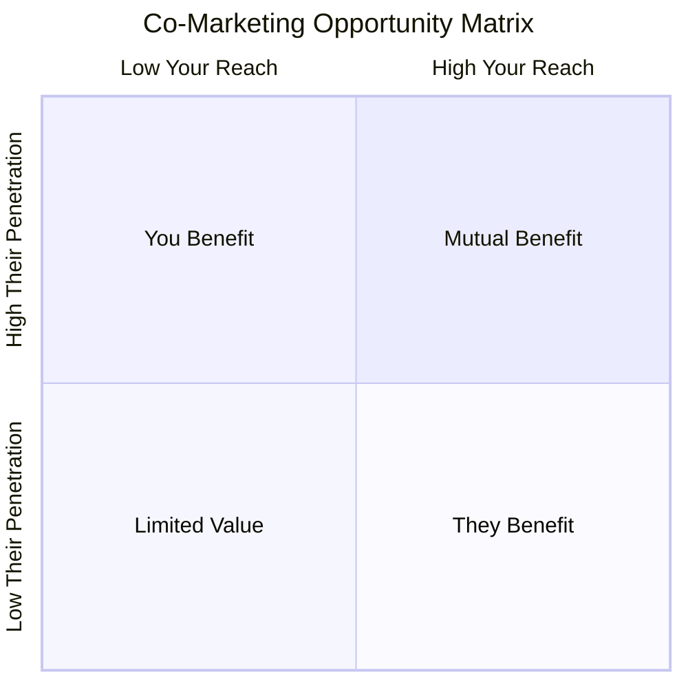
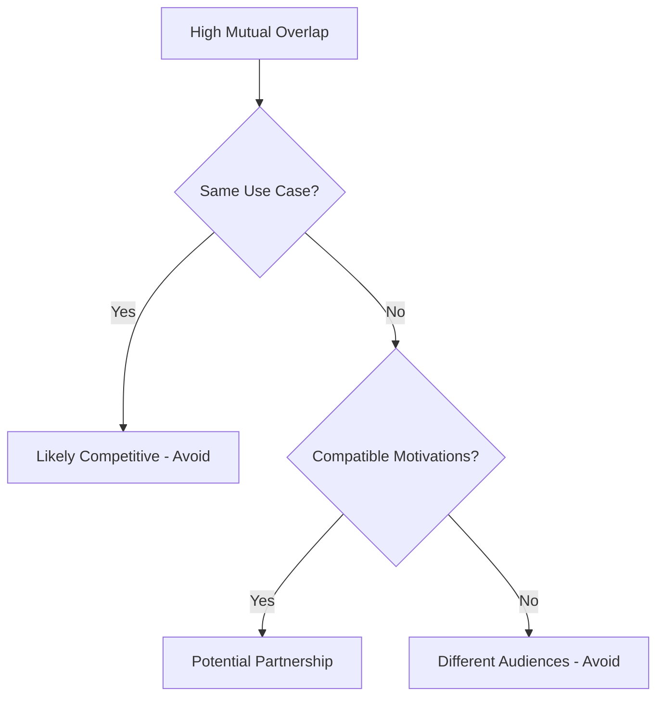

# Building Co-Marketing Campaigns That Actually Work

_How to evaluate partnership opportunities using audience overlap, psychographic alignment, and strategic complementarity_

---

## The Business Problem

Your VP of Marketing walks into the Monday meeting excited: "I just got off a call with Brand X. They want to do a co-marketing campaign with us. They have 2 million followers, we have 500,000. This could be huge for awareness!"

The team starts brainstorming:

- Joint webinar series?
- Co-branded content?
- Bundle offering?
- Social media takeover?

But before investing months of effort and significant budget into a partnership, you need to answer a more fundamental question: **Will our audiences actually respond?**

Traditional partnership evaluation focuses on surface metrics:

- Follower counts (bigger is better, right?)
- Brand prestige (name recognition)
- Category adjacency (similar products = natural fit)
- Gut feeling (the brands "feel aligned")

This approach leads to common failures:

 **Partnership Failure Patterns:**

- High visibility, low conversion (lots of impressions, few sales)
- Audience confusion (messaging doesn't resonate with either base)
- One-sided benefit (Partner A wins, Partner B gets nothing)
- Wasted resources (6-month campaign yields minimal ROI) 

The core issue: **audience overlap doesn't guarantee audience alignment.** Two brands can share customers without those customers wanting the brands to collaborate. And high overlap can mean competition, not complementarity.

Audience affinity data reveals the truth before you commit resources.

---

## The Data Approach

Successful co-marketing requires three types of alignment:

### 1. **Audience Overlap Analysis**

**The question:** How much do our audiences intersect?

**Key metrics:**

|Metric|Formula|What It Reveals|
|---|---|---|
|**Reach**|`(Overlap ÷ Your Audience) × 100`|What % of your audience knows them?|
|**Penetration**|`(Overlap ÷ Their Audience) × 100`|What % of their audience knows you?|
|**Absolute Overlap**|`Count of shared audience`|Real scale of shared base|

**Interpretation framework:**

mermaid

 **Optimal co-marketing zone:** Moderate to high mutual overlap (15-40% reach both directions) indicates:

- Large enough shared audience to justify effort
- Neither brand completely dominates the other's audience
- Room for both to gain new customers from the partnership 

### 2. **Psychographic Alignment Analysis**

**The question:** Do the shared customers care about both brands for compatible reasons?

**What to examine:**

- **Shared affinities:** What else do overlapping customers care about?
- **Motivational compatibility:** Are their reasons for choosing each brand aligned or conflicting?
- **Value system overlap:** Do they engage with similar causes, aesthetics, communities?

**Red flags:**



- High overlap but contradictory value affinities (luxury vs. budget-conscious)
- Different motivational drivers (performance vs. fashion, efficiency vs. creativity)
- Competing cultural positioning (traditional vs. disruptive, mainstream vs. counterculture) 

### 3. **Strategic Complementarity Analysis**

**The question:** Will partnering create value, or just cannibalize?

**Evaluation criteria:**

|Factor|Complementary|Competitive|
|---|---|---|
|**Product relationship**|Different use cases, compatible needs|Direct substitutes|
|**Purchase timing**|Sequential or bundled|Mutually exclusive choice|
|**Customer journey**|Different touchpoints|Same decision moment|
|**Value proposition**|Additive benefits|Overlapping benefits|

---

## Worked Example: FitTech Tracker Evaluates Wellness App Partnership

### Scenario Setup

**FitTech Tracker**

- Fitness tracking device (heart rate, GPS, sleep)
- Audience: 800,000 engaged users
- Price: $200-350 hardware
- Positioning: _"Data-driven performance optimization"_

 

**WellnessFlow App**

- Meditation, mindfulness, stress management app
- Audience: 1,200,000 users
- Price: $15/month subscription
- Positioning: _"Balance and mental wellness for busy professionals"_

**Partnership proposal:** Joint "Total Wellness Bundle" campaign

- Co-branded content series on recovery and balance
- Bundle pricing (FitTech device + 6 months WellnessFlow)
- Cross-promotion to both audiences
- Shared campaign investment: $400K

**The question:** Should FitTech invest in this partnership?

### Step 1: Audience Overlap Analysis

**Raw numbers:**

- FitTech audience: 800,000
- WellnessFlow audience: 1,200,000
- Users engaging with both brands: 192,000

**Calculated metrics:**

|Metric|Calculation|Result|
|---|---|---|
|FitTech → WellnessFlow reach|192,000 ÷ 800,000|**24%**|
|WellnessFlow → FitTech penetration|192,000 ÷ 1,200,000|**16%**|

**Initial interpretation:**

 **Moderate mutual overlap:** 24% of FitTech users already use WellnessFlow; 16% of WellnessFlow users already use FitTech. This suggests:

- Meaningful existing connection between audiences
- Neither brand has saturated the other's base
- Room for both to acquire new customers 

**But overlap alone doesn't answer:** Are these 192,000 people using both brands for compatible or conflicting reasons?

### Step 2: Psychographic Alignment Analysis

#### Examining the 192,000 Overlap Audience

What else do these shared customers care about?

**Shared high affinities (overlap segment vs. general population):**

 

**Performance & Optimization**

- Training programs: **18x** affinity
- Performance nutrition: **22x**
- Biohacking content: **15x**
- Quantified self movement: **19x**

 

**Wellness & Recovery**

- Sleep optimization: **25x**
- Stress management: **20x**
- Work-life balance: **14x**
- Burnout prevention: **17x**

 

**Professional Success**

- Career development: **8x**
- Productivity tools: **12x**
- Executive coaching: **11x**
- High-performance culture: **9x**

 

**Pattern interpretation:**

 **The overlap segment is "The High-Performing Professional Seeking Balance"**

**Who they are:**

- Ambitious professionals who push hard (performance, career, optimization)
- Increasingly aware of burnout risk (stress, recovery, sleep)
- Using FitTech to optimize physical performance
- Using WellnessFlow to manage mental/emotional load

**Why this matters:** They're not using the products for conflicting reasons. They're using them as **complementary tools in a holistic wellness strategy**. 

#### Comparing FitTech-Only vs. WellnessFlow-Only Audiences

**FitTech-only users (608,000 people NOT using WellnessFlow):**

|Affinity Category|Multiplier vs. General Pop|
|---|---|
|Competitive athletics|**35x**|
|Marathon/triathlon events|**28x**|
|Sports performance science|**31x**|
|**Meditation apps**|**1.2x** (low!)|
|**Stress management**|**2.1x** (modest)|

 **Insight:** FitTech-only users are hardcore athletes focused primarily on physical performance. They're less interested in mental wellness (yet). 

**WellnessFlow-only users (1,008,000 people NOT using FitTech):**

|Affinity Category|Multiplier vs. General Pop|
|---|---|
|Mental health content|**18x**|
|Work-life balance|**16x**|
|Self-care routines|**14x**|
|**Fitness trackers**|**1.8x** (low!)|
|**Athletic performance**|**1.4x** (very low)|

 **Insight:** WellnessFlow-only users prioritize mental health and work-life balance but aren't focused on physical performance optimization. 

### Step 3: Strategic Complementarity Assessment

**Product relationship:**

|Dimension|FitTech|WellnessFlow|Complementarity|
|---|---|---|---|
|**Primary need**|Physical performance tracking|Mental wellness & stress management|✅ Different, non-competing|
|**Usage context**|During/after exercise|Throughout workday, before sleep|✅ Different times|
|**Purchase motivation**|"Optimize my training"|"Manage my stress"|✅ Different goals|
|**Price point**|$200-350 hardware|$15/month software|✅ Different budget categories|

 **Strong complementarity:** The products serve different needs, are used at different times, and don't compete for the same purchase decision. 

**Partnership value proposition:**

**For FitTech:**

- Access to 1,008,000 WellnessFlow-only users who care about wellness but haven't optimized physical health yet
- Position FitTech as part of "complete wellness" not just "athlete tool"
- Potential conversion: If 5% of WellnessFlow-only users buy FitTech → 50,400 new customers → $10-17M revenue

**For WellnessFlow:**

- Access to 608,000 FitTech-only users who are performance-focused but may be approaching burnout
- Position WellnessFlow as essential recovery/balance tool for high performers
- Potential conversion: If 8% of FitTech-only users subscribe → 48,640 new subscribers → $8.7M annual recurring revenue

### Step 4: Campaign Concept Validation

**Proposed campaign messaging:**



**"Total Performance: Mind + Body"**

_For high performers who want to optimize both physical and mental capacity_

**Campaign elements:**

- Content series: "The Recovery Advantage" (how rest makes you faster)
- Bundle offer: FitTech device + 6 months WellnessFlow (15% discount)
- Co-branded guided recovery routines
- Sleep optimization protocols combining both platforms

<--->

**Target audiences:**

1. **192K overlap segment:** Reinforce they're making smart choice using both
2. **608K FitTech-only:** "You track your body obsessively. What about your mind?"
3. **1,008K WellnessFlow-only:** "Mental wellness needs physical foundation. Start tracking."



**Psychographic alignment check:**

- Does messaging resonate with **overlap segment's** values? ✅ Yes (holistic optimization)
- Does it authentically extend **FitTech's** positioning? ✅ Yes (performance through recovery)
- Does it authentically extend **WellnessFlow's** positioning? ✅ Yes (balance requires physical awareness)

### Step 5: The Decision

**Partnership evaluation scorecard:**

|Criterion|Score|Rationale|
|---|---|---|
|**Audience overlap**|⭐⭐⭐⭐|24%/16% mutual overlap = sufficient shared base + growth opportunity|
|**Psychographic alignment**|⭐⭐⭐⭐⭐|Overlap segment uses both for compatible, complementary reasons|
|**Strategic complementarity**|⭐⭐⭐⭐⭐|Products serve different needs, different timing, different motivations|
|**Brand positioning fit**|⭐⭐⭐⭐|Both can authentically message holistic wellness|
|**Mutual value creation**|⭐⭐⭐⭐⭐|Both brands access new, high-value customer segments|

**Recommendation: ✅ Proceed with partnership**

**Projected ROI:**

 

**FitTech gains:**

- 50K new customers (conservative 5% conversion from WellnessFlow-only)
- $10-17M revenue
- ROI: 25-42x on $400K investment

 

**WellnessFlow gains:**

- 48K new subscribers
- $8.7M ARR
- ROI: 22x on $400K investment

 

**Shared benefits:**

- Strengthen positioning with 192K overlap segment
- Co-created content assets
- Data sharing on recovery science

 

---

## Contrast: When Co-Marketing Fails

### Counter-Example: FitTech Evaluates Partnership with SocialFit

**SocialFit**

- Social fitness app (group challenges, leaderboards, workout sharing)
- Audience: 2,000,000 users
- Positioning: _"Make fitness fun and social"_

**Partnership proposal:** Joint fitness challenge campaign with leaderboards

**Overlap analysis:**

|Metric|Value|
|---|---|
|FitTech → SocialFit reach|**62%**|
|SocialFit → FitTech penetration|**25%**|
|Absolute overlap|496,000|

**Surface-level assessment:** "Wow! 62% of our audience uses SocialFit. This should be a slam dunk partnership!"

**But psychographic analysis reveals:**

 **Motivational conflict:**

**FitTech users care about:**

- Personal performance optimization (**31x** affinity)
- Data-driven training (**28x**)
- Individual achievement (**19x**)

**SocialFit users care about:**

- Social competition and gamification (**41x**)
- Community belonging (**35x**)
- Fun and entertainment (**22x**)

**The 496K overlap:** People using FitTech for data/optimization might use SocialFit for social motivation, but these are _different motivations in conflict_. 

**Why the partnership fails:**

1. **Brand dilution risk:** FitTech positioned as "serious performance tool" conflicts with SocialFit's "fun game" positioning
2. **Messaging confusion:** Can't authentically message both "optimize your data" and "have fun with friends"
3. **Audience cannibalization:** High overlap (62%) means you're not reaching new customers, just re-targeting existing ones
4. **One-sided benefit:** FitTech gains little (already reaching 62% of SocialFit's audience); SocialFit gains a lot (only reaching 25% of FitTech's performance-focused users)

**Decision: ❌ Pass on partnership despite high overlap**

---

## Common Pitfalls

### 1. Conflating Overlap with Opportunity

 **The trap:** "They have 5 million followers and 30% of our audience uses them. This is perfect!"

**Why it fails:** High overlap can mean:

- You're already reaching them (no new audience gained)
- They're a competitor (you're fighting for the same customers)
- Different motivations (they use both products for incompatible reasons) 

**How to avoid:**

- Examine both directions (reach AND penetration)
- Analyze the psychographic profile of the overlap segment
- Assess whether the relationship is complementary or competitive

### 2. Ignoring Psychographic Misalignment

 **The trap:** "Both our audiences care about health. Let's partner!"

**Why it fails:** "Health" is too broad. Sub-motivations matter:

- Performance vs. appearance
- Optimization vs. balance
- Individual achievement vs. social belonging 

**Example failure case:**

 

**Premium Gym Chain** (performance, intensity, results-driven)

Partners with:

**Wellness Spa** (relaxation, indulgence, self-care)

 

**Result:** Audiences confused

- Gym members: "I go to the gym to push hard, not relax"
- Spa customers: "I go to the spa to escape intensity, not add more"

Campaign flops despite 20% audience overlap.

 

### 3. One-Sided Partnerships

 **The trap:** Assuming bigger follower count = better partner

**Why it fails:** If they have 10x your audience but only 5% penetration while you have 60% reach into theirs:

- They gain massively from your promotion
- You gain minimally (already reaching most of their audience) 

**How to avoid:**

- Calculate mutual benefit explicitly
- Negotiate investment proportional to value gained
- Structure deal to balance asymmetric value

### 4. Misreading Competitive Overlap as Partnership Opportunity

 **The trap:** "We share 40% of our audience with Brand X. Let's collaborate!"

**Why it fails:** High mutual overlap often means direct competition 

**Decision framework:**

mermaid

---

## Complementary Approaches

### When Affinity Data Isn't Enough

**Combine with:**

 **Ask overlap segment directly:**

- "You use both FitTech and WellnessFlow. How do they fit into your routine?"
- "Would you be interested in integrated features between the products?"
- "What value would a bundle offer provide?"

**Value:** Validates motivational assumptions 

 **Before full partnership:**

- Create small-scale co-branded content test
- Promote to overlap segment
- Measure engagement relative to solo content

**Value:** Real performance data before big investment 

 **Survey your audience:**

- "How do you view Brand X?" (positive, neutral, negative)
- "Does Brand X align with our values?"

**Value:** Avoids partnering with brands your audience actively dislikes 

### What Affinity Data Can't Tell You

**Limitations:**

- **Actual usage intensity:** Overlap shows they engage with both, not how frequently
- **Purchase readiness:** They might like both brands but only buy from one
- **Brand perception specifics:** Data shows overlap, not why they feel about potential partnership
- **Operational fit:** Execution complexity, timeline alignment, contract terms

**Integration approach:**

1. Use affinity data for **initial screening** (fast yes/no on 90% of opportunities)
2. Conduct deeper **qualitative research** on finalists (surveys, interviews)
3. Run **small-scale pilots** before major campaigns
4. Measure **real performance** and iterate

---

## Actionable Takeaway

 **Before committing to any co-marketing partnership, validate three alignment factors:**

1. **Audience Overlap:** Moderate mutual overlap (15-40%) indicates opportunity without over-saturation
2. **Psychographic Compatibility:** Overlap segment uses both brands for complementary, not conflicting, reasons
3. **Strategic Complementarity:** Products/services serve different needs, at different times, with additive value

**Next step:** Audit your current partnerships using this framework. Which are delivering mutual value? Which are one-sided or misaligned? Reallocate investment accordingly. 

---

_Affinity data prevents expensive partnership mistakes by revealing the truth before you commit resources. High follower counts and big brand names are seductive, but audience alignment drives results._