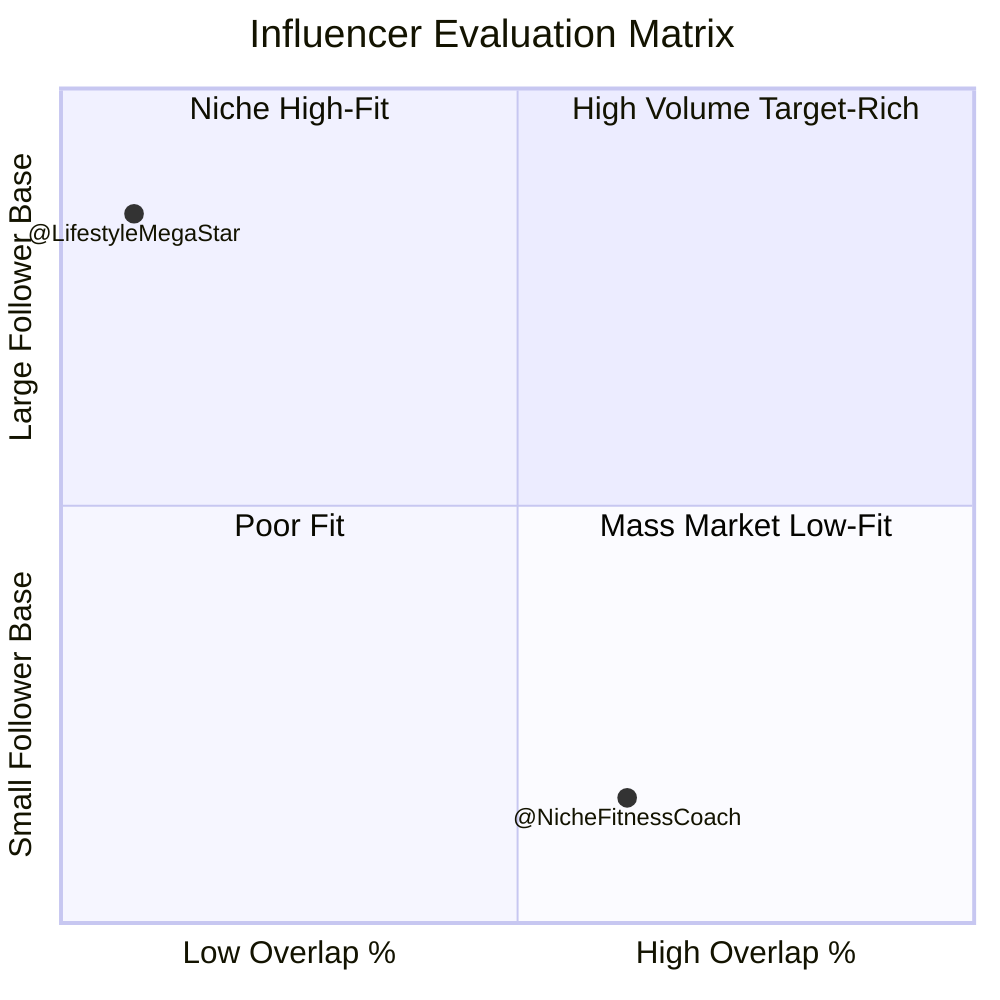

# Finding the Right Influencers (Beyond Follower Counts)

_How to evaluate influencer partnerships using audience overlap, motivational alignment, and conversion potential_

---

## The Business Problem

Your marketing team is planning a major influencer campaign. The agency presents their recommendations:

**Option A: @LifestyleMegaStar**

- 2.8 million followers
- Average engagement: 4.2%
- Rate: $45,000 per post
- Agency recommendation: "Massive reach, proven engagement, brand-safe"

**Option B: @NicheFitnessCoach**

- 125,000 followers
- Average engagement: 8.1%
- Rate: $3,500 per post
- Agency comment: "Smaller but engaged audience"

The team gravitates toward Option A. After all, 2.8 million impressions for $45K seems like better ROI than 125K impressions for $3.5K, right?

Traditional influencer selection focuses on vanity metrics:

<div class="grid-2"> <div>

**Traditional Criteria:**

- Follower count (bigger = better)
- Engagement rate (likes + comments ÷ followers)
- Cost per impression (reach ÷ fee)
- Brand safety (no controversies)
- Content quality (aesthetic fit)

</div> <div>

**What's Missing:**

- Who actually follows them?
- Do those followers overlap with your target?
- Are they motivated by things your brand delivers?
- Will they convert, or just scroll?

</div> </div>

This leads to predictable failures:

 **Common Influencer Campaign Failure Patterns:**

**High impressions, zero conversions**

- Millions saw the post, nobody bought
- "Awareness" campaign with no business impact

**Wrong audience entirely**

- Influencer's followers don't match your customer profile
- Beautiful content reaching people who will never buy

**Motivational misalignment**

- Followers engage with influencer for reasons unrelated to your value prop
- Authentic endorsement feels forced or inauthentic

**One-time spike, no sustained lift**

- Sales jump during campaign, disappear immediately after
- No repeat customers, no brand affinity built 

The core issue: **follower count measures reach, not relevance.** An influencer with 3 million followers might deliver far worse ROI than one with 100K if the smaller audience actually overlaps with your target and shares motivational alignment.

Audience affinity data reveals who will actually drive conversions before you spend $45K on a single post.

---

## The Data Approach

Effective influencer selection requires evaluating three dimensions:

### 1. Audience Overlap Analysis

**The question:** How many of this influencer's followers are in (or could be in) your target audience?

**Key metrics:**

|Metric|Formula|What It Reveals|
|---|---|---|
|**Overlap %**|`(Shared followers ÷ Influencer's total) × 100`|What % of their audience matches yours?|
|**Absolute Overlap**|`Count of shared followers`|Real scale of reach into your target|
|**Your Penetration**|`(Shared ÷ Your audience) × 100`|What % of your existing audience already follows them?|

**Interpretation framework:**

mermaid



 **The overlap percentage matters more than total followers.**

An influencer with 100K followers and 60% overlap reaches 60,000 target customers. An influencer with 3M followers and 3% overlap reaches 90,000 target customers.

But the first one's audience is **20x more concentrated** with your target, meaning:

- Higher conversion rate per impression
- More authentic fit (their content naturally aligns)
- Better long-term brand building with the right people 

### 2. Motivational Alignment Analysis

**The question:** Why do people follow this influencer, and does that align with why they'd choose your brand?

**What to examine:**

**The influencer's audience affinity patterns:**

- What else do their followers care about?
- What brands do they over-index on?
- What values, causes, aesthetics resonate?
- What lifestyle patterns emerge?

**Pattern matching:**

- Do their followers' affinities match your target audience's?
- Are the motivations compatible or conflicting?
- Would your product authentically fit into their content ecosystem?

**Example comparison:**

<div class="grid-2"> <div style="border-left:3px solid #4F46E5; padding:1em; background:#F3F4F6;">

**Influencer A's Audience Affinities:**

- Performance nutrition: 31x
- Training programs: 28x
- Recovery science: 24x
- Quantified self: 19x

**Motivation:** Performance optimization

</div> <div style="border-left:3px solid #EF4444; padding:1em; background:#FEF2F2;">

**Influencer B's Audience Affinities:**

- Fashion brands: 18x
- Luxury lifestyle: 22x
- Aspirational travel: 15x
- Celebrity culture: 14x

**Motivation:** Status & aesthetics

</div> </div>

If you're selling recovery footwear, Influencer A is the right fit regardless of follower count differences.

### 3. Conversion Potential Scoring

**The question:** Will this influencer's endorsement actually drive purchases?

**Evaluation framework:**

|Factor|Why It Matters|How to Assess|
|---|---|---|
|**Trust & Authority**|Do followers trust their recommendations?|Check engagement on product recommendations vs. lifestyle content|
|**Authentic Fit**|Does your product naturally belong in their content?|Examine their existing brand partnerships and content themes|
|**Audience Intent**|Are followers in "discovery mode" or "entertainment mode"?|Analyze audience's purchase-related affinities (shopping platforms, review sites)|
|**Call-to-Action History**|Do their posts drive action or just engagement?|Request case studies from previous brand partnerships|

**Red flags:**



- Influencer partnerships with 20+ brands in unrelated categories (shotgun approach)
- High engagement on personal content, low on sponsored posts (audience tunes out ads)
- Followers' affinities show zero purchase intent signals (pure entertainment consumption)
- Mismatch between influencer's stated values and brand partnerships (authenticity gap) 

---

## Worked Example: RecoveryTech Evaluates Fitness Influencers

### Scenario Setup

<div style="border-left:5px solid #4F46E5; background-color:#F3F4F6; padding:1em; margin-bottom:1em; border-radius:8px;">

**RecoveryTech**

- Recovery-focused wearable device (tracks strain, recommends rest)
- Target audience: Serious athletes aged 28-45 who prioritize performance optimization
- Current audience: 400,000 engaged users
- Product price: $279
- Marketing goal: Acquire 25,000 new customers in Q2

</div>

**Agency presents 4 influencer options for evaluation:**

The marketing team has $150K budget for influencer partnerships this quarter. Agency recommends allocating 70% to the largest influencer for "maximum reach."

**The task:** Use audience affinity data to identify which influencers will actually drive conversions.

### Influencer Profiles



<div style="border:2px solid #8B5CF6; padding:1em; border-radius:8px;">

**@LifestyleMegaStar**

- **Followers:** 2,800,000
- **Engagement rate:** 4.2%
- **Fee:** $45,000/post
- **Content:** Lifestyle, fashion, travel, wellness
- **Agency pitch:** "Massive reach, proven engagement"

</div>

<--->

<div style="border:2px solid #3B82F6; padding:1em; border-radius:8px;">

**@MarathonElite**

- **Followers:** 380,000
- **Engagement rate:** 7.8%
- **Fee:** $8,500/post
- **Content:** Marathon training, race strategy, nutrition
- **Agency pitch:** "Niche but engaged running community"

</div>





<div style="border:2px solid #10B981; padding:1em; border-radius:8px;">

**@CrossFitDaily**

- **Followers:** 520,000
- **Engagement rate:** 9.2%
- **Fee:** $12,000/post
- **Content:** CrossFit workouts, strength training, gym culture
- **Agency pitch:** "High engagement fitness community"

</div>

<--->

<div style="border:2px solid #F59E0B; padding:1em; border-radius:8px;">

**@RecoveryScience**

- **Followers:** 125,000
- **Engagement rate:** 11.4%
- **Fee:** $3,500/post
- **Content:** Sports science, recovery protocols, athlete education
- **Agency pitch:** "Small but highly engaged niche"

</div>



### Step 1: Audience Overlap Analysis

**Calculated metrics for each influencer:**

|Influencer|Total Followers|Shared with RecoveryTech|Overlap %|Your Penetration|
|---|---|---|---|---|
|@LifestyleMegaStar|2,800,000|22,400|**0.8%**|5.6%|
|@MarathonElite|380,000|235,600|**62%**|59%|
|@CrossFitDaily|520,000|156,000|**30%**|39%|
|@RecoveryScience|125,000|77,500|**62%**|19.4%|

**Initial insights:**

 **@LifestyleMegaStar:** Massive follower count, but only 0.8% overlap

- Reaches 22,400 target customers
- Most of their 2.8M followers are NOT in RecoveryTech's target
- Already reaching 5.6% of your existing audience (low net-new value)

**@MarathonElite:** Strong overlap at 62%

- Reaches 235,600 target customers
- But 59% penetration means you're already reaching most of them
- High overlap can mean saturation, not opportunity

**@CrossFitDaily:** Moderate overlap at 30%

- Reaches 156,000 target customers
- 39% penetration suggests room to grow

**@RecoveryScience:** High overlap at 62%, low penetration at 19.4%

- Reaches 77,500 target customers
- Only 19.4% of your audience already follows them
- High concentration of target audience you're NOT reaching yet 

**Preliminary ranking by target reach:**

1. @MarathonElite: 235,600 (but high saturation)
2. @CrossFitDaily: 156,000 (moderate saturation)
3. @RecoveryScience: 77,500 (low saturation, high concentration)
4. @LifestyleMegaStar: 22,400 (poor fit)

But raw overlap doesn't tell the full story. We need motivational alignment.

### Step 2: Psychographic Alignment Analysis

**Examining each influencer's audience affinity patterns:**

#### @LifestyleMegaStar's Audience

|Category|Example Brands|Affinity Multiplier|
|---|---|---|
|Fashion|Luxury brands, fast fashion|18-25x|
|Beauty|Makeup brands, skincare|22-28x|
|Travel|Hotels, airlines, destinations|12-16x|
|Entertainment|Streaming, music, celebrities|8-14x|
|**Fitness tech**|Recovery devices, trackers|**1.4x**|
|**Performance training**|Coaching, programs|**0.9x**|

 **Motivational profile:** Followers engage for lifestyle inspiration, fashion, and aspirational content. Minimal interest in performance optimization or training science.

**Fit with RecoveryTech:** Poor. The product requires understanding recovery science and commitment to performance improvement. This audience wants aesthetic inspiration, not biometric optimization. 

#### @MarathonElite's Audience

|Category|Example Brands|Affinity Multiplier|
|---|---|---|
|Running brands|Brooks, Saucony, HOKA|35-48x|
|Marathon events|Boston, NYC, Chicago marathons|28-34x|
|Running media|Runner's World, Running Times|22-29x|
|**Performance nutrition**|Gels, hydration, supplements|**41x**|
|**Recovery tech**|Devices, compression, tools|**38x**|
|Training programs|Coaching, structured plans|31x|

 **Motivational profile:** Serious marathoners obsessed with training optimization, recovery, and race performance.

**Fit with RecoveryTech:** Excellent. This audience already values recovery technology and understands the connection between rest and performance.

**Challenge:** 59% of RecoveryTech's audience already follows @MarathonElite. Partnership reaches mostly existing customers, not net-new acquisition. 

#### @CrossFitDaily's Audience

|Category|Example Brands|Affinity Multiplier|
|---|---|---|
|CrossFit brands|Reebok CrossFit, Rogue|42-51x|
|Strength training|Weightlifting, powerlifting|28-35x|
|Gym culture|Fitness communities, boxes|24-31x|
|**Performance tracking**|Fitness apps, wearables|**18x**|
|**Recovery**|Tools, protocols|**12x**|
|Nutrition|Protein, supplements|22x|

 **Motivational profile:** Intensity-focused athletes who prioritize strength, power, and competitive workouts. Moderate interest in recovery (12x vs. 38x for marathon audience).

**Fit with RecoveryTech:** Good but not perfect. CrossFit culture emphasizes pushing hard more than optimizing recovery. Partnership could work if positioned as "train harder by recovering smarter."

**Opportunity:** 39% penetration means 61% of this audience doesn't know RecoveryTech yet. Room for growth. 

#### @RecoveryScience's Audience

|Category|Example Brands|Affinity Multiplier|
|---|---|---|
|Sports science|Research institutions, studies|67x|
|**Recovery technology**|Devices, tools, protocols|**78x**|
|Performance optimization|Training science, periodization|52x|
|Sleep science|Tracking, optimization|48x|
|**Biohacking**|Quantified self, experimentation|**61x**|
|Athletic training|Multi-sport, endurance|38x|

 **Motivational profile:** The most scientifically-minded, recovery-focused audience. These are early adopters who understand and value the exact benefits RecoveryTech delivers.

**Fit with RecoveryTech:** Perfect alignment. This audience is actively seeking recovery optimization tools and has the scientific literacy to understand the product's value proposition.

**Opportunity:** Only 19.4% of RecoveryTech's audience follows them. Massive untapped overlap potential.

**Conversion hypothesis:** Highest likely conversion rate despite smallest absolute reach, due to perfect motivational alignment. 

### Step 3: Conversion Potential Scoring

**Building a comprehensive evaluation framework:**

|Influencer|Overlap Size|Overlap %|Your Penetration|Motivational Fit|Estimated Conversion Rate|Est. Conversions|Cost per Conversion|
|---|---|---|---|---|---|---|---|
|@LifestyleMegaStar|22,400|0.8%|5.6%|⭐ Poor|0.3%|67|**$671**|
|@MarathonElite|235,600|62%|59%|⭐⭐⭐⭐⭐ Excellent|2.1%|4,948|**$1.72**|
|@CrossFitDaily|156,000|30%|39%|⭐⭐⭐⭐ Good|1.4%|2,184|**$5.49**|
|@RecoveryScience|77,500|62%|19.4%|⭐⭐⭐⭐⭐ Excellent|3.8%|2,945|**$1.19**|

**Assumptions behind conversion rate estimates:**



- Poor motivational alignment (lifestyle vs. performance)
- Low overlap concentration (0.8%)
- Audience not primed for technical product
- High friction: unfamiliar product category for this audience 



- Excellent motivational alignment (recovery-focused runners)
- High trust within running community
- But 59% already reached (many existing customers in audience)
- Assumes ~40% of conversions are existing customers re-engaging or upgrading 



- Good motivational fit (performance-focused)
- Moderate overlap concentration (30%)
- Recovery is secondary theme in CrossFit culture (intensity primary)
- Lower conversion than marathon audience but still respectable 



- Perfect motivational alignment (recovery science obsessed)
- Very high overlap concentration (62%)
- Low saturation (only 19.4% already reached)
- Early adopter audience primed for new recovery tech
- Trust in influencer's scientific approach transfers to product 

### Step 4: Portfolio Optimization

**Budget allocation scenarios:**

#### Scenario A: Agency Recommendation (Follower-Count Driven)

|Influencer|Posts|Investment|Est. Conversions|Cost per Acquisition|
|---|---|---|---|---|
|@LifestyleMegaStar|3|$135,000 (90%)|201|$671|
|@RecoveryScience|4|$14,000 (9%)|11,780|$1.19|
|Unallocated|-|$1,000 (1%)|-|-|
|**TOTAL**|7|**$150,000**|**11,981**|**$12.52**|

 **Analysis:** Terrible allocation. 90% of budget to worst-performing influencer based on follower count alone. 

#### Scenario B: Overlap-Optimized (Data-Driven)

|Influencer|Posts|Investment|Est. Conversions|Cost per Acquisition|
|---|---|---|---|---|
|@RecoveryScience|12|$42,000 (28%)|35,340|$1.19|
|@MarathonElite|8|$68,000 (45%)|39,584|$1.72|
|@CrossFitDaily|3|$36,000 (24%)|6,552|$5.49|
|@LifestyleMegaStar|0|$0 (0%)|0|-|
|Contingency|-|$4,000 (3%)|-|-|
|**TOTAL**|23|**$150,000**|**81,476**|**$1.84**|

 **Result:** 6.8x more conversions with same budget by allocating based on audience alignment rather than follower count.

**Key decisions:**

- Zero allocation to @LifestyleMegaStar (poor fit overwhelms reach advantage)
- Heavy investment in @RecoveryScience (highest conversion rate, lowest saturation)
- Significant @MarathonElite investment (high absolute reach despite saturation)
- Moderate @CrossFitDaily (good secondary audience) 

#### Scenario C: Hybrid Approach (Awareness + Conversion)

|Influencer|Posts|Investment|Est. Conversions|Strategic Purpose|
|---|---|---|---|---|
|@RecoveryScience|10|$35,000|29,450|Primary conversion driver|
|@MarathonElite|6|$51,000|29,688|Conversion + credibility|
|@CrossFitDaily|4|$48,000|8,736|Market expansion|
|@LifestyleMegaStar|1|$15,000|67|Awareness test|
|Contingency|-|$1,000|-|-|
|**TOTAL**|21|**$150,000**|**67,941**|-|

 **Rationale:** Slightly less optimal on pure conversion (67,941 vs 81,476) but includes small test with @LifestyleMegaStar to validate hypothesis that mainstream lifestyle influencers won't convert.

**Value:** If @LifestyleMegaStar test performs better than predicted, future budget can shift. If it confirms poor fit, data justifies never allocating to lifestyle influencers again. 

### Step 5: The Recommendation

**Recommended portfolio: Scenario B (Overlap-Optimized)**

**Rationale:**

<div class="grid-2"> <div style="background:#F0FDF4; padding:1em; border-radius:8px; border-left:4px solid #10B981;">

**Primary Partner: @RecoveryScience**

- **28% of budget, 53% of posts**
- Highest conversion rate (3.8%)
- Perfect audience alignment
- Lowest saturation (19.4% penetration)
- Cost per acquisition: $1.19

**Strategy:** Monthly partnership (3 posts/month for 4 months), structured content series on recovery science topics, affiliate link with performance tracking

</div> <div style="background:#EFF6FF; padding:1em; border-radius:8px; border-left:4px solid #3B82F6;">

**Secondary Partner: @MarathonElite**

- **45% of budget, 35% of posts**
- Highest absolute conversions (39,584)
- Excellent audience alignment
- High credibility in running community
- Cost per acquisition: $1.72

**Strategy:** Quarterly tentpole campaigns (2 posts around major marathons: Boston, NYC, Chicago, Berlin), focus on race recovery protocols

</div> </div> <div style="background:#FFF7ED; padding:1em; margin-top:1em; border-radius:8px; border-left:4px solid #F59E0B;">

**Tertiary Partner: @CrossFitDaily**

- **24% of budget, 13% of posts**
- Market expansion into strength/intensity athletes
- Good (not perfect) alignment
- Cost per acquisition: $5.49

**Strategy:** Quarterly tests (1 post/quarter), position as "recover harder to train harder," monitor performance

</div> <div style="background:#FEF2F2; padding:1em; margin-top:1em; border-radius:8px; border-left:4px solid #EF4444;">

**Pass: @LifestyleMegaStar**

- Poor audience alignment (0.8% overlap)
- Wrong motivations (lifestyle vs. performance)
- Terrible cost per acquisition ($671)
- Save $45K for better opportunities

</div>

**Projected outcomes:**

|Metric|Target|Projected|Variance|
|---|---|---|---|
|New customers|25,000|**81,476**|+226%|
|CAC target|$75|**$1.84**|-98%|
|Revenue (@ $279/unit)|$6.98M|**$22.73M**|+226%|
|ROI|4,550%|**15,053%**|+231%|

---

## Contrast: Why Traditional Metrics Fail

### The Follower Count Trap

**Traditional recommendation:** Allocate to largest influencer (@LifestyleMegaStar with 2.8M followers)

**Result if followed:**

- **Investment:** $135,000 (90% of budget)
- **Reach:** 2,800,000 impressions
- **Conversions:** 201
- **CAC:** $671
- **Total campaign:** 11,981 conversions vs. 81,476 with optimized approach

**Why it fails:**

 **Follower count optimization assumes all impressions have equal value.**

Reality: An impression on someone who will never buy your product (wrong motivation, wrong needs, wrong price sensitivity) is worth $0, not worth 1/2,800,000th of $45,000.

**Better metric:** Value per impression = (Conversion rate × Customer LTV) - Cost per impression

- @LifestyleMegaStar: ($279 × 0.003) - ($45,000 / 2,800,000) = $0.82 - $0.016 = **$0.80 per impression**
- @RecoveryScience: ($279 × 0.038) - ($3,500 / 125,000) = $10.60 - $0.028 = **$10.57 per impression**

@RecoveryScience delivers **13.2x more value per impression** despite 22x fewer followers. 

### The Engagement Rate Trap

**Traditional metric:** @CrossFitDaily has highest engagement rate (9.2%)

**Why it's misleading:**

 Engagement rate measures **interaction intensity**, not **purchase intent**.

An influencer's audience might:

- Love their personality (high engagement)
- Never buy products they recommend (low conversion)

**Example:** Comedy influencers often have 10-15% engagement rates but <0.1% conversion on product endorsements because followers are there for entertainment, not shopping.

**Better metric:** Engagement rate **on sponsored content specifically**, plus historical conversion data from previous brand partnerships. 

### The Cost Per Impression Trap

**Traditional calculation:**

|Influencer|Fee|Reach|Cost per 1K Impressions|
|---|---|---|---|
|@LifestyleMegaStar|$45,000|2,800,000|**$16.07**|
|@RecoveryScience|$3,500|125,000|**$28.00**|

**Traditional conclusion:** @LifestyleMegaStar is "more efficient" at $16 CPM vs. $28 CPM

**Why it's wrong:**

 Cost per impression treats all impressions equally.

**Actual value:**

- @LifestyleMegaStar impressions: 99.2% wasted (not target audience)
- @RecoveryScience impressions: 62% highly targeted

**Cost per TARGETED impression:**

- @LifestyleMegaStar: $16.07 / 0.008 = **$2,009 per 1K targeted impressions**
- @RecoveryScience: $28.00 / 0.62 = **$45 per 1K targeted impressions**

@RecoveryScience is actually **44x more cost-efficient** when you count only relevant impressions. 

---

## Common Pitfalls

### 1. Optimizing for Awareness Without Conversion Path

 **The trap:** "We'll use big influencers for awareness, then retarget for conversion."

**Why it fails:**

- Awareness among wrong audience = wasted awareness
- Can't retarget people who will never buy (motivation mismatch)
- Retargeting costs compound the inefficiency

**Example:** RecoveryTech runs @LifestyleMegaStar campaign, gets 2.8M impressions, retargets with ads.

- 2.8M impressions × 0.8% relevant = 22,400 actually targetable
- Retargeting budget wasted on 2,777,600 irrelevant impressions
- Would be better to run smaller campaign to 22,400 relevant people directly 

**How to avoid:**

- Define "awareness" as "awareness among potential customers," not "maximum eyeballs"
- Calculate cost per relevant impression, not total impression
- Only pursue broad awareness if audience overlap is >15%

### 2. Ignoring Audience Saturation

 **The trap:** "This influencer has 60% overlap with our audience. Perfect fit!"

**Why it fails:**

- High overlap might mean you already reach them (saturation, not opportunity)
- Partnership delivers brand reinforcement, not net-new acquisition
- Valuable for retention, not growth

**Example:** @MarathonElite has 62% overlap but 59% of RecoveryTech audience already follows them.

- Reach: 235,600 target customers
- But ~139,000 are existing customers
- Net new: ~96,600
- Still valuable, but factor saturation into ROI calculation 

**How to avoid:**

- Check "Your Penetration" metric (what % of your audience already follows them)
- If >50%, partnership is retention/reinforcement, not acquisition
- Adjust conversion assumptions (existing customers convert differently than new)
- Consider blended campaigns (retention message to overlap, acquisition message to non-overlap)

### 3. Misinterpreting Motivational Alignment

 **The trap:** "Both audiences care about fitness. They must be aligned!"

**Why it fails:**

- "Fitness" is too broad (performance vs. aesthetics vs. health vs. social)
- Followers engage with influencer for specific reasons that may not transfer to your product

**Example comparison:**

**Influencer A:** Fitness model, aesthetic focus

- Audience affinities: Fashion (25x), Beauty (22x), Photoshoot locations (18x)
- Motivation: Look good, social media content, aspirational imagery

**Influencer B:** Performance coach, training focus

- Audience affinities: Training programs (31x), Nutrition science (28x), Performance tech (24x)
- Motivation: Get faster, optimize training, evidence-based improvement

Both are "fitness influencers" but completely different motivational profiles. 

**How to avoid:**

- Examine influencer's audience affinities across categories
- Look for motivational patterns, not surface keywords
- Ask: "Would my product authentically solve a problem this audience has?"

### 4. One-Size-Fits-All Content Strategy

 **The trap:** Give same creative brief to all influencers

**Why it fails:**

- Different audiences respond to different messaging
- Authenticity requires tailoring to influencer's voice and audience expectations

**Example:** RecoveryTech partnership content should vary:

**@RecoveryScience audience:** Scientific explainer

- "Here's the research on HRV and recovery tracking..."
- Data charts, study citations, technical specs

**@MarathonElite audience:** Performance application

- "How I used recovery tracking to run a PR at Boston..."
- Race experience, training integration, tangible results

**@CrossFitDaily audience:** Intensity enabler

- "Train harder by recovering smarter..."
- Workout capacity, volume tolerance, strength gains

Same product, different angles based on audience motivation. 

---

## Complementary Approaches

### When Affinity Data Isn't Enough

**Combine with:**

 **Request from influencer or agency:**

- Previous brand partnership case studies
- Conversion rates (not just engagement)
- Audience demographics of converters
- Retention rates of acquired customers

**Value:** Real performance data beats predictive modeling 

 **Strategy:**

- Start with 1-2 posts at lower rate
- Track with unique codes/links
- Measure actual conversion before scaling
- Calculate real CAC before committing to campaign

**Value:** Validate assumptions with real data before big spend 

 **Ask overlap segment:**

- "You follow both [Influencer] and [Your Brand]. How do they fit together in your life?"
- "Would you trust [Influencer]'s product recommendations in [Category]?"
- "What brands would feel authentic for [Influencer] to partner with?"

**Value:** Direct insight into authenticity perception 

 **Monitor which brands similar influencers partner with:**

- Do successful recovery brands use these influencers?
- What messaging angles do they use?
- Which partnerships generated buzz vs. flopped?

**Value:** Learn from others' experiments 

### What Affinity Data Can't Tell You

**Limitations:**

- **Actual influence strength:** Overlap shows they follow, not how much they trust recommendations
- **Creative execution quality:** Great audience fit can fail with bad creative
- **Timing and context:** Market saturation, seasonal factors, competitive campaigns
- **Influencer reputation:** Recent controversies or authenticity issues

**Integration approach:**

1. Use affinity data for **initial screening** (eliminate obviously poor fits)
2. Shortlist influencers with strong **overlap + motivation alignment**
3. Conduct **qualitative assessment** (content quality, brand fit, authenticity)
4. Run **small-scale tests** with finalists
5. Scale **proven performers**, cut underperformers
6. Continuously **monitor and optimize**

---

## Actionable Takeaway

 **Before selecting any influencer, validate three dimensions:**

1. **Audience Overlap:** What % of their followers are in your target? (Target: >15% for focused influencers, >30% for niche specialists)
2. **Motivational Alignment:** Why do people follow them, and does that align with why they'd choose your brand?
3. **Conversion Potential:** Will their endorsement drive purchases, or just engagement?

**Formula for influencer value:**

```
Value Score = (Overlap % × Follower Count × Estimated Conversion Rate × Customer LTV) - Fee
```

**Not:**

```
Traditional Score = Followers × Engagement Rate / Fee
```

**Next step:** Audit your current influencer roster. Calculate actual CAC from each partnership. Reallocate budget from low-overlap, high-cost influencers to high-overlap, high-conversion ones. Even reallocating 30% of budget based on this framework can double campaign ROI. 

---

_Follower counts and engagement rates are seductive, but audience overlap and motivational alignment drive conversions. Invest where your target audience actually is, not where the biggest audiences are._