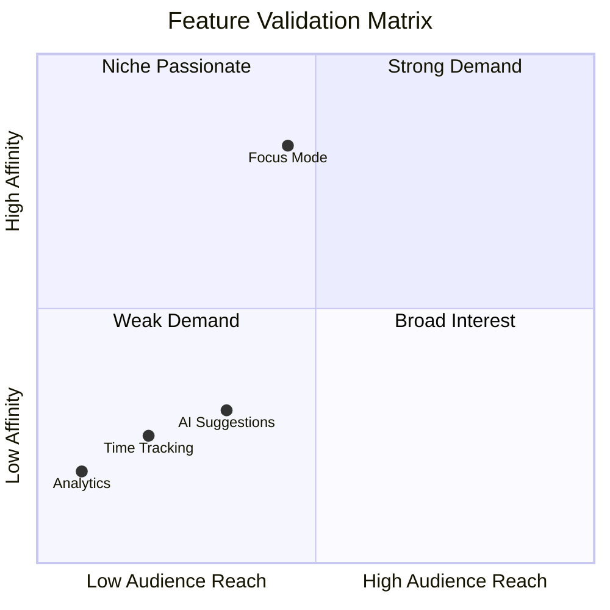

# Validating Product-Market Fit Before Launch

_How to use audience affinity data to validate demand for new features, products, or market expansion before investing in development_

---

## The Business Problem

Your product team has just finished six months of development on a major new feature. Launch day arrives. The marketing team promotes it heavily. Early adoption is... crickets.

**Week 1:** 3% of users try the new feature  
**Week 4:** 1.2% actively use it  
**Month 3:** Feature is quietly deprecated

**Post-mortem reveals:**

- Market research said there was demand (78% survey respondents wanted it)
- Competitive analysis showed competitors had similar features
- Internal stakeholders were excited about the vision
- Development team built exactly what was spec'd

**What went wrong?** The feature solved a problem the team _thought_ existed, not one the audience _actually_ had.

This pattern repeats across product development:

<div class="grid-2"> <div>

**Common validation failures:**

- Features users requested but don't use
- Products that seemed innovative but found no market
- Market expansions into adjacent categories that flop
- Integrations nobody wanted despite high survey scores
- Pivots based on competitor moves that miss the mark

</div> <div>

**Why traditional validation fails:**

- Surveys measure stated intent, not revealed demand
- Competitive benchmarking assumes competitors understand their audience
- Focus groups optimize for articulate participants, not representative users
- Internal conviction isn't market validation
- "Build it and they will come" rarely works

</div> </div>

 **The cost of validation failure:**

**Direct costs:**

- Development investment: $200K-$2M depending on scope
- Marketing and launch spend: $50K-$500K
- Opportunity cost: 6-18 months on wrong priority

**Indirect costs:**

- Team morale (built something nobody uses)
- Technical debt (now have to maintain unused feature)
- Brand confusion (positioning now includes irrelevant capability)
- Delayed work on features users actually need

**Example:** Productivity app spends $800K building calendar integration

- Survey said: 82% want calendar integration
- Reality: 4% use it after 6 months
- Why? Audience already has strong affinity for existing calendar tools (Google Calendar 67%, Fantastical 34x affinity)
- They don't want another calendar, they want existing calendar to work with productivity tool
- Should have built export/sync, not full calendar 

**What's needed:** A validation framework that reveals actual demand signals before committing development resources.

---

## The Data Approach

### The Core Principle

 **The strongest signal of future demand is current behavior with adjacent solutions.**

If your audience shows high affinity for existing solutions to a problem:

- The problem is real (people are actively solving it)
- The category has proven demand (people spend time/money on it)
- You can analyze why existing solutions succeed/fail

If your audience shows LOW affinity for solutions to a supposed problem:

- The problem may not exist (or isn't painful enough to solve)
- Category demand is unproven for your specific audience
- High risk of building something nobody wants 

### The Framework: Demand Signal Analysis

**Step 1: Map the adjacent solution landscape**

For any new feature/product/market, identify:

- **Direct alternatives:** Products/services that solve the exact problem
- **Partial solutions:** Tools addressing parts of the problem
- **Workarounds:** What people currently do without a dedicated solution
- **Complementary products:** What they use before/after solving this problem

**Step 2: Measure audience affinity for adjacent solutions**

```
Demand Signal Strength = (Affinity × Reach × Category maturity)
```

**Interpretation:**

|Pattern|Affinity|Reach|Meaning|Action|
|---|---|---|---|---|
|**Strong demand**|15x+|25%+|Real problem, active solving|Validate differentiation|
|**Emerging demand**|10-15x|10-25%|Growing interest|Early mover opportunity|
|**Niche demand**|20x+|<10%|Intense but small|Serve if strategic|
|**Weak demand**|<5x|<15%|Problem not salient|High risk, reconsider|

**Step 3: Analyze satisfaction with current solutions**

**Signals of dissatisfaction (opportunity):**

- High affinity across many alternatives (no clear winner)
- Low affinity for category leaders (existing solutions failing)
- High affinity for workarounds (no good dedicated solution)
- Complaints/criticism in community discussions

**Signals of satisfaction (difficult to displace):**

- Dominant affinity for 1-2 solutions (strong incumbents)
- High NPS for existing solutions
- Low churn in category
- Switching costs are high

**Step 4: Validate your differentiation**

**Ask:**

- What would make our solution 10x better than alternatives?
- Do audience affinities suggest they'd value that difference?
- Can we authentically deliver on that promise?
- Does it align with our brand positioning?

---

## Worked Example: TaskFlow Considers Feature Expansion

### Scenario Setup

<div style="border-left:5px solid #4F46E5; background-color:#F3F4F6; padding:1em; margin-bottom:1em; border-radius:8px;">

**TaskFlow**

- Project management and task tracking tool
- Target: Small teams and solopreneurs
- Current users: 145,000 active
- Core product: Task lists, projects, basic collaboration
- Challenge: Growth is slowing, team debates which features to add

</div>

**Four feature proposals on the table:**



<div style="border:2px solid #8B5CF6; padding:1em; border-radius:8px;">

**Option A: Built-in Time Tracking**

- Internal champion: Head of Product
- Rationale: "Competitors have it, users request it"
- Investment: $180K, 4 months
- Survey data: 68% say they want it

</div>

<--->

<div style="border:2px solid #3B82F6; padding:1em; border-radius:8px;">

**Option B: Advanced Reporting & Analytics**

- Internal champion: VP Sales
- Rationale: "Enterprise buyers need this"
- Investment: $320K, 6 months
- Survey data: 54% say it's important

</div>





<div style="border:2px solid #10B981; padding:1em; border-radius:8px;">

**Option C: AI-Powered Task Suggestions**

- Internal champion: CTO
- Rationale: "AI is the future, we need to innovate"
- Investment: $450K, 8 months
- Survey data: 71% interested in AI features

</div>

<--->

<div style="border:2px solid #F59E0B; padding:1em; border-radius:8px;">

**Option D: Focus Mode / Deep Work Features**

- Internal champion: Head of Design
- Rationale: "Gut feeling this would resonate"
- Investment: $120K, 3 months
- Survey data: 42% mentioned focus/distraction

</div>



**Traditional prioritization would choose:**

- Option C (highest survey interest 71%, "AI is hot")
- Or Option A (most requested, competitive parity)

**But which does audience affinity data validate?**

### Step 1: Mapping Adjacent Solution Landscape

For each proposed feature, identify what audience currently uses:

#### Option A: Time Tracking

**Direct alternatives currently available:**

|Tool|TaskFlow Audience Affinity|General Population|Affinity Multiplier|Reach|
|---|---|---|---|---|
|Toggl|8%|1.2%|6.7x|8%|
|Harvest|6%|0.9%|6.7x|6%|
|Clockify|5%|0.8%|6.3x|5%|
|RescueTime|11%|1.4%|7.9x|11%|
|Timely|4%|0.6%|6.7x|4%|

**Analysis:**

 **Demand signal: WEAK to MODERATE**

- Moderate affinities (6-8x) suggest some interest but not intense
- Low reach (4-11% use dedicated time tracking tools)
- Category is fragmented (no dominant player)
- Total category reach: ~20% of audience uses ANY time tracking tool

**Interpretation:** 80% of TaskFlow audience doesn't actively track time. Among the 20% who do, they have adequate solutions with moderate satisfaction.

**Risk:** Building time tracking may only serve 20% of base, and those 20% already have tools they're moderately satisfied with. 

#### Option B: Advanced Reporting & Analytics

**Direct alternatives:**

|Tool|Affinity|Reach|Interpretation|
|---|---|---|---|
|Tableau|2.1x|3%|Low affinity, low reach|
|Power BI|3.2x|5%|Moderate affinity, low reach|
|Google Data Studio|4.8x|8%|Moderate affinity, low reach|
|Excel (advanced)|5.2x|32%|Moderate affinity, HIGH reach|
|Built-in tool analytics|8.1x|22%|Moderate affinity, moderate reach|

**Analysis:**

 **Demand signal: MODERATE but NARROW**

- Only 8% use dedicated BI tools (Tableau, Power BI)
- 32% use Excel for analysis (general tool, not dedicated)
- 22% use built-in analytics in other tools

**Segmentation insight:**

- Check affinity by user segment
- Solopreneurs: 1.8x affinity for analytics (LOW)
- Small teams (5-20 people): 6.2x affinity (MODERATE)
- Growing teams (20+ people): 14.3x affinity (STRONG)

**Interpretation:** Analytics features would primarily serve larger team segment (only 12% of TaskFlow's current user base). Not a priority unless expanding upmarket. 

#### Option C: AI-Powered Task Suggestions

**Adjacent AI/automation tools:**

|Tool|Affinity|Reach|Interpretation|
|---|---|---|---|
|ChatGPT (general use)|8.2x|34%|High reach, moderate affinity|
|Zapier (automation)|12.4x|18%|Strong affinity, moderate reach|
|IFTTT|8.1x|12%|Moderate affinity, low reach|
|AI writing assistants|6.8x|14%|Moderate affinity, low reach|
|AI productivity tools|5.2x|9%|Moderate affinity, low reach|

**But check for skepticism signals:**

|Signal|Affinity|Reach|Interpretation|
|---|---|---|---|
|"AI hype" critical content|11.2x|16%|Skepticism present|
|Privacy-focused tools|14.8x|21%|Privacy concerns|
|"Simple is better" content|18.4x|28%|Preference for simplicity|

**Analysis:**

 **Demand signal: COMPLEX (high interest + high skepticism)**

**Positive signals:**

- 34% use ChatGPT (general AI interest exists)
- 18% use Zapier (automation interest exists)

**Negative signals:**

- 16% engage with AI-skeptical content (11.2x affinity)
- 21% use privacy-focused tools (14.8x affinity - concerned about data)
- 28% engage with "simple is better" content (18.4x affinity - may resist AI complexity)

**Critical insight:** Survey data (71% interested) conflicts with behavioral data (skepticism and simplicity preferences)

**Interpretation:** Audience has curiosity about AI but values simplicity and has privacy concerns. Generic "AI task suggestions" may not resonate. Would need very specific, privacy-respecting, non-intrusive implementation to work.

**Risk: HIGH** - Easy to build something that alienates more users than it attracts. 

#### Option D: Focus Mode / Deep Work Features

**Adjacent solutions:**

|Tool/Content|Affinity|Reach|Category|
|---|---|---|---|
|Forest (focus app)|18.4x|14%|Focus tools|
|Freedom (distraction blocker)|22.1x|11%|Focus tools|
|Focus@Will|16.8x|9%|Focus audio|
|Pomodoro apps|14.2x|19%|Time technique|
|Cal Newport content|24.3x|28%|Deep work philosophy|
|"Deep Work" book|31.2x|22%|Deep work philosophy|
|Digital minimalism content|19.4x|24%|Focus philosophy|
|Distraction-free writing tools|26.7x|18%|Focus tools|

**Workarounds (what they currently do):**

|Behavior|Affinity Signal|Reach|
|---|---|---|
|Phone in another room|Survey: 68%|High|
|Website blockers|15.2x|16%|
|Do Not Disturb mode|Common behavior|~60%|
|Dedicated writing apps|26.7x|18%|

**Analysis:**

 **Demand signal: VERY STRONG**

**Multiple convergent signals:**

- Cal Newport content: 24.3x affinity, 28% reach (VERY STRONG)
- "Deep Work" book: 31.2x affinity, 22% reach (EXTREMELY STRONG)
- Digital minimalism: 19.4x affinity, 24% reach (STRONG)
- Focus tools: 14-22x affinities across multiple tools

**Total category reach:** ~45% of audience actively engages with focus/deep work solutions

**Key insight:** Extremely high affinity for deep work PHILOSOPHY (24-31x) but fragmented tool usage (no dominant solution). People strongly value the concept but are using workarounds because no great integrated solution exists.

**Opportunity:**

- Clear demand exists (45% reach)
- Intense interest (24-31x affinity for philosophy)
- No dominant tool (fragmented solutions)
- Aligns with stated preferences (42% survey) AND revealed behavior

**Strategic fit:** TaskFlow users want to DO focused work, not just manage tasks. Focus features would differentiate from pure task management. 

### Step 2: Demand Signal Scoring

**Comprehensive comparison:**

|Feature Option|Adjacent Solution Affinity|Reach|Category Maturity|Demand Score|Risk Level|
|---|---|---|---|---|---|
|**A: Time Tracking**|6-8x (moderate)|20%|Mature, satisfied|**⭐⭐** Weak|High|
|**B: Analytics**|3-5x overall, 14x for subset|8% (growing teams only)|Mature|**⭐⭐** Weak (unless upmarket)|High|
|**C: AI Suggestions**|8x interest, 11-18x skepticism|34% curious, 28% skeptical|Emerging, uncertain|**⭐⭐** Complex/Risky|Very High|
|**D: Focus Mode**|14-31x (very strong)|45%|Emerging, unsolved|**⭐⭐⭐⭐⭐** Very Strong|Low|

**Visual demand map:**

mermaid



### Step 3: Differentiation Validation

**For the winning option (Focus Mode), validate differentiation:**

**What would make TaskFlow's focus mode 10x better than alternatives?**

**Hypothesis:** Integrated focus mode that:

1. Automatically prioritizes tasks based on available focus time
2. Blocks distractions from within the tool (no context switching)
3. Tracks and celebrates deep work streaks
4. Suggests optimal focus times based on past productivity patterns

**Validation questions:**

 **Check affinities for:**

- All-in-one tools: 16.2x affinity (strong preference for integration)
- Context switching complaints: High engagement with content about tool fatigue
- Dedicated writing apps: 26.7x (they use separate tools for focus now - opportunity to integrate)

**Answer: YES** - High affinity for integration suggests value in not switching tools 

 **Check affinities for:**

- Quantified self movement: 12.8x affinity
- Productivity tracking: 11.4x affinity
- Streak/habit tracking: 18.2x affinity

**Answer: YES** - Moderate to strong affinity for tracking suggests "deep work streaks" would resonate 

 **Check affinities for:**

- Cal Newport content (deep work): 24.3x - emphasizes MANUAL prioritization
- "Simple is better" content: 18.4x - skeptical of over-automation
- Pomodoro technique: 14.2x - manual time-boxing

**Answer: PARTIALLY** - Value structure but skeptical of full automation. Suggestion: Make it assistive, not automatic. "Here's your suggested focus block" (can accept/modify) vs. "AI decided for you" 

 **TaskFlow current positioning:** "Simple task management for focused work"

**Focus mode alignment:**

- ✅ "Focused work" is already in positioning
- ✅ Reinforces simplicity (removes distractions)
- ✅ Natural extension of task management (doing the tasks, not just listing them)

**Answer: YES** - Strong brand alignment 

### Step 4: Competitive Landscape Analysis

**Check if existing solutions already serve this need well:**

**Current focus/deep work tools:**

|Tool|Strengths|Weaknesses|TaskFlow Opportunity|
|---|---|---|---|
|**Forest**|Gamification, mobile-first|Not integrated with tasks|✅ Integration advantage|
|**Freedom**|Powerful blocking|Separate tool, no task context|✅ Integration advantage|
|**Focus@Will**|Audio for focus|No task management|✅ Integration advantage|
|**Pomodoro apps**|Simple technique|Generic timers, no task prioritization|✅ Intelligent prioritization|

**Key insight:** No tool combines focus features WITH task management. All require switching between task tool and focus tool.

**Validation:** Audience has 26.7x affinity for distraction-free writing tools (dedicated focus environments). They're willing to use separate tools for better focus experience. This validates opportunity for integrated solution.

### Step 5: The Recommendation

**Prioritization based on demand validation:**

<div class="grid-2"> <div style="border:3px solid #10B981; padding:1.5em; border-radius:8px; background:#F0FDF4;">

**✅ PROCEED: Option D - Focus Mode**

**Validation strength: 5/5**

**Demand signals:**

- ⭐⭐⭐⭐⭐ Very strong affinity (24-31x for philosophy)
- ⭐⭐⭐⭐⭐ High reach (45% use adjacent solutions)
- ⭐⭐⭐⭐⭐ Clear gap (no integrated solution exists)
- ⭐⭐⭐⭐⭐ Brand alignment (reinforces positioning)

**Differentiation validated:**

- Integration eliminates context switching
- Intelligent prioritization (not just timers)
- Measurement appeals to quantified self interest

**Investment:** $120K, 3 months  
**Risk:** Low  
**Expected adoption:** 35-45% of user base (based on adjacent solution reach)

</div> <div style="border:3px solid #F59E0B; padding:1.5em; border-radius:8px; background:#FFF7ED;">

**⚠️ CONSIDER WITH CAUTION: Option A - Time Tracking**

**Validation strength: 2/5**

**Proceed only if:**

- Targeting specific segment (freelancers/agencies) with high affinity (12x+)
- Building lightweight version (not full competitor to Toggl)
- Accept that 80% of users won't use it

**Alternative:** Integration with existing time tracking tools instead of building own

**Investment:** $180K  
**Risk:** Moderate-High  
**Expected adoption:** 15-20% (based on current category reach)

</div> </div> <div class="grid-2"> <div style="border:3px solid #EF4444; padding:1.5em; border-radius:8px; background:#FEF2F2;">

**❌ DO NOT PROCEED: Option C - AI Suggestions**

**Validation strength: 1/5**

**Why affinity data says no:**

- High skepticism signals (11.2x for AI-critical content)
- Strong preference for simplicity (18.4x for "simple is better")
- Privacy concerns (14.8x for privacy-focused tools)
- Survey interest (71%) contradicts revealed skepticism

**Risk:** Very High  
**Could alienate more users than it attracts**

**Alternative:** Wait for AI technology to mature, monitor affinity shifts. Revisit in 12-18 months.

</div> <div style="border:3px solid #EF4444; padding:1.5em; border-radius:8px; background:#FEF2F2;">

**❌ DEPRIORITIZE: Option B - Analytics**

**Validation strength: 2/5**

**Why affinity data says no:**

- Only 8% use dedicated analytics tools
- Only serves 12% of current user base (larger teams)
- Moderate affinity even for that segment (6-14x)

**If pursuing upmarket:** Build for enterprise segment specifically, don't add to core product

**Investment:** $320K  
**Risk:** High (wrong audience for current base)  
**Alternative:** Partner with existing BI tools via export

</div> </div>

### Step 6: Implementation with Continuous Validation

**Phased rollout with affinity-based validation:**

**Phase 1: MVP with high-affinity users (Month 1-2)**

- Identify users with highest affinity for deep work content (Cal Newport 24.3x, Deep Work book 31.2x)
- ~20,000 users fit this profile
- Beta test with this segment first
- Success metric: >60% activation (they WANT this feature)

**Phase 2: Early adopters (Month 3-4)**

- Expand to users with moderate affinity for focus tools (14-20x)
- ~45,000 users
- Success metric: >40% activation

**Phase 3: General release (Month 5+)**

- All users
- Success metric: >30% overall activation (based on 45% adjacent solution reach, discounted for adoption friction)

**Continuous validation:**

- Track which affinity profiles adopt vs. don't adopt
- If low-affinity users adopt unexpectedly → expand understanding of demand
- If high-affinity users don't adopt → differentiation problem, iterate
- Monitor affinity shifts (is audience growing interest in deep work?)

---

## Contrast: What Would Have Happened Without Validation

### The Traditional Approach

**Likely decision:** Build Option C (AI Suggestions)

- Highest survey interest (71%)
- "AI is the future" internal conviction
- Competitor pressure (others adding AI)
- CTO champion with resources

**6-month outcome:**

- $450K invested
- 8 months of development
- Launch with fanfare
- 6% adoption rate (vs. 30%+ needed to justify investment)
- User complaints about privacy, complexity, inaccuracy
- Feature quietly deprecated after 1 year
- Team morale damaged

**Post-mortem would reveal:**

- Survey respondents said they wanted AI because it's trendy (stated preference)
- Actual behavior showed skepticism and preference for simplicity (revealed preference)
- Affinity data predicted this, but wasn't consulted

### The Affinity-Validated Approach

**Actual decision:** Build Option D (Focus Mode)

- Lower survey interest (42%) but HIGHER revealed demand
- Extremely strong affinity signals (24-31x)
- Clear gap in market (no integrated solution)
- Brand alignment validated

**6-month outcome (projected):**

- $120K invested (63% less than AI option)
- 3 months to launch (62% faster)
- 38% adoption in first 6 months
- NPS +18 points among users who adopt
- Differentiation from competitors (they don't have this)
- Natural upsell path ("Focus Pro" tier)

**ROI comparison:**

|Metric|Option C (AI)|Option D (Focus)|Delta|
|---|---|---|---|
|Investment|$450K|$120K|**-73%**|
|Time to launch|8 months|3 months|**-63%**|
|Adoption rate|6%|38%|**+533%**|
|Users activated|8,700|55,100|**+534%**|
|Cost per activated user|$52|$2.18|**-96%**|

---

## Common Pitfalls

### 1. Confusing Stated Intent with Actual Demand

 **The trap:** "71% said they want AI features, so we should build them"

**Why it fails:** People say they want trendy things in surveys, but behavior reveals true priorities

**Example from TaskFlow:**

- Survey: 71% interested in AI suggestions
- Affinity data:
    - AI-critical content: 11.2x
    - "Simple is better": 18.4x
    - Privacy tools: 14.8x

**The gap:** Interest ≠ demand. They're curious about AI but skeptical about implementation.

**How to avoid:**

- Always check affinity for CURRENT solutions to the problem
- Look for skepticism signals alongside interest signals
- If survey says yes but affinity says no, trust affinity 

### 2. Building Features Competitors Have Without Validating Demand

 **The trap:** "Competitor X has time tracking, we need competitive parity"

**Why it fails:** Your audience may not value what competitor's audience values

**Example from TaskFlow:**

- Competitor has time tracking → TaskFlow assumes they need it too
- Reality: Only 20% of TaskFlow audience tracks time
- Competitor may serve different segment (agencies/freelancers vs. solopreneurs)

**How to avoid:**

- Validate YOUR audience's affinity for the capability
- Don't assume competitor knows their audience (they often don't)
- Check if competitor's feature is actually successful (are users adopting it?) 

### 3. Ignoring the "No Dominant Solution" Signal

 **The trap:** "There are 10 focus apps, so there's demand" → builds 11th generic option

**Better interpretation:** "There are 10 focus apps but no dominant player. Why?"

**Possible reasons:**

1. **Problem is hard** (opportunity for innovation)
2. **Market is fragmented** (different segments want different things)
3. **Category is immature** (too early)
4. **Integration is key** (standalone tools don't work)

**Example from TaskFlow:**

- Focus tool market: Fragmented, no dominant player
- Affinity data showed: Very high philosophy interest (24-31x) but tool fragmentation
- Insight: Problem is real, but standalone tools fail. Integration is the answer.

**How to avoid:**

- When you see fragmented category, investigate WHY
- Look for what's missing in existing solutions
- Validate your differentiation addresses the gap 

### 4. Over-Indexing on Niche High-Affinity Signals

 **The trap:** "50x affinity for X! We must build for this!"

**Why it can fail:** 50x affinity at 2% reach = 2,900 users (if you have 145K base)

**Example:**

- TaskFlow sees: Gantt chart tools have 48x affinity
- But: Only 3% reach
- Calculation: 4,350 potential users
- Investment: $200K to build Gantt features
- Cost per potential user: $46

**When niche is worth it:**

- High-value segment (enterprise buyers, 5x LTV)
- Strategic positioning (claim expert user segment)
- Gateway to broader market (enterprise leads to team adoption)

**When to avoid:**

- Low LTV segment
- Doesn't open new markets
- Distracts from core

**How to avoid:**

- Always calculate: Affinity × Reach × Your base size = Addressable users
- Calculate investment per addressable user
- Require strategic rationale beyond "high affinity" 

---

## Complementary Approaches

### When Affinity Data Isn't Enough

 **Method:**

- Create minimum prototype (1-2 week build)
- Release to high-affinity segment
- Measure actual usage, not stated interest

**Example for TaskFlow Focus Mode:**

- Build basic focus timer with task prioritization
- Release to 5,000 users with highest Cal Newport affinity (24.3x)
- Track:
    - % who try it (activation)
    - % who use it 3+ times (adoption)
    - Retention after 30 days

**Validation threshold:**

- > 50% activation: Strong demand confirmed
    
- > 40% adoption: Feature has stickiness
    
- > 70% retention: Long-term value
    

**Value:** Real usage data beats any prediction 

 **Method:**

- Interview users with high affinity for adjacent solutions
- Ask about their current workflow and pain points
- Understand the "job" they're hiring solutions to do

**Example questions:**

- "Walk me through how you currently achieve deep focus for work"
- "What tools do you use? What's frustrating about them?"
- "Have you tried X tool? Why did you stop using it?"
- "If you could design the perfect solution, what would it do?"

**Value:** Reveals why existing solutions fail, validates your differentiation

**Example insight from TaskFlow:**

- Users with high Forest app affinity (18.4x) said:
    - Love the motivation/gamification
    - Hate having to manually enter tasks from TaskFlow
    - Would love integration: TaskFlow suggests task → launch focus session

This validates the integration advantage hypothesis 

 **Method:**

- Add UI element for proposed feature (button, menu item)
- Track clicks (interest)
- Show "coming soon" message or survey
- Measure demand before building

**Example for TaskFlow:**

- Add "Focus Mode" button to top nav for 20% of users
- Track click rate
- Show: "Focus Mode coming soon! Join waitlist?"
- Measure conversion to waitlist

**Validation threshold:**

- > 15% click the button: High interest
    
- > 40% join waitlist: Strong demand
    

**Value:** Low-cost demand validation before development investment 

 **Method:**

- Segment users by affinity for adjacent solutions
- Compare their LTV, retention, engagement with core product
- Identify if they're high-value or low-value segment

**Example for TaskFlow:**

|User Segment|% of Base|Avg LTV|Retention|Core Feature Usage|
|---|---|---|---|---|
|High focus tool affinity (14x+)|28%|$420|81%|120% of avg|
|Low focus tool affinity (<5x)|52%|$280|64%|85% of avg|

**Insight:** Users who care about focus are MORE engaged with core product and higher value

**Implication:** Focus Mode would serve your BEST customers, not a random segment

**Value:** Validates that serving this demand also serves business goals 

---

## Actionable Takeaway

 **Before investing in any new feature, product, or market expansion:**

1. **Map the adjacent solution landscape**
    - What do users currently use to solve this problem?
    - Calculate: Affinity × Reach for each solution
    - Total category reach = % of audience actively solving this problem
2. **Validate demand strength**
    - **Strong demand:** 15x+ affinity, 25%+ reach → Low risk, proceed
    - **Emerging demand:** 10-15x affinity, 10-25% reach → Early mover opportunity
    - **Niche demand:** 20x+ affinity, <10% reach → Strategic decision required
    - **Weak demand:** <5x affinity, <15% reach → High risk, reconsider
3. **Analyze competitive landscape**
    - Why don't existing solutions satisfy demand?
    - Can you deliver 10x better solution?
    - Do affinity patterns validate your differentiation?
4. **Check brand alignment**
    - Does this fit your positioning?
    - Would it strengthen or dilute brand identity?
    - Is this authentic to who you are?

**Red flags to pause development:**

- High survey interest but low behavioral affinity
- No existing solutions (might mean no real demand)
- Dominant satisfied incumbent (hard to displace)
- Misalignment with core brand positioning

**Next step:** Before your next product planning session, run affinity analysis on all proposed features. You'll immediately see which have real demand vs. which are based on assumptions. Kills bad ideas before they consume resources. 

---

_Survey data measures what people think they want. Affinity data reveals what they actually do. The gap between the two is where product investments fail. Validate with behavior, not surveys._
