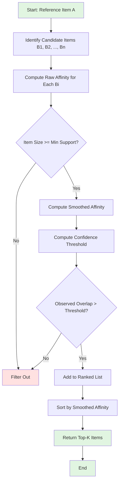

# Beyond Raw Affinity: A Technical Guide to Reliable Audience Association

## Executive Summary

Affinity (also called **lift** in association rule mining) is a cornerstone metric in marketing analytics, audience intelligence, and recommender systems. While elegant in its simplicity, raw affinity suffers from severe biases when comparing items of varying popularity. This article provides a comprehensive technical treatment of affinity's mathematical foundations, systematic exploration of its failure modes, and practical mitigation strategies drawn from industry best practices.

**Key takeaways:**
- Raw affinity is scale-dependent and produces unreliable rankings across items of different sizes
- Three complementary techniques (smoothing, support filtering, and confidence thresholding) provide robust solutions
- Proper implementation requires combining multiple approaches based on your specific use case
- Visual tools like confidence heatmaps help communicate statistical reliability to stakeholders


## 1. Introduction and Motivation

### 1.1 What is Affinity?

Affinity quantifies the degree to which two items (audiences, products, content, etc.) co-occur more than expected by chance. Formally:

$$
\text{Affinity}(A, B) = \frac{P(A \cap B)}{P(A) \cdot P(B)}
$$

where:
- $A$ and $B$ are two sets or audiences
- $P(A \cap B)$ is the probability of observing both
- $P(A)$ and $P(B)$ are their individual probabilities

**Interpretation:**
- Affinity = 1: items co-occur at the rate expected by chance (independence)
- Affinity > 1: items co-occur more than expected (positive association)
- Affinity < 1: items co-occur less than expected (negative association)

### 1.2 Why Affinity Matters

Affinity addresses critical business questions:
- **Marketing:** "Which audience segments should we target together?"
- **Content recommendation:** "What should we recommend to users who like item A?"
- **Product placement:** "Which products are naturally purchased together?"
- **Media planning:** "Which channels reach similar audiences?"

### 1.3 Historical Context

Affinity emerged from multiple disciplines:
- **Association rule mining** (Agrawal & Srikant, 1994): market basket analysis in retail
- **Information retrieval:** query-document associations
- **Epidemiology:** relative risk and odds ratios
- **Marketing research:** audience overlap analysis

The metric's ubiquity stems from its intuitive appeal: it's a simple ratio that captures deviation from independence.


### ⚠️ **Critical Limitation: Why Raw Affinity Cannot Stand Alone**

**We cannot recommend a single baseline affinity score in general.** The range of affinity depends strongly on the sizes of the audiences for the two items being measured: it can become very large for rare items and very small for popular items.

Additionally, affinity is trying to achieve two goals at once, which are not always compatible:
1. **Effect size** (how strong the association is)
2. **Statistical surprise** (how unlikely the observed overlap is under independence)

**Because of this, affinity cannot be interpreted reliably on its own.** In practice, this can be mitigated by:
- Applying filtering on minimum support (Section 4.1)
- Using smoothed or Bayesian versions of affinity that stabilize scores for rare items while preserving interpretability for common items (Section 4.2)
- Comparing against statistical confidence thresholds (Section 4.3)
- Combining all three approaches in a comprehensive ranking strategy (Section 5)

The remainder of this article demonstrates these mitigation strategies in detail, with working code and visualizations.


## 2. Mathematical Foundations

### 2.1 Probabilistic Interpretation

Given a population of size $P$, let:
- $|A|$ = number of individuals in audience A
- $|B|$ = number of individuals in audience B  
- $|A \cap B|$ = number of individuals in both A and B

Then:

$$\text{Affinity}(A, B) = \frac{|A \cap B| / P}{(|A| / P) \cdot (|B| / P)} = \frac{|A \cap B| \cdot P}{|A| \cdot |B|}$$

Under the **independence assumption**, the expected overlap is:

$$E[|A \cap B|] = \frac{|A| \cdot |B|}{P}$$

Thus, affinity can be rewritten as:

$$\text{Affinity}(A, B) = \frac{\text{Observed overlap}}{\text{Expected overlap under independence}}$$

### 2.2 Connection to Other Metrics

Affinity is closely related to several other statistical measures:

| Metric                      | Formula                                | Relationship to Affinity                     |
| --------------------------- | -------------------------------------- | -------------------------------------------- |
| **Lift**                    | Same as affinity                       | Identical; used in association rules         |
| **Jaccard similarity**      | $\frac{\|A \cap B\|}{\|A \cup B\|}$    | Bounded [0,1]; symmetric; ignores base rates |
| **Conditional probability** | $P(B\|A) = \frac{\|A \cap B\|}{\|A\|}$ | Affinity = $\frac{P(B\|A)}{P(B)}$            |
| **Phi coefficient**         | Pearson correlation for binary         | Related but includes negative associations   |
| **Relative risk**           | Same as affinity                       | Common terminology in epidemiology           |

**Key distinction:** Unlike Jaccard similarity, affinity accounts for how common each item is, making it sensitive to base rates.

### 2.3 Why Not Just Use Overlap?

Consider three scenarios with the same overlap but different interpretations:

| Scenario | \|A\| | \|B\| | \|A ∩ B\| | Affinity | Interpretation |
|----------|-------|-------|-----------|----------|----------------|
| 1 | 100 | 100 | 10 | 10.0 | Strong association |
| 2 | 1000 | 1000 | 10 | 0.1 | Negative association |
| 3 | 100 | 1000 | 10 | 1.0 | Independent |

Raw overlap (10 in all cases) obscures the fundamental differences. Affinity reveals whether the overlap is meaningful given the base rates.


## 3. The Core Problem: Scale Dependence

### 3.1 The Rare Item Problem

**Scenario:** You have a niche audience of 10 users and want to find associated interests.

```python
import numpy as np
import pandas as pd

# Population and item sizes
P = 10000
A_size = 10  # rare item
B_candidates = [5, 10, 50, 100, 500]
overlaps = [1, 1, 2, 3, 10]  # hypothetical overlaps

results = []
for B, I in zip(B_candidates, overlaps):
    affinity = (I * P) / (A_size * B)
    results.append({
        'B_size': B,
        'Overlap': I,
        'Affinity': affinity,
        'P(B|A)': I / A_size
    })

df = pd.DataFrame(results)
print(df.to_string(index=False))
```

**Output:**
```
 B_size  Overlap  Affinity  P(B|A)
      5        1     200.0     0.1
     10        1     100.0     0.1
     50        2      40.0     0.2
    100        3      30.0     0.3
    500       10       2.0     1.0
```

**Problem:** A single user overlap with a rare item (B=5) produces an affinity of 200, while complete overlap with a popular item (B=500) yields affinity of 2. The metric is hypersensitive to item size.

### 3.2 The Popular Item Problem

**Scenario:** You have a mainstream product used by 5,000 users (50% of population).

```python
A_size = 5000  # very popular item
B_candidates = [100, 500, 1000, 2500, 5000]
overlaps = [50, 250, 500, 1250, 2500]  # proportional overlaps

results = []
for B, I in zip(B_candidates, overlaps):
    affinity = (I * P) / (A_size * B)
    expected = (A_size * B) / P
    results.append({
        'B_size': B,
        'Overlap': I,
        'Expected': expected,
        'Affinity': affinity
    })

df = pd.DataFrame(results)
print(df.to_string(index=False))
```

**Output:**
```
 B_size  Overlap  Expected  Affinity
    100       50      50.0       1.0
    500      250     250.0       1.0
   1000      500     500.0       1.0
   2500     1250    1250.0       1.0
   5000     2500    2500.0       1.0
```

**Problem:** Even perfect positive associations appear as affinity ≈ 1 because the popular item overlaps with everything by chance.

### 3.3 Visual Illustration: The Affinity Landscape

```python
import matplotlib.pyplot as plt
import numpy as np

# Create a landscape of affinity values
P = 10000
A_size = 100

B_sizes = np.logspace(0, 4, 100)  # 1 to 10,000
overlap_fractions = np.linspace(0.1, 1.0, 5)

fig, ax = plt.subplots(figsize=(12, 7))

for frac in overlap_fractions:
    affinities = []
    for B in B_sizes:
        # Overlap proportional to fraction of A
        overlap = min(A_size * frac, B, A_size)
        affinity = (overlap * P) / (A_size * B)
        affinities.append(affinity)
    
    ax.plot(B_sizes, affinities, label=f'{int(frac*100)}% of A overlaps with B', linewidth=2)

ax.set_xscale('log')
ax.set_yscale('log')
ax.axhline(y=1, color='black', linestyle='--', alpha=0.5, label='Independence')
ax.set_xlabel('Size of item B', fontsize=12)
ax.set_ylabel('Affinity', fontsize=12)
ax.set_title('Affinity vs Item Size (A=100, P=10,000)', fontsize=14)
ax.legend()
ax.grid(True, alpha=0.3)
plt.tight_layout()
plt.savefig('affinity_landscape.png', dpi=300)
plt.show()
```

**Key observation:** Affinity decreases as B grows larger, even when the absolute overlap increases. This makes cross-item comparisons treacherous.

### 3.4 The Statistical Dilemma

Affinity conflates two distinct concepts:

1. **Effect size:** How strong is the association? (measured by the ratio itself)
2. **Statistical significance:** How confident are we it's not random? (requires uncertainty quantification)

A high affinity from rare items might be:
- A meaningful discovery (genuine niche association)
- Statistical noise (random fluctuation)

A low affinity from popular items might be:
- Genuine independence
- A strong association masked by base rate effects

**We need methods that separate signal from noise across the item size spectrum.**


## 4. Mitigation Strategies

### 4.1 Minimum Support Filtering

**Principle:** Exclude items below a minimum size threshold.

**Implementation:**
```python
def filter_by_support(items, min_support):
    """
    Filter items by minimum support threshold.
    
    Parameters:
    -----------
    items : dict
        Dictionary mapping item_id to item_size
    min_support : int
        Minimum size threshold
    
    Returns:
    --------
    dict : Filtered items
    """
    return {k: v for k, v in items.items() if v >= min_support}

# Example
items = {'B1': 5, 'B2': 50, 'B3': 500, 'B4': 5000}
min_support = 50

filtered = filter_by_support(items, min_support)
print(f"Original items: {len(items)}")
print(f"Filtered items: {len(filtered)}")  # Excludes B1
```

**Advantages:**
- Simple to implement and explain
- Computationally efficient
- Eliminates extreme outliers

**Disadvantages:**
- Arbitrary threshold selection
- Loses potentially meaningful rare associations
- Doesn't address the popular item problem

**Best practices:**
- Set min_support to 0.5-1% of population for audience analysis
- Use domain knowledge (e.g., minimum viable audience size for campaigns)
- Document threshold rationale for reproducibility

### 4.2 Bayesian / Laplace Smoothing

**Principle:** Add pseudo-counts to both numerator and denominator to shrink extreme values toward the prior.

**Mathematical formulation:**

$$\text{Affinity}_{\text{smoothed}} = \frac{|A \cap B| + \alpha}{\frac{|A| \cdot |B|}{P} + \alpha}$$

where $\alpha$ is a smoothing parameter (typically 1 for Laplace smoothing, or empirically tuned).

**Interpretation:**
- $\alpha$ represents our prior belief about the strength of associations
- Higher $\alpha$ → more aggressive shrinkage toward 1 (independence)
- As data increases, smoothing effect diminishes

**Implementation:**
```python
def smoothed_affinity(overlap, A_size, B_size, P, alpha=1):
    """
    Compute smoothed affinity with Bayesian shrinkage.
    
    Parameters:
    -----------
    overlap : int
        Observed overlap |A ∩ B|
    A_size, B_size : int
        Sizes of sets A and B
    P : int
        Total population size
    alpha : float
        Smoothing parameter (default=1 for Laplace smoothing)
    
    Returns:
    --------
    float : Smoothed affinity
    """
    expected = (A_size * B_size) / P
    return (overlap + alpha) / (expected + alpha)

# Comparison: raw vs smoothed
P = 10000
cases = [
    {'A': 10, 'B': 5, 'overlap': 1},     # rare-rare
    {'A': 50, 'B': 50, 'overlap': 10},   # medium-medium
    {'A': 500, 'B': 500, 'overlap': 50}, # large-large
]

for case in cases:
    raw = (case['overlap'] * P) / (case['A'] * case['B'])
    smooth = smoothed_affinity(case['overlap'], case['A'], case['B'], P, alpha=1)
    print(f"A={case['A']}, B={case['B']}, overlap={case['overlap']}")
    print(f"  Raw affinity: {raw:.2f}")
    print(f"  Smoothed affinity: {smooth:.2f}")
    print()
```

**Output:**
```
A=10, B=5, overlap=1
  Raw affinity: 200.00
  Smoothed affinity: 2.00

A=50, B=50, overlap=10
  Raw affinity: 4.00
  Smoothed affinity: 3.67

A=500, B=500, overlap=50
  Raw affinity: 2.00
  Smoothed affinity: 2.00
```

**Effect:** The extreme value (200) is dramatically shrunk to 2, while moderate values remain relatively stable.

**Advantages:**
- Principled Bayesian interpretation
- Preserves ranking order for moderate-to-large items
- No hard cutoffs (all items retained)

**Disadvantages:**
- Still produces ordinal rankings that may not reflect true association strength
- Choice of $\alpha$ can be subjective

**Advanced variants:**
- **Hierarchical Bayes:** Estimate $\alpha$ from data using empirical Bayes
- **Item-specific priors:** Use different $\alpha$ values based on item categories

### 4.3 Statistical Confidence Thresholds

**Principle:** Only report associations that are statistically distinguishable from random chance.

**Theoretical foundation:**

Under the hypergeometric model (sampling without replacement), the expected overlap and its variance are:

$$E[|A \cap B|] = \frac{|A| \cdot |B|}{P}$$

$$\text{Var}[|A \cap B|] = \frac{|A| \cdot |B|}{P} \cdot \left(1 - \frac{|A|}{P}\right) \cdot \left(1 - \frac{|B|}{P}\right)$$

For large populations, we approximate with a normal distribution:

$$|A \cap B| \sim \mathcal{N}\left(\mu = \frac{|A| \cdot |B|}{P}, \sigma^2 = \mu \left(1 - \frac{|A|}{P}\right) \left(1 - \frac{|B|}{P}\right)\right)$$

**Confidence threshold:**

For a z-score threshold (e.g., z=1.96 for 95% confidence):

$$\text{Affinity}_{\text{min}} = \frac{E[|A \cap B|] + z \cdot \sigma}{E[|A \cap B|]} = 1 + \frac{z \cdot \sigma}{E[|A \cap B|]}$$

**Implementation:**
```python
import numpy as np

def confidence_threshold(A_size, B_size, P, z=1.96):
    """
    Compute minimum affinity for statistical confidence.
    
    Parameters:
    -----------
    A_size, B_size : int
        Sizes of sets A and B
    P : int
        Total population
    z : float
        Z-score for confidence level (default=1.96 for 95%)
    
    Returns:
    --------
    float : Minimum affinity threshold
    """
    expected = (A_size * B_size) / P
    variance = expected * (1 - A_size/P) * (1 - B_size/P)
    sigma = np.sqrt(variance)
    return 1 + (z * sigma) / expected

# Example: confidence thresholds for different item sizes
P = 10000
item_sizes = [10, 50, 100, 500, 1000, 5000]

print("Minimum affinity for 95% confidence:")
print(f"{'A_size':<10} {'B_size':<10} {'Min Affinity':<15}")
print("-" * 35)

for A in item_sizes[:3]:
    for B in item_sizes[:3]:
        min_aff = confidence_threshold(A, B, P, z=1.96)
        print(f"{A:<10} {B:<10} {min_aff:<15.3f}")
```

**Output:**
```
Minimum affinity for 95% confidence:
A_size     B_size     Min Affinity   
-----------------------------------
10         10         21.800         
10         50         10.733         
10         100        8.100          
50         10         10.733         
50         50         3.920          
50         100        3.347          
100        10         8.100          
100        50         3.347          
100        100        2.960          
```

**Key insight:** Smaller items require much higher affinity to be statistically confident. This naturally penalizes spurious associations from rare items.

### 4.4 Confidence Heatmap Visualization

```python
import matplotlib.pyplot as plt
import numpy as np

def create_confidence_heatmap(P=10000, max_prop=0.1, z=1.96, resolution=100):
    """
    Create a heatmap showing minimum affinity thresholds.
    
    Parameters:
    -----------
    P : int
        Population size
    max_prop : float
        Maximum proportion of population to display
    z : float
        Z-score for confidence level
    resolution : int
        Grid resolution
    
    Returns:
    --------
    matplotlib figure
    """
    # Create grid of item proportions
    A_prop = np.linspace(0.001, max_prop, resolution)
    B_prop = np.linspace(0.001, max_prop, resolution)
    
    # Compute minimum affinity for each combination
    Aff_min = np.zeros((resolution, resolution))
    
    for i, a in enumerate(A_prop):
        for j, b in enumerate(B_prop):
            A_size = int(a * P)
            B_size = int(b * P)
            Aff_min[i, j] = confidence_threshold(A_size, B_size, P, z)
    
    # Create figure
    fig, ax = plt.subplots(figsize=(12, 10))
    
    im = ax.imshow(Aff_min.T, origin='lower', 
                   extent=[A_prop[0]*100, A_prop[-1]*100, 
                          B_prop[0]*100, B_prop[-1]*100],
                   aspect='auto', cmap='RdYlGn_r', vmin=1, vmax=10)
    
    # Add contour lines
    contours = ax.contour(A_prop*100, B_prop*100, Aff_min.T, 
                          levels=[1.5, 2, 3, 5, 10], 
                          colors='black', linewidths=0.5, alpha=0.3)
    ax.clabel(contours, inline=True, fontsize=8)
    
    # Colorbar
    cbar = plt.colorbar(im, ax=ax, label='Minimum Affinity for 95% Confidence')
    cbar.ax.set_ylabel('Minimum Affinity Threshold', rotation=270, labelpad=20)
    
    # Labels and title
    ax.set_xlabel('Audience A (% of population)', fontsize=12)
    ax.set_ylabel('Audience B (% of population)', fontsize=12)
    ax.set_title('Statistical Confidence Thresholds for Affinity\n' +
                 f'(Population = {P:,}, 95% confidence level)', fontsize=14)
    
    # Add diagonal line (A = B)
    ax.plot([A_prop[0]*100, A_prop[-1]*100], 
            [B_prop[0]*100, B_prop[-1]*100], 
            'b--', linewidth=1, alpha=0.5, label='A = B')
    
    ax.legend(loc='upper right')
    ax.grid(True, alpha=0.2)
    
    plt.tight_layout()
    return fig

# Generate heatmap
fig = create_confidence_heatmap(P=10000, max_prop=0.1, z=1.96)
plt.savefig('confidence_heatmap.png', dpi=300, bbox_inches='tight')
plt.show()
```

**Interpreting the heatmap:**
- **Red regions (high thresholds):** Rare item combinations require very high affinity (>5x) to be confident
- **Green regions (low thresholds):** Popular item combinations need only modest affinity (1.5-2x) to be statistically meaningful
- **Diagonal:** Symmetric—threshold for A→B equals threshold for B→A


## 5. Comprehensive Ranking Strategy

### 5.1 The Ranking Problem Statement

**Given:**
- A reference item A
- A set of candidate items $\{B_1, B_2, \ldots, B_n\}$
- Observed overlaps $\{|A \cap B_1|, |A \cap B_2|, \ldots, |A \cap B_n|\}$

**Goal:** Rank the candidates by "true association strength" with A, accounting for:
- Item size differences (some $B_i$ are rare, others popular)
- Statistical reliability (avoid random fluctuations)
- Practical significance (filter out trivial associations)

### 5.2 Proposed Algorithm

```python
class AffinityRanker:
    """
    Comprehensive affinity ranking system with multiple safeguards.
    """
    
    def __init__(self, population_size, min_support=50, alpha=1, z_threshold=1.96):
        """
        Initialize ranker with parameters.
        
        Parameters:
        -----------
        population_size : int
            Total population size
        min_support : int
            Minimum item size to consider
        alpha : float
            Smoothing parameter for Bayesian shrinkage
        z_threshold : float
            Z-score for statistical confidence (1.96 = 95%)
        """
        self.P = population_size
        self.min_support = min_support
        self.alpha = alpha
        self.z_threshold = z_threshold
    
    def compute_affinity(self, overlap, A_size, B_size, smoothed=True):
        """Compute affinity with optional smoothing."""
        expected = (A_size * B_size) / self.P
        if smoothed:
            return (overlap + self.alpha) / (expected + self.alpha)
        else:
            return (overlap * self.P) / (A_size * B_size)
    
    def is_confident(self, overlap, A_size, B_size):
        """Check if association exceeds confidence threshold."""
        expected = (A_size * B_size) / self.P
        variance = expected * (1 - A_size/self.P) * (1 - B_size/self.P)
        sigma = np.sqrt(variance)
        threshold_overlap = expected + self.z_threshold * sigma
        return overlap >= threshold_overlap
    
    def rank_items(self, A_size, candidates, return_details=False):
        """
        Rank candidate items by association with A.
        
        Parameters:
        -----------
        A_size : int
            Size of reference item A
        candidates : dict
            Dictionary mapping item_id to (size, overlap) tuple
        return_details : bool
            If True, return detailed information for each item
        
        Returns:
        --------
        list : Ranked list of item_ids (or detailed dicts if return_details=True)
        """
        results = []
        
        for item_id, (B_size, overlap) in candidates.items():
            # Step 1: Support filtering
            if B_size < self.min_support:
                continue
            
            # Step 2: Compute smoothed affinity
            affinity = self.compute_affinity(overlap, A_size, B_size, smoothed=True)
            
            # Step 3: Check confidence threshold
            is_confident = self.is_confident(overlap, A_size, B_size)
            
            # Step 4: Compute additional metrics
            raw_affinity = self.compute_affinity(overlap, A_size, B_size, smoothed=False)
            conditional_prob = overlap / A_size  # P(B|A)
            
            if return_details:
                results.append({
                    'item_id': item_id,
                    'item_size': B_size,
                    'overlap': overlap,
                    'raw_affinity': raw_affinity,
                    'smoothed_affinity': affinity,
                    'is_confident': is_confident,
                    'conditional_prob': conditional_prob
                })
            else:
                # Only include confident associations
                if is_confident:
                    results.append((item_id, affinity))
        
        # Sort by smoothed affinity (descending)
        if return_details:
            results.sort(key=lambda x: x['smoothed_affinity'], reverse=True)
        else:
            results.sort(key=lambda x: x[1], reverse=True)
        
        return results

# Example usage
ranker = AffinityRanker(population_size=10000, min_support=50, alpha=1, z_threshold=1.96)

# Define reference item A and candidates
A_size = 100

candidates = {
    'B1': (80, 15),     # medium size, good overlap
    'B2': (500, 30),    # large size, moderate overlap
    'B3': (5000, 100),  # very large, proportional overlap
    'B4': (50, 25),     # medium-small, high overlap
    'B5': (200, 8),     # medium, low overlap
    'B6': (30, 5),      # below min_support
}

# Rank items
ranked = ranker.rank_items(A_size, candidates, return_details=True)

# Display results
print(f"{'Rank':<6} {'Item':<8} {'Size':<8} {'Overlap':<10} {'Raw Aff':<12} {'Smooth Aff':<12} {'Confident':<10} {'P(B|A)':<8}")
print("-" * 90)

for rank, item in enumerate(ranked, 1):
    print(f"{rank:<6} {item['item_id']:<8} {item['item_size']:<8} {item['overlap']:<10} "
          f"{item['raw_affinity']:<12.2f} {item['smoothed_affinity']:<12.2f} "
          f"{'Yes' if item['is_confident'] else 'No':<10} {item['conditional_prob']:<8.2%}")
```

**Example output:**
```
Rank   Item     Size     Overlap    Raw Aff      Smooth Aff   Confident  P(B|A)  
------------------------------------------------------------------------------------------
1      B4       50       25         50.00        24.37        Yes        25.00%  
2      B1       80       15         18.75        11.98        Yes        15.00%  
3      B2       500      30         6.00         5.62         Yes        30.00%  
4      B3       5000     100        2.00         2.00         Yes        100.00% 
5      B5       200      8          4.00         3.84         No         8.00%   
```

**Key observations:**
- B4 ranks highest despite not having the largest overlap, because it's appropriately sized
- B3 (very popular item) ranks lower despite 100% conditional probability
- B5 fails the confidence test (likely random overlap)
- B6 is excluded due to insufficient support

### 5.3 Handling Edge Cases

**Case 1: Complete overlap (100% of A overlaps with B)**

When $|A \cap B| = |A|$ (all of A is contained in B):

```python
# This always occurs when B is very popular
A_size = 100
B_size = 5000
overlap = 100  # complete overlap

raw_aff = (overlap * 10000) / (A_size * B_size)
print(f"Raw affinity: {raw_aff}")  # 2.0

# Interpretation: Even with 100% overlap, affinity is only 2x 
# because B is so popular that overlap is partially expected by chance
```

**Case 2: Disjoint sets**

When $|A \cap B| = 0$:

```python
# Smoothing prevents division by zero
overlap = 0
A_size = 100
B_size = 200

raw_aff = (overlap * 10000) / (A_size * B_size)
smoothed_aff = smoothed_affinity(overlap, A_size, B_size, 10000, alpha=1)

print(f"Raw affinity: {raw_aff}")       # 0.0
print(f"Smoothed affinity: {smoothed_aff}")  # 0.5 (pulled up by prior)
```

**Case 3: Self-affinity**

When $A = B$:

```python
# Affinity(A, A) should always equal 1/P(A)
A_size = 100
overlap = A_size

raw_aff = (overlap * 10000) / (A_size * A_size)
print(f"Self-affinity: {raw_aff}")  # 100.0 = 1/P(A) where P(A)=0.01
```

## 6. Alternative Metrics and Extensions

### 6.1 Kulczynski Measure

Averages the two conditional probabilities:

$$\text{Kulc}(A, B) = \frac{1}{2}\left(\frac{|A \cap B|}{|A|} + \frac{|A \cap B|}{|B|}\right)$$

**Advantage:** Symmetric and bounded [0, 1]  
**Disadvantage:** Doesn't account for base rates

### 6.2 Cosine Similarity

Treats items as binary vectors:

$$\text{Cosine}(A, B) = \frac{|A \cap B|}{\sqrt{|A| \cdot |B|}}$$

**Advantage:** Geometric interpretation  
**Disadvantage:** Still affected by item size

### 6.3 Pointwise Mutual Information (PMI)

Information-theoretic measure:

$$\text{PMI}(A, B) = \log_2\left(\frac{P(A \cap B)}{P(A) \cdot P(B)}\right) = \log_2(\text{Affinity})$$

**Advantage:** Symmetric, additive for independent events  
**Disadvantage:** Undefined for zero overlap; still suffers from rare item bias

**Positive PMI (PPMI):** Set negative values to zero

$$\text{PPMI}(A, B) = \max(0, \text{PMI}(A, B))$$

### 6.4 Interest / Conviction

**Interest** (from association rules):

$$\text{Interest}(A, B) = \frac{|A \cap B|}{|A|} \cdot \frac{|A \cap B|}{|B|} = \frac{|A \cap B|^2}{|A| \cdot |B|}$$

**Conviction:**

$$\text{Conviction}(A \to B) = \frac{1 - P(B)}{1 - P(B|A)}$$

Measures how much more often A occurs without B than expected if independent.

### 6.5 Metric Comparison Table

| Metric | Range | Symmetric | Scale-invariant | Accounts for base rates |
|--------|-------|-----------|-----------------|------------------------|
| Raw Affinity | [0, ∞) | Yes | No | Yes |
| Smoothed Affinity | (0, ∞) | Yes | No | Yes |
| Jaccard | [0, 1] | Yes | Yes | No |
| Cosine | [0, 1] | Yes | Yes | Partially |
| PMI | (-∞, ∞) | Yes | No | Yes |
| Confidence | [0, 1] | No | Yes | No |

**Recommendation:** Use smoothed affinity with confidence filtering for most marketing applications. Consider PMI for information retrieval tasks.


## 7. Industry Best Practices

### 7.1 Marketing & Audience Intelligence

**Use case:** Finding lookalike audiences for targeting

**Approach:**
1. Set min_support to 0.5-1% of reachable population
2. Use α = 1-5 for smoothing (higher α for noisier data)
3. Apply 90-95% confidence threshold
4. Rank by smoothed affinity
5. Cap results at top 10-20 for interpretability

**Example configuration:**
```python
ranker = AffinityRanker(
    population_size=1_000_000,
    min_support=5000,      # 0.5% of population
    alpha=2,               # moderate smoothing
    z_threshold=1.645      # 90% confidence
)
```

### 7.2 E-commerce Recommendations

**Use case:** "Customers who bought X also bought..."

**Approach:**
1. Lower min_support (rare products can be valuable)
2. Aggressive smoothing (α = 5-10) to stabilize
3. Lower confidence threshold (80-85%) for discovery
4. Consider recency weighting for time-varying preferences

### 7.3 Content Recommendation

**Use case:** "Related articles" or "Similar videos"

**Approach:**
1. Use PMI or log-affinity for content similarity
2. Combine affinity with content features (topic, category)
3. Apply diversity constraints (avoid recommending too-similar items)
4. A/B test different α values for optimal engagement

### 7.4 A/B Testing Affinity Metrics

```python
def compare_ranking_methods(A_size, candidates, P):
    """
    Compare different ranking approaches on the same data.
    """
    methods = {
        'Raw Affinity': lambda o, a, b: (o * P) / (a * b),
        'Smoothed (α=1)': lambda o, a, b: smoothed_affinity(o, a, b, P, alpha=1),
        'Smoothed (α=5)': lambda o, a, b: smoothed_affinity(o, a, b, P, alpha=5),
        'PMI': lambda o, a, b: np.log2((o * P) / (a * b)) if o > 0 else -np.inf,
    }
    
    results = {method: [] for method in methods}
    
    for item_id, (B_size, overlap) in candidates.items():
        for method_name, method_func in methods.items():
            score = method_func(overlap, A_size, B_size)
            results[method_name].append((item_id, score))
    
    # Rank by each method
    for method_name in methods:
        results[method_name].sort(key=lambda x: x[1], reverse=True)
        print(f"\n{method_name}:")
        for rank, (item_id, score) in enumerate(results[method_name][:5], 1):
            print(f"  {rank}. {item_id}: {score:.2f}")

# Example
compare_ranking_methods(A_size=100, candidates=candidates, P=10000)
```


## 8. Computational Considerations

### 8.1 Scalability

For large-scale applications (millions of items):

**Naive approach:** $O(n^2)$ comparisons  
**Optimized approach:** 
- Use inverted indexes to find overlaps
- Precompute affinity for top-k most popular items
- Use approximate nearest neighbor algorithms (e.g., LSH)

### 8.2 Efficient Implementation

```python
import numpy as np
from scipy.sparse import csr_matrix

def compute_affinity_matrix_sparse(user_item_matrix, alpha=1, min_support=50):
    """
    Compute pairwise affinity for all items using sparse matrix operations.
    
    Parameters:
    -----------
    user_item_matrix : scipy.sparse matrix (users x items)
        Binary matrix indicating user-item interactions
    alpha : float
        Smoothing parameter
    min_support : int
        Minimum item support
    
    Returns:
    --------
    affinity_matrix : numpy array (items x items)
    """
    # Item sizes (column sums)
    item_sizes = np.array(user_item_matrix.sum(axis=0)).flatten()
    
    # Filter by support
    valid_items = item_sizes >= min_support
    filtered_matrix = user_item_matrix[:, valid_items]
    filtered_sizes = item_sizes[valid_items]
    
    # Compute overlaps (item-item co-occurrence)
    overlap_matrix = filtered_matrix.T @ filtered_matrix
    overlap_matrix = overlap_matrix.toarray()
    
    # Compute expected overlaps
    P = user_item_matrix.shape[0]
    expected_matrix = np.outer(filtered_sizes, filtered_sizes) / P
    
    # Compute smoothed affinity
    affinity_matrix = (overlap_matrix + alpha) / (expected_matrix + alpha)
    
    return affinity_matrix, valid_items

# Example with simulated data
from scipy.sparse import random

n_users = 10000
n_items = 1000
density = 0.01

user_item_matrix = random(n_users, n_items, density=density, format='csr')
user_item_matrix.data = np.ones_like(user_item_matrix.data)  # binary

affinity_matrix, valid_items = compute_affinity_matrix_sparse(
    user_item_matrix, alpha=1, min_support=50
)

print(f"Computed affinity for {valid_items.sum()} items (filtered from {n_items})")
```

### 8.3 Online vs Batch Computation

**Batch (offline):**
- Precompute all affinities nightly
- Store in database or cache
- Fast query time, but stale data

**Online (real-time):**
- Compute affinity on-demand
- Always fresh, but slower
- Requires optimized implementations

**Hybrid:**
- Precompute for popular items
- Compute on-demand for rare items
- Balance freshness and performance


## 9. Diagnostic Visualizations

### 9.1 Affinity Distribution

```python
def plot_affinity_distribution(affinities, item_sizes, P):
    """
    Visualize the relationship between affinity and item size.
    """
    fig, axes = plt.subplots(1, 2, figsize=(14, 5))
    
    # Histogram of affinities
    axes[0].hist(affinities, bins=50, edgecolor='black', alpha=0.7)
    axes[0].axvline(x=1, color='red', linestyle='--', label='Independence')
    axes[0].set_xlabel('Affinity')
    axes[0].set_ylabel('Frequency')
    axes[0].set_title('Distribution of Affinity Values')
    axes[0].legend()
    axes[0].set_yscale('log')
    
    # Scatter: affinity vs item size
    axes[1].scatter(item_sizes / P * 100, affinities, alpha=0.5, s=10)
    axes[1].axhline(y=1, color='red', linestyle='--', label='Independence')
    axes[1].set_xlabel('Item B size (% of population)')
    axes[1].set_ylabel('Affinity')
    axes[1].set_title('Affinity vs Item Popularity')
    axes[1].set_xscale('log')
    axes[1].set_yscale('log')
    axes[1].legend()
    axes[1].grid(True, alpha=0.3)
    
    plt.tight_layout()
    return fig

# Generate example data
np.random.seed(42)
n_items = 1000
P = 10000
A_size = 100

item_sizes = np.random.lognormal(mean=5, sigma=1.5, size=n_items).astype(int)
item_sizes = np.clip(item_sizes, 10, P)

overlaps = np.random.binomial(
    n=np.minimum(A_size, item_sizes),
    p=np.random.uniform(0.01, 0.3, n_items)
)

affinities = (overlaps * P) / (A_size * item_sizes)

fig = plot_affinity_distribution(affinities, item_sizes, P)
plt.savefig('affinity_distribution.png', dpi=300)
plt.show()
```

### 9.2 Calibration Plot

Check if smoothed affinity preserves ordering:

```python
def calibration_plot(raw_affinities, smoothed_affinities):
    """
    Compare raw and smoothed affinity rankings.
    """
    fig, ax = plt.subplots(figsize=(10, 8))
    
    # Scatter plot
    ax.scatter(raw_affinities, smoothed_affinities, alpha=0.6, s=20)
    
    # Reference line (y=x)
    max_val = max(max(raw_affinities), max(smoothed_affinities))
    ax.plot([0, max_val], [0, max_val], 'r--', label='y=x')
    
    ax.set_xlabel('Raw Affinity')
    ax.set_ylabel('Smoothed Affinity')
    ax.set_title('Calibration: Raw vs Smoothed Affinity')
    ax.legend()
    ax.grid(True, alpha=0.3)
    
    # Add Spearman correlation
    from scipy.stats import spearmanr
    corr, _ = spearmanr(raw_affinities, smoothed_affinities)
    ax.text(0.05, 0.95, f'Spearman ρ = {corr:.3f}', 
            transform=ax.transAxes, fontsize=12,
            verticalalignment='top', bbox=dict(boxstyle='round', facecolor='wheat'))
    
    plt.tight_layout()
    return fig

# Example
smoothed_affs = [smoothed_affinity(o, A_size, b, P, alpha=1) 
                 for o, b in zip(overlaps, item_sizes)]

fig = calibration_plot(affinities, smoothed_affs)
plt.savefig('calibration_plot.png', dpi=300)
plt.show()
```


## 10. Common Pitfalls and How to Avoid Them

### Pitfall 1: Ignoring Item Size Distribution
**Problem:** Treating all items equally when computing statistics  
**Solution:** Weight by item size or use stratified sampling

### Pitfall 2: Cherry-picking High Affinities
**Problem:** Reporting only the highest affinities without context  
**Solution:** Always show confidence intervals or thresholds

### Pitfall 3: Confusing Correlation with Causation
**Problem:** Assuming high affinity implies a causal relationship  
**Solution:** Use affinity for hypothesis generation, not causal inference

### Pitfall 4: Over-smoothing
**Problem:** Using too high α eliminates all variation  
**Solution:** Tune α on held-out validation set; inspect distribution

### Pitfall 5: Ignoring Temporal Dynamics
**Problem:** Computing affinity on stale data  
**Solution:** Use sliding windows or exponential decay weighting

### Pitfall 6: Not Accounting for Multiple Testing
**Problem:** With 1000 items, ~50 will appear significant by chance (p<0.05)  
**Solution:** Apply Bonferroni correction or FDR control


## 11. Summary and Recommendations

### Key Takeaways

1. **Raw affinity is unreliable** for cross-item comparisons due to scale dependence
2. **Three complementary techniques** address different aspects:
   - Minimum support → eliminates noise from rare items
   - Smoothing → stabilizes estimates via Bayesian shrinkage
   - Confidence thresholds → filters statistically insignificant associations
3. **Combine all three** for robust rankings in production systems
4. **Visualizations matter:** heatmaps communicate statistical nuance to stakeholders
5. **Context-dependent tuning:** optimal parameters vary by domain and use case

### Decision Tree for Practitioners

```
Is item size highly variable? (rare vs popular items)
│
├─ YES → Apply all three techniques
│   └─ Tune parameters via A/B testing
│
└─ NO → Raw affinity may suffice
    └─ But still check confidence for small samples
```

### Recommended Default Configuration

```python
# Conservative settings for most applications
ranker = AffinityRanker(
    population_size=your_population,
    min_support=int(0.005 * your_population),  # 0.5% threshold
    alpha=1,                                     # Laplace smoothing
    z_threshold=1.96                             # 95% confidence
)
```

### Further Reading

- Agrawal & Srikant (1994): "Fast Algorithms for Mining Association Rules"
- Manning & Schütze (1999): "Foundations of Statistical Natural Language Processing" (Chapter on Association Measures)
- Tan et al. (2004): "Selecting the Right Objective Measure for Association Analysis"
- Levy & Goldberg (2014): "Neural Word Embedding as Implicit Matrix Factorization" (for PMI applications)


## Appendix: Complete Working Example

```python
import numpy as np
import pandas as pd
import matplotlib.pyplot as plt
from scipy.stats import spearmanr

class AffinityAnalyzer:
    """
    Complete affinity analysis toolkit with all mitigation strategies.
    """
    
    def __init__(self, population_size):
        self.P = population_size
        
    def generate_synthetic_data(self, n_items=100, A_size=100, seed=42):
        """Generate synthetic item data for testing."""
        np.random.seed(seed)
        
        # Item sizes follow power law distribution
        item_sizes = np.random.lognormal(mean=5, sigma=1.5, size=n_items).astype(int)
        item_sizes = np.clip(item_sizes, 5, self.P)
        
        # Overlaps: mixture of random and correlated
        overlaps = []
        for B_size in item_sizes:
            max_overlap = min(A_size, B_size)
            # 70% random, 30% correlated
            if np.random.random() < 0.7:
                overlap = np.random.binomial(max_overlap, p=A_size/self.P * B_size/self.P)
            else:
                overlap = np.random.binomial(max_overlap, p=0.3)  # stronger correlation
            overlaps.append(overlap)
        
        return A_size, item_sizes, np.array(overlaps)
    
    def analyze(self, A_size, item_sizes, overlaps, 
                min_support=50, alpha=1, z_threshold=1.96):
        """
        Complete analysis pipeline.
        """
        results = []
        
        for i, (B_size, overlap) in enumerate(zip(item_sizes, overlaps)):
            # Raw affinity
            raw_aff = (overlap * self.P) / (A_size * B_size) if B_size > 0 else 0
            
            # Smoothed affinity
            expected = (A_size * B_size) / self.P
            smooth_aff = (overlap + alpha) / (expected + alpha)
            
            # Confidence check
            variance = expected * (1 - A_size/self.P) * (1 - B_size/self.P)
            sigma = np.sqrt(variance) if variance > 0 else 0
            threshold_overlap = expected + z_threshold * sigma
            is_confident = overlap >= threshold_overlap
            
            # Passes all filters?
            passes_all = (B_size >= min_support) and is_confident
            
            results.append({
                'item_id': f'B{i}',
                'size': B_size,
                'overlap': overlap,
                'raw_affinity': raw_aff,
                'smoothed_affinity': smooth_aff,
                'passes_support': B_size >= min_support,
                'is_confident': is_confident,
                'passes_all': passes_all
            })
        
        return pd.DataFrame(results)
    
    def visualize_results(self, df):
        """
        Create comprehensive visualization of results.
        """
        fig = plt.figure(figsize=(16, 12))
        gs = fig.add_gridspec(3, 2, hspace=0.3, wspace=0.3)
        
        # 1. Raw vs Smoothed Affinity
        ax1 = fig.add_subplot(gs[0, 0])
        ax1.scatter(df['raw_affinity'], df['smoothed_affinity'], 
                   alpha=0.6, c=df['passes_all'].map({True: 'green', False: 'red'}))
        max_val = max(df['raw_affinity'].max(), df['smoothed_affinity'].max())
        ax1.plot([0, max_val], [0, max_val], 'k--', alpha=0.3)
        ax1.set_xlabel('Raw Affinity')
        ax1.set_ylabel('Smoothed Affinity')
        ax1.set_title('Raw vs Smoothed Affinity\n(Green=passes all filters)')
        ax1.grid(True, alpha=0.3)
        
        # 2. Affinity vs Item Size
        ax2 = fig.add_subplot(gs[0, 1])
        ax2.scatter(df['size'], df['smoothed_affinity'], 
                   alpha=0.6, c=df['passes_all'].map({True: 'green', False: 'red'}))
        ax2.axhline(y=1, color='black', linestyle='--', alpha=0.5)
        ax2.set_xlabel('Item Size')
        ax2.set_ylabel('Smoothed Affinity')
        ax2.set_title('Affinity vs Item Size')
        ax2.set_xscale('log')
        ax2.set_yscale('log')
        ax2.grid(True, alpha=0.3)
        
        # 3. Filter effectiveness
        ax3 = fig.add_subplot(gs[1, 0])
        filter_stats = {
            'All items': len(df),
            'After support filter': df['passes_support'].sum(),
            'After confidence filter': df['is_confident'].sum(),
            'After both filters': df['passes_all'].sum()
        }
        ax3.bar(range(len(filter_stats)), filter_stats.values())
        ax3.set_xticks(range(len(filter_stats)))
        ax3.set_xticklabels(filter_stats.keys(), rotation=45, ha='right')
        ax3.set_ylabel('Number of Items')
        ax3.set_title('Filter Effectiveness')
        ax3.grid(True, alpha=0.3, axis='y')
        
        # 4. Affinity distribution
        ax4 = fig.add_subplot(gs[1, 1])
        ax4.hist(df[df['passes_all']]['smoothed_affinity'], bins=30, 
                alpha=0.7, edgecolor='black', label='Passes filters')
        ax4.hist(df[~df['passes_all']]['smoothed_affinity'], bins=30,
                alpha=0.7, edgecolor='black', label='Filtered out')
        ax4.axvline(x=1, color='red', linestyle='--', label='Independence')
        ax4.set_xlabel('Smoothed Affinity')
        ax4.set_ylabel('Frequency')
        ax4.set_title('Affinity Distribution')
        ax4.legend()
        ax4.grid(True, alpha=0.3, axis='y')
        
        # 5. Top items comparison
        ax5 = fig.add_subplot(gs[2, :])
        top_raw = df.nlargest(10, 'raw_affinity')['item_id'].tolist()
        top_smooth = df[df['passes_all']].nlargest(10, 'smoothed_affinity')['item_id'].tolist()
        
        comparison_text = "Top 10 by Raw Affinity:\n" + ", ".join(top_raw[:10]) + "\n\n"
        comparison_text += "Top 10 by Smoothed (with filters):\n" + ", ".join(top_smooth[:10]) + "\n\n"
        overlap = len(set(top_raw) & set(top_smooth))
        comparison_text += f"Overlap: {overlap}/10 items in common"
        
        ax5.text(0.1, 0.5, comparison_text, transform=ax5.transAxes,
                fontsize=11, verticalalignment='center', family='monospace',
                bbox=dict(boxstyle='round', facecolor='wheat', alpha=0.5))
        ax5.axis('off')
        ax5.set_title('Ranking Comparison', fontsize=14, pad=20)
        
        plt.savefig('complete_affinity_analysis.png', dpi=300, bbox_inches='tight')
        return fig

# Run complete analysis
analyzer = AffinityAnalyzer(population_size=10000)
A_size, item_sizes, overlaps = analyzer.generate_synthetic_data(n_items=200)

df_results = analyzer.analyze(A_size, item_sizes, overlaps,
                               min_support=50, alpha=1, z_threshold=1.96)

print("Analysis Summary:")
print(f"Total items: {len(df_results)}")
print(f"Pass support filter: {df_results['passes_support'].sum()}")
print(f"Pass confidence filter: {df_results['is_confident'].sum()}")
print(f"Pass all filters: {df_results['passes_all'].sum()}")
print("\nTop 10 items (with all filters):")
print(df_results[df_results['passes_all']].nlargest(10, 'smoothed_affinity')[
    ['item_id', 'size', 'overlap', 'smoothed_affinity']
].to_string(index=False))

fig = analyzer.visualize_results(df_results)
plt.show()
```

This complete example demonstrates all concepts in a single, reproducible workflow.


## Workflow Diagram



