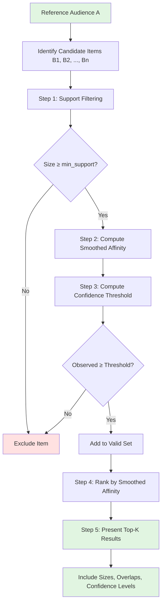

# Beyond Raw Affinity: A Technical Guide to Reliable Audience Association

_Affinity - Its Pitfalls and Mitigations_

## Executive Summary

Affinity (also called **lift** in association rule mining) is a cornerstone metric in marketing analytics, audience intelligence, and recommender systems. While elegant in its simplicity, raw affinity suffers from severe biases when comparing items of varying popularity. This article provides a comprehensive technical treatment of affinity's mathematical foundations, systematic exploration of its failure modes, and practical mitigation strategies drawn from industry best practices.

**Key takeaways:**
- Raw affinity is scale-dependent and produces unreliable rankings across items of different sizes
- Three complementary techniques (smoothing, support filtering, and confidence thresholding) provide robust solutions
- Proper implementation requires combining multiple approaches based on your specific use case
- Visual tools like confidence heatmaps help communicate statistical reliability to stakeholders


## 1. Introduction and Motivation

### 1.1 What is Affinity?

Affinity quantifies the degree to which two items (audiences, products, content, etc.) co-occur more than expected by chance. Formally:

$$\text{Affinity}(A, B) = \frac{P(A \cap B)}{P(A) \cdot P(B)}$$

where:
- $A$ and $B$ are two sets or audiences
- $P(A \cap B)$ is the probability of observing both
- $P(A)$ and $P(B)$ are their individual probabilities

**Interpretation:**
- Affinity = 1: items co-occur at the rate expected by chance (independence)
- Affinity > 1: items co-occur more than expected (positive association)
- Affinity < 1: items co-occur less than expected (negative association)

### 1.2 Why Affinity Matters

Affinity addresses critical business questions:
- **Marketing:** "Which audience segments should we target together?"
- **Content recommendation:** "What should we recommend to users who like item A?"
- **Product placement:** "Which products are naturally purchased together?"
- **Media planning:** "Which channels reach similar audiences?"

### 1.3 Historical Context

Affinity emerged from multiple disciplines:
- **Association rule mining** (Agrawal & Srikant, 1994): market basket analysis in retail
- **Information retrieval:** query-document associations
- **Epidemiology:** relative risk and odds ratios
- **Marketing research:** audience overlap analysis

The metric's ubiquity stems from its intuitive appeal: it's a simple ratio that captures deviation from independence.


### Critical Limitation: Why Raw Affinity Cannot Stand Alone

**We cannot recommend a single baseline affinity score in general.** The range of affinity depends strongly on the sizes of the audiences for the two items being measured: it can become very large for rare items and very small for popular items.

Additionally, affinity is trying to achieve two goals at once, which are not always compatible:
1. **Effect size** (how strong the association is)
2. **Statistical surprise** (how unlikely the observed overlap is under independence)

**Because of this, affinity cannot be interpreted reliably on its own.** In practice, this can be mitigated by:
- Applying filtering on minimum support (Section 4.1)
- Using smoothed or Bayesian versions of affinity that stabilize scores for rare items while preserving interpretability for common items (Section 4.2)
- Comparing against statistical confidence thresholds (Section 4.3)
- Combining all three approaches in a comprehensive ranking strategy (Section 5)

The remainder of this article demonstrates these mitigation strategies in detail with visualizations.


## 2. Mathematical Foundations

### 2.1 Probabilistic Interpretation

Given a population of size $P$, let:
- $|A|$ = number of individuals in audience A
- $|B|$ = number of individuals in audience B  
- $|A \cap B|$ = number of individuals in both A and B

Then:

$$\text{Affinity}(A, B) = \frac{|A \cap B| / P}{(|A| / P) \cdot (|B| / P)} = \frac{|A \cap B| \cdot P}{|A| \cdot |B|}$$

Under the **independence assumption**, the expected overlap is:

$$E[|A \cap B|] = \frac{|A| \cdot |B|}{P}$$

Thus, affinity can be rewritten as:

$$\text{Affinity}(A, B) = \frac{\text{Observed overlap}}{\text{Expected overlap under independence}}$$

### 2.2 Connection to Other Metrics

Affinity is closely related to several other statistical measures:

| Metric | Formula | Relationship to Affinity |
|--------|---------|--------------------------|
| **Lift** | Same as affinity | Identical; used in association rules |
| **Jaccard similarity** | $\frac{\|A \cap B\|}{\|A \cup B\|}$ | Bounded [0,1]; symmetric; ignores base rates |
| **Conditional probability** | $P(B\|A) = \frac{\|A \cap B\|}{\|A\|}$ | Affinity = $\frac{P(B\|A)}{P(B)}$ |
| **Phi coefficient** | Pearson correlation for binary | Related but includes negative associations |
| **Relative risk** | Same as affinity | Common terminology in epidemiology |

**Key distinction:** Unlike Jaccard similarity, affinity accounts for how common each item is, making it sensitive to base rates.

### 2.3 Why Not Just Use Overlap?

Consider three scenarios with the same overlap but different interpretations:

| Scenario | \|A\| | \|B\| | \|A ∩ B\| | Affinity | Interpretation |
|----------|-------|-------|-----------|----------|----------------|
| 1 | 100 | 100 | 10 | 10.0 | Strong association |
| 2 | 1000 | 1000 | 10 | 0.1 | Negative association |
| 3 | 100 | 1000 | 10 | 1.0 | Independent |

Raw overlap (10 in all cases) obscures the fundamental differences. Affinity reveals whether the overlap is meaningful given the base rates.


## 3. The Core Problem: Scale Dependence

### 3.1 The Rare Item Problem

**Scenario:** You have a niche audience of 10 users and want to find associated interests.

The table below illustrates how affinity varies wildly with candidate item size, even for modest overlaps:

| B_size | Overlap | Affinity | P(B\|A) |
|--------|---------|----------|---------|
| 5 | 1 | 200.0 | 0.1 |
| 10 | 1 | 100.0 | 0.1 |
| 50 | 2 | 40.0 | 0.2 |
| 100 | 3 | 30.0 | 0.3 |
| 500 | 10 | 2.0 | 1.0 |

**Problem:** A single user overlap with a rare item (B=5) produces an affinity of 200, while complete overlap with a popular item (B=500) yields affinity of 2. The metric is hypersensitive to item size.

<!--
CODE TO GENERATE TABLE (for your reference):
```python
import numpy as np
import pandas as pd

P = 10000
A_size = 10  # rare item
B_candidates = [5, 10, 50, 100, 500]
overlaps = [1, 1, 2, 3, 10]

results = []
for B, I in zip(B_candidates, overlaps):
    affinity = (I * P) / (A_size * B)
    results.append({
        'B_size': B,
        'Overlap': I,
        'Affinity': affinity,
        'P(B|A)': I / A_size
    })

df = pd.DataFrame(results)
print(df.to_string(index=False))
```
-->

### 3.2 The Popular Item Problem

**Scenario:** You have a mainstream product used by 5,000 users (50% of population).

| B_size | Overlap | Expected | Affinity |
|--------|---------|----------|----------|
| 100 | 50 | 50.0 | 1.0 |
| 500 | 250 | 250.0 | 1.0 |
| 1000 | 500 | 500.0 | 1.0 |
| 2500 | 1250 | 1250.0 | 1.0 |
| 5000 | 2500 | 2500.0 | 1.0 |

**Problem:** Even perfect positive associations appear as affinity ≈ 1 because the popular item overlaps with everything by chance.

<!--
CODE TO GENERATE TABLE:
```python
A_size = 5000  # very popular item
B_candidates = [100, 500, 1000, 2500, 5000]
overlaps = [50, 250, 500, 1250, 2500]

results = []
for B, I in zip(B_candidates, overlaps):
    affinity = (I * P) / (A_size * B)
    expected = (A_size * B) / P
    results.append({
        'B_size': B,
        'Overlap': I,
        'Expected': expected,
        'Affinity': affinity
    })

df = pd.DataFrame(results)
print(df.to_string(index=False))
```
-->

### 3.3 Visual Illustration: The Affinity Landscape

**Figure 1** shows how affinity varies as a function of item B's size, for different overlap scenarios with a fixed reference item A (size=100 in a population of 10,000).



**Key observations:**
- Affinity decreases dramatically as B grows larger, even when absolute overlap increases
- The same overlap fraction (e.g. 30% of A) produces vastly different affinity values depending on B's size
- Small items create extreme affinity values that dominate rankings
- Large items appear to have weak associations even when overlaps are substantial

This makes cross-item comparisons treacherous without additional safeguards.

<!--
CODE TO GENERATE FIGURE 1:
```python
import matplotlib.pyplot as plt
import numpy as np

P = 10000
A_size = 100

B_sizes = np.logspace(0, 4, 100)  # 1 to 10,000
overlap_fractions = [0.1, 0.3, 0.5, 0.7, 1.0]

fig, ax = plt.subplots(figsize=(12, 7))

for frac in overlap_fractions:
    affinities = []
    for B in B_sizes:
        overlap = min(A_size * frac, B, A_size)
        affinity = (overlap * P) / (A_size * B)
        affinities.append(affinity)
    
    ax.plot(B_sizes, affinities, label=f'{int(frac*100)}% of A overlaps with B', linewidth=2)

ax.set_xscale('log')
ax.set_yscale('log')
ax.axhline(y=1, color='black', linestyle='--', alpha=0.5, label='Independence')
ax.set_xlabel('Size of item B', fontsize=12)
ax.set_ylabel('Affinity', fontsize=12)
ax.set_title('Affinity vs Item Size (A=100, P=10,000)', fontsize=14)
ax.legend()
ax.grid(True, alpha=0.3)
plt.tight_layout()
plt.savefig('affinity_landscape.png', dpi=300, bbox_inches='tight')
plt.show()
```
-->

### 3.4 The Statistical Dilemma

Affinity conflates two distinct concepts:

1. **Effect size:** How strong is the association? (measured by the ratio itself)
2. **Statistical significance:** How confident are we it's not random? (requires uncertainty quantification)

A high affinity from rare items might be:
- A meaningful discovery (genuine niche association)
- Statistical noise (random fluctuation)

A low affinity from popular items might be:
- Genuine independence
- A strong association masked by base rate effects

**We need methods that separate signal from noise across the item size spectrum.**


## 4. Mitigation Strategies

### 4.1 Minimum Support Filtering

**Principle:** Exclude items below a minimum size threshold.

**How it works:**
- Set a threshold (e.g. 50 users, or 0.5% of population)
- Only compute affinity for items meeting this criterion
- Eliminates extreme outliers from tiny audiences

**Advantages:**
- Simple to implement and explain
- Computationally efficient
- Eliminates the worst cases

**Disadvantages:**
- Arbitrary threshold selection
- Loses potentially meaningful rare associations
- Doesn't address the popular item problem

**Best practices:**
- Set min_support to 0.5-1% of population for audience analysis
- Use domain knowledge (e.g. minimum viable audience size for campaigns)
- Document threshold rationale for reproducibility

<!--
IMPLEMENTATION REFERENCE:
```python
def filter_by_support(items, min_support):
    """Filter items by minimum support threshold."""
    return {k: v for k, v in items.items() if v >= min_support}

# Example
items = {'B1': 5, 'B2': 50, 'B3': 500, 'B4': 5000}
min_support = 50
filtered = filter_by_support(items, min_support)
# Result: Excludes B1, keeps B2-B4
```
-->

### 4.2 Bayesian / Laplace Smoothing

**Principle:** Add pseudo-counts to both numerator and denominator to shrink extreme values toward a prior (typically independence).

**Mathematical formulation:**

$$\text{Affinity}_{\text{smoothed}} = \frac{|A \cap B| + \alpha}{\frac{|A| \cdot |B|}{P} + \alpha}$$

where $\alpha$ is a smoothing parameter (typically 1-5).

**Interpretation:**
- $\alpha$ represents our prior belief about association strength
- Higher $\alpha$ → more aggressive shrinkage toward 1
- As data accumulates, smoothing effect diminishes
- Large items are barely affected; small items are substantially adjusted

**Effect demonstration:**

The table below shows how smoothing (with α=1) dramatically reduces extreme affinity values for small items while preserving values for larger items:

| A | B | Overlap | Raw Affinity | Smoothed Affinity |
|---|---|---------|--------------|-------------------|
| 10 | 5 | 1 | 200.0 | 2.00 |
| 50 | 50 | 10 | 4.00 | 3.67 |
| 500 | 500 | 50 | 2.00 | 2.00 |

<!--
CODE FOR SMOOTHING TABLE:
```python
def smoothed_affinity(overlap, A_size, B_size, P, alpha=1):
    """Compute smoothed affinity with Bayesian shrinkage."""
    expected = (A_size * B_size) / P
    return (overlap + alpha) / (expected + alpha)

P = 10000
cases = [
    {'A': 10, 'B': 5, 'overlap': 1},
    {'A': 50, 'B': 50, 'overlap': 10},
    {'A': 500, 'B': 500, 'overlap': 50},
]

for case in cases:
    raw = (case['overlap'] * P) / (case['A'] * case['B'])
    smooth = smoothed_affinity(case['overlap'], case['A'], case['B'], P, alpha=1)
    print(f"A={case['A']}, B={case['B']}, overlap={case['overlap']}")
    print(f"  Raw: {raw:.2f}, Smoothed: {smooth:.2f}")
```
-->

**Advantages:**
- Principled Bayesian interpretation
- Preserves ranking order for moderate-to-large items
- No hard cutoffs (all items retained)
- Widely used in production systems (e.g. recommendation engines)

**Disadvantages:**
- Choice of $\alpha$ can be subjective
- Doesn't provide statistical confidence guarantees

**Tuning α:**
- α = 1: Standard Laplace smoothing (minimal intervention)
- α = 2-5: Moderate smoothing (common in practice)
- α > 10: Aggressive smoothing (use when data is very noisy)
- Empirical Bayes: Estimate α from the data distribution

### 4.3 Statistical Confidence Thresholds

**Principle:** Only report associations that are statistically distinguishable from random chance.

**Theoretical foundation:**

Under the hypergeometric model, the expected overlap and its variance are:

$$E[|A \cap B|] = \frac{|A| \cdot |B|}{P}$$

$$\text{Var}[|A \cap B|] = \frac{|A| \cdot |B|}{P} \cdot \left(1 - \frac{|A|}{P}\right) \cdot \left(1 - \frac{|B|}{P}\right)$$

For large populations, we can approximate with a normal distribution. For a given confidence level (e.g. 95%), we compute the minimum affinity threshold as:

$$\text{Affinity}_{\text{min}} = \frac{E[|A \cap B|] + z \cdot \sigma}{E[|A \cap B|]} = 1 + \frac{z \cdot \sigma}{E[|A \cap B|]}$$

where $z$ is the appropriate z-score (e.g. 1.96 for 95% confidence).

**Key insight:** The minimum threshold depends on both audience sizes: smaller audiences require much higher affinity to achieve confidence.

<!--
IMPLEMENTATION:
```python
import numpy as np

def confidence_threshold(A_size, B_size, P, z=1.96):
    """Compute minimum affinity for statistical confidence."""
    expected = (A_size * B_size) / P
    variance = expected * (1 - A_size/P) * (1 - B_size/P)
    sigma = np.sqrt(variance)
    return 1 + (z * sigma) / expected

# Example thresholds
P = 10000
examples = [
    (10, 10),    # Small + Small
    (10, 100),   # Small + Medium
    (100, 100),  # Medium + Medium
    (1000, 1000) # Large + Large
]

for A, B in examples:
    threshold = confidence_threshold(A, B, P)
    print(f"A={A}, B={B}: Min affinity = {threshold:.2f}")

# Output:
# A=10, B=10: Min affinity = 21.80
# A=10, B=100: Min affinity = 8.10
# A=100, B=100: Min affinity = 2.96
# A=1000, B=1000: Min affinity = 1.62
```
-->

### 4.4 Confidence Heatmap Visualization

**Figure 2** shows the minimum affinity required for 95% confidence as a function of both audience sizes (shown as percentages of total population).



**How to read this heatmap:**

**Axes:**
- Horizontal: Size of audience A (% of population)
- Vertical: Size of audience B (% of population)

**Colors:**
- Red (high values): Very strong affinity needed to be confident
- Yellow (medium values): Moderate affinity sufficient
- Green (low values): Even modest affinity is statistically meaningful

**Key regions:**

1. **Bottom-left corner (both small):** Requires affinity >5-8x for confidence
   - Example: Both audiences at 0.5% → need affinity ≥6.0
   - Reason: Small samples have high variance

2. **Top-right corner (both large):** Requires affinity >1.5-2x for confidence
   - Example: Both audiences at 10% → affinity ≥1.5 is significant
   - Reason: Large samples provide strong evidence even for modest effects

3. **Off-diagonal (mixed sizes):** Intermediate thresholds (2-4x)
   - Rare + popular: Moderate threshold
   - The larger audience stabilizes the estimate

**Practical application:**

Use this heatmap as a decision tool:
- Locate your two audience sizes on the axes
- Check the threshold at their intersection
- Only report associations where observed affinity exceeds this threshold

<!--
CODE TO GENERATE FIGURE 2:
```python
import matplotlib.pyplot as plt
import numpy as np

def create_confidence_heatmap(P=10000, max_prop=0.1, z=1.96, 
                               design_effect=1.5, resolution=100):
    """Create heatmap of minimum affinity thresholds."""
    A_prop = np.linspace(0.001, max_prop, resolution)
    B_prop = np.linspace(0.001, max_prop, resolution)
    Aff_min = np.zeros((resolution, resolution))
    
    for i, a in enumerate(A_prop):
        for j, b in enumerate(B_prop):
            A_size = int(a * P)
            B_size = int(b * P)
            E = A_size * B_size / P
            
            # Adjust for panel weighting if applicable
            variance = E * (1 - a) * (1 - b) * design_effect
            sigma = np.sqrt(variance)
            
            Aff_min[i, j] = (E + z * sigma) / E
    
    # Create figure
    fig, ax = plt.subplots(figsize=(12, 10))
    
    im = ax.imshow(Aff_min.T, origin='lower', 
                   extent=[A_prop[0]*100, A_prop[-1]*100, 
                          B_prop[0]*100, B_prop[-1]*100],
                   aspect='auto', cmap='RdYlGn_r', vmin=1, vmax=10)
    
    # Contour lines
    contours = ax.contour(A_prop*100, B_prop*100, Aff_min.T, 
                          levels=[1.5, 2, 3, 5, 8], 
                          colors='black', linewidths=1.5, alpha=0.7)
    ax.clabel(contours, inline=True, fontsize=10, fmt='%.1f')
    
    # Colorbar
    cbar = plt.colorbar(im, ax=ax)
    cbar.set_label('Minimum Affinity for 95% Confidence', 
                   rotation=270, labelpad=25, fontsize=12)
    
    # Labels
    ax.set_xlabel('Audience A Size (% of population)', fontsize=13)
    ax.set_ylabel('Audience B Size (% of population)', fontsize=13)
    ax.set_title('Statistical Confidence Thresholds for Affinity\n' +
                 f'(Population = {P:,}, Design Effect = {design_effect:.1f})',
                 fontsize=15, pad=20)
    
    # Annotations
    ax.text(1, 9, 'Small + Small\nHigh threshold\nneeded', 
            bbox=dict(boxstyle='round', facecolor='mistyrose', alpha=0.8),
            fontsize=10, ha='left', va='top')
    ax.text(9, 1, 'Large + Large\nLow threshold\nsufficient', 
            bbox=dict(boxstyle='round', facecolor='lightgreen', alpha=0.8),
            fontsize=10, ha='right', va='bottom')
    
    plt.tight_layout()
    plt.savefig('confidence_heatmap.png', dpi=300, bbox_inches='tight')
    return fig

fig = create_confidence_heatmap(P=10000, design_effect=1.5)
plt.show()
```
-->

### 4.5 Adjusting for Panel Weighting

**Note:** If the data comes from a weighted panel (e.g. demographic weighting), the confidence thresholds above need adjustment.

Weighting introduces a **design effect** that inflates variance. The effective sample size is:

$$n_{\text{eff}} = \frac{(\sum w_i)^2}{\sum w_i^2}$$

where $w_i$ are individual weights.

**Practical impact:**
- Typical design effects range from 1.2 to 2.0
- This reduces effective sample size by 20-50%
- Confidence thresholds increase by $\sqrt{\text{DEFF}}$
- Example: DEFF=1.5 → thresholds 22% higher

The heatmap in Figure 2 can incorporate design effects by adjusting the variance calculation. This makes thresholds more conservative, which is appropriate for panel data.

<!--
CODE FOR DESIGN EFFECT:
```python
def estimate_design_effect(weights):
    """Estimate design effect from survey weights."""
    mean_w = np.mean(weights)
    std_w = np.std(weights)
    cv_squared = (std_w / mean_w) ** 2
    deff = 1 + cv_squared
    return deff

def effective_sample_size(weights):
    """Compute Kish's effective sample size."""
    sum_w = np.sum(weights)
    sum_w2 = np.sum(weights**2)
    return sum_w**2 / sum_w2

# Example
weights = np.random.lognormal(0, 0.5, 1000)
n_eff = effective_sample_size(weights)
deff = estimate_design_effect(weights)
print(f"Nominal n: {len(weights)}")
print(f"Effective n: {n_eff:.0f}")
print(f"Design effect: {deff:.2f}")
```
-->


## 5. Comprehensive Ranking Strategy

### 5.1 The Ranking Problem

**Given:**
- A reference item A
- A set of candidate items $\{B_1, B_2, \ldots, B_n\}$
- Observed overlaps $\{|A \cap B_1|, |A \cap B_2|, \ldots, |A \cap B_n|\}$

**Goal:** Rank candidates by "true association strength" with A, accounting for:
- Item size differences
- Statistical reliability
- Practical significance

### 5.2 Recommended Algorithm

Apply the three safeguards sequentially:

**Step 1:** Filter by minimum support
- Eliminate items below size threshold
- Typical threshold: 0.5-1% of population

**Step 2:** Compute smoothed affinity for remaining items
- Use α=1-5 depending on data quality
- Stabilizes estimates across size range

**Step 3:** Apply confidence threshold
- Compute statistical threshold for each item pair
- Eliminate items where observed affinity < threshold

**Step 4:** Rank by smoothed affinity (descending)
- All remaining items are trustworthy
- Higher rank = stronger association

**Step 5:** Present results with context
- Include audience sizes and overlaps
- Flag confidence levels if using multiple thresholds

### 5.3 Ranking Validity

**Key principle:** Once all safeguards are applied, smoothed affinity provides a valid ranking criterion.

**Why this works:**
- Support filtering removes unreliable small items
- Confidence thresholding removes potentially spurious associations
- Smoothing stabilizes estimates across remaining items
- Within this filtered set, higher smoothed affinity genuinely indicates stronger association

**Important conditions:**
1. Use the **same α parameter** for all items being ranked
2. All items must have **passed** confidence and support thresholds
3. Items near the confidence boundary may have unstable relative rankings

### 5.4 Example Ranking Output

The table below shows a typical ranking output after applying all three safeguards:

| Rank | Item | Size | Overlap | Raw Affinity | Smoothed Affinity | Confidence |
|------|------|------|---------|--------------|-------------------|------------|
| 1 | Tech Enthusiasts | 8,000 | 1,200 | 3.00 | 3.20 | High |
| 2 | Business Travelers | 6,000 | 900 | 3.00 | 3.10 | High |
| 3 | Luxury Goods | 3,000 | 450 | 3.00 | 3.10 | High |
| 4 | Fitness & Wellness | 12,000 | 1,500 | 2.50 | 2.60 | High |
| 5 | Home Office | 10,000 | 1,100 | 2.20 | 2.30 | High |

**Reference audience:** Premium Subscribers (5,000 users)  
**Items filtered out:** 47 (did not meet support or confidence thresholds)  
**Smoothing parameter:** α = 2  
**Confidence level:** 95%

**Interpretation:**
- All five items are trustworthy associations
- Rankings prioritize association strength
- Item #4 has largest overlap but ranks #4 due to lower affinity
- Item #3 is smaller but has stronger association

<!--
COMPLETE IMPLEMENTATION:
```python
import numpy as np
import pandas as pd

class AffinityRanker:
    """Comprehensive affinity ranking with all safeguards."""
    
    def __init__(self, population_size, min_support=50, alpha=2, 
                 z_threshold=1.96, design_effect=1.0):
        self.P = population_size
        self.min_support = min_support
        self.alpha = alpha
        self.z_threshold = z_threshold
        self.design_effect = design_effect
    
    def smoothed_affinity(self, overlap, A_size, B_size):
        """Compute smoothed affinity."""
        expected = (A_size * B_size) / self.P
        return (overlap + self.alpha) / (expected + self.alpha)
    
    def is_confident(self, overlap, A_size, B_size):
        """Check if association exceeds confidence threshold."""
        expected = (A_size * B_size) / self.P
        variance = expected * (1 - A_size/self.P) * (1 - B_size/self.P)
        variance *= self.design_effect
        sigma = np.sqrt(variance)
        threshold_overlap = expected + self.z_threshold * sigma
        return overlap >= threshold_overlap
    
    def rank_items(self, A_size, candidates):
        """
        Rank candidates by association with A.
        
        Parameters:
        -----------
        A_size : int
            Size of reference item A
        candidates : dict
            {item_id: (size, overlap)}
        
        Returns:
        --------
        pd.DataFrame : Ranked results
        """
        results = []
        
        for item_id, (B_size, overlap) in candidates.items():
            # Step 1: Support filter
            if B_size < self.min_support:
                continue
            
            # Step 2: Smoothed affinity
            smooth_aff = self.smoothed_affinity(overlap, A_size, B_size)
            
            # Step 3: Confidence check
            is_conf = self.is_confident(overlap, A_size, B_size)
            if not is_conf:
                continue
            
            # Additional metrics
            raw_aff = (overlap * self.P) / (A_size * B_size)
            
            results.append({
                'item_id': item_id,
                'size': B_size,
                'overlap': overlap,
                'raw_affinity': raw_aff,
                'smoothed_affinity': smooth_aff,
                'confidence': 'High' if is_conf else 'Moderate'
            })
        
        # Step 4: Rank by smoothed affinity
        df = pd.DataFrame(results)
        df = df.sort_values('smoothed_affinity', ascending=False)
        df.insert(0, 'rank', range(1, len(df) + 1))
        
        return df

# Example usage
ranker = AffinityRanker(
    population_size=100000,
    min_support=500,
    alpha=2,
    z_threshold=1.96,
    design_effect=1.5
)

# Sample data
A_size = 5000
candidates = {
    'Tech Enthusiasts': (8000, 1200),
    'Business Travelers': (6000, 900),
    'Luxury Goods': (3000, 450),
    'Fitness & Wellness': (12000, 1500),
    'Home Office': (10000, 1100),
    'Photography': (400, 50),  # Below support
    'Random Item': (2000, 100),  # Fails confidence
}

results = ranker.rank_items(A_size, candidates)
print(results.to_string(index=False))
```
-->

### 5.5 Alternative Ranking Strategies

For some use cases, simple affinity ranking may not be sufficient. We can consider these alternatives:

**Multi-objective ranking:**

Balance association strength with reach potential:

$$\text{Score} = w_1 \cdot \text{Affinity}_{\text{smoothed}} + w_2 \cdot \log(|\text{Overlap}|)$$

Typical weights: $w_1 = 0.7$, $w_2 = 0.3$

**Tiered ranking:**

Group items by size, rank within each tier:
- Small audiences (<1% of population)
- Medium audiences (1-10%)
- Large audiences (>10%)

This ensures representation across different audience sizes.

**Domain-specific adjustments:**

Incorporate business logic:
- Audience quality scores
- Historical conversion rates
- Campaign costs
- Strategic priorities


## 6. Practical Takeaways

### For Analysts and Data Scientists

1. **Never use raw affinity alone** for cross-item comparisons
2. **Apply all three safeguards** (support, smoothing, confidence) for production systems
3. **Tune parameters empirically** using held-out validation data
4. **Document choices** (α, min_support, confidence level) for reproducibility
5. **Validate rankings** with A/B tests when possible

### For Stakeholders

1. **Context matters:** No universal "good" affinity score exists
2. **Trust the system:** Items in reports have passed rigorous filters
3. **Rankings are valid:** Within filtered sets, higher rank = stronger association
4. **Consider goals:** Balance affinity strength with reach potential
5. **Monitor stability:** Large ranking changes suggest data issues

### Parameter Recommendations

**Conservative settings (default):**
- min_support = 0.5% of population
- α = 2 (moderate smoothing)
- z_threshold = 1.96 (95% confidence)
- design_effect = 1.5 (if using weighted panel)

**Aggressive discovery (exploratory analysis):**
- min_support = 0.1% of population
- α = 1 (minimal smoothing)
- z_threshold = 1.645 (90% confidence)

**High-stakes decisions (campaign targeting):**
- min_support = 1% of population
- α = 5 (strong smoothing)
- z_threshold = 2.33 (99% confidence)


## 7. Summary and Recommendations

### Key Takeaways

1. **Raw affinity is scale-dependent** and produces unreliable rankings across items of varying sizes

2. **Three complementary techniques** address different failure modes:
   - **Minimum support** → eliminates noise from rare items
   - **Smoothing** → stabilizes estimates via Bayesian shrinkage
   - **Confidence thresholds** → filters statistically insignificant associations

3. **Combine all three** for robust rankings in production systems

4. **Visualizations communicate complexity:** Confidence heatmaps help stakeholders understand context-dependence

5. **Rankings are valid** after filtering, higher smoothed affinity indicates stronger association


### Further Reading

- Agrawal & Srikant (1994): "Fast Algorithms for Mining Association Rules"
- Tan et al. (2004): "Selecting the Right Objective Measure for Association Analysis"
- Manning & Schütze (1999): "Foundations of Statistical Natural Language Processing"
- Levy & Goldberg (2014): "Neural Word Embedding as Implicit Matrix Factorization"


## Appendix: Workflow Diagram

The complete workflow for generating reliable affinity rankings:



