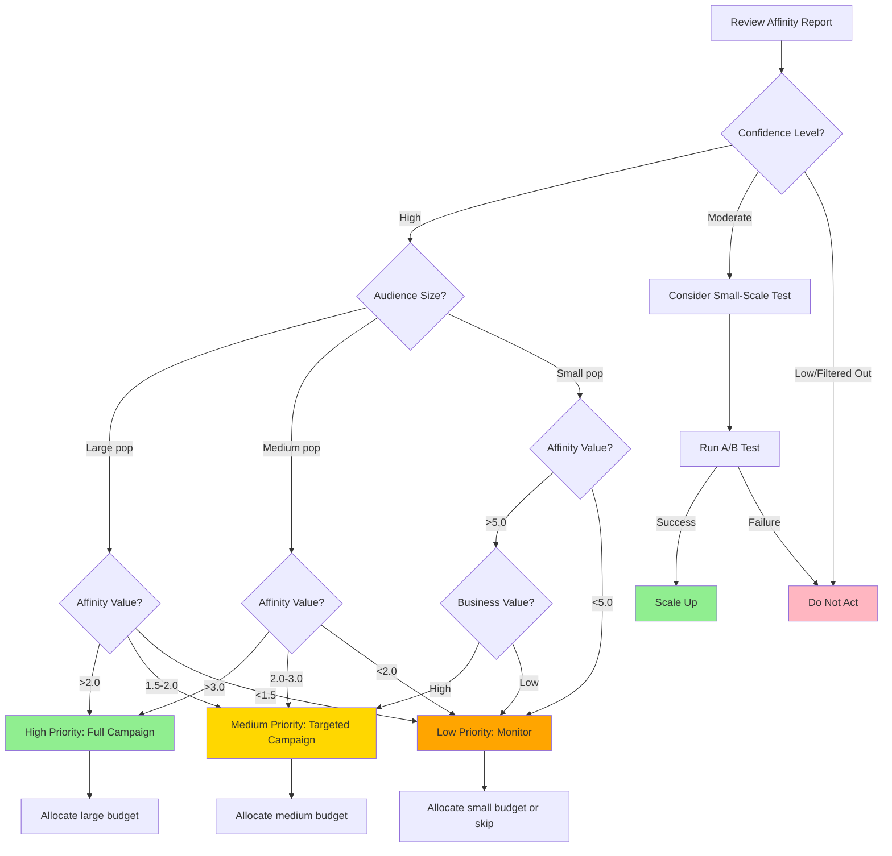

# Interpreting Affinity Scores: A Guide for Decision-Makers

## What You'll Learn

This guide explains how we measure which audiences or items naturally go together, and why the numbers you see are reliable. If you're making decisions based on audience overlap data, this guide will help you interpret the results correctly and avoid common misunderstandings.

**Who this is for:** Marketing managers, product managers, analysts, and executives who need to understand and act on affinity metrics without getting into the mathematical details.

**What you'll get:**
- Clear understanding of what affinity measures and why it matters
- Knowledge of why raw numbers can be misleading
- Confidence in interpreting affinity reports and rankings
- Visual tools to assess which associations are trustworthy


## 1. What is Affinity?

### The Basic Idea

Affinity answers the question: **"How much more likely are two things to appear together than we'd expect by chance?"**

Think of it this way:
- If 10% of your customers like Product A
- And 10% like Product B
- You'd expect about 1% (10% × 10%) to like both by pure coincidence

If you actually observe 3% liking both, the affinity is **3.0** (three times what you'd expect).

### Real-World Examples

**Marketing context:**
- "Customers who shop for outdoor gear are 4.5x more likely to subscribe to our travel newsletter" → Affinity = 4.5
- "People who watch action movies are 1.2x more likely to watch comedies" → Affinity = 1.2 (weak association)
- "Users of our mobile app are 8x more likely to be premium subscribers" → Affinity = 8.0 (strong association)

**Interpretation:**
- **Affinity = 1:** No special relationship (what you'd expect by chance)
- **Affinity > 1:** Positive association (they go together more than expected)
- **Affinity < 1:** Negative association (they rarely appear together)
- **Affinity >> 1:** Strong positive association (reliable pattern)

### Why This Matters for Decision-Making

Affinity helps you:
- **Target the right audiences** for campaigns
- **Recommend relevant products** to customers
- **Allocate marketing budget** to high-impact channels
- **Discover hidden patterns** in customer behavior
- **Avoid wasted effort** on unrelated audiences

### **The Core Challenge**

**There is no universal "good" affinity score.** What counts as high or low depends entirely on the audience sizes you're comparing.

Here's why affinity is tricky:
- **Rare audiences** can produce affinity scores of 50, 100, or even higher. But these might just be random noise
- **Popular audiences** typically show affinity scores near 1.0. But this doesn't mean they're unrelated

Affinity is also trying to answer two different questions simultaneously:
1. **"How strong is this relationship?"** (effect size)
2. **"How confident are we it's not random?"** (statistical significance)

**The bottom line:** You can't interpret a single affinity number in isolation. You need context about audience sizes and statistical confidence. This can be done through through filtering, smoothing, and confidence thresholds.

The rest of this guide explains how we make affinity reliable and how you should interpret the results.


## 2. The Problem: Why Raw Numbers Can Mislead You

### The Small Audience Trap

**Scenario:** You're looking at which other interests your customers have. You see:

| Interest | Audience Size | Overlap with Your Customers | Raw Affinity |
|----------|---------------|----------------------------|--------------|
| Luxury Watches | 50 people | 5 people | **200.0** |
| Outdoor Activities | 5,000 people | 500 people | **2.0** |

**Question:** Should you target luxury watch enthusiasts because the affinity is 200x?

**Answer:** Probably not! Here's why:

The luxury watch group is so small that even a few random overlaps create huge affinity numbers. With only 50 people, just 5 overlapping customers produce an affinity of 200. But this could easily be coincidence.

The outdoor activities group has genuine evidence: 500 customers show consistent interest. Even though the affinity (2.0) seems lower, it's based on real patterns, not noise.

**The lesson:** High affinity from tiny audiences is often statistical noise, not actionable insight.

### The Popular Item Trap

**Scenario:** You're analyzing which products go together:

| Product | Popularity | Customers Who Also Bought Your Product | Raw Affinity |
|---------|------------|----------------------------------------|--------------|
| Best-Seller Widget | 50% of all customers | 5,000 customers | **1.1** |
| Niche Accessory | 2% of all customers | 200 customers | **1.1** |

**Question:** Are these equally important associations?

**Answer:** No! The best-seller overlaps with everything because it's so popular. 50% of customers buy it anyway. The niche accessory, despite the same affinity, represents a more meaningful discovery: customers who buy your product are choosing this specific accessory at much higher rates than the general population.

**The lesson:** Low affinity doesn't always mean weak association; context matters.

### The Core Challenge

Raw affinity numbers are **scale-dependent**: they react differently to audience sizes. This makes it nearly impossible to compare a niche interest (50 people) with a mainstream one (50,000 people) on equal footing.

**What you need:** A system that accounts for these size differences automatically, so you can trust the rankings you see.


## 3. How We Make Affinity Reliable

We use three complementary safeguards to ensure the affinity scores you see are trustworthy:

### Safeguard 1: Minimum Audience Size

**What it does:** We only calculate affinity for audiences above a minimum size threshold.

**Why it matters:** Eliminates noise from extremely small groups where a single person can skew results.

**Example threshold:** For a population of 100,000, we might require at least 500 people (0.5%) before considering an audience.

**What this means for you:** You won't see misleading "super high" affinity scores from audiences of 5-10 people.

### Safeguard 2: Statistical Smoothing

**What it does:** Applies a mathematical correction that stabilizes scores, especially for smaller audiences.

**Why it matters:** Prevents wild swings in affinity from small sample sizes while preserving meaningful patterns in larger groups.

**How it works:** Think of it like adding a "reality check" to extreme values. An audience of 50 with 5 overlaps might show raw affinity of 200, but smoothing adjusts it to something more reasonable like 15-20.

**What this means for you:** Rankings are more stable and comparable across different audience sizes.

### Safeguard 3: Confidence Thresholds

**What it does:** Only reports associations that are statistically unlikely to be random chance.

**Why it matters:** Filters out associations that could easily occur by luck, even with modest affinity scores.

**How we determine it:** We calculate how much overlap would be "unusual" given the audience sizes. Only associations exceeding this threshold are flagged as confident.

**What this means for you:** Every association you see has passed a statistical reliability test.


## 4. Visual Guide: When to Trust Affinity

### The Confidence Heatmap

This heatmap shows the **minimum affinity needed** for us to be confident (95% certain) that an association isn't random, based on the sizes of both audiences.

<!-- 
```python
import numpy as np
import matplotlib.pyplot as plt

# Parameters
P = 100000  # Total population (e.g. 100k customers)
max_prop = 0.10  # Show up to 10% of population
z_threshold = 1.96  # 95% confidence

# Create grid
A_prop = np.linspace(0.001, max_prop, 100)
B_prop = np.linspace(0.001, max_prop, 100)
Aff_min = np.zeros((100, 100))

for i, a in enumerate(A_prop):
    for j, b in enumerate(B_prop):
        A_size = int(a * P)
        B_size = int(b * P)
        E = A_size * B_size / P
        sigma = np.sqrt(E * (1 - a) * (1 - b))
        Aff_min[i, j] = (E + z_threshold * sigma) / E

# Create visualization
fig, ax = plt.subplots(figsize=(12, 10))

im = ax.imshow(Aff_min.T, origin='lower', 
               extent=[A_prop[0]*100, A_prop[-1]*100, 
                      B_prop[0]*100, B_prop[-1]*100],
               aspect='auto', cmap='RdYlGn_r', vmin=1, vmax=8)

# Add contour lines for key thresholds
contours = ax.contour(A_prop*100, B_prop*100, Aff_min.T, 
                      levels=[1.5, 2, 3, 5], 
                      colors='black', linewidths=1.5, alpha=0.7)
ax.clabel(contours, inline=True, fontsize=10, fmt='%.1f')

# Colorbar
cbar = plt.colorbar(im, ax=ax)
cbar.set_label('Minimum Affinity Needed\nfor 95% Confidence', 
               rotation=270, labelpad=25, fontsize=12)

# Labels
ax.set_xlabel('Audience A Size (% of total population)', fontsize=13)
ax.set_ylabel('Audience B Size (% of total population)', fontsize=13)
ax.set_title('Confidence Threshold Heatmap\n' + 
             'Higher values = need stronger affinity to be confident',
             fontsize=15, pad=20)

# Add annotations for key regions
ax.text(1, 9, 'Small + Small\nHigh threshold\nneeded', 
        bbox=dict(boxstyle='round', facecolor='mistyrose', alpha=0.8),
        fontsize=10, ha='left', va='top')
ax.text(9, 1, 'Large + Large\nLow threshold\nsufficient', 
        bbox=dict(boxstyle='round', facecolor='lightgreen', alpha=0.8),
        fontsize=10, ha='right', va='bottom')

plt.tight_layout()
plt.savefig('stakeholder_confidence_heatmap.png', dpi=300, bbox_inches='tight')
plt.show()
``` -->

<!-- 
```python
import numpy as np
import matplotlib.pyplot as plt

# Parameters
P = 100000  # Total population (e.g. 100k customers)
max_prop = 0.001  # Show up to 0.1% of population (niche items)
z_threshold = 1.96  # 95% confidence

# Create grid
A_prop = np.linspace(0.00001, max_prop, 100)
B_prop = np.linspace(0.00001, max_prop, 100)
Aff_min = np.zeros((100, 100))

for i, a in enumerate(A_prop):
    for j, b in enumerate(B_prop):
        A_size = int(a * P)
        B_size = int(b * P)
        E = A_size * B_size / P
        sigma = np.sqrt(E * (1 - a) * (1 - b))
        Aff_min[i, j] = (E + z_threshold * sigma) / E

# Create visualization
fig, ax = plt.subplots(figsize=(12, 10))
im = ax.imshow(Aff_min.T, origin='lower', 
               extent=[A_prop[0]*100, A_prop[-1]*100, 
                      B_prop[0]*100, B_prop[-1]*100],
               aspect='auto', cmap='RdYlGn_r', vmin=1, vmax=15)

# Add contour lines for key thresholds (adjusted for niche scale)
contours = ax.contour(A_prop*100, B_prop*100, Aff_min.T, 
                      levels=[2, 5, 10, 15], 
                      colors='black', linewidths=1.5, alpha=0.7)
ax.clabel(contours, inline=True, fontsize=10, fmt='%.0f')

# Colorbar
cbar = plt.colorbar(im, ax=ax)
cbar.set_label('Minimum Affinity Needed\nfor 95% Confidence', 
               rotation=270, labelpad=25, fontsize=12)

# Labels (adjusted for niche scale)
ax.set_xlabel('Audience A Size (% of total population)', fontsize=13)
ax.set_ylabel('Audience B Size (% of total population)', fontsize=13)
ax.set_title('Confidence Threshold Heatmap for Niche Items\n' + 
             'Higher values = need stronger affinity to be confident',
             fontsize=15, pad=20)

# Add annotations for key regions (adjusted positions for 0.1% scale)
ax.text(0.002, 0.095, 'Ultra-niche + Niche\nVery high threshold\nneeded', 
        bbox=dict(boxstyle='round', facecolor='mistyrose', alpha=0.8),
        fontsize=10, ha='left', va='top')
ax.text(0.095, 0.002, 'Niche + Niche\n(larger sizes)\nLower threshold', 
        bbox=dict(boxstyle='round', facecolor='lightgreen', alpha=0.8),
        fontsize=10, ha='right', va='bottom')

plt.tight_layout()
plt.savefig('stakeholder_confidence_heatmap_niche.png', dpi=300, bbox_inches='tight')
plt.show()
``` -->







**Note on Panel Data:** These thresholds are based on standard sampling assumptions. With weighted panel data, the **actual thresholds are somewhat higher** than presented here (typically 20-40% higher depending on weight variability).

<!-- 
```python
import numpy as np
import matplotlib.pyplot as plt

def create_confidence_heatmap_weighted(P=10000, max_prop=0.1, z=1.96, 
                                       design_effect=1.5, resolution=100):
    """
    Create confidence heatmap accounting for survey weights.
    
    Parameters:
    -----------
    P : int
        Population size (weighted estimate)
    max_prop : float
        Maximum proportion to display
    z : float
        Z-score for confidence level
    design_effect : float
        Ratio of variance with weights to variance without weights
        Typical values: 1.2-2.0 (higher = more variable weights)
        Equivalent to: n_nominal / n_effective
    resolution : int
        Grid resolution
    """
    A_prop = np.linspace(0.001, max_prop, resolution)
    B_prop = np.linspace(0.001, max_prop, resolution)
    Aff_min = np.zeros((resolution, resolution))
    
    for i, a in enumerate(A_prop):
        for j, b in enumerate(B_prop):
            A_size = int(a * P)
            B_size = int(b * P)
            E = A_size * B_size / P
            
            # ADJUSTED: Inflate variance by design effect
            variance = E * (1 - a) * (1 - b) * design_effect
            sigma = np.sqrt(variance)
            
            Aff_min[i, j] = (E + z * sigma) / E
    
    # Create visualization
    fig, ax = plt.subplots(figsize=(12, 10))
    
    im = ax.imshow(Aff_min.T, origin='lower', 
                   extent=[A_prop[0]*100, A_prop[-1]*100, 
                          B_prop[0]*100, B_prop[-1]*100],
                   aspect='auto', cmap='RdYlGn_r', vmin=1, vmax=10)
    
    # Contours
    contours = ax.contour(A_prop*100, B_prop*100, Aff_min.T, 
                          levels=[1.5, 2, 3, 5, 8], 
                          colors='black', linewidths=1.5, alpha=0.7)
    ax.clabel(contours, inline=True, fontsize=10, fmt='%.1f')
    
    # Colorbar
    cbar = plt.colorbar(im, ax=ax)
    cbar.set_label('Minimum Affinity Needed\nfor 95% Confidence', 
                   rotation=270, labelpad=25, fontsize=12)
    
    # Labels
    ax.set_xlabel('Audience A Size (% of total population)', fontsize=13)
    ax.set_ylabel('Audience B Size (% of total population)', fontsize=13)
    ax.set_title(f'Confidence Threshold Heatmap\n' + 
                 f'Adjusted for Panel Weights (Design Effect = {design_effect:.1f})',
                 fontsize=15, pad=20)
    
    # Add note about weighting
    note_text = f'Note: Thresholds account for sampling weights.\n'
    note_text += f'Design effect = {design_effect:.1f} '
    note_text += f'(effective sample ≈ {100/design_effect:.0f}% of nominal)'
    ax.text(0.02, 0.98, note_text, transform=ax.transAxes,
            fontsize=9, verticalalignment='top',
            bbox=dict(boxstyle='round', facecolor='yellow', alpha=0.3))
    
    plt.tight_layout()
    return fig

# Generate with typical design effect
fig = create_confidence_heatmap_weighted(P=10000, design_effect=1.5)
plt.savefig('confidence_heatmap_weighted.png', dpi=300, bbox_inches='tight')
plt.show()
```
-->

### How to Read This Heatmap

**The axes:**
- Horizontal: Size of Audience A (as % of total population)
- Vertical: Size of Audience B (as % of total population)

**The colors:**
- 🔴 **Red/Dark regions (high numbers):** Need very strong overlap to be confident
- 🟡 **Yellow regions (medium numbers):** Need moderate overlap
- 🟢 **Green regions (low numbers):** Even modest overlap is trustworthy

**Key insights:**

1. **Bottom-left corner (both audiences small):**
   - **Color:** Dark red
   - **Minimum affinity:** 5-8x
   - **Interpretation:** Small audiences require extremely strong overlap to rule out chance
   - **Example:** If both audiences are 0.5% of population, affinity must exceed ~6x

2. **Top-right corner (both audiences large):**
   - **Color:** Light green
   - **Minimum affinity:** 1.5-2x
   - **Interpretation:** Large audiences provide so much data that even modest overlap is significant
   - **Example:** If both audiences are 10% of population, affinity of 1.5x is already meaningful

3. **Mixed regions (one small, one large):**
   - **Color:** Yellow/orange
   - **Minimum affinity:** 2-4x
   - **Interpretation:** Moderate thresholds. The large audience stabilizes the estimate

### Practical Decision Rules

Use this heatmap as your "reality check":

**Before the heatmap:**
- "I see affinity of 10 between two small audiences. Should I act on this?"
- ❓ You're unsure if 10 is high enough.

**With the heatmap:**
- Locate the intersection of the two audience sizes
- Check the minimum threshold at that point
- If your observed affinity ≥ threshold → **Trustworthy**
- If your observed affinity < threshold → ⚠️ **Could be random**


## 5. Understanding Affinity

### How Rankings Should Work

**The ranking process:**

All items in your report have already passed our quality filters:

1. **Support filter:** Large enough audience to be reliable
2. **Confidence threshold:** Statistically unlikely to be random
3. **Smoothing applied:** Scores stabilized across different audience sizes

**Once these filters are applied, items are ranked by their smoothed affinity score** (highest to lowest).

This means:

- **Rank #1 = Strongest association** among all qualified items
- **All ranked items are trustworthy**—they've passed rigorous statistical tests
- **Higher rank = stronger relationship**, not necessarily larger overlap

### What Rankings Tell You (and What They Don't)

**Rankings prioritize "strength of association":**

| What Rank Tells You                       | What Rank Doesn't Tell You             |
| ----------------------------------------- | -------------------------------------- |
| How strongly associated the items are     | Which has the most absolute overlap    |
| Relative ordering of association strength | Which gives maximum reach potential    |
| Which passed the highest quality bar      | Which is "best" for your specific goal |

**Why this matters:** Example:

- **Item #4:** Rank 4, affinity 2.6x, size 12,000, overlap 1,500
- **Item #10:** Rank 10, affinity 1.9x, size 20,000, overlap 1,800

**Item #4 ranks higher** because the association is stronger (2.6x vs 1.9x), but **Item #10 has more reach** (20,000 people vs 12,000).
### Interpreting Ranks for Your Goals

**Scenario 1: You want the strongest associations (precision targeting)** → **Use the ranking as-is.** Focus on items #1-3.

**Scenario 2: You want maximum reach** → **Look at the "Size" and "Overlap" columns** instead. In the example above, Podcast Listeners (#10) actually has the largest overlap (1,800 people), even though it ranks #10.

**Scenario 3: You want a balanced approach** → **Consider both rank and size.** Items #4, #5, and #8 offer strong associations AND substantial reach.

**Scenario 4: You want niche, highly targeted audiences** → **Focus on high-ranking small/medium audiences.** Item #3 (Luxury Goods) ranks high despite smaller size—perfect for premium targeting.

### Understanding Confidence Levels

**High Confidence (>95%):**

- We're very certain this association isn't random
- Safe to act on with full investment
- Example: Items #1, #2, #3, #4, #5, #6, #8, #10 above

**Moderate Confidence (80-95%):**

- Likely a real association, but with slightly more uncertainty
- Consider testing on a smaller scale before full rollout
- Example: Items #7, #9 above

**Low Confidence (<80%):**

- Too uncertain to report
- These items are automatically filtered out and won't appear in your rankings
### Reading the Full Picture

**Smart interpretation combines multiple signals:**

```
Example Decision Framework:

Item: Tech Enthusiasts
- Rank: #1 (strongest association) ✓
- Size: 8,000 (medium reach) ✓
- Overlap: 1,200 (substantial) ✓
- Confidence: High ✓
→ Decision: Primary target for campaign

Item: Podcast Listeners
- Rank: #10 (weaker association)
- Size: 20,000 (large reach) ✓✓
- Overlap: 1,800 (largest overlap) ✓✓
- Confidence: High ✓
→ Decision: Include for reach expansion

Item: Photography
- Rank: #9 (moderate association)
- Size: 4,000 (smaller reach)
- Overlap: 380 (modest)
- Confidence: Moderate
→ Decision: Test with small budget first
```
## 6. Common Questions and Misconceptions

### Q1: "Why don't you just show me the overlap percentage?"

**A:** Overlap percentage (e.g. "30% of audience A also likes B") doesn't tell you if that's unusual.

**Example:**
- 30% overlap when B is a niche interest (2% of population) → **Very unusual! Affinity = 15x**
- 30% overlap when B is mainstream (40% of population) → **Not unusual. Affinity = 0.75x**

Affinity accounts for how common B is in the first place.

### Q2: "I see high affinity but small absolute numbers. Should I ignore it?"

**A:** Not necessarily! Small absolute numbers might still represent a meaningful niche opportunity.

**Example:** 
- "200 of your customers are also classic car enthusiasts (affinity = 8.0)"
- While 200 people seems small, this is 8x higher than expected
- For a luxury car accessories campaign, this could be perfect targeting

**Consider:** Your business goals, campaign economics, and whether the niche is worth pursuing.

### Q3: "The ranking seems to change every time. Why?"

**A:** This can happen for two legitimate reasons:

1. **Your audience composition is changing** (e.g. seasonal trends, new customer acquisition)
2. **Items near the boundary are crossing confidence thresholds** (they're right on the edge)

If you're seeing major instability, it might indicate:
- Insufficient sample size (need more data)
- Rapidly evolving preferences (use shorter time windows)

### Q4: "Can I compare affinity scores across different reference audiences?"

**A:** With caution. Affinity is always relative to the specific reference audience.

**Example:**
- "Tech enthusiasts have affinity 3.0 with premium subscribers"
- "Tech enthusiasts have affinity 5.0 with startup founders"

This tells you tech enthusiasm is more predictive of startup founders than premium subscribers, but you can't directly compare the 3.0 and 5.0 across different base populations.

### Q5: "Why do some obvious associations have low affinity?"

**A:** If both things are extremely popular, they'll overlap a lot by chance, resulting in affinity near 1.0.

**Example:**
- 80% of customers use mobile devices
- 70% of customers make purchases during holidays
- Expected overlap: 56% (80% × 70%)
- Observed overlap: 58%
- Affinity: 1.04 (barely above chance)

Even though the absolute overlap is huge (58%), affinity correctly recognizes this is barely more than you'd expect from two popular behaviors.


## 7. Best Practices for Using Affinity in Decisions

### Do's ✅

**1. Use affinity for prioritization, not absolute certainty**
- Affinity identifies likely patterns, not guarantees
- Always validate with A/B tests for major investments

**2. Combine affinity with business context**
- A strong affinity (5.0) with a tiny audience (50 people) might not be worth targeting
- A moderate affinity (2.0) with a huge audience (50,000 people) could be very valuable

**3. Look at the full picture**
- Review the top 10-20 items, not just #1
- Consider multiple approaches for diversification

**4. Check confidence levels**
- Prioritize "high confidence" associations for immediate action
- Treat "moderate confidence" as hypotheses to test

**5. Monitor changes over time**
- Track how affinities evolve with your business
- Update targeting strategies based on trends

### Don'ts ❌

**1. Don't cherry-pick high affinities without checking confidence**
- A sky-high affinity (50.0) from 3 people is meaningless
- Always check audience size and confidence level

**2. Don't ignore context**
- Affinity ≠ causation (just because they co-occur doesn't mean one causes the other)
- Consider external factors (seasonality, promotions, etc.)

**3. Don't compare affinities from different reference audiences**
- Each affinity is relative to its own base
- Different populations have different baseline expectations

**4. Don't treat affinity as the only input**
- Combine with other metrics (conversion rates, customer lifetime value, etc.)
- Use domain expertise to sanity-check results

**5. Don't set unrealistic expectations**
- Even "high confidence" associations can fail in practice
- Build in room for experimentation and learning


## 8. Decision-Making Framework

Use this flowchart to decide how to act on affinity insights:



### Decision Matrix

| Confidence | Affinity | Audience Size | Recommended Action | Example |
|------------|----------|---------------|-------------------|---------|
| High | >3.0 | Large | **Full campaign** | "Tech enthusiasts" (8k people, affinity 3.2) |
| High | 2-3 | Large | **Targeted campaign** | "Fitness enthusiasts" (12k people, affinity 2.6) |
| High | >5.0 | Small | **Niche campaign** if valuable | "Luxury watch collectors" (500 people, affinity 8.0) |
| Moderate | >2.0 | Any | **Test first** | "Travel bloggers" (1k people, affinity 2.5) |
| Low | Any | Any | **Do not pursue** | Filtered out automatically |

## 9. Case Study: Applying Affinity Insights

### Scenario

**Company:** Streaming service with 500,000 subscribers  
**Goal:** Identify which content genres to promote to fans of "Sci-Fi Thrillers"  
**Reference Audience:** 25,000 users who watch Sci-Fi Thrillers (5% of base)

### Initial Results (Before Filters)

| Genre | Audience Size | Overlap | Raw Affinity |
|-------|---------------|---------|--------------|
| Obscure Indie Films | 200 | 50 | **125.0** |
| Action Movies | 200,000 | 8,000 | **1.6** |
| Tech Documentaries | 30,000 | 3,000 | **4.0** |
| Fantasy Series | 80,000 | 6,000 | **3.0** |
| All Movies (general) | 450,000 | 23,000 | **1.02** |

**Initial confusion:** "Should we promote indie films? The affinity is 125!"

### After Applying Our System

| Genre | Smoothed Affinity | Confidence | Final Rank | Recommendation |
|-------|------------------|------------|------------|----------------|
| Tech Documentaries | 3.8 | High ✓ | **#1** | **Primary recommendation** |
| Fantasy Series | 2.9 | High ✓ | **#2** | **Secondary recommendation** |
| Action Movies | 1.6 | High ✓ | **#3** | **Tertiary (broad reach)** |
| Obscure Indie Films | 12.5 | Moderate | **#4** | **Consider niche test** |
| All Movies | 1.01 | High ✓ | *(filtered)* | **Too generic** |

### Business Decision

**Strategy adopted:**
1. **Featured carousel for Tech Documentaries** (high affinity, good size, clear relevance)
2. **Email campaign for Fantasy Series** (strong association, large reach)
3. **Background inclusion of Action Movies** (broad appeal, maintains diversity)
4. **Small A/B test for Indie Films** (interesting signal, but validate first)

**Results after 3 months:**
- Tech Documentaries: +35% viewership from Sci-Fi fans
- Fantasy Series: +22% viewership from Sci-Fi fans
- Action Movies: +8% viewership (meets expectations)
- Indie Films: No significant lift (test discontinued)

**Key lesson:** The highest raw affinity (Indie Films at 125.0) wasn't the best business decision. The system correctly flagged it as "moderate confidence" due to small sample size, preventing over-investment.

## 10. Summary: Key Takeaways

### What Affinity Tells You
- **Affinity measures co-occurrence above chance**, not just overlap
- Values >1 indicate positive association; values >>1 indicate strong patterns
- Accounts for how common each audience/item is in the population

### Why Raw Numbers Can Mislead
- **Small audiences:** Produce unreliable extreme values from small samples
- **Large audiences:** Mask meaningful associations due to high base rates
- **Comparing across sizes:** Raw affinity isn't directly comparable

### How We Ensure Reliability
1. **Minimum support filtering:** Excludes audiences too small to be reliable
2. **Statistical smoothing:** Stabilizes estimates across audience sizes
3. **Confidence thresholds:** Reports only associations passing statistical tests

### How to Use Affinity Wisely
- Prioritize "high confidence" associations
- Balance affinity strength with audience size and business value
- Validate with tests before major investments
- Monitor trends over time
- Don't chase extreme values from tiny audiences
- Don't ignore context and domain knowledge
- Don't treat affinity as certainty: it's a strong indicator, not proof

### Your Action Items
1. **Review reports for confidence levels** before acting
2. **Use the heatmap** to calibrate your intuition about different audience sizes
3. **Combine affinity with business metrics** (reach, conversion, value)
4. **Start with high-confidence, medium-to-large audiences** for quick wins
5. **Test moderate-confidence findings** before full deployment

## Additional Resources

**For more details on the methodology:**
- See Article 1 (Technical Deep Dive) for mathematical foundations and implementation details

**For questions about your specific use case:**
- Consult with your data science or analytics team
- They can adjust parameters (minimum support, smoothing strength, confidence level) based on your business needs

