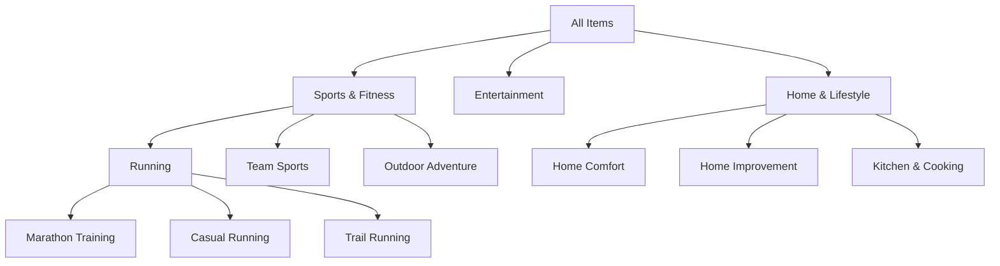

# **Introduction: The Foundation of Speed and Cost-Efficiency**

Part 1 established the three-tier architecture. Now we dive into the **Data Layer**: the foundation that makes the entire system fast and cost-efficient.

The Data Layer is where we **precompute everything that doesn't depend on specific queries**. Every dollar spent on precomputation saves ten dollars in runtime API and LLM costs. Every hour spent building good embeddings and clusters saves hundreds of hours of query time.

 **Core principle**: If a computation is audience-independent or applies to common patterns, precompute it. If it's audience-specific, compute it at runtime (Intelligence Layer). 

This article covers:

1. **Item embeddings**: Representing brands, influencers, and entities as vectors
2. **Thematic clusters**: Grouping items by shared meaning and audience patterns
3. **Precomputation strategy**: What to compute, when to update, how to version
4. **Indices**: Fast lookup structures for similarity and retrieval
5. **Signal-specific considerations**: How TW, IG, and TW-IG differ
6. **Evolution**: Adding new sources and maintaining coherence


# **1. Item Embeddings: Three Approaches**

An **embedding** is a dense vector representation of an item (brand, influencer, media outlet, etc.) in a high-dimensional space. Items with similar embeddings are similar in meaning or behavior.

We need embeddings for three reasons:

1. **Similarity search**: "Find items similar to Nike"
2. **Clustering**: "Group items into thematic categories"
3. **Feature representation**: Use embeddings as input to downstream models

There are three approaches to creating embeddings, each capturing different aspects of items:

## **1.1 Text-Based Embeddings (Semantic)**

**What they capture**: The meaning and content of an item based on its textual description and recent activity.

**Data used**:

- Item descriptions (e.g. "Nike - Athletic footwear and apparel brand")
- Recent tweets (for Twitter items)
- Bio/profile text (for Instagram items)
- Category labels

**How to compute**:


```python
from sentence_transformers import SentenceTransformer

class TextEmbedder:
    def __init__(self, model_name="all-MiniLM-L6-v2"):
        """
        Using sentence transformers for semantic embeddings.
        Model produces 384-dim vectors, fast inference.
        """
        self.model = SentenceTransformer(model_name)
    
    def embed_item(self, item):
        """Generate embedding for a single item"""
        # Combine all text signals
        text = self.combine_text(item)
        
        # Generate embedding
        embedding = self.model.encode(text)
        
        return embedding
    
    def combine_text(self, item):
        """Intelligently combine text signals"""
        parts = []
        
        # Core description
        if item.description:
            parts.append(item.description)
        
        # Recent content (sample, don't use all tweets)
        if item.recent_tweets:
            # Use only most recent 5 tweets to avoid noise
            recent_text = " ".join(item.recent_tweets[:5])
            parts.append(recent_text)
        
        # Category context
        if item.categories:
            cat_text = " ".join(item.categories)
            parts.append(cat_text)
        
        return " ".join(parts)
    
    def batch_embed(self, items, batch_size=32):
        """Efficient batch processing"""
        texts = [self.combine_text(item) for item in items]
        embeddings = self.model.encode(texts, batch_size=batch_size)
        return embeddings
```

**Strengths**:

- Captures semantic meaning (what the brand "is about")
- Works for new items with no audience data yet
- Language-aware (understands "running" and "marathon" are related)
- Fast to compute (single forward pass through transformer)

**Weaknesses**:

- Doesn't capture actual audience behavior
- Description text can be marketing fluff, not reality
- Misses implicit connections (e.g. two brands with different descriptions but similar audiences)

## **1.2 Behavioral Embeddings (Audience-Based)**

**What they capture**: Which items are followed by similar audiences.

**Data used**: The follow matrix itself (users × items)

**How to compute**:



Decompose the user-item matrix into latent factors:

python

```python
from scipy.sparse import csr_matrix
from sklearn.decomposition import TruncatedSVD

class MatrixFactorizationEmbedder:
    def __init__(self, n_components=128):
        """
        Use SVD to decompose follow matrix.
        Similar to recommendation system embeddings.
        """
        self.n_components = n_components
        self.svd = TruncatedSVD(n_components=n_components)
    
    def fit(self, follow_matrix):
        """
        follow_matrix: scipy sparse matrix (users × items)
        Values: 1 if user follows item, 0 otherwise
        """
        # Fit SVD on item space (transpose to get items × latent)
        item_embeddings = self.svd.fit_transform(follow_matrix.T)
        
        self.embeddings = item_embeddings
        return self
    
    def get_embedding(self, item_id):
        """Get embedding for specific item"""
        return self.embeddings[item_id]
    
    def similarity(self, item_id_1, item_id_2):
        """Cosine similarity between two items"""
        emb1 = self.embeddings[item_id_1]
        emb2 = self.embeddings[item_id_2]
        
        return np.dot(emb1, emb2) / (np.linalg.norm(emb1) * np.linalg.norm(emb2))
```

**Pros**: Simple, interpretable, fast **Cons**: Linear assumptions, doesn't capture complex patterns 



Treat the follow matrix as a bipartite graph (users ↔ items) and learn embeddings via message passing:

python

```python
import torch
from torch_geometric.nn import SAGEConv

class GNNEmbedder(torch.nn.Module):
    def __init__(self, num_items, embedding_dim=128):
        super().__init__()
        self.embedding = torch.nn.Embedding(num_items, embedding_dim)
        self.conv1 = SAGEConv(embedding_dim, embedding_dim)
        self.conv2 = SAGEConv(embedding_dim, embedding_dim)
    
    def forward(self, edge_index):
        """
        edge_index: [2, num_edges] tensor of (user, item) pairs
        """
        # Initial embeddings
        x = self.embedding.weight
        
        # Message passing
        x = self.conv1(x, edge_index)
        x = torch.relu(x)
        x = self.conv2(x, edge_index)
        
        return x
```

**Pros**: Captures non-linear patterns, state-of-the-art performance **Cons**: More complex, requires GPU, harder to interpret 

**Strengths**:

- Captures actual audience behavior (not claims)
- Reveals implicit similarities (brands with similar audiences)
- Data-driven (no text processing needed)

**Weaknesses**:

- Requires sufficient follow data (cold start problem)
- Doesn't work for new items
- Opaque (hard to explain why two items are similar)

## **1.3 Hybrid Embeddings (Best of Both)**

Combine text and behavioral embeddings to get both semantic meaning and audience behavior.

python

```python
class HybridEmbedder:
    def __init__(self, text_embedder, behavioral_embedder, alpha=0.5):
        """
        Combine text and behavioral embeddings.
        
        Args:
            text_embedder: TextEmbedder instance
            behavioral_embedder: MatrixFactorizationEmbedder or GNNEmbedder
            alpha: Weight for text embeddings (1-alpha for behavioral)
        """
        self.text_embedder = text_embedder
        self.behavioral_embedder = behavioral_embedder
        self.alpha = alpha
    
    def embed_item(self, item):
        """Generate hybrid embedding"""
        # Text embedding
        text_emb = self.text_embedder.embed_item(item)
        
        # Behavioral embedding
        if item.id in self.behavioral_embedder.embeddings:
            behav_emb = self.behavioral_embedder.get_embedding(item.id)
        else:
            # New item: use only text embedding
            return text_emb
        
        # Normalize both
        text_emb = text_emb / np.linalg.norm(text_emb)
        behav_emb = behav_emb / np.linalg.norm(behav_emb)
        
        # Weighted combination
        hybrid = self.alpha * text_emb + (1 - self.alpha) * behav_emb
        
        # Re-normalize
        hybrid = hybrid / np.linalg.norm(hybrid)
        
        return hybrid
```

 **Tuning alpha**: Start with α=0.5 (equal weight). Increase α if text descriptions are high quality. Decrease α if behavioral data is very rich. 

**Alternative: Learned combination**

Instead of manual weighting, learn the optimal combination:

python

```python
class LearnedHybridEmbedder(torch.nn.Module):
    def __init__(self, text_dim, behav_dim, output_dim=128):
        super().__init__()
        # Project both to common space
        self.text_proj = torch.nn.Linear(text_dim, output_dim)
        self.behav_proj = torch.nn.Linear(behav_dim, output_dim)
        
        # Attention-based fusion
        self.fusion = torch.nn.MultiheadAttention(output_dim, num_heads=4)
    
    def forward(self, text_emb, behav_emb):
        # Project to common dimension
        text_proj = self.text_proj(text_emb)
        behav_proj = self.behav_proj(behav_emb)
        
        # Stack for attention
        stacked = torch.stack([text_proj, behav_proj])
        
        # Attention-based fusion
        fused, _ = self.fusion(stacked, stacked, stacked)
        
        # Average over the two sources
        output = fused.mean(dim=0)
        
        return output
```

This requires training data (e.g. item similarity judgments) but can learn optimal fusion strategy.


# **2. Signal-Specific Embeddings**

 **Critical point**: You need **separate embeddings for each signal source** (TW, IG, TW-IG). 

Why? Because behavioral patterns differ by platform:

<div class="grid-3"> <div>

**Twitter Signal**

- News-focused behavior
- Professional discourse
- Text-heavy engagement
- Older demographic

</div> <div>

**Instagram Signal**

- Visual-first behavior
- Lifestyle content
- Aesthetic focus
- Younger demographic

</div> <div>

**Combined Signal**

- Union of behaviors
- Broader coverage
- Platform effects averaged
- Lookalike noise

</div> </div>

**Implementation strategy**:

```python
class SignalSpecificEmbeddings:
    def __init__(self):
        self.text_embedder = TextEmbedder()  # Shared across signals
        
        # Signal-specific behavioral embedders
        self.tw_behavioral = MatrixFactorizationEmbedder()
        self.ig_behavioral = MatrixFactorizationEmbedder()
        self.combined_behavioral = MatrixFactorizationEmbedder()
    
    def fit(self, tw_matrix, ig_matrix, combined_matrix):
        """Fit separate embeddings for each signal"""
        self.tw_behavioral.fit(tw_matrix)
        self.ig_behavioral.fit(ig_matrix)
        self.combined_behavioral.fit(combined_matrix)
    
    def get_embedding(self, item, signal="TW-IG"):
        """Get embedding for specific signal"""
        # Text component (same for all signals)
        text_emb = self.text_embedder.embed_item(item)
        
        # Behavioral component (signal-specific)
        if signal == "TW":
            behav_emb = self.tw_behavioral.get_embedding(item.id)
        elif signal == "IG":
            behav_emb = self.ig_behavioral.get_embedding(item.id)
        else:  # TW-IG
            behav_emb = self.combined_behavioral.get_embedding(item.id)
        
        # Hybrid combination
        return self.combine(text_emb, behav_emb)
```

**Storage implications**:
- Text embeddings: Compute once, shared across signals (~100K items × 384 dims × 4 bytes = ~150 MB)
- Behavioral embeddings: Per signal (~100K items × 128 dims × 4 bytes × 3 signals = ~150 MB)
- Total: ~300 MB for all embeddings (manageable)


# **3. Thematic Clusters: Essential or Useful?**

**Thematic clusters** group items by shared meaning or audience patterns. Examples:
- "Running Ecosystem" = {Brooks, Saucony, Runner's World, Boston Marathon, ...}
- "Pop Culture Entertainment" = {Disney, Marvel, Taylor Swift, ...}
- "Home Comfort" = {Serta, BHG, Target, ...}

## **3.1 When Clusters Are Essential**


**Psychographic Intelligence (Layer 2)** fundamentally requires clusters.

The question "What does this audience care about?" cannot be answered with a list of 10,000 individual items. You need thematic groupings to reveal patterns.


**Example**: StrideRecover audience analysis
```
Without clusters:
- Brooks Running: 31x affinity
- Saucony: 44x affinity  
- HOKA: 55x affinity
- Runner's World: 12x affinity
- Boston Marathon: 20x affinity
- Nuun Hydration: 83x affinity
- PRO Compression: 119x affinity
... (50 more items)

With clusters:
- Running Ecosystem (7 items, avg 40x affinity, 25% reach)
  → "Dedicated endurance athlete identity"
- Sports Nutrition (5 items, avg 60x affinity, 20% reach)
  → "Performance optimization mindset"
- Home Comfort (6 items, avg 80x affinity, 18% reach)
  → "Recovery extends to home environment"
```

Clusters enable the shift from **data** to **insight**.

## **3.2 When Clusters Are Useful But Not Essential**

**Strategic Intelligence (Layer 1)** doesn't strictly require clusters. Overlap metrics (reach, penetration, affinity) work at the item level:

python

```python
# Don't need clusters for this
overlap = api.get_overlap(
    audience="StrideRecover",
    item="ComfyCasual"
)
# Result: 12% reach, 2.4% penetration → minimal overlap
```

But clusters are **useful** for summarization and pattern recognition:

python

```python
# Clusters help identify patterns
competitive_landscape = {
    "Direct Competition": ["RecoveryBrand1", "RecoveryBrand2"],
    "Adjacent Categories": ["CompressionGear1", "SportsNutrition1"],
    "Different Markets": ["CasualComfort1", "FashionFootwear1"]
}
```

**Verdict**: Clusters are essential for Layer 2 (Psychographic), useful for Layer 1 (Strategic), and helpful for Layer 3 (Activation) content strategy.


# **4. Clustering Approaches**

## **4.1 Category-Aware Clustering**

Start with the existing taxonomy as a prior, but don't be constrained by it.

```python
class CategoryAwareClusterer:
    def __init__(self, taxonomy, embeddings):
        """
        taxonomy: Dict mapping items to categories
        embeddings: Dict mapping items to embedding vectors
        """
        self.taxonomy = taxonomy
        self.embeddings = embeddings
    
    def cluster(self, items, n_clusters=50):
        """
        Cluster items respecting but not limited to categories.
        """
        from sklearn.cluster import AgglomerativeClustering
        
        # Build similarity matrix
        X = np.array([self.embeddings[item] for item in items])
        
        # Add category constraint: items in same category get bonus similarity
        similarity = self.compute_similarity_with_category_bonus(X, items)
        
        # Hierarchical clustering
        clustering = AgglomerativeClustering(
            n_clusters=n_clusters,
            affinity='precomputed',
            linkage='average'
        )
        
        labels = clustering.fit_predict(1 - similarity)  # Convert to distance
        
        # Post-process: split clusters that span too many categories
        refined_labels = self.refine_by_category(items, labels)
        
        return refined_labels
    
    def compute_similarity_with_category_bonus(self, X, items):
        """Add bonus for items in same category"""
        n = len(items)
        similarity = cosine_similarity(X)
        
        # Bonus for same category
        for i in range(n):
            for j in range(i+1, n):
                if self.taxonomy[items[i]] == self.taxonomy[items[j]]:
                    similarity[i,j] *= 1.2  # 20% bonus
                    similarity[j,i] *= 1.2
        
        return similarity
```

**Why category-aware?**

- Categories reflect real-world structure (Sports, Entertainment, Food)
- But categories can be too coarse (all "Sports" items aren't the same)
- Or too fine-grained (splitting "Running Shoes" and "Running Apparel" when audience sees them as one)

## **4.2 Audience-Relative Clustering**

 **Key insight**: The "right" clusters depend on the audience. 

For StrideRecover's audience, "Running Ecosystem" is a meaningful cluster. For ComfyCasual's audience, it's not (they don't care about running).

**Implementation**:

```python
class AudienceRelativeClusterer:
    def __init__(self, api_client, embeddings):
        self.api = api_client
        self.embeddings = embeddings
    
    def cluster_for_audience(self, audience, candidate_items, n_clusters=20):
        """
        Cluster items based on how this specific audience relates to them.
        """
        # Get affinity scores for all items
        affinities = {}
        for item in candidate_items:
            result = self.api.get_overlap(audience, item)
            affinities[item] = result.affinity
        
        # Weight embeddings by affinity
        X = []
        items = []
        for item in candidate_items:
            if affinities[item] > 2.0:  # Only cluster high-affinity items
                weighted_emb = self.embeddings[item] * np.log(affinities[item])
                X.append(weighted_emb)
                items.append(item)
        
        X = np.array(X)
        
        # Cluster
        from sklearn.cluster import KMeans
        kmeans = KMeans(n_clusters=n_clusters, random_state=42)
        labels = kmeans.fit_predict(X)
        
        # Generate cluster labels using LLM
        clusters = self.generate_cluster_labels(items, labels)
        
        return clusters
    
    def generate_cluster_labels(self, items, labels):
        """Use LLM to generate meaningful labels for clusters"""
        clusters = {}
        for cluster_id in set(labels):
            cluster_items = [items[i] for i in range(len(items)) if labels[i] == cluster_id]
            
            # LLM generates label based on items in cluster
            label = self.llm.generate_cluster_label(cluster_items)
            
            clusters[label] = cluster_items
        
        return clusters
```

**Example output for StrideRecover audience**:
```
Cluster 1: "Dedicated Running Ecosystem" (15 items)
  - Brooks, Saucony, HOKA, Runner's World, Boston Marathon, ...
  
Cluster 2: "Performance Nutrition & Hydration" (8 items)
  - Nuun, Clif Bar, GU Energy, ...
  
Cluster 3: "Recovery & Compression" (6 items)
  - PRO Compression, recovery tools, ...
  
Cluster 4: "Home Comfort & Wellness" (10 items)
  - Serta, BHG Live Better, home goods, ...
```

## **4.3 Multi-Level Hierarchical Clustering**

Real-world clusters have structure: broad themes contain sub-themes.

mermaid



**Implementation**:

```python
class HierarchicalClusterer:
    def __init__(self, embeddings):
        self.embeddings = embeddings
    
    def cluster_hierarchical(self, items, levels=[10, 30, 100]):
        """
        Create multi-level clustering.
        
        levels: [broad, medium, fine] number of clusters at each level
        """
        from sklearn.cluster import AgglomerativeClustering
        
        X = np.array([self.embeddings[item] for item in items])
        
        hierarchy = {}
        
        for n_clusters in levels:
            clustering = AgglomerativeClustering(n_clusters=n_clusters)
            labels = clustering.fit_predict(X)
            
            hierarchy[n_clusters] = {
                'labels': labels,
                'clusters': self.build_cluster_dict(items, labels)
            }
        
        return hierarchy
    
    def build_cluster_dict(self, items, labels):
        clusters = {}
        for label in set(labels):
            cluster_items = [items[i] for i in range(len(items)) if labels[i] == label]
            clusters[label] = cluster_items
        return clusters
```

**Use cases for different levels**:
- **Broad (10 clusters)**: Executive summaries, high-level themes
- **Medium (30 clusters)**: Strategic planning, segment identification  
- **Fine (100 clusters)**: Tactical content strategy, precise targeting


# **5. What to Precompute**

The decision of what to precompute follows a simple cost-benefit analysis:
```
Precompute if: (Reuse frequency × Runtime cost) > (Storage cost + Compute cost)
```

## **5.1 Item-Level Precomputation**



**Cost**:

- Compute: 100K items × $0.00001 per embedding = $1
- Storage: 100K × 384 × 4 bytes = 150 MB
- Update frequency: Weekly (when new items or content changes)

**Benefit**:

- Used for every similarity search, clustering, hybrid embedding
- Saves ~$0.001 per query
- With 10K queries/day → saves $10/day = $3,650/year

**Verdict**: Always precompute 



**Cost**:

- Compute: 100K items × 3 signals × $0.0001 per embedding = $30
- Storage: 100K × 128 × 4 bytes × 3 = 150 MB
- Update frequency: Weekly (when follow patterns change)

**Benefit**:

- Used for every audience-specific analysis
- Saves ~$0.002 per query
- With 10K queries/day → saves $20/day = $7,300/year

**Verdict**: Always precompute 



**Cost**:

- Compute: Nearly free (just weighted combination of precomputed embeddings)
- Storage: 100K × 384 × 4 bytes = 150 MB

**Benefit**:

- Only saves a few milliseconds per query
- But simplifies downstream code

**Verdict**: Precompute if using fixed α, compute on-demand if α varies by use case 

## **5.2 Category-Level Precomputation**



For common audience segments (e.g. "Gen Z Female Urban", "Millennial Male Fitness"), precompute category-level patterns:

python

```python
category_affinities = {
    "GenZ_Female_Urban": {
        "Beauty": {"mean_affinity": 8.2, "reach": 0.42, "top_items": [...]},
        "Entertainment": {"mean_affinity": 6.1, "reach": 0.65, "top_items": [...]},
        "Sports": {"mean_affinity": 2.8, "reach": 0.31, "top_items": [...]},
        # ... all categories
    },
    "Millennial_Male_Fitness": {
        "Sports": {"mean_affinity": 15.3, "reach": 0.58, "top_items": [...]},
        "Technology": {"mean_affinity": 7.1, "reach": 0.44, "top_items": [...]},
        # ... all categories
    },
    # ... 20-50 common segments
}
```

**Cost**: 50 segments × 100 categories × $0.10 per computation = $500 **Benefit**: Instant category-level insights for common segments **Verdict**: Precompute for top 20-50 segments that cover 80% of queries 

## **5.3 Ecosystem-Level Precomputation**



Cluster all items into global themes, independent of any audience:

python

```python
global_clusters = {
    "Running Ecosystem": [list of running-related items],
    "Pop Culture Entertainment": [list of entertainment items],
    "Professional News Media": [list of news outlets],
    # ... 30-50 global clusters
}
```

**Cost**: One-time $50 compute + $10/month updates **Benefit**: Foundation for all audience-specific analyses **Verdict**: Always precompute 



For each item, precompute top-N most similar items:

python

```python
similarity_graph = {
    "Nike": [
        ("Adidas", 0.92),
        ("Under Armour", 0.87),
        ("Puma", 0.84),
        # ... top 50 similar items
    ],
    "Brooks Running": [
        ("Saucony", 0.95),
        ("HOKA", 0.91),
        ("New Balance", 0.88),
        # ... top 50 similar items
    ],
    # ... for all items
}
```

**Cost**: 100K items × 50 comparisons × $0.00001 = $50 **Storage**: 100K × 50 × 12 bytes = 60 MB **Benefit**: Instant "similar items" queries, partnership discovery **Verdict**: Always precompute 


# **6. Indices for Fast Retrieval**

Precomputed embeddings and clusters are useless if you can't query them efficiently. You need **indices** for fast lookup.

## **6.1 Vector Similarity Index**

For finding items similar to a query embedding.



**FAISS (Facebook AI Similarity Search)**

python

```python
import faiss

class FAISSIndex:
    def __init__(self, dimension=384):
        # Use IVF (Inverted File) with PQ (Product Quantization)
        # for large-scale similarity search
        quantizer = faiss.IndexFlatL2(dimension)
        self.index = faiss.IndexIVFPQ(
            quantizer,
            dimension,
            nlist=100,  # num centroids
            M=8,        # num subquantizers
            nbits=8     # bits per subquantizer
        )
        self.item_ids = []
    
    def train_and_add(self, embeddings, item_ids):
        """Train index and add embeddings"""
        # Train on embeddings
        self.index.train(embeddings)
        
        # Add to index
        self.index.add(embeddings)
        
        # Store item IDs
        self.item_ids = item_ids
    
    def search(self, query_embedding, k=10):
        """Find k nearest neighbors"""
        distances, indices = self.index.search(
            query_embedding.reshape(1, -1), 
            k
        )
        
        # Map indices to item IDs
        results = [
            (self.item_ids[idx], distances[0][i])
            for i, idx in enumerate(indices[0])
        ]
        
        return results
```

<--->

**Annoy (Spotify's library)**

python

```python
from annoy import AnnoyIndex

class AnnoyIndex:
    def __init__(self, dimension=384):
        self.index = AnnoyIndex(dimension, 'angular')
        self.item_ids = []
    
    def build(self, embeddings, item_ids, n_trees=10):
        """Build index"""
        for i, (emb, item_id) in enumerate(zip(embeddings, item_ids)):
            self.index.add_item(i, emb)
            self.item_ids.append(item_id)
        
        # Build with n_trees (more trees = higher precision)
        self.index.build(n_trees)
    
    def search(self, query_embedding, k=10):
        """Find k nearest neighbors"""
        indices, distances = self.index.get_nns_by_vector(
            query_embedding,
            k,
            include_distances=True
        )
        
        results = [
            (self.item_ids[idx], distances[i])
            for i, idx in enumerate(indices)
        ]
        
        return results
```



**Performance comparison**:

|Index|Build Time (100K items)|Query Time|Memory|Precision|
|---|---|---|---|---|
|**FAISS IVF-PQ**|~2 min|<1ms|~50 MB|95%|
|**Annoy**|~5 min|<1ms|~100 MB|98%|
|**Exact (no index)**|0|~500ms|~150 MB|100%|

 **Recommendation**: Use **FAISS** for production (better memory efficiency). Use **Annoy** for development (simpler API). Use **exact search** for validation (ground truth). 

## **6.2 Inverted Index (Category → Items)**

For fast lookup of items by category or attribute.

python

```python
class InvertedIndex:
    def __init__(self):
        self.index = {}  # category -> list of items
    
    def build(self, items, taxonomy):
        """Build inverted index from taxonomy"""
        for item in items:
            categories = taxonomy.get(item, [])
            
            for category in categories:
                if category not in self.index:
                    self.index[category] = []
                
                self.index[category].append(item)
    
    def query(self, category):
        """Get all items in category"""
        return self.index.get(category, [])
    
    def query_multiple(self, categories):
        """Get items in any of the categories"""
        results = set()
        for category in categories:
            results.update(self.index.get(category, []))
        return list(results)
```

**Use cases**:

- "Show me all items in 'Running Ecosystem' cluster"
- "Get candidate influencers in 'Fitness' category"
- "Find items tagged as 'Sports Nutrition'"

## **6.3 Graph Index (Item Relationships)**

For traversing relationships between items.

python

```python
import networkx as nx

class ItemGraphIndex:
    def __init__(self):
        self.graph = nx.Graph()
    
    def build(self, similarity_matrix, items, threshold=0.7):
        """Build graph from similarity matrix"""
        n = len(items)
        
        # Add nodes
        for item in items:
            self.graph.add_node(item)
        
        # Add edges where similarity > threshold
        for i in range(n):
            for j in range(i+1, n):
                if similarity_matrix[i, j] > threshold:
                    self.graph.add_edge(
                        items[i],
                        items[j],
                        weight=similarity_matrix[i, j]
                    )
    
    def neighbors(self, item, k=10):
        """Get k most similar neighbors"""
        if item not in self.graph:
            return []
        
        neighbors = self.graph.neighbors(item)
        
        # Sort by edge weight
        neighbors_with_weight = [
            (neighbor, self.graph[item][neighbor]['weight'])
            for neighbor in neighbors
        ]
        
        neighbors_with_weight.sort(key=lambda x: x[1], reverse=True)
        
        return neighbors_with_weight[:k]
    
    def connected_component(self, item):
        """Get all items in same connected component"""
        if item not in self.graph:
            return []
        
        return list(nx.node_connected_component(self.graph, item))
```

**Use cases**:

- "Show me the ecosystem of items connected to Nike"
- "Find clusters by connected components"
- "Explore partnership networks"


# **7. Signal-Specific Considerations**

Remember: you need separate precomputation for each signal (TW, IG, TW-IG).

## **7.1 Storage Strategy**

python

```python
class SignalSpecificDataLayer:
    def __init__(self):
        # Shared: Text embeddings (signal-independent)
        self.text_embeddings = {}
        
        # Signal-specific: Behavioral embeddings
        self.behavioral_embeddings = {
            "TW": {},
            "IG": {},
            "TW-IG": {}
        }
        
        # Signal-specific: Clusters
        self.clusters = {
            "TW": {},
            "IG": {},
            "TW-IG": {}
        }
        
        # Signal-specific: Indices
        self.indices = {
            "TW": FAISSIndex(),
            "IG": FAISSIndex(),
            "TW-IG": FAISSIndex()
        }
    
    def get_embedding(self, item, signal="TW-IG"):
        """Get hybrid embedding for specific signal"""
        text_emb = self.text_embeddings[item]
        behav_emb = self.behavioral_embeddings[signal][item]
        
        # Combine (simple average for now)
        return (text_emb + behav_emb) / 2
    
    def similar_items(self, item, signal="TW-IG", k=10):
        """Find similar items using signal-specific index"""
        query_emb = self.get_embedding(item, signal)
        return self.indices[signal].search(query_emb, k)
```

## **7.2 When Signals Diverge**

Some items behave very differently on Twitter vs. Instagram:

 **Example**: News outlet behavior

**Twitter**: NYT has high affinity (audiences follow for news) **Instagram**: NYT has low affinity (visual platform, less news consumption) **Combined**: Averaged signal, loses platform-specific insight

**Implication**: For content strategy, must analyze signals separately. 

**Detecting divergence**:

python

```python
def compute_signal_divergence(item, tw_embedding, ig_embedding):
    """Measure how different item's behavior is across signals"""
    
    # Cosine similarity between TW and IG embeddings
    similarity = np.dot(tw_embedding, ig_embedding) / (
        np.linalg.norm(tw_embedding) * np.linalg.norm(ig_embedding)
    )
    
    # Divergence score (0 = identical, 1 = completely different)
    divergence = 1 - similarity
    
    return divergence

# Compute for all items
divergence_scores = {}
for item in items:
    tw_emb = embeddings["TW"][item]
    ig_emb = embeddings["IG"][item]
    divergence_scores[item] = compute_signal_divergence(item, tw_emb, ig_emb)

# Items with high divergence need signal-specific strategies
high_divergence_items = [
    item for item, score in divergence_scores.items()
    if score > 0.5
]
```


# **8. Evolution Strategy**

The Data Layer must evolve as new items appear, audiences shift, and new signals are added.

## **8.1 Incremental Updates**

Don't recompute everything from scratch. Update incrementally.

python

```python
class IncrementalEmbedder:
    def __init__(self, base_embeddings):
        self.embeddings = base_embeddings
        self.new_items = []
    
    def add_item(self, item):
        """Add new item and compute embedding"""
        # Text embedding (fast, can compute immediately)
        text_emb = self.text_embedder.embed_item(item)
        self.embeddings[item] = text_emb
        
        # Mark for behavioral embedding update
        self.new_items.append(item)
    
    def update_behavioral(self, follow_matrix):
        """Update behavioral embeddings for new items"""
        if not self.new_items:
            return
        
        # Extract rows for new items from matrix
        new_item_indices = [self.item_to_idx[item] for item in self.new_items]
        new_item_data = follow_matrix[new_item_indices, :]
        
        # Compute embeddings using existing model
        new_embeddings = self.behavioral_model.transform(new_item_data)
        
        # Update
        for item, emb in zip(self.new_items, new_embeddings):
            self.behavioral_embeddings[item] = emb
        
        self.new_items = []
```

## **8.2 Versioning Strategy**

Track versions of embeddings and clusters for reproducibility.

python

```python
class VersionedDataLayer:
    def __init__(self, storage_path):
        self.storage_path = storage_path
        self.current_version = None
    
    def save_version(self, embeddings, clusters, metadata):
        """Save current state as versioned snapshot"""
        version_id = datetime.now().strftime("%Y%m%d_%H%M%S")
        version_path = f"{self.storage_path}/v_{version_id}"
        
        os.makedirs(version_path, exist_ok=True)
        
        # Save embeddings
        np.save(f"{version_path}/embeddings.npy", embeddings)
        
        # Save clusters
        with open(f"{version_path}/clusters.json", 'w') as f:
            json.dump(clusters, f)
        
        # Save metadata
        with open(f"{version_path}/metadata.json", 'w') as f:
            json.dump({
                "version": version_id,
                "num_items": len(embeddings),
                "timestamp": datetime.now().isoformat(),
                **metadata
            }, f)
        
        self.current_version = version_id
    
    def load_version(self, version_id):
        """Load specific version"""
        version_path = f"{self.storage_path}/v_{version_id}"
        
        embeddings = np.load(f"{version_path}/embeddings.npy")
        
        with open(f"{version_path}/clusters.json", 'r') as f:
            clusters = json.load(f)
        
        return embeddings, clusters
```

**Update frequency**:

- **Text embeddings**: Weekly (as new content appears)
- **Behavioral embeddings**: Weekly (as follow patterns change)
- **Clusters**: Monthly (slower to shift)
- **Indices**: Weekly (rebuild with new embeddings)

## **8.3 Adding New Signals**

When TikTok is added:

python

```python
class ExtensibleDataLayer:
    def __init__(self):
        self.signals = ["TW", "IG", "TW-IG"]
        self.embeddings = {signal: {} for signal in self.signals}
        self.clusters = {signal: {} for signal in self.signals}
        self.indices = {signal: FAISSIndex() for signal in self.signals}
    
    def add_signal(self, signal_name, follow_matrix):
        """Add new signal to system"""
        print(f"Adding new signal: {signal_name}")
        
        # Compute embeddings for new signal
        self.embeddings[signal_name] = self.compute_behavioral_embeddings(follow_matrix)
        
        # Compute clusters for new signal
        self.clusters[signal_name] = self.cluster_items(self.embeddings[signal_name])
        
        # Build index for new signal
        self.indices[signal_name] = self.build_index(self.embeddings[signal_name])
        
        # Update signal list
        self.signals.append(signal_name)
        
        print(f"Signal {signal_name} added successfully")
```


# **9. Implementation Checklist**



- [ ]  Set up sentence transformer model (all-MiniLM-L6-v2 or similar)
- [ ]  Extract item descriptions and recent tweets/posts
- [ ]  Compute text embeddings for all items
- [ ]  Store in efficient format (numpy arrays)
- [ ]  Build vector similarity index (FAISS)
- [ ]  Test: "Find items similar to Nike" query

**Deliverable**: Fast similarity search based on semantic meaning 



- [ ]  Extract follow matrices (TW, IG, TW-IG)
- [ ]  Implement matrix factorization or GNN approach
- [ ]  Compute behavioral embeddings per signal
- [ ]  Validate: Do similar items have similar embeddings?
- [ ]  Build signal-specific indices

**Deliverable**: Behavioral similarity that captures actual audience patterns 



- [ ]  Implement weighted combination (α=0.5 start)
- [ ]  Tune α on validation set
- [ ]  Rebuild indices with hybrid embeddings
- [ ]  Compare hybrid vs. text-only vs. behavioral-only

**Deliverable**: Best-of-both-worlds embeddings 



- [ ]  Implement hierarchical clustering (3 levels: 10, 30, 100 clusters)
- [ ]  Generate cluster labels with LLM
- [ ]  Validate clusters with domain experts
- [ ]  Build inverted index (cluster → items)

**Deliverable**: Global thematic taxonomy 



- [ ]  Identify top 20 common audience segments
- [ ]  Compute audience-relative clusters for each segment
- [ ]  Store in segment-specific indices
- [ ]  Implement fallback to global clusters for rare segments

**Deliverable**: Fast, accurate clustering for common use cases 



- [ ]  Implement versioning system
- [ ]  Set up incremental update pipeline
- [ ]  Add monitoring and validation
- [ ]  Document APIs and usage patterns
- [ ]  Performance benchmarking

**Deliverable**: Production-ready Data Layer 


# **10. Summary: The Data Layer Foundation**

The Data Layer is the foundation of the entire Audience Intelligence System. It provides:

**Embeddings** (vector representations):

- Text-based: Semantic meaning from descriptions
- Behavioral: Audience patterns from follow matrices
- Hybrid: Best of both worlds
- **Signal-specific**: Separate for TW, IG, TW-IG

**Clusters** (thematic groupings):

- Global: Cross-audience patterns
- Segment-specific: Tailored to common audiences
- Multi-level: Broad themes to micro-niches
- LLM-labeled: Human-interpretable names

**Indices** (fast retrieval):

- Vector similarity: FAISS or Annoy for nearest neighbors
- Inverted: Category → items lookup
- Graph: Item relationship networks

**Evolution strategy**:

- Incremental updates (don't recompute everything)
- Versioning (track changes, enable reproducibility)
- Extensible (easy to add new signals)

 **Key principle**: Precompute everything that's audience-independent. This makes the Intelligence Layer fast and cost-effective. 


# **What's Next**

**Part 3** will explore the **Intelligence Layer**: how to orchestrate runtime queries, integrate LLM capabilities, and combine precomputed data with live API calls to deliver actionable insights.

We'll see how the Data Layer we just built becomes the foundation for:

- Query planning (which precomputed data to use?)
- Signal selection (TW, IG, or TW-IG for this query?)
- LLM orchestration (when to use large vs. small models?)
- API optimization (caching, batching, cost management)

The Data Layer provides the foundation. The Intelligence Layer brings it to life.