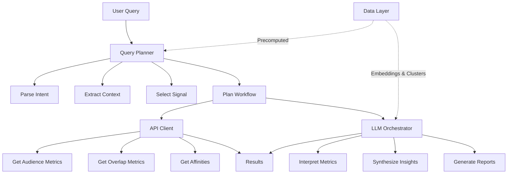
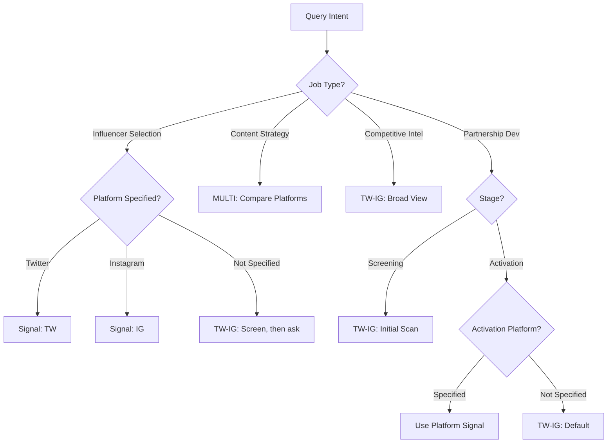
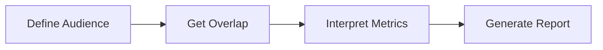
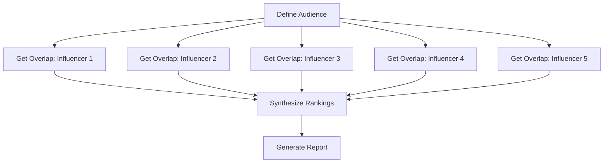
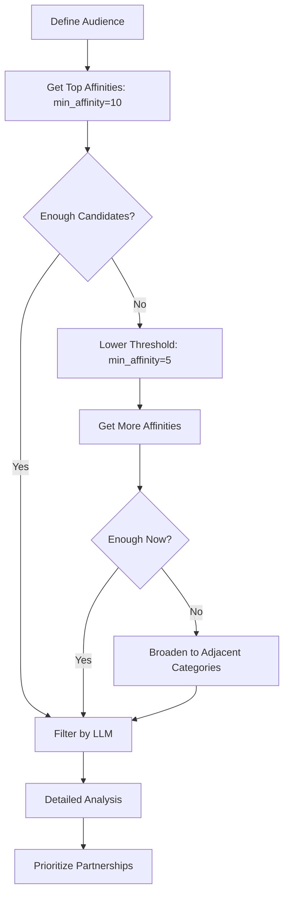

# **The Intelligence Layer: Runtime Orchestration & LLM Integration**

---

## **Introduction: From Data to Decisions**

Part 2 established the **Data Layer**: precomputed embeddings, clusters, and indices that make the system fast and cost-efficient. But this data is static. The **Intelligence Layer** brings it to life.

The Intelligence Layer is where:

- User queries are parsed and planned
- Precomputed data is combined with runtime API calls
- LLMs transform raw metrics into strategic insights
- Multiple sources of information are synthesized into actionable recommendations

This is the **orchestration tier**: it connects the static Data Layer below with the dynamic Application Layer above.

 **Core principle**: The Intelligence Layer is query-specific and context-aware. It makes runtime decisions about which data to use, which signals to query, and which models to invoke. 

---

## **1. Architecture Overview: Three Components**

The Intelligence Layer consists of three main components:

mermaid



<div class="grid-3"> <div>

### **Query Planner**

- Parses user requests
- Maps to JTBD patterns
- Selects appropriate signal
- Plans execution workflow
- Routes to handlers

</div> <div>

### **API Client**

- Manages Audience Intelligence API
- Handles authentication & retries
- Caches results
- Batches requests
- Validates responses

</div> <div>

### **LLM Orchestrator**

- Interprets raw metrics
- Generates insights
- Creates narratives
- Labels clusters
- Validates outputs

</div> </div>

---

## **2. Query Planner: From Intent to Execution**

The Query Planner is the entry point to the Intelligence Layer. It transforms natural language or structured requests into executable workflows.

### **2.1 Intent Recognition**

First step: understand what the user wants to do.

python

```python
from enum import Enum
from dataclasses import dataclass
from typing import Optional, List, Dict

class JobType(Enum):
    """Supported Jobs to Be Done"""
    INFLUENCER_SELECTION = "influencer_selection"
    COMPETITIVE_INTELLIGENCE = "competitive_intelligence"
    CONTENT_STRATEGY = "content_strategy"
    PARTNERSHIP_DEVELOPMENT = "partnership_development"
    MARKET_EXPANSION = "market_expansion"
    CHANNEL_PRIORITIZATION = "channel_prioritization"

@dataclass
class QueryIntent:
    """Parsed user intent"""
    job_type: JobType
    brand: Optional[str] = None
    competitors: Optional[List[str]] = None
    target_segment: Optional[str] = None
    platform: Optional[str] = None
    budget: Optional[float] = None
    constraints: Dict = None

class IntentParser:
    def __init__(self, llm_client):
        self.llm = llm_client
    
    def parse(self, user_query: str) -> QueryIntent:
        """
        Parse natural language query into structured intent.
        
        Example inputs:
        - "Find Instagram influencers for my recovery footwear brand"
        - "How do we compete with Nike in the running space?"
        - "What content should we create for Gen Z on TikTok?"
        """
        # Use LLM to extract structured information
        prompt = f"""
        Parse this user query into structured intent:
        Query: "{user_query}"
        
        Extract:
        - Job type (influencer_selection, competitive_intelligence, content_strategy, etc.)
        - Brand name (if mentioned)
        - Competitors (if mentioned)
        - Target segment (if mentioned)
        - Platform (if mentioned: twitter, instagram, tiktok)
        - Budget (if mentioned)
        - Any other constraints
        
        Return as JSON.
        """
        
        result = self.llm.query(
            prompt,
            response_format={"type": "json_object"}
        )
        
        # Parse JSON response
        intent_data = json.loads(result)
        
        # Create QueryIntent object
        return QueryIntent(
            job_type=JobType(intent_data['job_type']),
            brand=intent_data.get('brand'),
            competitors=intent_data.get('competitors'),
            target_segment=intent_data.get('target_segment'),
            platform=intent_data.get('platform'),
            budget=intent_data.get('budget'),
            constraints=intent_data.get('constraints', {})
        )
```

 **Why use LLM for parsing?** Natural language queries are ambiguous. An LLM can handle variations like "influencer suggestions", "find influencers", "who should we partner with" and map them all to `INFLUENCER_SELECTION`. 

### **2.2 Signal Selection**

 **Terminology note**: We're using **"signal"** instead of "matrix" to emphasize that we're choosing between different data sources (Twitter follows, Instagram follows, combined) rather than just mathematical matrices.

**Signals available**:

- **TW**: Twitter follow behavior
- **IG**: Instagram follow behavior (via lookalike matching)
- **TW-IG**: Combined signal (Twitter OR Instagram) 

Signal selection is **context-dependent**. The right signal depends on:

1. **The job type** (what are you trying to do?)
2. **The activation platform** (where will you execute?)
3. **The brand context** (where is your brand native?)

python

```python
class SignalSelector:
    """Choose appropriate signal (TW, IG, TW-IG) for query"""
    
    def select(self, intent: QueryIntent, brand_context: dict) -> str:
        """
        Select signal based on intent and context.
        
        Returns: "TW", "IG", "TW-IG", or "MULTI" (use all)
        """
        job = intent.job_type
        
        # Rule 1: Platform-specific JTBDs
        if job == JobType.INFLUENCER_SELECTION:
            return self._select_for_influencer(intent)
        
        elif job == JobType.CONTENT_STRATEGY:
            return "MULTI"  # Need platform-specific insights
        
        elif job == JobType.CHANNEL_PRIORITIZATION:
            return "MULTI"  # Compare across platforms
        
        # Rule 2: Strategic JTBDs (broad view)
        elif job in [JobType.COMPETITIVE_INTELLIGENCE, 
                     JobType.MARKET_EXPANSION]:
            return "TW-IG"  # Use combined for comprehensive view
        
        # Rule 3: Partnership discovery
        elif job == JobType.PARTNERSHIP_DEVELOPMENT:
            stage = intent.constraints.get('stage', 'screening')
            if stage == 'screening':
                return "TW-IG"  # Broad initial screening
            else:
                return self._select_for_activation(intent)
        
        # Default: combined signal
        return "TW-IG"
    
    def _select_for_influencer(self, intent: QueryIntent) -> str:
        """Influencer selection: use campaign platform"""
        platform = intent.platform or intent.constraints.get('platform')
        
        if platform == "twitter":
            return "TW"
        elif platform == "instagram":
            return "IG"
        else:
            # No platform specified: use combined for screening,
            # then ask user to specify platform
            return "TW-IG"
    
    def _select_for_activation(self, intent: QueryIntent) -> str:
        """Choose based on where activation will happen"""
        platform = intent.platform or intent.constraints.get('platform')
        
        if platform:
            return "TW" if platform == "twitter" else "IG"
        else:
            return "TW-IG"
```



mermaid





### **2.3 Workflow Planning**

Once we know the intent and signal, plan the execution workflow.

python

```python
@dataclass
class WorkflowStep:
    """A single step in execution workflow"""
    action: str  # "api_call", "data_lookup", "llm_task", "combine"
    params: Dict
    depends_on: Optional[List[str]] = None  # Dependencies

class WorkflowPlanner:
    def __init__(self, data_layer, api_client, llm_client):
        self.data = data_layer
        self.api = api_client
        self.llm = llm_client
    
    def plan(self, intent: QueryIntent, signal: str) -> List[WorkflowStep]:
        """
        Create execution plan for query.
        """
        job = intent.job_type
        
        if job == JobType.INFLUENCER_SELECTION:
            return self._plan_influencer_selection(intent, signal)
        
        elif job == JobType.COMPETITIVE_INTELLIGENCE:
            return self._plan_competitive_intelligence(intent, signal)
        
        elif job == JobType.CONTENT_STRATEGY:
            return self._plan_content_strategy(intent, signal)
        
        # ... other job types
    
    def _plan_influencer_selection(self, intent: QueryIntent, signal: str):
        """Plan workflow for influencer selection"""
        return [
            # Step 1: Define target audience
            WorkflowStep(
                action="api_call",
                params={
                    "method": "define_audience",
                    "brand": intent.brand,
                    "segment": intent.target_segment,
                    "signal": signal
                }
            ),
            
            # Step 2: Get candidate influencers from precomputed clusters
            WorkflowStep(
                action="data_lookup",
                params={
                    "method": "get_cluster_items",
                    "cluster_type": "influencers",
                    "platform": intent.platform,
                    "limit": 100
                },
                depends_on=["step_1"]
            ),
            
            # Step 3: Calculate overlap metrics (parallel API calls)
            WorkflowStep(
                action="api_call",
                params={
                    "method": "batch_get_overlap",
                    "audience": "{{step_1.audience_id}}",
                    "items": "{{step_2.candidates}}",
                    "signal": signal
                },
                depends_on=["step_1", "step_2"]
            ),
            
            # Step 4: Enrich with metadata
            WorkflowStep(
                action="data_lookup",
                params={
                    "method": "get_item_metadata",
                    "items": "{{step_2.candidates}}",
                    "fields": ["follower_count", "engagement_rate", "cost_estimate"]
                },
                depends_on=["step_2"]
            ),
            
            # Step 5: LLM ranking
            WorkflowStep(
                action="llm_task",
                params={
                    "method": "rank_influencers",
                    "overlaps": "{{step_3.results}}",
                    "metadata": "{{step_4.metadata}}",
                    "budget": intent.budget,
                    "criteria": ["overlap", "affinity", "cost_efficiency", "authenticity"]
                },
                depends_on=["step_3", "step_4"]
            ),
            
            # Step 6: Generate report
            WorkflowStep(
                action="llm_task",
                params={
                    "method": "generate_report",
                    "template": "influencer_selection",
                    "data": "{{step_5.ranking}}",
                    "top_n": 5
                },
                depends_on=["step_5"]
            )
        ]
```

 **Key insight**: The workflow is a **DAG (Directed Acyclic Graph)** of dependencies. Some steps can run in parallel (e.g. metadata lookup while waiting for API), others must be sequential. 

---

## **3. API Client: Managing the Audience Intelligence API**

The API Client is responsible for all interactions with the Audience Intelligence API.

### **3.1 Core API Client**

python

```python
import requests
from typing import Dict, List, Optional
import time
from functools import lru_cache

class AudienceIntelligenceAPI:
    def __init__(self, base_url: str, api_key: str):
        self.base_url = base_url
        self.api_key = api_key
        self.session = requests.Session()
        self.session.headers.update({
            "Authorization": f"Bearer {api_key}",
            "Content-Type": "application/json"
        })
    
    def define_audience(
        self,
        signal: str,
        brand: Optional[str] = None,
        segment: Optional[str] = None,
        demographic_filters: Optional[Dict] = None
    ) -> Dict:
        """
        Define an audience and get audience_id.
        
        Args:
            signal: "TW", "IG", or "TW-IG"
            brand: Brand name or item ID
            segment: Predefined segment (e.g., "Dedicated_Athletes")
            demographic_filters: Additional filters (age, gender, location)
        
        Returns:
            {
                "audience_id": "aud_12345",
                "size": 150000,
                "metadata": {...}
            }
        """
        payload = {
            "signal": signal,
            "brand": brand,
            "segment": segment,
            "demographic_filters": demographic_filters
        }
        
        response = self._post("/audiences/define", payload)
        return response
    
    def get_overlap(
        self,
        audience_id: str,
        item: str,
        signal: str
    ) -> Dict:
        """
        Calculate overlap metrics for audience with item.
        
        Returns:
            {
                "reach": 0.42,          # % of audience that follows item
                "penetration": 0.15,    # % of item's audience in target
                "affinity": 3.2,        # lift vs general population
                "relevance": 0.85,      # internal metric
                "sample_size": 63000
            }
        """
        payload = {
            "audience_id": audience_id,
            "item": item,
            "signal": signal
        }
        
        response = self._post("/overlap/calculate", payload)
        return response
    
    def batch_get_overlap(
        self,
        audience_id: str,
        items: List[str],
        signal: str,
        batch_size: int = 50
    ) -> List[Dict]:
        """
        Calculate overlap for multiple items efficiently.
        API supports batching up to 50 items per request.
        """
        results = []
        
        # Process in batches
        for i in range(0, len(items), batch_size):
            batch = items[i:i+batch_size]
            
            payload = {
                "audience_id": audience_id,
                "items": batch,
                "signal": signal
            }
            
            response = self._post("/overlap/batch", payload)
            results.extend(response['results'])
        
        return results
    
    def get_top_affinities(
        self,
        audience_id: str,
        signal: str,
        min_affinity: float = 2.0,
        limit: int = 100,
        category: Optional[str] = None
    ) -> List[Dict]:
        """
        Get top items by affinity for audience.
        
        Returns list of:
            {
                "item": "Brooks_Running",
                "reach": 0.31,
                "affinity": 30.9,
                "relevance": 0.92
            }
        """
        payload = {
            "audience_id": audience_id,
            "signal": signal,
            "min_affinity": min_affinity,
            "limit": limit,
            "category": category
        }
        
        response = self._post("/affinities/top", payload)
        return response['items']
    
    def _post(self, endpoint: str, payload: Dict) -> Dict:
        """Internal method with retry logic"""
        url = f"{self.base_url}{endpoint}"
        
        max_retries = 3
        for attempt in range(max_retries):
            try:
                response = self.session.post(url, json=payload)
                response.raise_for_status()
                return response.json()
            
            except requests.exceptions.HTTPError as e:
                if e.response.status_code == 429:  # Rate limit
                    wait_time = 2 ** attempt  # Exponential backoff
                    time.sleep(wait_time)
                    continue
                else:
                    raise
            
            except requests.exceptions.RequestException as e:
                if attempt < max_retries - 1:
                    time.sleep(1)
                    continue
                else:
                    raise
```

### **3.2 Caching Layer**

API calls are expensive. Cache aggressively.

python

```python
from cachetools import TTLCache, LRUCache
import hashlib

class CachedAPIClient:
    def __init__(self, api_client: AudienceIntelligenceAPI):
        self.api = api_client
        
        # Short-term cache for audience definitions (1 hour TTL)
        self.audience_cache = TTLCache(maxsize=1000, ttl=3600)
        
        # Longer-term cache for overlap metrics (24 hour TTL)
        # Overlap patterns change slowly
        self.overlap_cache = TTLCache(maxsize=10000, ttl=86400)
        
        # LRU cache for top affinities (frequently accessed)
        self.affinity_cache = LRUCache(maxsize=5000)
    
    def define_audience(self, signal, brand=None, segment=None, demographic_filters=None):
        """Cached audience definition"""
        cache_key = self._hash_dict({
            "signal": signal,
            "brand": brand,
            "segment": segment,
            "demographic_filters": demographic_filters
        })
        
        if cache_key in self.audience_cache:
            return self.audience_cache[cache_key]
        
        result = self.api.define_audience(signal, brand, segment, demographic_filters)
        self.audience_cache[cache_key] = result
        return result
    
    def get_overlap(self, audience_id, item, signal):
        """Cached overlap calculation"""
        cache_key = f"{audience_id}:{item}:{signal}"
        
        if cache_key in self.overlap_cache:
            return self.overlap_cache[cache_key]
        
        result = self.api.get_overlap(audience_id, item, signal)
        self.overlap_cache[cache_key] = result
        return result
    
    def batch_get_overlap(self, audience_id, items, signal):
        """Batch with partial cache hits"""
        # Check cache first
        cached_results = {}
        uncached_items = []
        
        for item in items:
            cache_key = f"{audience_id}:{item}:{signal}"
            if cache_key in self.overlap_cache:
                cached_results[item] = self.overlap_cache[cache_key]
            else:
                uncached_items.append(item)
        
        # Fetch uncached items
        if uncached_items:
            new_results = self.api.batch_get_overlap(audience_id, uncached_items, signal)
            
            # Cache new results
            for result in new_results:
                item = result['item']
                cache_key = f"{audience_id}:{item}:{signal}"
                self.overlap_cache[cache_key] = result
                cached_results[item] = result
        
        # Return in original order
        return [cached_results[item] for item in items]
    
    @staticmethod
    def _hash_dict(d):
        """Create hash of dictionary for cache key"""
        return hashlib.md5(
            json.dumps(d, sort_keys=True).encode()
        ).hexdigest()
```

 **Cache hit rate**: With good caching, expect 60-80% cache hit rate for production workloads. This reduces API costs by 3-5x. 

### **3.3 Validation Layer**

Always validate API responses.

python

```python
class ValidatedAPIClient:
    def __init__(self, api_client: CachedAPIClient):
        self.api = api_client
    
    def get_overlap(self, audience_id, item, signal):
        """Get overlap with validation"""
        result = self.api.get_overlap(audience_id, item, signal)
        
        # Validate response structure
        self._validate_overlap_response(result)
        
        # Add warnings for edge cases
        if result['sample_size'] < 100:
            result['warning'] = "Low sample size, results may be unreliable"
        
        if result['reach'] < 0.01:
            result['warning'] = "Very low reach, consider filtering out"
        
        return result
    
    def _validate_overlap_response(self, result):
        """Sanity checks on overlap metrics"""
        # Required fields
        required = ['reach', 'penetration', 'affinity', 'sample_size']
        for field in required:
            assert field in result, f"Missing field: {field}"
        
        # Value ranges
        assert 0 <= result['reach'] <= 1, f"Invalid reach: {result['reach']}"
        assert 0 <= result['penetration'] <= 1, f"Invalid penetration: {result['penetration']}"
        assert result['affinity'] >= 0, f"Invalid affinity: {result['affinity']}"
        assert result['sample_size'] > 0, f"Invalid sample size: {result['sample_size']}"
        
        # Logical consistency
        # If reach is high but affinity is low, something may be wrong
        if result['reach'] > 0.5 and result['affinity'] < 1.2:
            # This is suspicious but not necessarily wrong
            # High reach with low affinity means item is popular with everyone
            pass
```

## **4. LLM Orchestrator: Transforming Metrics into Insights**

The LLM Orchestrator is responsible for all LLM interactions. It has four key roles:

<div class="grid-3"> <div>

### **1. Query Understanding**

Parse natural language into structured requests

</div> <div>

### **2. Metric Interpretation**

Transform raw numbers into strategic insights

</div> <div>

### **3. Narrative Generation**

Create executive summaries and tactical reports

</div> </div> <div style="margin-top: 1em;">

### **4. Thematic Labeling**

Generate human-readable labels for clusters

</div>

### **4.1 Tiered Model Selection**

 **Cost optimization strategy**: Use small, cheap models for simple tasks. Reserve large, expensive models for complex synthesis. 

python

```python
from enum import Enum

class ModelTier(Enum):
    SMALL = "small"    # GPT-4o-mini, Claude Haiku
    MEDIUM = "medium"  # GPT-4o
    LARGE = "large"    # Claude Sonnet 4

class TieredLLMClient:
    def __init__(self):
        self.models = {
            ModelTier.SMALL: LLMClient("gpt-4o-mini", cost_per_1k_tokens=0.0001),
            ModelTier.MEDIUM: LLMClient("gpt-4o", cost_per_1k_tokens=0.005),
            ModelTier.LARGE: LLMClient("claude-sonnet-4", cost_per_1k_tokens=0.03)
        }
        self.cost_tracking = {tier: 0.0 for tier in ModelTier}
    
    def query(self, prompt: str, tier: ModelTier = ModelTier.MEDIUM, **kwargs):
        """Query with specified model tier"""
        model = self.models[tier]
        response = model.query(prompt, **kwargs)
        
        # Track costs
        self.cost_tracking[tier] += response.cost
        
        return response
```

**Task-to-tier mapping**:

|Task|Complexity|Model Tier|Cost per Call|Rationale|
|---|---|---|---|---|
|**Parse query intent**|Low|SMALL|$0.0001|Structured extraction, clear format|
|**Classify quadrant**|Low|SMALL|$0.0001|Simple logic: if reach > 0.25 and penetration > 0.25...|
|**Label cluster**|Medium|SMALL → MEDIUM|$0.0005|Try small first, escalate if quality insufficient|
|**Rank influencers**|Medium|MEDIUM|$0.005|Multi-criteria decision, needs reasoning|
|**Generate report**|High|LARGE|$0.03|Complex synthesis, narrative quality matters|
|**Strategic interpretation**|High|LARGE|$0.03|Requires deep reasoning and framework application|

### **4.2 Metric Interpretation**

Transform raw API metrics into strategic insights.

python

```python
class MetricInterpreter:
    def __init__(self, llm_client: TieredLLMClient):
        self.llm = llm_client
    
    def interpret_competitive_position(
        self,
        brand: str,
        competitor: str,
        reach: float,
        penetration: float,
        affinity: float
    ) -> Dict:
        """
        Interpret overlap metrics in competitive context.
        Use SMALL model for classification, LARGE for strategic insight.
        """
        # Step 1: Classify quadrant (SMALL model)
        quadrant = self._classify_quadrant(reach, penetration)
        
        # Step 2: Generate strategic interpretation (LARGE model)
        prompt = f"""
        You are analyzing competitive dynamics using the Audience Intelligence Framework.
        
        Brand: {brand}
        Competitor: {competitor}
        
        Overlap Metrics:
        - Reach: {reach:.1%} (% of {brand}'s audience that also follows {competitor})
        - Penetration: {penetration:.1%} (% of {competitor}'s audience that also follows {brand})
        - Affinity: {affinity:.1f}x (how much more likely {brand}'s audience is to follow {competitor} vs general population)
        
        Quadrant: {quadrant}
        
        Provide:
        1. Strategic interpretation: What does this competitive position mean?
        2. Immediate implications: What should {brand} do?
        3. Risk assessment: What happens if {brand} does nothing?
        
        Use the Audience Intelligence Stack framework (Strategic Intelligence layer).
        Be specific and actionable.
        """
        
        interpretation = self.llm.query(prompt, tier=ModelTier.LARGE)
        
        return {
            "quadrant": quadrant,
            "reach": reach,
            "penetration": penetration,
            "affinity": affinity,
            "interpretation": interpretation.text,
            "cost": interpretation.cost
        }
    
    def _classify_quadrant(self, reach: float, penetration: float) -> str:
        """
        Simple rule-based classification (could use SMALL LLM too).
        """
        high_reach = reach > 0.25
        high_penetration = penetration > 0.25
        
        if high_reach and high_penetration:
            return "Symmetric Competition"
        elif not high_reach and high_penetration:
            return "Niche Dominance"
        elif high_reach and not high_penetration:
            return "Asymmetric Threat"
        else:
            return "Minimal Overlap"
```

### **4.3 Report Generation**

Use existing report templates (from your prompt files) to generate structured outputs.

python

```python
class ReportGenerator:
    def __init__(self, llm_client: TieredLLMClient, template_dir: str):
        self.llm = llm_client
        self.templates = self._load_templates(template_dir)
    
    def generate(
        self,
        template_name: str,
        data: Dict,
        tier: ModelTier = ModelTier.LARGE
    ) -> str:
        """
        Generate report using predefined template.
        
        Args:
            template_name: "executive_summary", "deep_dive", 
                          "audience_comparison", "competitor_conquest"
            data: Data to fill into template
            tier: Model tier (use LARGE for reports)
        
        Returns:
            Formatted report in markdown
        """
        # Get template
        template = self.templates[template_name]
        
        # Build prompt
        prompt = self._build_prompt(template, data)
        
        # Generate (use LARGE model for quality)
        response = self.llm.query(prompt, tier=tier)
        
        return response.text
    
    def _build_prompt(self, template: Dict, data: Dict) -> str:
        """
        Build prompt by filling template with data.
        
        Template structure:
        {
            "system": "You are an expert audience strategist...",
            "instructions": "Generate a report with sections...",
            "format": "Use markdown with specific structure...",
            "example": "Example output..."
        }
        """
        prompt = f"""
        {template['system']}
        
        {template['instructions']}
        
        DATA:
        {json.dumps(data, indent=2)}
        
        {template['format']}
        
        {template.get('example', '')}
        """
        
        return prompt
    
    def _load_templates(self, template_dir: str) -> Dict:
        """Load report templates from files"""
        templates = {}
        
        # Load from your existing prompt files
        # a1.executive_summary_one_pager_punchier_tw.txt
        # a2.deep_dive_tw.txt
        # b1.compare_tw.txt
        # b2.competitor_conquest_tw.txt
        
        for template_file in os.listdir(template_dir):
            if template_file.endswith('.txt'):
                template_name = template_file.split('.')[0]
                with open(os.path.join(template_dir, template_file)) as f:
                    templates[template_name] = {
                        "system": self._extract_system_prompt(f.read()),
                        "instructions": self._extract_instructions(f.read()),
                        "format": self._extract_format(f.read())
                    }
        
        return templates
```

### **4.4 Cluster Labeling**

Generate human-readable labels for thematic clusters.

python

```python
class ClusterLabeler:
    def __init__(self, llm_client: TieredLLMClient):
        self.llm = llm_client
    
    def label_cluster(self, items: List[str], signal: str = "TW-IG") -> str:
        """
        Generate thematic label for cluster of items.
        
        Args:
            items: List of item names in cluster
            signal: Which signal (for context)
        
        Returns:
            Label like "Running Ecosystem" or "Pop Culture Entertainment"
        """
        # Try SMALL model first
        prompt = f"""
        Generate a concise, descriptive label for this cluster of brands/items:
        
        Items: {', '.join(items[:20])}  # Limit to first 20 for context
        
        Signal: {signal} (Twitter/Instagram follows)
        
        Rules:
        - Label should be 2-4 words
        - Capture the common theme
        - Use terminology that marketers understand
        - Examples: "Running Ecosystem", "Home Comfort", "Pop Culture Entertainment"
        
        Return only the label, nothing else.
        """
        
        try:
            response = self.llm.query(prompt, tier=ModelTier.SMALL)
            label = response.text.strip()
            
            # Validate quality
            if len(label.split()) > 6 or len(label) > 50:
                # Label too long, try again with MEDIUM model
                raise ValueError("Label quality insufficient")
            
            return label
        
        except Exception:
            # Fallback to MEDIUM model for better quality
            response = self.llm.query(prompt, tier=ModelTier.MEDIUM)
            return response.text.strip()
```

---

## **5. Orchestration Patterns**

Different JTBDs require different orchestration patterns. Here are the three main patterns:

### **5.1 Sequential Pattern (Simple JTBDs)**

For straightforward tasks where steps must happen in order.

python

```python
class SequentialOrchestrator:
    """Simple sequential execution"""
    
    async def execute(self, workflow: List[WorkflowStep]):
        """Execute steps sequentially"""
        results = {}
        
        for i, step in enumerate(workflow):
            step_id = f"step_{i+1}"
            
            # Wait for dependencies
            if step.depends_on:
                for dep in step.depends_on:
                    if dep not in results:
                        raise ValueError(f"Dependency {dep} not satisfied")
            
            # Execute step
            result = await self._execute_step(step, results)
            results[step_id] = result
        
        return results
    
    async def _execute_step(self, step: WorkflowStep, context: Dict):
        """Execute single step"""
        if step.action == "api_call":
            return await self._api_call(step.params, context)
        elif step.action == "data_lookup":
            return await self._data_lookup(step.params, context)
        elif step.action == "llm_task":
            return await self._llm_task(step.params, context)
```

**Example: Single competitor analysis**

mermaid



### **5.2 Parallel Pattern (Independent Tasks)**

When multiple tasks can run simultaneously.

python

```python
import asyncio

class ParallelOrchestrator:
    """Execute independent tasks in parallel"""
    
    async def execute(self, workflow: List[WorkflowStep]):
        """Execute with parallelism where possible"""
        results = {}
        
        # Build dependency graph
        dep_graph = self._build_dependency_graph(workflow)
        
        # Execute in waves (tasks with no pending dependencies)
        while dep_graph:
            # Find tasks ready to execute (no unmet dependencies)
            ready_tasks = [
                (step_id, step) for step_id, step in dep_graph.items()
                if all(dep in results for dep in step.depends_on or [])
            ]
            
            if not ready_tasks:
                raise ValueError("Circular dependency detected")
            
            # Execute ready tasks in parallel
            task_futures = [
                self._execute_step(step, results)
                for step_id, step in ready_tasks
            ]
            
            task_results = await asyncio.gather(*task_futures)
            
            # Store results
            for (step_id, _), result in zip(ready_tasks, task_results):
                results[step_id] = result
                del dep_graph[step_id]
        
        return results
```

**Example: Multi-influencer evaluation**

mermaid



 **Performance gain**: Parallel execution reduces total time from 5× (sequential) to 1× (parallel) for independent API calls. 

### **5.3 Iterative Pattern (Exploratory Tasks)**

For tasks that require refinement based on intermediate results.

python

```python
class IterativeOrchestrator:
    """Execute with iterative refinement"""
    
    async def execute(self, workflow, max_iterations=3):
        """Execute with refinement loop"""
        results = {}
        
        for iteration in range(max_iterations):
            # Execute workflow
            iteration_results = await self._execute_workflow(workflow, results)
            
            # Check if refinement needed
            if self._is_satisfactory(iteration_results):
                return iteration_results
            
            # Refine based on results
            workflow = self._refine_workflow(workflow, iteration_results)
            results.update(iteration_results)
        
        return results
    
    def _is_satisfactory(self, results):
        """Check if results meet quality threshold"""
        # Example: enough high-quality candidates found
        candidates = results.get('candidates', [])
        high_quality = [c for c in candidates if c['score'] > 0.7]
        return len(high_quality) >= 5
    
    def _refine_workflow(self, workflow, results):
        """Adjust workflow based on results"""
        # Example: if not enough candidates, broaden search
        if len(results.get('candidates', [])) < 10:
            # Lower affinity threshold
            workflow[2].params['min_affinity'] *= 0.8
        return workflow
```

**Example: Partnership discovery**

mermaid



---

## **6. Framework Choice: LangChain vs. Custom**

Should you use LangChain or build custom orchestration?



### **LangChain Strengths**

✅ Rapid prototyping ✅ Built-in prompt templates ✅ Agent framework for complex flows ✅ Memory management ✅ Tool integration ✅ Community & examples

<--->

### **LangChain Weaknesses**

❌ Heavyweight abstractions ❌ Performance overhead ❌ Less control over execution ❌ Debugging can be difficult ❌ Version compatibility issues ❌ Overkill for simple patterns



### **Recommendation: Hybrid Approach**

<div class="quadrant-cards"> <div class="card symmetric">

**Development Phase: Use LangChain**

- Quick iteration
- Experiment with agents
- Test prompt variations
- Validate patterns

**Tools**: LangChain + LangSmith for tracing

</div> <div class="card asymmetric">

**Production: Mix LangChain & Custom**

- **LangChain for**: Complex agentic workflows, exploratory tasks
- **Custom for**: High-throughput patterns, cost-sensitive operations
- **Result**: Best of both worlds

</div> </div>

### **Example: LangChain for Exploratory Partnership Discovery**

python

```python
from langchain.agents import AgentExecutor, create_openai_tools_agent
from langchain.tools import Tool
from langchain_openai import ChatOpenAI

class PartnershipDiscoveryAgent:
    def __init__(self, api_client, data_layer):
        self.api = api_client
        self.data = data_layer
        
        # Define tools the agent can use
        tools = [
            Tool(
                name="get_top_affinities",
                func=self._get_top_affinities,
                description="Get top brands/items by affinity for audience"
            ),
            Tool(
                name="get_overlap",
                func=self._get_overlap,
                description="Calculate overlap metrics between audience and item"
            ),
            Tool(
                name="get_similar_items",
                func=self._get_similar_items,
                description="Find items similar to given item"
            )
        ]
        
        # Create agent
        llm = ChatOpenAI(model="gpt-4o", temperature=0)
        self.agent = create_openai_tools_agent(llm, tools, self._get_prompt())
        self.executor = AgentExecutor(agent=self.agent, tools=tools)
    
    def discover_partnerships(self, brand: str, signal: str = "TW-IG"):
        """Let agent explore partnership opportunities"""
        query = f"""
        Find promising partnership opportunities for {brand}.
        
        Process:
        1. Get top affinities for {brand}'s audience
        2. Filter for non-competing brands (complementary, not competitive)
        3. Calculate detailed overlap for top candidates
        4. Find similar items to promising candidates (discover more)
        5. Rank by strategic fit (overlap + complementarity)
        
        Return top 10 partnership recommendations with rationale.
        """
        
        result = self.executor.invoke({"input": query})
        return result
```

### **Example: Custom Orchestration for High-Throughput Reports**

python

```python
class ProductionReportGenerator:
    """Custom orchestration for production report generation"""
    
    def __init__(self, api_client, llm_client):
        self.api = api_client
        self.llm = llm_client
    
    async def generate_competitive_report(
        self,
        brand: str,
        competitors: List[str],
        signal: str = "TW-IG"
    ):
        """Fast, cost-efficient competitive report"""
        
        # Step 1: Define audience (cached)
        audience = self.api.define_audience(signal=signal, brand=brand)
        
        # Step 2: Parallel overlap calculations (batched API)
        overlaps = await self.api.batch_get_overlap(
            audience['audience_id'],
            competitors,
            signal
        )
        
        # Step 3: Classification (fast, rule-based)
        landscape = [
            {
                "competitor": comp,
                "reach": overlap['reach'],
                "penetration": overlap['penetration'],
                "affinity": overlap['affinity'],
                "quadrant": self._classify_quadrant(
                    overlap['reach'],
                    overlap['penetration']
                )
            }
            for comp, overlap in zip(competitors, overlaps)
        ]
        
        # Step 4: LLM synthesis (single call, LARGE model)
        report = await self.llm.generate_report(
            template="competitive_intelligence",
            data={
                "brand": brand,
                "landscape": landscape
            },
            tier=ModelTier.LARGE
        )
        
        return report
```

## **7. Cost Optimization**

Runtime costs come from two sources: **API calls** and **LLM calls**. Optimize both.

### **7.1 API Cost Optimization**



**Impact**: 60-80% cost reduction

python

```python
# Cache TTL by operation type
CACHE_CONFIG = {
    "audience_definition": 3600,     # 1 hour (audiences change slowly)
    "overlap_metrics": 86400,         # 24 hours (overlap patterns stable)
    "top_affinities": 43200,          # 12 hours (balance freshness & cost)
}
```

**Cost example**:

- Without caching: 10K queries/day × $0.01 per query = $100/day = $36K/year
- With 70% cache hit rate: 3K API calls/day × $0.01 = $30/day = $11K/year
- **Savings**: $25K/year





**Impact**: 50-80% reduction in number of calls

python

```python
# Bad: Sequential API calls
for competitor in competitors:  # 10 competitors
    overlap = api.get_overlap(audience, competitor)  # 10 API calls

# Good: Single batched call
overlaps = api.batch_get_overlap(audience, competitors)  # 1 API call
```

**Cost example**:

- Sequential: 10 calls × $0.01 = $0.10 per query
- Batched: 1 call × $0.01 = $0.01 per query
- **Savings**: 90% per query





**Impact**: Eliminates runtime API calls for common queries

Precompute for common segments (from Part 2):

- 50 segments × 100 categories × $0.01 = $50 one-time
- Saves $0.01 per query for 80% of queries
- At 10K queries/day: saves $80/day = $29K/year
- **ROI**: Pays for itself in first day



### **7.2 LLM Cost Optimization**



**Impact**: 70-90% cost reduction

python

```python
TASK_TIER_MAPPING = {
    "parse_intent": ModelTier.SMALL,      # $0.0001
    "classify_quadrant": ModelTier.SMALL,  # $0.0001
    "label_cluster": ModelTier.SMALL,      # $0.0005 (try small first)
    "rank_items": ModelTier.MEDIUM,        # $0.005
    "generate_report": ModelTier.LARGE,    # $0.03
}
```

**Cost example** (100 queries/day):

- All LARGE model: 100 × $0.15 = $15/day = $5,475/year
- Tiered approach: 100 × $0.04 = $4/day = $1,460/year
- **Savings**: $4,015/year (73% reduction)





**Impact**: 30-50% token reduction

python

```python
# Bad: Verbose prompt (1000 tokens)
prompt = f"""
You are an expert audience strategist with deep knowledge of...
[long preamble]

Here is the data:
{json.dumps(data, indent=4)}  # Wasteful formatting
[verbose instructions]
"""

# Good: Concise prompt (400 tokens)
prompt = f"""
Analyze competitive position.

Data: {json.dumps(data)}  # Compact

Output: Quadrant, strategic implication (2-3 sentences), action (1-2 sentences).
"""
```

**Cost example**:

- Verbose: 1000 input tokens + 500 output = $0.045 per query
- Concise: 400 input + 300 output = $0.021 per query
- **Savings**: 53% per query





**Impact**: 20-40% cost reduction for similar queries

python

```python
class SemanticCachededuplicator:
    """Cache LLM results for semantically similar queries"""
    
    def __init__(self, llm_client, embedding_model):
        self.llm = llm_client
        self.embedder = embedding_model
        self.cache = {}
        self.embeddings = []
    
    async def query_with_cache(self, prompt, similarity_threshold=0.95):
        """Check if similar prompt was asked recently"""
        
        # Embed prompt
        prompt_embedding = self.embedder.encode(prompt)
        
        # Check for similar cached queries
        for cached_emb, cached_result in zip(self.embeddings, self.cache.values()):
            similarity = cosine_similarity(prompt_embedding, cached_emb)
            if similarity > similarity_threshold:
                return cached_result  # Return cached result
        
        # New query: call LLM
        result = await self.llm.query(prompt)
        
        # Cache
        cache_key = len(self.cache)
        self.cache[cache_key] = result
        self.embeddings.append(prompt_embedding)
        
        return result
```

**Cost example**:

- Without semantic cache: 1000 queries/day
- With 30% semantic duplicates: 700 unique queries
- **Savings**: 300 LLM calls/day



### **7.3 Combined Cost Example**

**Baseline**: Naive implementation

- API: 10K queries/day × 10 calls/query × $0.01 = $1,000/day
- LLM: 10K queries/day × $0.15 = $1,500/day
- **Total**: $2,500/day = $912K/year

**Optimized**: Production implementation

- API: 10K queries × 70% cache hit × 3 calls/query × $0.01 = $90/day
- LLM: 10K queries × 70% cache hit × $0.04 = $120/day
- **Total**: $210/day = $77K/year

**Savings**: $835K/year (91% reduction)

---

## **8. Error Handling & Resilience**

The Intelligence Layer must gracefully handle failures.

### **8.1 API Failure Handling**

python

```python
class ResilientAPIClient:
    """API client with comprehensive error handling"""
    
    async def get_overlap_with_fallback(
        self,
        audience_id: str,
        item: str,
        signal: str
    ):
        """Get overlap with multiple fallback strategies"""
        
        try:
            # Primary: Cached API call
            return await self.cached_api.get_overlap(audience_id, item, signal)
        
        except APIRateLimitError:
            # Fallback 1: Wait and retry
            await asyncio.sleep(5)
            try:
                return await self.api.get_overlap(audience_id, item, signal)
            except:
                # Fallback 2: Use precomputed estimate
                return self._estimate_from_precomputed(audience_id, item, signal)
        
        except APITimeoutError:
            # Fallback: Use precomputed estimate
            return self._estimate_from_precomputed(audience_id, item, signal)
        
        except APIAuthError:
            # Fatal: Cannot proceed
            raise
    
    def _estimate_from_precomputed(self, audience_id, item, signal):
        """Estimate overlap using precomputed segment data"""
        # Match audience to closest precomputed segment
        segment = self.match_to_segment(audience_id)
        
        # Get precomputed category-level patterns
        item_category = self.get_item_category(item)
        category_stats = self.precomputed_data[segment][item_category]
        
        # Estimate item-level metrics from category
        return {
            "reach": category_stats["mean_reach"],
            "penetration": category_stats["mean_penetration"],
            "affinity": category_stats["mean_affinity"],
            "estimated": True,  # Flag that this is an estimate
            "warning": "API unavailable, using precomputed estimate"
        }
```

### **8.2 LLM Failure Handling**

python

```python
class ResilientLLMClient:
    """LLM client with validation and fallback"""
    
    async def generate_with_validation(
        self,
        prompt: str,
        tier: ModelTier,
        validator: callable,
        max_retries: int = 3
    ):
        """Generate with output validation"""
        
        for attempt in range(max_retries):
            try:
                # Generate
                response = await self.llm.query(prompt, tier=tier)
                
                # Validate
                if validator(response.text):
                    return response
                
                # Invalid output: retry with explicit correction
                prompt = f"{prompt}\n\nPrevious output was invalid. Please ensure output follows requirements exactly."
            
            except LLMAPIError as e:
                if attempt < max_retries - 1:
                    # Retry with exponential backoff
                    await asyncio.sleep(2 ** attempt)
                    continue
                else:
                    # Final attempt: try fallback model
                    fallback_tier = self._get_fallback_tier(tier)
                    return await self.llm.query(prompt, tier=fallback_tier)
        
        # All retries failed
        raise ValueError("LLM generation failed after multiple retries")
    
    def _get_fallback_tier(self, tier: ModelTier):
        """Get fallback model tier"""
        if tier == ModelTier.LARGE:
            return ModelTier.MEDIUM
        elif tier == ModelTier.MEDIUM:
            return ModelTier.SMALL
        else:
            return ModelTier.SMALL  # Already smallest
```

### **8.3 Graceful Degradation**

When failures occur, degrade gracefully rather than fail completely.

python

```python
class GracefulQueryExecutor:
    """Execute queries with graceful degradation"""
    
    async def execute_influencer_selection(
        self,
        brand: str,
        platform: str,
        budget: float
    ):
        """Influencer selection with fallbacks at each step"""
        
        results = {
            "status": "success",
            "degraded": False,
            "warnings": []
        }
        
        try:
            # Step 1: Define audience
            audience = await self.api.define_audience(brand=brand)
        except Exception as e:
            results["warnings"].append("Could not define custom audience, using default segment")
            audience = self.get_default_segment(brand)
            results["degraded"] = True
        
        try:
            # Step 2: Get candidates
            candidates = self.data.get_cluster_items("influencers", platform=platform)
        except Exception as e:
            results["warnings"].append("Could not get curated candidates, using all influencers")
            candidates = self.data.get_all_items(category="influencers")
            results["degraded"] = True
        
        try:
            # Step 3: Calculate overlaps
            overlaps = await self.api.batch_get_overlap(audience, candidates)
        except Exception as e:
            results["warnings"].append("API unavailable, using estimated overlaps")
            overlaps = [
                self._estimate_overlap(audience, candidate)
                for candidate in candidates
            ]
            results["degraded"] = True
        
        try:
            # Step 4: LLM ranking
            ranked = await self.llm.rank_influencers(overlaps, budget)
        except Exception as e:
            results["warnings"].append("LLM unavailable, using rule-based ranking")
            ranked = self._rule_based_ranking(overlaps, budget)
            results["degraded"] = True
        
        results["recommendations"] = ranked[:5]
        return results
```

 **Important**: Always inform users when results are degraded or estimated. Don't present fallback results as if they were full-quality results. 

## **9. Monitoring & Observability**

The Intelligence Layer needs comprehensive monitoring.

### **9.1 Cost Tracking**

python

```python
class CostTracker:
    """Track costs across API and LLM calls"""
    
    def __init__(self):
        self.costs = {
            "api": defaultdict(float),  # by endpoint
            "llm": defaultdict(float),  # by model tier
            "total": 0.0
        }
        self.call_counts = {
            "api": defaultdict(int),
            "llm": defaultdict(int)
        }
    
    def track_api_call(self, endpoint: str, cost: float):
        """Track API call cost"""
        self.costs["api"][endpoint] += cost
        self.costs["total"] += cost
        self.call_counts["api"][endpoint] += 1
    
    def track_llm_call(self, tier: ModelTier, cost: float):
        """Track LLM call cost"""
        self.costs["llm"][tier.value] += cost
        self.costs["total"] += cost
        self.call_counts["llm"][tier.value] += 1
    
    def get_summary(self):
        """Get cost summary"""
        return {
            "total_cost": self.costs["total"],
            "api_cost": sum(self.costs["api"].values()),
            "llm_cost": sum(self.costs["llm"].values()),
            "api_calls": sum(self.call_counts["api"].values()),
            "llm_calls": sum(self.call_counts["llm"].values()),
            "breakdown": {
                "api": dict(self.costs["api"]),
                "llm": dict(self.costs["llm"])
            }
        }
```

### **9.2 Performance Metrics**

python

```python
import time
from contextlib import contextmanager

class PerformanceMonitor:
    """Monitor query performance"""
    
    def __init__(self):
        self.timings = defaultdict(list)
    
    @contextmanager
    def measure(self, operation: str):
        """Context manager for timing operations"""
        start = time.time()
        try:
            yield
        finally:
            duration = time.time() - start
            self.timings[operation].append(duration)
    
    def get_stats(self, operation: str):
        """Get statistics for operation"""
        timings = self.timings[operation]
        if not timings:
            return None
        
        return {
            "count": len(timings),
            "mean": np.mean(timings),
            "median": np.median(timings),
            "p95": np.percentile(timings, 95),
            "p99": np.percentile(timings, 99),
            "total": sum(timings)
        }

# Usage
perf_monitor = PerformanceMonitor()

async def execute_query():
    with perf_monitor.measure("total_query"):
        with perf_monitor.measure("api_calls"):
            audience = await api.define_audience(...)
        
        with perf_monitor.measure("llm_generation"):
            report = await llm.generate_report(...)
    
    return report
```

### **9.3 Quality Metrics**

python

```python
class QualityMonitor:
    """Monitor output quality"""
    
    def __init__(self):
        self.quality_scores = defaultdict(list)
    
    def track_output(
        self,
        operation: str,
        output: str,
        validation_passed: bool,
        confidence: float = None
    ):
        """Track output quality"""
        self.quality_scores[operation].append({
            "validation_passed": validation_passed,
            "confidence": confidence,
            "output_length": len(output),
            "timestamp": time.time()
        })
    
    def get_quality_stats(self, operation: str):
        """Get quality statistics"""
        scores = self.quality_scores[operation]
        if not scores:
            return None
        
        return {
            "total_outputs": len(scores),
            "validation_pass_rate": sum(s["validation_passed"] for s in scores) / len(scores),
            "mean_confidence": np.mean([s["confidence"] for s in scores if s["confidence"]]),
            "mean_output_length": np.mean([s["output_length"] for s in scores])
        }
```

---

## **10. Summary: The Intelligence Layer**

The Intelligence Layer is the orchestration tier that brings the Data Layer to life:

**Query Planner**:

- Parses user intent
- Selects appropriate signal (TW, IG, TW-IG)
- Plans workflow execution
- Routes to JTBD handlers

**API Client**:

- Manages Audience Intelligence API
- Implements caching (60-80% cost reduction)
- Batches requests (50-80% fewer calls)
- Validates responses

**LLM Orchestrator**:

- Tiered model selection (70-90% cost reduction)
- Interprets metrics into insights
- Generates narrative reports
- Labels clusters thematically

**Orchestration patterns**:

- Sequential: Simple linear workflows
- Parallel: Independent tasks execute simultaneously
- Iterative: Exploratory tasks with refinement

**Cost optimization**:

- Aggressive caching (API & LLM)
- Batch API calls
- Tiered model selection
- Prompt optimization
- Result: 91% cost reduction vs. naive implementation

**Resilience**:

- Fallback strategies at every layer
- Graceful degradation
- Comprehensive error handling
- Always inform users of quality degradation

 **Key principle**: The Intelligence Layer makes runtime decisions about which data to use, which signals to query, and which models to invoke. It optimizes for speed, cost, and quality simultaneously. 

---

## **What's Next**

**Part 4** will dive deep into **Signal Strategy**: the critical tactical question of when to use Twitter, Instagram, or combined signals.

We'll explore:

- What each signal reveals (and hides)
- JTBD-specific signal selection strategies
- Platform divergence patterns
- The lookalike matching question
- Future-proofing for heterogeneous signals

This is the most important tactical decision in the system: choosing the right signal source dramatically affects insight quality and actionability.