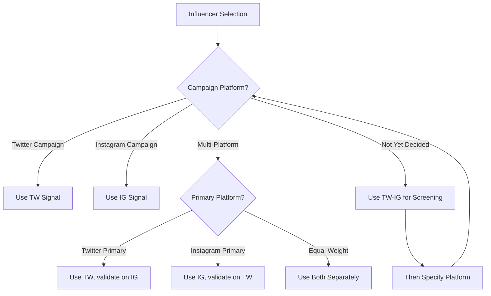
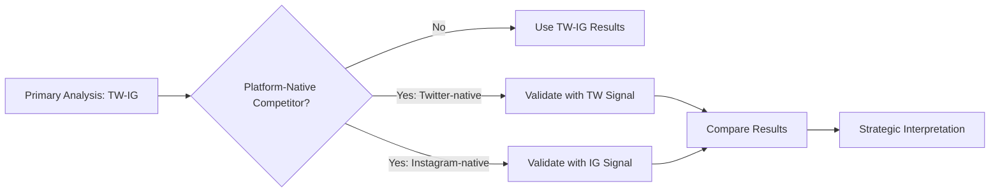
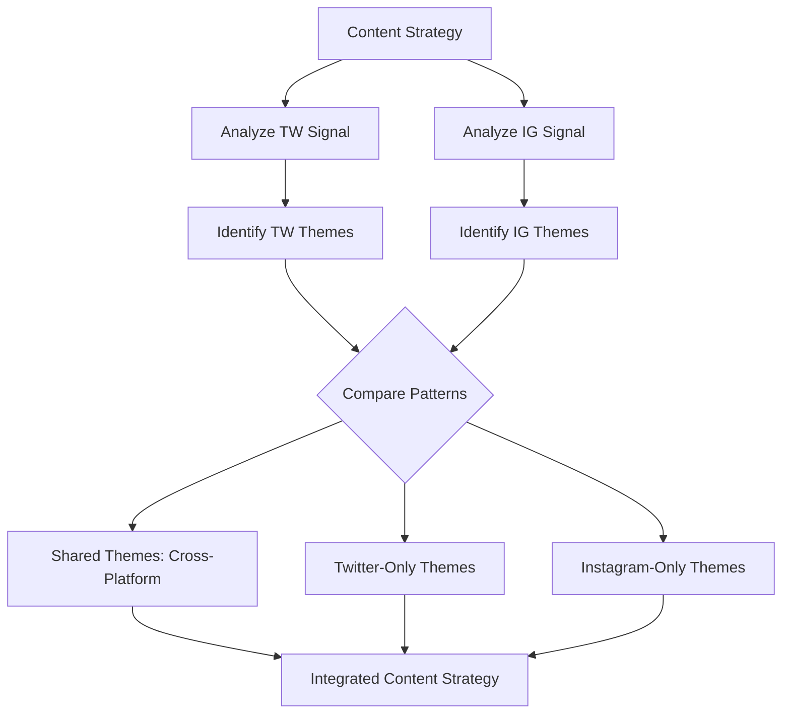
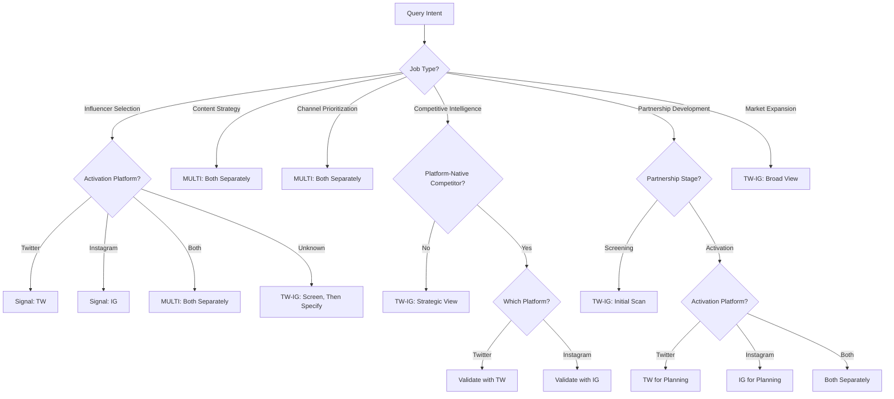

# Signal Strategy: Twitter, Instagram, or Combined?

## **Introduction: The Most Important Tactical Decision**

You have three signals available:

- **TW**: Twitter follow behavior
- **IG**: Instagram follow behavior (via lookalike matching)
- **TW-IG**: Combined signal (Twitter follow OR Instagram follow)

The signal you choose **fundamentally shapes the insights you get**. Choose wrong, and you'll:

- Miss platform-specific behaviors
- Get diluted insights from averaging
- Make recommendations for the wrong platform
- Misunderstand your competitive landscape

Choose right, and you'll:

- Capture true audience behavior
- Generate actionable, platform-specific insights
- Make confident tactical decisions
- Understand competitive dynamics accurately

 **This article answers**: When do you use TW, when do you use IG, when do you use TW-IG, and when do you use multiple signals separately? 

This is not a theoretical question. It's the **most important tactical decision** in your system architecture. Get this right, and everything else follows. Get it wrong, and even perfect execution won't deliver good results.

---

## **1. What Each Signal Reveals**

Before we can choose intelligently, we need to understand what each signal actually tells us.

### **1.1 Twitter Signal (TW): The Information-Seeking Audience**

 **Twitter follow behavior reveals**: What people want to stay informed about, who they consider credible sources, what professional interests they have. 

**Audience characteristics**:

- Text-heavy engagement (reading, sharing, commenting)
- News and information seeking
- Professional discourse and networking
- Real-time conversation and debate
- Older demographic skew (Gen X, Boomers)

**What shows up strongly in TW signal**:

<div class="grid-3"> <div>

**News & Media**

- NYT, WSJ, CNN
- Industry publications
- Journalists
- News aggregators

</div> <div>

**Professional Content**

- Thought leaders
- Business influencers
- Industry analysts
- Company accounts

</div> <div>

**Niche Communities**

- Specific interest groups
- Technical discussions
- Policy debates
- Expert networks

</div> </div>

**What shows up weakly in TW signal**:

- Visual-first brands (fashion, beauty, lifestyle)
- Entertainment and celebrity culture
- Aspirational lifestyle content
- Product aesthetics and design

**Example: Running brand audience on Twitter**

```
High affinity items:
- Runner's World (12x) - trusted editorial source
- NYT (1.4x at 60% reach) - news consumption
- Elite runners (20-30x) - credible authorities
- Marathon events (20x) - community participation
- Training science content (high engagement)

Insight: This audience uses Twitter for information, credibility, community discourse.
```

### **1.2 Instagram Signal (IG): The Aspiration-Driven Audience**

 **Instagram follow behavior reveals**: What people aspire to, what aesthetics resonate, what lifestyle they identify with, what they want to purchase. 

**Audience characteristics**:

- Visual-first engagement (photos, stories, reels)
- Lifestyle inspiration and aspiration
- Shopping and product discovery
- Influencer culture and parasocial relationships
- Younger demographic skew (Gen Z, Millennials)

**What shows up strongly in IG signal**:

<div class="grid-3"> <div>

**Visual Brands**

- Fashion labels
- Beauty products
- Home decor
- Food & beverage

</div> <div>

**Lifestyle Content**

- Influencers
- Travel accounts
- Fitness inspiration
- Aesthetic content

</div> <div>

**Shopping**

- DTC brands
- E-commerce
- Product reviews
- Unboxing content

</div> </div>

**What shows up weakly in IG signal**:

- News and journalism
- Text-heavy thought leadership
- Professional networking
- Technical/analytical content

**Example: Same running brand audience on Instagram**

```
High affinity items:
- Running lifestyle influencers (15-25x)
- Athleisure brands (10-20x)
- Wellness aesthetics (meditation, recovery, self-care)
- Home workout equipment (visual appeal)
- Fitness transformation content

Insight: This audience uses Instagram for inspiration, community, lifestyle integration.
```

### **1.3 Combined Signal (TW-IG): The Comprehensive View**

 **Combined signal reveals**: Broad audience patterns, comprehensive competitive landscape, platform-agnostic insights. 

**How it's constructed**:

```
For each Twitter user:
  1. Find Instagram lookalike (optimization-based matching)
  2. Combine follows: Twitter follow OR Instagram lookalike follow
  3. Result: Broader follow pattern across both platforms
```

**What you gain**:

- ✅ **Broader coverage**: Captures behavior across both platforms
- ✅ **Completeness**: Don't miss items only present on one platform
- ✅ **Platform-agnostic insights**: Strategic view independent of platform
- ✅ **Robustness**: Less sensitive to platform-specific fluctuations

**What you lose**:

- ❌ **Platform specificity**: Can't tell which behavior happens where
- ❌ **Behavioral nuance**: Averages out platform-specific patterns
- ❌ **Lookalike noise**: IG lookalike matching introduces uncertainty
- ❌ **Actionability**: Harder to create platform-specific strategies

**Example: Same running brand on combined signal**

```
High affinity items:
- Running brands (both platforms combined)
- News sources (Twitter primarily)
- Lifestyle content (Instagram primarily)
- Averaged behavioral patterns

Insight: Comprehensive view, but platform-specific nuances are hidden.
```

---

## **2. The Default Signal Question**

 **The tempting default**: "Let's just always use TW-IG. It's comprehensive, covers both platforms, simple to communicate."

**The reality**: This is often wrong. 

### **2.1 Arguments FOR TW-IG as Default**



**Claim**: TW-IG captures the full picture by combining both platforms.

**When this is valid**:

- Strategic competitive analysis (who are we competing with broadly?)
- Market sizing (how large is the addressable audience?)
- Partnership screening (initial broad scan for opportunities)

**Example**:

```
Question: "How big is the market for recovery footwear?"

TW signal: 150K engaged users
IG signal: 200K engaged users (via lookalikes)
TW-IG signal: 280K engaged users (some overlap between TW and IG audiences)

Answer: Total addressable market is ~280K engaged users.
```

This is the right signal for this question. 



**Claim**: One signal is easier to communicate and maintain.

**When this is valid**:

- Executive summaries (high-level strategic view)
- Initial exploration (understanding the space)
- Non-technical stakeholders (simplify the story)

**Example**:

```
Executive Summary:
"StrideRecover's audience shows 31x affinity for running brands, 
 8x affinity for organic foods, 100x affinity for premium mattresses."

Using TW-IG signal simplifies communication.
```





**Claim**: Combined signal is less sensitive to platform-specific changes.

**When this is valid**:

- Long-term tracking (platform popularity shifts over time)
- Platform decline scenarios (if Twitter usage drops, IG compensates)
- Stable strategic insights (platform-agnostic patterns)

**Example**:

```
If Twitter engagement declines 20% over next year,
TW signal becomes less reliable.
TW-IG signal remains robust (IG compensates).
```



### **2.2 Arguments AGAINST TW-IG as Default**



**Problem**: You can't tell which behavior happens on which platform.

**Why this matters**:

```
TW-IG signal shows:
- News sources: 1.4x affinity (averaged across platforms)

Reality:
- TW signal: News sources 2.0x affinity (strong)
- IG signal: News sources 0.8x affinity (weak)

If you're planning a content strategy, you need to know:
- On Twitter: Share news, current events, analysis
- On Instagram: DON'T share news (audience doesn't engage)

TW-IG signal hides this critical difference.
```





**Problem**: Instagram data comes via lookalike matching, which introduces uncertainty.

**How lookalike matching works**:

```
1. Twitter User A has certain characteristics (demographics, behaviors)
2. Algorithm finds Instagram User A' with similar characteristics
3. Assumption: User A and User A' have similar interests
4. TW-IG signal combines: Twitter follows of A + Instagram follows of A'
```

**Sources of error**:

- Matching quality varies (some matches are better than others)
- A and A' are similar but not identical
- Platform behavior differs even for same person

**Impact**:

```
If matching quality is 80%:
- 80% of Instagram follows correctly represent Twitter user's interests
- 20% of Instagram follows are noise

This noise dilutes the signal in TW-IG.
```





**Problem**: You can't create platform-specific strategies with platform-agnostic insights.

**Example**: Influencer selection

```
Question: "Find influencers for Instagram campaign"

TW-IG signal says:
- @RunningCoach has 35% reach, 30x affinity ✓

But wait:
- On Twitter: @RunningCoach has 50% reach, 45x affinity
- On Instagram: @RunningCoach has 8% reach, 12x affinity

For an Instagram campaign, TW-IG signal misleads you.
The high affinity comes from Twitter, not Instagram.

Correct signal for Instagram campaign: IG signal
Correct answer: @RunningCoach is not a good Instagram influencer for this audience.
```



### **2.3 The Verdict: Context-Dependent Default**

 **Recommendation**: There is no universal default. Signal choice depends on:

1. The job to be done
2. The activation platform
3. The brand context 

## **3. Signal Selection by Job To Be Done**

Different JTBDs require different signals. Here's the complete decision framework.

### **3.1 Influencer Selection**

 **Rule**: Use the signal that matches the **activation platform**. 

**Decision tree**:

mermaid



**Rationale**:

An influencer's value comes from **where their audience actually engages**. If you're running an Instagram campaign, you need Instagram audience data, not Twitter data.

**Example workflow**:

python

```python
# Instagram campaign for StrideRecover
signal = "IG"  # Campaign activates on Instagram

# Get Instagram influencer candidates
candidates = data_layer.get_cluster_items(
    cluster="fitness_influencers",
    platform="instagram"
)

# Calculate overlap using IG signal
overlaps = api.batch_get_overlap(
    audience_id=stride_audience,
    items=candidates,
    signal="IG"  # Must match campaign platform
)

# Result: Influencers ranked by Instagram audience overlap
# NOT Twitter overlap (which would be wrong for IG campaign)
```

**Bad example** (common mistake):

python

```python
# WRONG: Instagram campaign but using combined signal
signal = "TW-IG"  # Wrong!

overlaps = api.batch_get_overlap(
    audience_id=stride_audience,
    items=candidates,
    signal="TW-IG"
)

# Problem: High overlap might come from Twitter, not Instagram
# Influencer looks good but has weak Instagram audience
# Campaign fails despite "good data"
```

### **3.2 Competitive Intelligence**

 **Rule**: Use **TW-IG** for broad strategic view. Use platform-specific signals for validation or platform-native competitors. 

**Recommended approach**:

mermaid



**Why TW-IG works here**:

Competitive intelligence asks: "Who are we competing with **broadly** for audience attention?"

The answer should be platform-agnostic because:

- Competitors exist across platforms
- Audience allocates attention across platforms
- Strategic positioning isn't platform-specific

**Example**:

python

```python
# Competitive landscape analysis for StrideRecover
signal = "TW-IG"  # Broad view

competitors = [
    "ComfyCasual",
    "RecoveryBrand1", 
    "RecoveryBrand2",
    "CompetitorX"
]

landscape = []
for competitor in competitors:
    overlap = api.get_overlap(
        audience=stride_audience,
        item=competitor,
        signal="TW-IG"
    )
    
    landscape.append({
        "competitor": competitor,
        "reach": overlap.reach,
        "penetration": overlap.penetration,
        "quadrant": classify_quadrant(overlap.reach, overlap.penetration)
    })

# Result: Strategic competitive map
# Shows who we're competing with across platforms
```

**When to use platform-specific validation**:

If a competitor is **platform-native** (only exists on one platform), check that specific signal:

python

```python
# Example: TikTok-first competitor analysis
# They don't have meaningful Twitter presence

# Primary analysis (TW-IG)
overlap_combined = api.get_overlap(
    audience=stride_audience,
    item="TikTokCompetitor",
    signal="TW-IG"
)

# Validation (IG signal, closer to TikTok audience)
overlap_ig = api.get_overlap(
    audience=stride_audience,
    item="TikTokCompetitor", 
    signal="IG"
)

# If overlap_combined ≫ overlap_ig, 
# then the overlap is coming from Twitter lookalikes (noise)
# Actual competitive threat is lower than TW-IG suggests
```

### **3.3 Content Strategy**

 **Rule**: Use **both signals separately** and compare. Content performs differently on each platform. 

**Why both signals matter**:

Content strategy requires understanding:

- What content resonates **on Twitter** (text, news, debates)
- What content resonates **on Instagram** (visuals, lifestyle, aesthetics)
- These are often **very different**

**Recommended workflow**:

mermaid



**Example implementation**:

python

```python
class ContentStrategyAnalyzer:
    def analyze_platform_specific_content(self, audience_id):
        """Analyze content themes separately by platform"""
        
        # Get top affinities on Twitter
        tw_affinities = api.get_top_affinities(
            audience_id=audience_id,
            signal="TW",
            min_affinity=5.0,
            limit=100
        )
        
        # Get top affinities on Instagram
        ig_affinities = api.get_top_affinities(
            audience_id=audience_id,
            signal="IG",
            min_affinity=5.0,
            limit=100
        )
        
        # Cluster into themes (platform-specific)
        tw_themes = llm.identify_themes(tw_affinities, platform="Twitter")
        ig_themes = llm.identify_themes(ig_affinities, platform="Instagram")
        
        # Compare
        comparison = self.compare_themes(tw_themes, ig_themes)
        
        return {
            "twitter": tw_themes,
            "instagram": ig_themes,
            "comparison": comparison
        }
    
    def compare_themes(self, tw_themes, ig_themes):
        """Find shared vs. platform-specific themes"""
        shared = []
        tw_only = []
        ig_only = []
        
        for tw_theme in tw_themes:
            match = self.find_matching_theme(tw_theme, ig_themes)
            if match:
                shared.append({
                    "theme": tw_theme.name,
                    "twitter_strength": tw_theme.strength,
                    "instagram_strength": match.strength
                })
            else:
                tw_only.append(tw_theme)
        
        for ig_theme in ig_themes:
            if not self.find_matching_theme(ig_theme, tw_themes):
                ig_only.append(ig_theme)
        
        return {
            "shared_themes": shared,
            "twitter_only": tw_only,
            "instagram_only": ig_only
        }
```

**Example output** (StrideRecover):

<div class="grid-3"> <div>

**Twitter Themes**

1. Running Science & Training (18x)
    - Training plans
    - Injury prevention
    - Performance data
2. News & Analysis (1.4x)
    - Marathon results
    - Industry news
    - Research updates
3. Expert Commentary (12x)
    - Elite runners
    - Coaches
    - Sports medicine

</div> <div>

**Instagram Themes**

1. Running Lifestyle (22x)
    - Gear aesthetics
    - Running locations
    - Post-run recovery
2. Wellness Integration (15x)
    - Home comfort
    - Meal prep
    - Self-care
3. Visual Inspiration (10x)
    - Transformation photos
    - Running photography
    - Community moments

</div> <div>

**Strategy Implications**

**Twitter Content:**

- Training tips
- Race analysis
- Expert Q&As
- Scientific studies

**Instagram Content:**

- Product photography
- Lifestyle integration
- Recovery routines
- Community stories

**Cross-Platform:**

- Race preparation
- Recovery importance

</div> </div>

 **Don't make this mistake**: Using TW-IG for content strategy averages out the platform differences. You'll create generic content that doesn't excel on either platform. 

### **3.4 Channel Prioritization**

 **Rule**: Use **both signals separately** to understand platform-specific behavior and allocate budget accordingly. 

**Why this matters**:

Your audience might:

- Over-index on Twitter for certain behaviors
- Over-index on Instagram for other behaviors
- Allocate attention differently by platform

**Decision framework**:

python

```python
class ChannelAnalyzer:
    def analyze_platform_affinity(self, audience_id):
        """Compare platform-specific affinity patterns"""
        
        results = {}
        
        for platform, signal in [("Twitter", "TW"), ("Instagram", "IG")]:
            # Get platform-specific affinities
            affinities = api.get_top_affinities(
                audience_id=audience_id,
                signal=signal,
                category="Media & Platforms",
                limit=50
            )
            
            results[platform] = {
                "platform_affinity": self.calculate_platform_affinity(affinities),
                "content_preferences": self.identify_content_types(affinities),
                "influencer_types": self.classify_influencers(affinities)
            }
        
        # Generate channel recommendations
        recommendations = self.generate_channel_recommendations(results)
        
        return recommendations
    
    def calculate_platform_affinity(self, affinities):
        """Calculate overall platform engagement"""
        # Look for platform-specific indicators
        indicators = {
            "Twitter": ["news", "journalism", "analysis", "threads"],
            "Instagram": ["visual", "lifestyle", "photos", "stories"]
        }
        
        # Calculate weighted affinity
        # ... implementation
```

**Example output** (StrideRecover):

|Platform Behavior|Twitter Signal|Instagram Signal|Implication|
|---|---|---|---|
|**News consumption**|High (NYT 1.4x at 60% reach)|Low (NYT 0.6x at 15% reach)|Allocate news-focused content to Twitter|
|**Lifestyle content**|Low (lifestyle influencers 0.8x)|High (lifestyle influencers 4.2x)|Allocate lifestyle content to Instagram|
|**Product discovery**|Medium (brands 2.5x)|High (DTC brands 5.8x)|Instagram is better for product launches|
|**Expert content**|Very high (elite athletes 30x)|Medium (elite athletes 12x)|Twitter for thought leadership|

**Budget allocation based on signals**:

python

```python
# Traditional approach (ignoring signals)
budget = {
    "Twitter": 0.25,  # 25% of social budget
    "Instagram": 0.25  # 25% of social budget
}

# Signal-informed approach
budget = {
    "Twitter": {
        "allocation": 0.20,  # 20% of social budget
        "focus": ["news", "expert_content", "training_science"],
        "rationale": "Strong expert/news affinity (TW signal)"
    },
    "Instagram": {
        "allocation": 0.30,  # 30% of social budget
        "focus": ["lifestyle", "product", "visual_stories"],
        "rationale": "Strong lifestyle/shopping affinity (IG signal)"
    }
}
```

### **3.5 Partnership Development**

 **Rule**: Use **TW-IG for screening**, then **platform-specific signals for activation planning**. 

**Two-phase approach**:

**Phase 1: Broad screening (TW-IG)**

Identify potential partners based on overall audience alignment:

python

```python
# Phase 1: Cast wide net
signal = "TW-IG"

# Get high-affinity non-competing brands
potential_partners = api.get_top_affinities(
    audience_id=stride_audience,
    signal=signal,
    min_affinity=10.0,
    limit=200
)

# Filter for non-competitive
partnerships = [
    p for p in potential_partners
    if not is_competitor(p) and is_complementary(p)
]

# Top candidates from broad screening:
# - Nuun Hydration (83x affinity)
# - PRO Compression (119x affinity)
# - Serta Mattress (100x affinity)
```

**Phase 2: Platform-specific validation**

For each promising partner, analyze where the partnership should activate:

python

````python
# Phase 2: Platform-specific analysis
for partner in partnerships[:10]:  # Top 10 candidates
    
    # Check Twitter signal
    tw_overlap = api.get_overlap(
        audience=stride_audience,
        item=partner,
        signal="TW"
    )
    
    # Check Instagram signal
    ig_overlap = api.get_overlap(
        audience=stride_audience,
        item=partner,
        signal="IG"
    )
    
    # Determine activation strategy
    if tw_overlap.affinity > ig_overlap.affinity * 1.5:
        activation = "Twitter-focused partnership"
    elif ig_overlap.affinity > tw_overlap.affinity * 1.5:
        activation = "Instagram-focused partnership"
    else:
        activation = "Multi-platform partnership"
    
    partnership_plan = {
        "partner": partner,
        "activation": activation,
        "twitter_strength": tw_overlap.affinity,
        "instagram_strength": ig_overlap.affinity
    }
```

**Example**: Nuun Hydration partnership
```
Phase 1 (TW-IG signal):
- 83x affinity, 23.1% reach
- Verdict: Strong partnership candidate ✓

Phase 2 (Platform-specific):
TW signal:
- 95x affinity, 28% reach
- High Twitter engagement

IG signal:
- 65x affinity, 18% reach
- Moderate Instagram engagement

Recommendation:
- Primary activation: Twitter (higher affinity)
- Strategy: Co-create educational content about hydration science
- Twitter focus: Share research, expert commentary
- Instagram secondary: Visual product integration

Wrong approach:
- Using only TW-IG (wouldn't know which platform to prioritize)
````

### **3.6 Market Expansion**

 **Rule**: Use **TW-IG** for broad opportunity discovery. Platform-specific signals usually don't matter for expansion strategy. 

**Rationale**:

Market expansion asks: "What adjacent categories show validated audience interest?"

This is a **strategic question** about product-market fit, not a **tactical question** about channel execution.

**Example workflow**:

python

````python
# Market expansion for StrideRecover
signal = "TW-IG"  # Broad view appropriate here

# Explore adjacent categories
categories = [
    "Compression Gear",
    "Sports Nutrition",
    "Sleep Products",
    "Home Comfort",
    "Fitness Tracking"
]

expansion_opportunities = []

for category in categories:
    # Get category-level affinity
    category_items = data_layer.get_items_in_category(category)
    
    affinities = []
    for item in category_items[:20]:  # Sample top items
        overlap = api.get_overlap(
            audience=stride_audience,
            item=item,
            signal=signal
        )
        affinities.append(overlap.affinity)
    
    avg_affinity = np.mean(affinities)
    total_reach = np.mean([o.reach for o in overlaps])
    
    expansion_opportunities.append({
        "category": category,
        "avg_affinity": avg_affinity,
        "reach": total_reach,
        "priority": self.calculate_priority(avg_affinity, total_reach)
    })

# Rank by priority
expansion_opportunities.sort(key=lambda x: x['priority'], reverse=True)
```

**Why platform-specific doesn't matter**:
```
Question: Should StrideRecover expand into compression gear?

TW-IG signal: 119x affinity, 12.7% reach → Strong opportunity ✓

TW signal: 130x affinity, 15% reach
IG signal: 95x affinity, 10% reach

Does platform breakdown change the decision?
No. High affinity on both platforms validates the opportunity.

The expansion decision is platform-agnostic.
Product launch strategy might be platform-specific, but that's a later question.
````

## **4. Platform Divergence: When Signals Tell Different Stories**

Sometimes Twitter and Instagram signals reveal dramatically different patterns. Detecting and understanding this divergence is critical.

### **4.1 Detecting Divergence**

python

```python
class DivergenceAnalyzer:
    def analyze_signal_divergence(self, audience_id, items):
        """
        Identify items with significant platform divergence.
        """
        divergent_items = []
        
        for item in items:
            # Get both signals
            tw_overlap = api.get_overlap(audience_id, item, signal="TW")
            ig_overlap = api.get_overlap(audience_id, item, signal="IG")
            
            # Calculate divergence metrics
            affinity_ratio = tw_overlap.affinity / (ig_overlap.affinity + 0.01)
            reach_diff = abs(tw_overlap.reach - ig_overlap.reach)
            
            # Flag high divergence
            if affinity_ratio > 2.0 or affinity_ratio < 0.5 or reach_diff > 0.15:
                divergent_items.append({
                    "item": item,
                    "tw_affinity": tw_overlap.affinity,
                    "ig_affinity": ig_overlap.affinity,
                    "affinity_ratio": affinity_ratio,
                    "tw_reach": tw_overlap.reach,
                    "ig_reach": ig_overlap.reach,
                    "reach_diff": reach_diff,
                    "interpretation": self.interpret_divergence(
                        tw_overlap, ig_overlap
                    )
                })
        
        return divergent_items
    
    def interpret_divergence(self, tw_overlap, ig_overlap):
        """Interpret what divergence means"""
        ratio = tw_overlap.affinity / (ig_overlap.affinity + 0.01)
        
        if ratio > 2.0:
            return "Twitter-dominant: audience engages primarily on Twitter"
        elif ratio < 0.5:
            return "Instagram-dominant: audience engages primarily on Instagram"
        elif abs(tw_overlap.reach - ig_overlap.reach) > 0.15:
            return "Reach divergence: different audience penetration"
        else:
            return "Balanced: similar engagement on both platforms"
```

### **4.2 Divergence Patterns**



**Typical divergence**:

- High Twitter affinity
- Low Instagram affinity

**Example**:

|Item|TW Affinity|TW Reach|IG Affinity|IG Reach|Interpretation|
|---|---|---|---|---|---|
|**NYT**|2.0x|60%|0.6x|15%|Twitter-dominant news consumption|
|**WSJ**|1.8x|45%|0.5x|12%|Twitter-dominant professional content|
|**CNN**|1.6x|58%|0.7x|20%|Twitter-dominant news|

**Why**: News consumption happens primarily on Twitter (text, real-time, discourse). Instagram is visual and lifestyle-focused.

**Implication**: For news-related content strategy, Twitter signal is much more relevant than IG or TW-IG. 



**Typical divergence**:

- Low Twitter affinity
- High Instagram affinity

**Example**:

|Item|TW Affinity|TW Reach|IG Affinity|IG Reach|Interpretation|
|---|---|---|---|---|---|
|**Fashion Brands**|0.8x|12%|4.5x|45%|Instagram-dominant visual appeal|
|**Beauty Influencers**|0.6x|8%|6.2x|38%|Instagram-dominant lifestyle|
|**Home Decor**|0.9x|15%|5.8x|42%|Instagram-dominant aesthetics|

**Why**: Visual brands thrive on Instagram's visual-first platform. Twitter's text focus doesn't suit them.

**Implication**: For visual brand partnerships, Instagram signal is much more relevant. 



**Typical pattern**:

- Similar affinity on both platforms
- Similar reach on both platforms

**Example**:

|Item|TW Affinity|TW Reach|IG Affinity|IG Reach|Interpretation|
|---|---|---|---|---|---|
|**Nike**|8.2x|42%|7.8x|40%|True cross-platform brand|
|**Starbucks**|2.5x|55%|2.3x|52%|Ubiquitous brand, platform-agnostic|
|**Amazon**|3.8x|40%|3.6x|38%|Platform-agnostic shopping|

**Why**: These brands have strong presence and engagement across both platforms.

**Implication**: TW-IG signal works well for these items. Platform-specific analysis adds little value. 

### **4.3 Using Divergence Insights**

**Content strategy implications**:

python

````python
# Identify highly divergent items
divergent = analyzer.analyze_signal_divergence(
    audience_id=stride_audience,
    items=top_100_affinities
)

# Separate by divergence type
twitter_dominant = [d for d in divergent if d['affinity_ratio'] > 2.0]
instagram_dominant = [d for d in divergent if d['affinity_ratio'] < 0.5]
balanced = [d for d in divergent if 0.7 < d['affinity_ratio'] < 1.5]

# Generate platform-specific strategies
strategy = {
    "twitter_content": {
        "themes": extract_themes(twitter_dominant),
        "focus": "News, expert commentary, training science",
        "format": "Text, threads, links"
    },
    "instagram_content": {
        "themes": extract_themes(instagram_dominant),
        "focus": "Lifestyle, visual inspiration, product aesthetics",
        "format": "Photos, stories, reels"
    },
    "cross_platform_content": {
        "themes": extract_themes(balanced),
        "focus": "Brand stories, community, shared values",
        "format": "Adaptable to both platforms"
    }
}
```

---

## **5. The Lookalike Matching Question**

The combined signal (TW-IG) relies on **lookalike matching**: finding Instagram users similar to Twitter users. This introduces uncertainty.

### **5.1 How Lookalike Matching Works**
```
Step 1: Characterize Twitter User
- Demographics: age, gender, location
- Behaviors: follow patterns, engagement types
- Interests: inferred from follows

Step 2: Find Similar Instagram User
- Optimization algorithm finds Instagram user with:
  * Similar demographics
  * Similar behavioral patterns
  * Similar interest signals

Step 3: Combine Signals
- TW-IG[user] = TW_follows[user] ∪ IG_follows[lookalike]
```

### **5.2 Sources of Uncertainty**



Not all matches are equally good.

**High-quality match**:
```
Twitter User A:
- Female, 35-44, urban, college-educated
- Follows: running brands, news, wellness
- Engagement: high with fitness content

Instagram Lookalike A':
- Female, 35-44, urban, college-educated  
- Follows: running brands, wellness, lifestyle
- Engagement: high with fitness content

Match quality: ~90%
```

**Lower-quality match**:
```
Twitter User B:
- Male, 25-34, suburban, college-educated
- Follows: tech brands, startups, crypto
- Engagement: high with tech content

Instagram Lookalike B':
- Male, 25-34, suburban, college-educated
- Follows: fashion, travel, food
- Engagement: high with lifestyle content

Match quality: ~60% (demographics match, interests don't)
```

**Impact on TW-IG signal**:
- High-quality matches: TW-IG signal is reliable
- Low-quality matches: TW-IG signal includes noise




Even the *same person* behaves differently on Twitter vs. Instagram.

**Example**:
```
Same Person, Two Platforms:

Twitter behavior:
- Follows: news outlets, thought leaders, professional content
- Engages: shares articles, debates, professional networking

Instagram behavior:
- Follows: friends, lifestyle influencers, brands
- Engages: likes photos, watches stories, shops

Even with perfect matching, combining these creates a hybrid that may not represent either platform well.
```




Not all Twitter users have good Instagram lookalikes.

**Scenarios**:
- Twitter-only user types (journalists, policy experts, academics)
- Demographics uncommon on Instagram (older Boomers, B2B professionals)
- Niche interests not well-represented on Instagram

**Impact**:
```
If 20% of Twitter users have poor Instagram lookalikes,
then TW-IG signal for those users is essentially just TW signal + noise.
````



### **5.3 When Lookalike Noise Matters**

 **High-stakes decisions** with **platform-specific execution** are most sensitive to lookalike noise. 

**High risk scenarios**:

1. **Instagram influencer selection**: Lookalike noise can recommend wrong influencers
2. **Instagram content strategy**: Combining signals obscures Instagram-specific patterns
3. **Instagram ad targeting**: Wrong lookalikes → wrong targeting → wasted spend

**Lower risk scenarios**:

1. **Strategic competitive analysis**: Broad patterns matter more than precision
2. **Market sizing**: Coverage breadth matters more than individual accuracy
3. **Partnership screening**: Initial filter, not final decision

**Recommendation**:

python

```python
class SignalQualityAssessor:
    def assess_lookalike_risk(self, job_type, activation_platform):
        """Assess whether lookalike noise is a concern"""
        
        high_risk_jobs = [
            "influencer_selection",
            "content_strategy",
            "channel_prioritization"
        ]
        
        if job_type in high_risk_jobs and activation_platform == "instagram":
            return {
                "risk": "HIGH",
                "recommendation": "Use IG signal, not TW-IG",
                "reason": "Lookalike noise affects Instagram-specific decisions"
            }
        
        elif job_type in ["competitive_intelligence", "market_expansion"]:
            return {
                "risk": "LOW",
                "recommendation": "TW-IG acceptable",
                "reason": "Strategic decisions less sensitive to individual noise"
            }
        
        else:
            return {
                "risk": "MEDIUM",
                "recommendation": "Use TW-IG, validate with platform-specific",
                "reason": "Moderate sensitivity to noise"
            }
```

---

## **6. Decision Framework: Complete Signal Selection Logic**

Putting it all together, here's the complete decision framework.

### **6.1 The Decision Tree**

mermaid



### **6.2 Implementation**

python

```python
class SignalSelector:
    """Complete signal selection logic"""
    
    def select_signal(
        self,
        job_type: JobType,
        activation_platform: Optional[str] = None,
        brand_context: Optional[dict] = None,
        constraints: Optional[dict] = None
    ) -> Union[str, List[str]]:
        """
        Select appropriate signal(s) for query.
        
        Returns:
            str: Single signal ("TW", "IG", "TW-IG")
            List[str]: Multiple signals to use separately
        """
        
        # Influencer Selection
        if job_type == JobType.INFLUENCER_SELECTION:
            return self._select_for_influencer(activation_platform)
        
        # Content Strategy
        elif job_type == JobType.CONTENT_STRATEGY:
            return ["TW", "IG"]  # Use both separately
        
        # Channel Prioritization
        elif job_type == JobType.CHANNEL_PRIORITIZATION:
            return ["TW", "IG"]  # Use both separately
        
        # Competitive Intelligence
        elif job_type == JobType.COMPETITIVE_INTELLIGENCE:
            competitors = constraints.get('competitors', [])
            return self._select_for_competitive(competitors, brand_context)
        
        # Partnership Development
        elif job_type == JobType.PARTNERSHIP_DEVELOPMENT:
            stage = constraints.get('stage', 'screening')
            if stage == 'screening':
                return "TW-IG"
            else:
                return self._select_for_activation(activation_platform)
        
        # Market Expansion
        elif job_type == JobType.MARKET_EXPANSION:
            return "TW-IG"
        
        # Default
        else:
            return "TW-IG"
    
    def _select_for_influencer(self, platform):
        """Signal selection for influencer selection"""
        if platform == "twitter":
            return "TW"
        elif platform == "instagram":
            return "IG"
        elif platform == "both":
            return ["TW", "IG"]
        else:
            # Platform not specified: screen with TW-IG
            return "TW-IG"
    
    def _select_for_competitive(self, competitors, brand_context):
        """Signal selection for competitive intelligence"""
        # Check if any competitors are platform-native
        platform_native = [
            c for c in competitors
            if self.is_platform_native(c, brand_context)
        ]
        
        if platform_native:
            # Need platform-specific validation
            return {
                "primary": "TW-IG",
                "validation": self._map_to_platforms(platform_native)
            }
        else:
            # All competitors cross-platform
            return "TW-IG"
    
    def _select_for_activation(self, platform):
        """Signal selection based on activation platform"""
        if platform == "twitter":
            return "TW"
        elif platform == "instagram":
            return "IG"
        elif platform == "both":
            return ["TW", "IG"]
        else:
            return "TW-IG"
```

### **6.3 Usage Examples**



python

```python
selector = SignalSelector()

# Instagram campaign
signal = selector.select_signal(
    job_type=JobType.INFLUENCER_SELECTION,
    activation_platform="instagram"
)
# Returns: "IG"

# Multi-platform campaign
signal = selector.select_signal(
    job_type=JobType.INFLUENCER_SELECTION,
    activation_platform="both"
)
# Returns: ["TW", "IG"]

# Platform TBD
signal = selector.select_signal(
    job_type=JobType.INFLUENCER_SELECTION,
    activation_platform=None
)
# Returns: "TW-IG" (for screening)
```





python

```python
# Content strategy always uses both separately
signal = selector.select_signal(
    job_type=JobType.CONTENT_STRATEGY
)
# Returns: ["TW", "IG"]

# Then execute separate analyses
tw_themes = analyze_content_themes(audience, signal="TW")
ig_themes = analyze_content_themes(audience, signal="IG")

# Compare and synthesize
strategy = synthesize_content_strategy(tw_themes, ig_themes)
```





python

```python
# Standard competitive analysis
signal = selector.select_signal(
    job_type=JobType.COMPETITIVE_INTELLIGENCE,
    constraints={"competitors": ["Brand1", "Brand2", "Brand3"]}
)
# Returns: "TW-IG"

# With platform-native competitor
signal = selector.select_signal(
    job_type=JobType.COMPETITIVE_INTELLIGENCE,
    constraints={"competitors": ["Brand1", "InstagramNativeBrand"]},
    brand_context={"platform_info": {...}}
)
# Returns: {
#     "primary": "TW-IG",
#     "validation": {"InstagramNativeBrand": "IG"}
# }
```



---

## **7. Future-Proofing: Adding New Signals**

Your system will evolve. TikTok, LinkedIn, purchase data, and other signals will be added. Design for extensibility now.

### **7.1 Heterogeneous Signal Types**

Not all signals can be combined:

**Combinable** (social follows):

- Twitter follows + Instagram follows → TW-IG
- Twitter follows + TikTok follows → TW-TT (future)
- Instagram follows + TikTok follows → IG-TT (future)

**Non-combinable** (different data types):

- Twitter follows + Purchase data (different semantics)
- Instagram follows + Survey responses (different semantics)
- Social follows + CRM data (different semantics)

**Architecture implications**:

python

```python
class SignalManager:
    """Manage multiple heterogeneous signals"""
    
    def __init__(self):
        self.signals = {
            # Social follow signals
            "social_follows": {
                "TW": TwitterFollowSignal(),
                "IG": InstagramFollowSignal(),
                "TW-IG": CombinedFollowSignal(["TW", "IG"]),
                # Future
                "TT": None,  # TikTok (when available)
                "LI": None,  # LinkedIn (when available)
            },
            
            # Purchase signals (future)
            "purchases": {
                "Amazon": None,
                "Target": None,
                "Brand_Site": None
            },
            
            # Survey signals (future)
            "surveys": {
                "NPS": None,
                "Brand_Health": None
            }
        }
    
    def get_available_signals(self, signal_type="social_follows"):
        """Get available signals of given type"""
        return [
            name for name, signal in self.signals[signal_type].items()
            if signal is not None
        ]
    
    def can_combine(self, signal1, signal2):
        """Check if two signals can be combined"""
        type1 = self.get_signal_type(signal1)
        type2 = self.get_signal_type(signal2)
        
        # Can only combine signals of same type
        return type1 == type2 and type1 == "social_follows"
    
    def combine_signals(self, signals: List[str]) -> str:
        """Create combined signal name"""
        if not all(self.can_combine(signals[0], s) for s in signals[1:]):
            raise ValueError("Cannot combine heterogeneous signals")
        
        return "-".join(sorted(signals))
```

### **7.2 Signal Selection with New Sources**

When TikTok is added:

python

```python
class ExtendedSignalSelector(SignalSelector):
    """Signal selector supporting future signals"""
    
    def select_signal(
        self,
        job_type: JobType,
        activation_platform: Optional[str] = None,
        **kwargs
    ):
        """Extended signal selection"""
        
        # Map platform to signal
        platform_signal_map = {
            "twitter": "TW",
            "instagram": "IG",
            "tiktok": "TT",  # New
            "linkedin": "LI",  # New
        }
        
        # Influencer selection
        if job_type == JobType.INFLUENCER_SELECTION:
            if activation_platform in platform_signal_map:
                return platform_signal_map[activation_platform]
            elif activation_platform == "social_broad":
                # Use combined social signal
                return "TW-IG-TT"  # Future: all social platforms
            else:
                return "TW-IG"  # Current default
        
        # Content strategy: always use separately
        elif job_type == JobType.CONTENT_STRATEGY:
            available_social = self.signal_manager.get_available_signals("social_follows")
            return [s for s in available_social if "-" not in s]  # Singles only
        
        # ... other job types
```

### **7.3 Multi-Signal Synthesis**

When signals can't be combined, synthesize insights via LLM:

python

```python
class MultiSignalSynthesizer:
    """Synthesize insights from heterogeneous signals"""
    
    async def synthesize_insights(
        self,
        audience_id: str,
        signals: Dict[str, str]  # signal_type -> signal_name
    ):
        """
        Combine insights from multiple signal types.
        
        Example:
            signals = {
                "social_follows": "TW-IG",
                "purchases": "Amazon",
                "surveys": "NPS"
            }
        """
        
        insights_by_signal = {}
        
        # Get insights from each signal
        for signal_type, signal_name in signals.items():
            insights = await self.get_signal_insights(
                audience_id,
                signal_type,
                signal_name
            )
            insights_by_signal[signal_type] = insights
        
        # LLM synthesis
        synthesis = await self.llm.synthesize_multi_signal(
            insights_by_signal
        )
        
        return synthesis
    
    async def get_signal_insights(self, audience_id, signal_type, signal_name):
        """Get insights from specific signal"""
        if signal_type == "social_follows":
            return await self.get_follow_insights(audience_id, signal_name)
        elif signal_type == "purchases":
            return await self.get_purchase_insights(audience_id, signal_name)
        elif signal_type == "surveys":
            return await self.get_survey_insights(audience_id, signal_name)
```

---

## **8. Implementation Checklist**



- [ ]  Implement `SignalSelector` class with decision logic
- [ ]  Define signal selection rules for each JTBD
- [ ]  Create signal validation functions
- [ ]  Add signal parameter to all API calls
- [ ]  Test signal selection for each JTBD pattern

**Deliverable**: Working signal selection for all current JTBDs 



- [ ]  Implement `DivergenceAnalyzer` class
- [ ]  Create divergence metrics (affinity ratio, reach diff)
- [ ]  Build divergence reporting functions
- [ ]  Test on known divergent items (news outlets, visual brands)
- [ ]  Document divergence patterns

**Deliverable**: Automatic detection of platform-specific patterns 



- [ ]  Implement workflows that use both TW and IG separately
- [ ]  Create signal comparison utilities
- [ ]  Build cross-signal synthesis functions
- [ ]  Add UI for displaying multi-signal results
- [ ]  Test on content strategy and channel prioritization

**Deliverable**: Support for parallel signal analysis 



- [ ]  Add signal quality metrics
- [ ]  Monitor lookalike matching quality (if accessible)
- [ ]  Track signal divergence frequency
- [ ]  Create alerts for unexpected signal patterns
- [ ]  Dashboard for signal usage and quality

**Deliverable**: Visibility into signal quality and usage 



- [ ]  Document signal selection rules
- [ ]  Create decision flowcharts for each JTBD
- [ ]  Write user guide for signal strategy
- [ ]  Train team on when to use which signal
- [ ]  Create examples and case studies

**Deliverable**: Team knowledge and best practices 

---

## **9. Common Mistakes & How to Avoid Them**

 **Mistake 1: Default to TW-IG for Everything**

**Why it's wrong**: Platform-specific insights are lost, lookalike noise affects precision.

**How to avoid**: Use the decision framework. Ask: "Does platform matter for this decision?" 

 **Mistake 2: Use TW-IG for Instagram Campaign Influencer Selection**

**Why it's wrong**: High overlap might come from Twitter, not Instagram. Influencer fails on Instagram.

**How to avoid**: Always match signal to activation platform for influencer selection. 

 **Mistake 3: Ignore Platform Divergence in Content Strategy**

**Why it's wrong**: Same content posted to both platforms underperforms because audience expectations differ.

**How to avoid**: Always analyze TW and IG separately for content strategy. 

 **Mistake 4: Use Platform-Specific Signal for Strategic Decisions**

**Why it's wrong**: Strategic questions (competitive positioning, market expansion) need comprehensive view.

**How to avoid**: Use TW-IG for strategic analysis unless platform-native competitor. 

 **Mistake 5: Forget to Validate TW-IG Results**

**Why it's wrong**: Lookalike noise can lead to incorrect conclusions.

**How to avoid**: For high-stakes decisions, validate TW-IG results with platform-specific signals. 

---

## **10. Summary: Signal Strategy Principles**

 **Core principle**: Signal selection is context-dependent. Match the signal to the decision you're making. 

**Quick reference guide**:

|Job To Be Done|Default Signal(s)|Rationale|
|---|---|---|
|**Influencer Selection**|Match activation platform|Platform-specific audience matters|
|**Content Strategy**|TW + IG separately|Platform behaviors differ|
|**Channel Prioritization**|TW + IG separately|Platform engagement differs|
|**Competitive Intelligence**|TW-IG|Strategic breadth matters|
|**Partnership Development**|TW-IG → validate|Screen broad, activate specific|
|**Market Expansion**|TW-IG|Strategic opportunity discovery|

**Key insights**:

1. **No universal default**: Signal choice depends on job type, activation platform, and brand context
2. **Platform divergence is real**: News and visual brands behave very differently on TW vs. IG
3. **Lookalike noise matters**: High-stakes, platform-specific decisions should avoid relying solely on TW-IG
4. **Multiple signals often best**: Content and channel strategy require analyzing TW and IG separately
5. **Future-proof now**: Design for heterogeneous signals (purchase, survey) that can't be combined

**When in doubt**:

- **Strategic decisions**: Use TW-IG
- **Tactical decisions**: Use platform-specific signal
- **High-stakes decisions**: Use multiple signals and compare

---

## **What's Next**

**Part 5** will show **JTBD implementation patterns**: concrete code examples for influencer selection, competitive intelligence, content strategy, and more.

We'll take the signal selection logic from this article and show exactly how it integrates into complete workflow implementations, with real code, error handling, and production considerations.