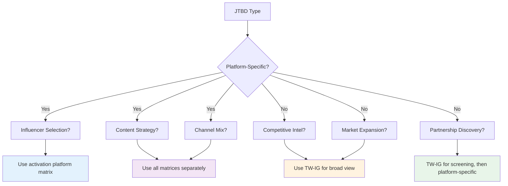

# **5 Implementing Jobs to Be Done: Concrete Patterns & Examples**

### **5.1 The JTBD Implementation Framework**

Each Job to Be Done follows a consistent pattern, but the details matter. This section provides concrete implementation examples for the most common audience intelligence tasks, showing how to combine the data layer (Part 2), intelligence layer (Part 3), and matrix strategy (Part 4) into working solutions.

 **Implementation Pattern Template:**

Every JTBD implementation follows this structure:

1. **Inputs**: What information do you need to start?
2. **Matrix Selection**: Which signal source(s) to use and why?
3. **API Sequence**: What calls to make, in what order?
4. **LLM Integration**: Where does the LLM add intelligence?
5. **Output Format**: What does the user receive? 

### **5.2 Influencer Selection**

#### **The Task**

Find influencers who will drive actual conversion for your brand, not just impressive engagement metrics.

#### **Why This Is Hard**

Most influencer selection relies on vanity metrics (follower count, engagement rate) without validating audience overlap or motivational alignment. An influencer with 2M followers might have only 0.8% overlap with your audience and completely misaligned motivations.

#### **Strategic Intelligence Required**

- **Layer 1 (Strategic)**: Does this influencer's audience actually overlap with ours?
- **Layer 2 (Psychographic)**: Do their followers share our audience's motivations and values?
- **Layer 3 (Activation)**: Will content featuring this influencer convert our target audience?

#### **Implementation**

python

```python
class InfluencerSelector:
    def __init__(self, api_client, llm_client):
        self.api = api_client
        self.llm = llm_client
    
    def select_influencers(
        self,
        brand: str,
        campaign_platform: str,  # "twitter" or "instagram"
        budget: float,
        segment: Optional[str] = None,
        min_overlap: float = 0.15,
        top_n: int = 5
    ) -> InfluencerReport:
        """
        Find influencers with genuine audience overlap and motivational fit.
        
        Args:
            brand: Target brand (e.g., "StrideRecover")
            campaign_platform: Where campaign will activate
            budget: Available budget (for cost-effectiveness filtering)
            segment: Optional audience segment to target
            min_overlap: Minimum reach threshold (default 15%)
            top_n: Number of recommendations to return
        """
        
        # Step 1: Define target audience
        audience_def = {
            "brand": brand,
            "segment": segment
        }
        audience = self.api.define_audience(audience_def)
        
        # Step 2: Matrix selection based on activation platform
        # CRITICAL: Use platform-specific matrix
        matrix = self._select_matrix(campaign_platform)
        
        # Step 3: Get candidate influencers
        # Start with precomputed clusters, then expand
        candidates = self._get_influencer_candidates(
            audience=audience,
            platform=campaign_platform,
            matrix=matrix
        )
        
        # Step 4: Calculate overlap metrics (parallel API calls)
        results = await self._calculate_overlaps(
            audience=audience,
            candidates=candidates,
            matrix=matrix
        )
        
        # Step 5: Filter by minimum overlap
        qualified = [r for r in results if r.reach >= min_overlap]
        
        # Step 6: Enrich with motivational analysis
        enriched = await self._analyze_motivations(
            qualified=qualified,
            audience=audience,
            matrix=matrix
        )
        
        # Step 7: LLM ranking with strategic interpretation
        ranked = self.llm.rank_influencers(
            candidates=enriched,
            budget=budget,
            criteria=[
                "audience_overlap",
                "motivational_alignment", 
                "cost_efficiency",
                "authenticity",
                "content_fit"
            ]
        )
        
        # Step 8: Generate recommendations
        report = self.llm.generate_influencer_report(
            ranked=ranked[:top_n],
            template="influencer_selection",
            context={
                "brand": brand,
                "segment": segment,
                "platform": campaign_platform,
                "budget": budget
            }
        )
        
        return report
    
    def _select_matrix(self, platform: str) -> str:
        """
        Matrix selection for influencer selection.
        
        Rule: ALWAYS use platform-specific matrix.
        Why: You're activating on that platform, you need that 
             platform's audience data.
        """
        matrix_map = {
            "twitter": "TW",
            "instagram": "IG",
            "tiktok": "TT"
        }
        return matrix_map.get(platform.lower(), "TW-IG")
    
    async def _get_influencer_candidates(
        self,
        audience: Audience,
        platform: str,
        matrix: str
    ) -> List[Influencer]:
        """
        Get candidate influencers from multiple sources.
        
        Sources:
        1. Precomputed thematic clusters (offline)
        2. High-affinity items from audience (runtime API)
        3. Platform-specific influencer lists (curated)
        """
        candidates = set()
        
        # Source 1: Precomputed clusters
        # Example: For running brand, check "Running Influencers" cluster
        cluster_candidates = self._get_from_clusters(
            audience=audience,
            platform=platform
        )
        candidates.update(cluster_candidates)
        
        # Source 2: High-affinity discovery
        # Find items with high affinity that are influencer accounts
        affinity_candidates = await self.api.get_top_affinities(
            audience=audience,
            matrix=matrix,
            item_type="influencer",
            min_affinity=5.0,
            limit=50
        )
        candidates.update(affinity_candidates)
        
        # Source 3: Platform-specific lists (optional)
        if hasattr(self, 'curated_lists'):
            curated = self.curated_lists.get(platform, [])
            candidates.update(curated)
        
        return list(candidates)
    
    async def _calculate_overlaps(
        self,
        audience: Audience,
        candidates: List[Influencer],
        matrix: str
    ) -> List[OverlapResult]:
        """
        Calculate overlap metrics for all candidates (parallel).
        """
        tasks = [
            self.api.get_overlap(
                audience=audience,
                item=candidate,
                matrix=matrix
            )
            for candidate in candidates
        ]
        
        results = await asyncio.gather(*tasks)
        
        # Enrich with cost estimates
        enriched_results = []
        for candidate, overlap in zip(candidates, results):
            enriched_results.append(
                OverlapResult(
                    influencer=candidate,
                    reach=overlap.reach,
                    penetration=overlap.penetration,
                    affinity=overlap.affinity,
                    estimated_cost=self._estimate_cost(candidate),
                    followers=candidate.followers
                )
            )
        
        return enriched_results
    
    async def _analyze_motivations(
        self,
        qualified: List[OverlapResult],
        audience: Audience,
        matrix: str
    ) -> List[EnrichedResult]:
        """
        Analyze motivational alignment between influencer 
        audience and brand audience.
        
        This is where Psychographic Intelligence comes in.
        """
        enriched = []
        
        for result in qualified:
            # Get influencer's audience affinities
            influencer_audience = await self.api.define_audience({
                "item": result.influencer
            })
            
            influencer_affinities = await self.api.get_top_affinities(
                audience=influencer_audience,
                matrix=matrix,
                limit=100
            )
            
            # Get brand audience affinities (may be cached)
            brand_affinities = await self.api.get_top_affinities(
                audience=audience,
                matrix=matrix,
                limit=100
            )
            
            # LLM analyzes motivational overlap
            motivation_analysis = self.llm.analyze_motivational_fit(
                influencer_affinities=influencer_affinities,
                brand_affinities=brand_affinities,
                influencer_name=result.influencer.name
            )
            
            enriched.append(
                EnrichedResult(
                    **result.__dict__,
                    motivational_fit=motivation_analysis.score,
                    shared_values=motivation_analysis.shared_values,
                    potential_conflicts=motivation_analysis.conflicts
                )
            )
        
        return enriched
```

#### **Matrix Selection Logic**

 **For influencer selection, ALWAYS use platform-specific matrix.**

Why:

- You're activating a campaign on Twitter → you need Twitter audience data
- Instagram influencer's Twitter audience ≠ their Instagram audience
- Using TW-IG would combine signals from both platforms, losing precision 

#### **Example Output**

markdown

```markdown
## Influencer Recommendations for StrideRecover Recovery Footwear

### Top 5 Influencers (Ranked by Strategic Fit)

#### 1. @RunCoachKatie (Twitter)
- **Audience Overlap**: 38% reach (38,000 of your 100K audience)
- **Affinity**: 15.2x (her followers are 15x more likely to follow you)
- **Motivational Fit**: 9.2/10
  - Shared values: Performance optimization, evidence-based training, injury prevention
  - Content themes: Marathon training, recovery protocols, running science
- **Estimated Cost**: $8,000 per campaign
- **Cost per Engaged User**: $0.21 (38K overlap × est. 30% engagement)
- **Strategic Rationale**: 
  Katie's audience is deeply embedded in the serious running community 
  (Runner's World 18x affinity, Boston Marathon 22x). Her content focuses 
  on training science and injury prevention, perfect alignment with your 
  recovery positioning. High conversion probability.

#### 2. @MarathonMindset (Twitter)
- **Audience Overlap**: 32% reach
- **Affinity**: 12.8x
- **Motivational Fit**: 8.7/10
- **Estimated Cost**: $6,500
- ...

#### Influencers to AVOID

##### @FitLifeJenna (Instagram) - Popular but Poor Fit
- **Audience Overlap**: 0.8% (only 800 people)
- **Affinity**: 0.6x (her audience is LESS likely to follow you)
- **Why to Avoid**: 
  Jenna's audience is fashion-focused Gen Z (Taylor Swift 4.2x, fast food 
  brands 5x+). Motivations: aesthetics and lifestyle, not performance. 
  Despite 2M followers, almost no overlap with your serious athlete base.
```

#### **Cost Optimization Strategy**

python

```python
def optimize_influencer_portfolio(
    self,
    ranked_influencers: List[EnrichedResult],
    budget: float,
    optimization_goal: str = "reach"  # or "efficiency" or "balanced"
) -> Portfolio:
    """
    Given a budget, find the optimal mix of influencers.
    
    Optimization goals:
    - "reach": Maximize total unique reach
    - "efficiency": Minimize cost per engaged user
    - "balanced": Balance reach and efficiency
    """
    
    if optimization_goal == "reach":
        # Greedy algorithm: highest reach first, avoiding overlap
        return self._greedy_reach_optimization(
            ranked_influencers, 
            budget
        )
    
    elif optimization_goal == "efficiency":
        # Prioritize cost-per-engaged-user
        sorted_by_efficiency = sorted(
            ranked_influencers,
            key=lambda x: x.estimated_cost / (x.reach * x.followers * 0.03)
        )
        return self._select_within_budget(sorted_by_efficiency, budget)
    
    else:  # balanced
        # Multi-objective optimization
        return self._pareto_optimization(ranked_influencers, budget)
```

---

### **5.3 Competitive Intelligence**

#### **The Task**

Understand where you actually sit in the competitive landscape, not where category definitions suggest you should be.

#### **Why This Is Hard**

Traditional competitive analysis focuses on product features and market share within predefined categories. But real competition happens at the audience level. Two brands in the same category might not compete at all, while brands in different categories might be fierce competitors for the same audience's attention and wallet.

#### **Strategic Intelligence Required**

- **Layer 1 (Strategic)**: Map the true competitive battlefield using audience overlap
- **Layer 2 (Psychographic)**: Understand why audiences choose competitors
- **Layer 3 (Activation)**: Identify defensive and offensive strategies

#### **Implementation**

python

```python
class CompetitiveAnalyzer:
    def __init__(self, api_client, llm_client):
        self.api = api_client
        self.llm = llm_client
    
    def analyze_competitive_position(
        self,
        brand: str,
        competitors: Optional[List[str]] = None,
        matrix: str = "TW-IG",  # Default to combined for broad view
        auto_discover: bool = True
    ) -> CompetitiveReport:
        """
        Comprehensive competitive intelligence analysis.
        
        Args:
            brand: Your brand
            competitors: List of known competitors (optional)
            matrix: Which signal to use (default: TW-IG for broad view)
            auto_discover: Whether to discover additional competitors
        """
        
        # Step 1: Define brand audience
        brand_audience = self.api.define_audience({"brand": brand})
        
        # Step 2: Identify competitive set
        competitive_set = self._build_competitive_set(
            brand=brand,
            known_competitors=competitors,
            auto_discover=auto_discover,
            audience=brand_audience,
            matrix=matrix
        )
        
        # Step 3: Calculate overlap with each competitor
        landscape = await self._map_competitive_landscape(
            brand_audience=brand_audience,
            competitors=competitive_set,
            matrix=matrix
        )
        
        # Step 4: Classify into strategic quadrants
        classified = self._classify_competitors(landscape)
        
        # Step 5: Psychographic analysis of key competitors
        psychographic_insights = await self._analyze_competitor_audiences(
            brand_audience=brand_audience,
            key_competitors=classified.get('symmetric_competition', []) + 
                           classified.get('asymmetric_threat', []),
            matrix=matrix
        )
        
        # Step 6: LLM synthesis into strategic report
        report = self.llm.generate_competitive_report(
            brand=brand,
            landscape=classified,
            psychographic_insights=psychographic_insights,
            template="competitive_intelligence"
        )
        
        return report
    
    async def _build_competitive_set(
        self,
        brand: str,
        known_competitors: Optional[List[str]],
        auto_discover: bool,
        audience: Audience,
        matrix: str
    ) -> List[str]:
        """
        Build the competitive set to analyze.
        
        Sources:
        1. Known competitors (provided by user)
        2. Category-based competitors (from taxonomy)
        3. Auto-discovered competitors (high overlap brands)
        """
        competitors = set(known_competitors or [])
        
        # Add category-based competitors
        brand_categories = self.api.get_item_categories(brand)
        for category in brand_categories:
            category_brands = self._get_category_brands(
                category=category,
                exclude=brand
            )
            competitors.update(category_brands[:10])  # Top 10 per category
        
        # Auto-discover via high overlap
        if auto_discover:
            discovered = await self.api.get_top_affinities(
                audience=audience,
                matrix=matrix,
                item_type="brand",
                min_affinity=2.0,
                limit=30
            )
            competitors.update([d.item for d in discovered])
        
        return list(competitors)
    
    async def _map_competitive_landscape(
        self,
        brand_audience: Audience,
        competitors: List[str],
        matrix: str
    ) -> List[CompetitorMetrics]:
        """
        Calculate overlap metrics for all competitors (parallel).
        """
        tasks = [
            self.api.get_overlap(
                audience=brand_audience,
                item=competitor,
                matrix=matrix
            )
            for competitor in competitors
        ]
        
        results = await asyncio.gather(*tasks)
        
        landscape = []
        for competitor, overlap in zip(competitors, results):
            landscape.append(
                CompetitorMetrics(
                    name=competitor,
                    reach=overlap.reach,
                    penetration=overlap.penetration,
                    affinity=overlap.affinity,
                    absolute_overlap=overlap.overlap_count
                )
            )
        
        return landscape
    
    def _classify_competitors(
        self,
        landscape: List[CompetitorMetrics]
    ) -> Dict[str, List[CompetitorMetrics]]:
        """
        Classify competitors into strategic quadrants.
        
        Quadrants:
        - Symmetric Competition: High reach + high penetration
        - Asymmetric Threat: High reach + low penetration (they're winning)
        - Niche Dominance: Low reach + high penetration (you own a niche)
        - Minimal Overlap: Low reach + low penetration (not really competing)
        """
        # Thresholds (can be adjusted based on industry)
        REACH_THRESHOLD = 0.25
        PENETRATION_THRESHOLD = 0.25
        
        classified = {
            'symmetric_competition': [],
            'asymmetric_threat': [],
            'niche_dominance': [],
            'minimal_overlap': []
        }
        
        for competitor in landscape:
            high_reach = competitor.reach >= REACH_THRESHOLD
            high_pen = competitor.penetration >= PENETRATION_THRESHOLD
            
            if high_reach and high_pen:
                quadrant = 'symmetric_competition'
            elif high_reach and not high_pen:
                quadrant = 'asymmetric_threat'
            elif not high_reach and high_pen:
                quadrant = 'niche_dominance'
            else:
                quadrant = 'minimal_overlap'
            
            # Add strategic implication
            competitor.quadrant = quadrant
            competitor.implication = self._get_strategic_implication(quadrant)
            
            classified[quadrant].append(competitor)
        
        return classified
    
    def _get_strategic_implication(self, quadrant: str) -> str:
        """
        Map quadrant to strategic implication.
        """
        implications = {
            'symmetric_competition': 
                "Direct threat. Differentiation critical. Price competition dangerous.",
            'asymmetric_threat': 
                "They're winning your audience. Urgent defensive strategy required.",
            'niche_dominance': 
                "You own a valuable niche. Protect and deepen, don't chase mass market.",
            'minimal_overlap': 
                "Not actually competing despite category similarity. Ignore or partner."
        }
        return implications[quadrant]
    
    async def _analyze_competitor_audiences(
        self,
        brand_audience: Audience,
        key_competitors: List[CompetitorMetrics],
        matrix: str
    ) -> Dict[str, PsychographicProfile]:
        """
        Deep psychographic analysis of key competitors.
        
        For symmetric competitors and asymmetric threats, understand:
        - What does their audience care about?
        - How does it differ from our audience?
        - Why are they choosing them over us?
        """
        profiles = {}
        
        for competitor in key_competitors:
            # Define competitor's audience
            comp_audience = await self.api.define_audience({
                "brand": competitor.name
            })
            
            # Get their top affinities
            comp_affinities = await self.api.get_top_affinities(
                audience=comp_audience,
                matrix=matrix,
                limit=100
            )
            
            # Get our affinities (may be cached)
            brand_affinities = await self.api.get_top_affinities(
                audience=brand_audience,
                matrix=matrix,
                limit=100
            )
            
            # LLM comparative analysis
            profile = self.llm.generate_psychographic_comparison(
                brand_name=brand_audience.brand,
                competitor_name=competitor.name,
                brand_affinities=brand_affinities,
                competitor_affinities=comp_affinities
            )
            
            profiles[competitor.name] = profile
        
        return profiles
```

#### **Matrix Selection Logic**

 **For competitive intelligence, TW-IG is usually the right default.**

Why:

- Broad view of competitive landscape matters more than platform-specific behavior
- Competitors may be strong on different platforms (you on Twitter, them on Instagram)
- Combined matrix reduces platform bias

**Exception:** If competitor is platform-native (e.g., TikTok-first brand), use that platform's matrix for accurate assessment. 

#### **Example Output**

markdown

```markdown
## Competitive Intelligence Report: StrideRecover

### Executive Summary

Your true competitive battlefield differs significantly from category assumptions. 
We analyzed 25 brands, including 8 category competitors and 17 auto-discovered 
through audience overlap.

**Key Finding:** ComfyCasual, long assumed to be your main competitor, has only 
12% audience overlap and serves a fundamentally different psychographic segment. 
Your real threats are performance-recovery brands and compression gear companies.

### Competitive Landscape

#### SYMMETRIC COMPETITION (3 brands)

High mutual overlap. Direct competition. Differentiation critical.

##### 1. RecoveryPro
- **Overlap**: 42% reach / 38% penetration
- **Strategic Implication**: Fighting for the same serious athlete audience
- **Why They Win**: 
  - Premium positioning (price $20 higher)
  - Elite athlete endorsements (Olympians vs. your marathoners)
  - Clinical validation (sports medicine partnerships)
- **Defensive Strategy**:
  - Emphasize accessibility ("recovery for everyday athletes, not just elites")
  - Partner with running coaches (vs. their pro athletes)
  - Focus on marathon community (vs. their Olympic positioning)

##### 2. CompressionElite
- **Overlap**: 35% reach / 33% penetration
- **Why This Matters**: Different product (compression gear vs. footwear) but 
  same audience and recovery positioning
- **Strategic Implication**: Competing for "recovery budget" and mindshare
- **Opportunity**: Partnership potential (compression + footwear = complete 
  recovery system)

#### ASYMMETRIC THREAT (1 brand) ⚠️

High reach into your audience. Low penetration into theirs. They're winning.

##### ActiveRecovery (New DTC Brand)
- **Overlap**: 28% reach / 9% penetration
- **Why This Is Dangerous**:
  - Only 3 years old, but capturing your audience rapidly
  - DTC model, aggressive social media
  - Your audience overlap has grown from 12% → 28% in 18 months
- **Why They're Winning**:
  - Values-driven messaging (sustainability, transparency)
  - Community building (recovery challenges, user content)
  - Digital-native approach
- **Defensive Strategy (URGENT)**:
  - Strengthen community programs
  - Emphasize heritage and proven results
  - Consider DTC channel addition

#### NICHE DOMINANCE (2 brands)

You've captured a niche within their audience. Protect and deepen.

##### NikeRunning
- **Overlap**: 18% reach / 45% penetration
- **Interpretation**: You own a specific segment of Nike's massive audience
- **Strategic Implication**: 
  - This is the "serious recovery-focused runner" niche within Nike's broad base
  - Defend by deepening recovery expertise
  - Don't chase Nike's mass market

#### MINIMAL OVERLAP (19 brands)

Not actually competing despite category similarity. Ignore or partner.

##### ComfyCasual
- **Overlap**: 12% reach / 2.4% penetration
- **Why Previously Assumed Competitor**: Same category (comfort footwear), 
  similar materials, overlapping price points
- **Reality**: Serve completely different audiences
  - You: Gen X serious athletes, performance-focused, family-oriented
  - Them: Gen Z casual comfort, pop culture-driven, fashion-focused
- **Strategic Recommendation**: Stop worrying about ComfyCasual. Focus 
  competitive energy on RecoveryPro and ActiveRecovery.

### Psychographic Comparison: You vs. Key Competitors

#### You (StrideRecover)
**Audience Characteristics:**
- Gen X (47.5% reach, 1.7x affinity)
- Married with children (61% / 50% reach)
- Performance-oriented (Brooks Running 31x, marathons 20x)
- Holistic wellness (organic food 8x, supplements 6x)

**Motivations:**
- Performance optimization through recovery
- Evidence-based health decisions
- Family wellbeing and active living
- Quality over convenience

#### RecoveryPro (Symmetric Competitor)
**Audience Characteristics:**
- Similar demographics (Gen X, married, children)
- Elite athlete focus (Olympics 45x, pro runners 60x)
- Higher income (luxury brands 8x vs. your 3x)
- Performance maximization obsessed

**Key Difference:**
- They target peak performers seeking marginal gains
- You target committed athletes seeking sustainable performance

**Whitespace Opportunity:**
- The "serious but not elite" segment
- The "family-focused athlete" segment
- The "long-term health over peak performance" segment
```

---

### **5.4 Content Strategy**

#### **The Task**

Determine what content resonates with your audience on which platforms, moving beyond generic "create engaging content" advice to platform-specific, segment-tailored strategies.

#### **Why This Is Hard**

Different platforms reward different content types. The same audience may engage with serious training content on Twitter but lifestyle inspiration on Instagram. Generic content strategy misses these platform-specific and segment-specific nuances.

#### **Implementation**

python

```python
class ContentStrategist:
    def __init__(self, api_client, llm_client):
        self.api = api_client
        self.llm = llm_client
    
    def generate_content_strategy(
        self,
        brand: str,
        platforms: List[str],
        segments: Optional[List[str]] = None
    ) -> ContentStrategy:
        """
        Generate platform-specific, segment-tailored content strategy.
        
        Args:
            brand: Your brand
            platforms: Platforms to analyze (e.g., ["twitter", "instagram"])
            segments: Optional audience segments to target
        """
        
        # Define brand audience
        audience = self.api.define_audience({"brand": brand})
        
        # Get segments (either provided or discovered)
        if not segments:
            segments = self._discover_segments(audience)
        
        # Platform-specific analysis
        platform_strategies = {}
        
        for platform in platforms:
            strategy = await self._analyze_platform(
                audience=audience,
                platform=platform,
                segments=segments
            )
            platform_strategies[platform] = strategy
        
        # Cross-platform synthesis
        unified_strategy = self.llm.synthesize_content_strategy(
            platform_strategies=platform_strategies,
            segments=segments
        )
        
        return unified_strategy
    
    async def _analyze_platform(
        self,
        audience: Audience,
        platform: str,
        segments: List[str]
    ) -> PlatformStrategy:
        """
        Analyze content opportunities on specific platform.
        
        CRITICAL: Use platform-specific matrix for platform-specific insights.
        """
        matrix = self._get_platform_matrix(platform)
        
        # Get top affinities on this platform
        affinities = await self.api.get_top_affinities(
            audience=audience,
            matrix=matrix,
            min_affinity=5.0,
            limit=100
        )
        
        # LLM thematic clustering
        themes = self.llm.identify_content_themes(
            affinities=affinities,
            platform=platform
        )
        
        # Segment-specific analysis
        segment_strategies = {}
        for segment in segments:
            segment_audience = await self.api.define_audience({
                "brand": audience.brand,
                "segment": segment
            })
            
            segment_affinities = await self.api.get_top_affinities(
                audience=segment_audience,
                matrix=matrix,
                min_affinity=3.0,
                limit=50
            )
            
            segment_strategy = self.llm.generate_segment_content_strategy(
                segment=segment,
                affinities=segment_affinities,
                platform=platform,
                themes=themes
            )
            
            segment_strategies[segment] = segment_strategy
        
        return PlatformStrategy(
            platform=platform,
            themes=themes,
            segment_strategies=segment_strategies
        )
    
    def _get_platform_matrix(self, platform: str) -> str:
        """
        Matrix selection for content strategy.
        
        Rule: Use platform-specific matrix.
        Why: Content performs differently on each platform.
        """
        matrix_map = {
            "twitter": "TW",
            "instagram": "IG",
            "tiktok": "TT"
        }
        return matrix_map.get(platform.lower(), "TW-IG")
```

#### **Matrix Selection Logic**

 **For content strategy, ALWAYS use platform-specific matrices analyzed separately.**

Why:

- Twitter audience engages with news and training science
- Instagram audience engages with visual lifestyle content
- Using TW-IG would average these signals, losing platform-specific insights
- You need to create different content for each platform

**Never use TW-IG for content strategy.** 

#### **Example Output**

markdown

```markdown
## Content Strategy: StrideRecover

### Platform-Specific Strategies

#### Twitter Strategy

**Audience Behavior on Twitter:**
- High engagement with running news (Runner's World 12x)
- High engagement with training content (running coaches 25x+)
- High engagement with scientific content (sports medicine 18x)
- News consumption (NYT 1.4x at 60% reach, WSJ 1.5x at 45%)

**Content Themes:**
1. **Training Science** (Primary)
   - Biomechanics of recovery
   - Evidence-based training protocols
   - Injury prevention research
   
2. **Marathon Community** (Primary)
   - Race recaps and results
   - Training journey stories
   - Event coverage

3. **Expert Insights** (Secondary)
   - Coach interviews
   - Sports medicine Q&A
   - Product science explainers

**Format Recommendations:**
- **Tweet threads**: Training tips, race prep series
- **Long-form**: Link to blog posts with scientific depth
- **Engagement**: Polls on training preferences, Q&A with experts

**Posting Cadence:**
- 3-5 tweets per day
- 2-3 threads per week
- 1 long-form article per week

**Example Content:**
```

Thread: The Science of Active Recovery 🧵

1/ Most runners think recovery is passive rest. But research shows active recovery with proper biomechanical support can reduce DOMS by 37% and speed return to training.

2/ Here's what happens at the cellular level when you wear recovery footwear...

[Thread continues with scientific explanation, studies cited]

```

#### Instagram Strategy

**Audience Behavior on Instagram:**
- High engagement with visual running content (running photography)
- High engagement with home comfort aesthetics (home decor 60x)
- High engagement with family wellness (family lifestyle 8x)

- Lifestyle integration (wellness influencers 12x)
```

**Content Themes:**

1. **Lifestyle Integration** (Primary)
    - Recovery as part of daily routine
    - Home comfort and wellness
    - Family active living
2. **Visual Storytelling** (Primary)
    - Before/after recovery moments
    - Athlete lifestyle (not just racing)
    - Product in context (home, travel, post-run)
3. **Community Inspiration** (Secondary)
    - User-generated content
    - Recovery transformation stories
    - Family wellness journey

**Format Recommendations:**

- **Posts**: High-quality lifestyle photography
- **Stories**: Behind-the-scenes, day-in-life content
- **Reels**: Quick recovery tips, product demos
- **IGTV/Long-form**: Recovery routines, athlete interviews

**Posting Cadence:**

- 1 feed post per day
- 5-10 stories per day
- 3-4 reels per week

**Example Content:**

```
[Image: Clean, minimalist home setting. Runner in recovery 
slides with feet up, coffee nearby, morning light.]

Caption:
Recovery isn't just post-workout. It's the quiet moments 
between life's demands.

For Sarah (@marathonmom_of3), recovery slides are part of 
her morning ritual. After dropping kids at school, before 
the workday begins, 20 minutes of intentional rest.

"My feet carry me through training, work, and family life. 
This is when I give back to them." - Sarah

📸: @lifestylephotographer
#ActiveRecovery #StrideRecover #RunnerLife
```

### Segment-Specific Strategies

#### Dedicated Endurance Athletes (30% of audience)

**Twitter:**

- **Focus**: Training optimization, race prep, performance gains
- **Content**: Technical, data-driven, scientific
- **Example**: "How recovery footwear impacts cumulative training load"

**Instagram:**

- **Focus**: Training journey, race day moments, achievement
- **Content**: Inspirational but authentic, journey-focused
- **Example**: Marathon prep series following real athletes

#### Health-Conscious Family Managers (40% of audience)

**Twitter:**

- **Focus**: Balancing training and family, efficiency, wellness
- **Content**: Practical advice, time-management, family wellness
- **Example**: "5 recovery strategies for busy parent-athletes"

**Instagram:**

- **Focus**: Family wellness, home comfort, lifestyle integration
- **Content**: Relatable family moments, home scenes, balance
- **Example**: Morning recovery routine with kids getting ready for school

### Cross-Platform Content Calendar

**Monthly Themes (Rotate):**

- Month 1: Marathon Training Season
- Month 2: Everyday Recovery
- Month 3: Family Wellness
- Month 4: Performance Science

**Weekly Structure:** Monday: **Motivation** (IG post, Twitter thread) Tuesday: **Education** (Twitter science thread) Wednesday: **Community** (UGC feature on IG, Twitter engagement) Thursday: **Product** (IG Reel demo, Twitter use case) Friday: **Lifestyle** (IG lifestyle post, Twitter weekend prep tips) Saturday: **Race/Event Coverage** (Both platforms) Sunday: **Recovery Focus** (IG relaxation theme, Twitter recovery tips)

````

---

### **5.5 Partnership Discovery**

#### **The Task**

Identify strategic partnership opportunities based on genuine audience overlap and complementary positioning, not just category assumptions.

#### **Why This Is Hard**

Most partnerships fail because brands assume overlap based on category proximity without validating actual audience dynamics. The "natural" partnerships (same category) may have minimal overlap, while unexpected cross-category partnerships may have massive shared audiences.

#### **Implementation**
```python
class PartnershipDiscoverer:
    def __init__(self, api_client, llm_client):
        self.api = api_client
        self.llm = llm_client
    
    def discover_partnerships(
        self,
        brand: str,
        partnership_type: str = "complementary",  # or "co-marketing" or "distribution"
        matrix: str = "TW-IG",  # Broad view for discovery
        min_overlap: float = 0.15
    ) -> PartnershipReport:
        """
        Discover strategic partnership opportunities.
        
        Args:
            brand: Your brand
            partnership_type: Type of partnership to explore
            matrix: Signal source (default TW-IG for broad discovery)
            min_overlap: Minimum audience overlap threshold
        """
        
        # Define brand audience
        audience = self.api.define_audience({"brand": brand})
        
        # Discover candidates
        candidates = await self._discover_candidates(
            audience=audience,
            partnership_type=partnership_type,
            matrix=matrix
        )
        
        # Calculate overlap
        overlaps = await self._calculate_overlaps(
            audience=audience,
            candidates=candidates,
            matrix=matrix
        )
        
        # Filter by minimum overlap
        qualified = [o for o in overlaps if o.reach >= min_overlap]
        
        # Classify partnership type
        classified = self._classify_partnerships(qualified)
        
        # Deep analysis of top candidates
        analyzed = await self._analyze_partnership_fit(
            brand_audience=audience,
            candidates=classified['high_priority'],
            matrix=matrix
        )
        
        # LLM synthesis
        report = self.llm.generate_partnership_report(
            brand=brand,
            partnerships=analyzed,
            template="partnership_opportunities"
        )
        
        return report
    
    async def _discover_candidates(
        self,
        audience: Audience,
        partnership_type: str,
        matrix: str
    ) -> List[Brand]:
        """
        Discover partnership candidates from multiple sources.
        """
        candidates = set()
        
        # Source 1: High-affinity brands (runtime discovery)
        high_affinity = await self.api.get_top_affinities(
            audience=audience,
            matrix=matrix,
            item_type="brand",
            min_affinity=3.0,
            limit=100
        )
        candidates.update([h.item for h in high_affinity])
        
        # Source 2: Adjacent categories (precomputed)
        brand_categories = self.api.get_item_categories(audience.brand)
        for category in brand_categories:
            adjacent = self._get_adjacent_categories(category)
            for adj_cat in adjacent:
                brands = self._get_category_brands(adj_cat, limit=20)
                candidates.update(brands)
        
        # Source 3: Complementary product categories
        if partnership_type == "complementary":
            complementary = self._get_complementary_categories(
                brand_categories
            )
            for comp_cat in complementary:
                brands = self._get_category_brands(comp_cat, limit=20)
                candidates.update(brands)
        
        return list(candidates)
    
    def _classify_partnerships(
        self,
        overlaps: List[OverlapResult]
    ) -> Dict[str, List[OverlapResult]]:
        """
        Classify partnership opportunities by strategic fit.
        
        Types:
        - High Priority: High overlap + non-competitive
        - Niche Collaboration: Low reach but high penetration
        - Cross-Category: Different category, good overlap
        - Low Priority: Low overlap or competitive
        """
        classified = {
            'high_priority': [],
            'niche_collaboration': [],
            'cross_category': [],
            'low_priority': []
        }
        
        for overlap in overlaps:
            # Check if competitive
            is_competitive = self._is_competitive(
                overlap.item,
                overlap.affinity
            )
            
            if is_competitive:
                classified['low_priority'].append(overlap)
                continue
            
            # Classify by overlap pattern
            high_reach = overlap.reach >= 0.25
            high_pen = overlap.penetration >= 0.25
            
            if high_reach and high_pen:
                classified['high_priority'].append(overlap)
            elif not high_reach and high_pen:
                classified['niche_collaboration'].append(overlap)
            else:
                # Check category
                if self._is_cross_category(overlap.item):
                    classified['cross_category'].append(overlap)
                else:
                    classified['low_priority'].append(overlap)
        
        return classified
    
    async def _analyze_partnership_fit(
        self,
        brand_audience: Audience,
        candidates: List[OverlapResult],
        matrix: str
    ) -> List[PartnershipAnalysis]:
        """
        Deep analysis of partnership fit.
        
        For each candidate:
        - Audience overlap (already have)
        - Psychographic alignment
        - Value proposition complementarity
        - Partnership opportunity types
        """
        analyses = []
        
        for candidate in candidates:
            # Get candidate's audience affinities
            partner_audience = await self.api.define_audience({
                "brand": candidate.item
            })
            
            partner_affinities = await self.api.get_top_affinities(
                audience=partner_audience,
                matrix=matrix,
                limit=100
            )
            
            # Get brand affinities (may be cached)
            brand_affinities = await self.api.get_top_affinities(
                audience=brand_audience,
                matrix=matrix,
                limit=100
            )
            
            # LLM analysis
            fit_analysis = self.llm.analyze_partnership_fit(
                brand_name=brand_audience.brand,
                partner_name=candidate.item,
                overlap_metrics=candidate,
                brand_affinities=brand_affinities,
                partner_affinities=partner_affinities
            )
            
            analyses.append(
                PartnershipAnalysis(
                    partner=candidate.item,
                    overlap=candidate,
                    psychographic_fit=fit_analysis.fit_score,
                    shared_values=fit_analysis.shared_values,
                    complementary_strengths=fit_analysis.complementary,
                    partnership_types=fit_analysis.opportunity_types
                )
            )
        
        return analyses
```

#### **Matrix Selection Logic**


**For partnership discovery, use TW-IG as default for initial screening.**

Why:
- Broad view helps discover unexpected partnerships
- Reduces platform bias (partner may be strong on different platform)

**Then use platform-specific for activation planning:**
- Where will partnership content activate?
- Which platform drives most shared value?


---

### **5.6 Market Expansion Opportunity Assessment**

#### **The Task**

Identify viable market expansion opportunities by analyzing where your audience already shows affinity and demand, rather than making category-based assumptions.

#### **Why This Is Hard**

Traditional market expansion analysis looks at category growth rates, competitive intensity, and market sizing. But it misses whether your specific audience actually cares about that adjacent market. The "logical" expansion may have zero audience interest, while unexpected adjacencies may have massive built-in demand.

#### **Implementation**
```python
class MarketExpansionAnalyzer:
    def __init__(self, api_client, llm_client):
        self.api = api_client
        self.llm = llm_client
    
    def assess_expansion_opportunities(
        self,
        brand: str,
        budget: float,
        matrix: str = "TW-IG",
        consider_categories: Optional[List[str]] = None
    ) -> ExpansionReport:
        """
        Assess market expansion opportunities based on audience affinities.
        
        This is the use case from Section 6 (StrideRecover expansion).
        
        Args:
            brand: Your brand
            budget: Available expansion budget
            matrix: Signal source (TW-IG for broad opportunity scan)
            consider_categories: Optional list of categories to evaluate
        """
        
        # Define brand audience
        audience = self.api.define_audience({"brand": brand})
        
        # Discover adjacent categories with audience demand
        opportunities = await self._discover_expansion_opportunities(
            audience=audience,
            matrix=matrix,
            consider_categories=consider_categories
        )
        
        # For each opportunity, assess strategic fit
        assessed = await self._assess_opportunities(
            audience=audience,
            opportunities=opportunities,
            matrix=matrix
        )
        
        # Rank by strategic attractiveness
        ranked = self._rank_opportunities(
            assessed=assessed,
            budget=budget
        )
        
        # Generate phased expansion plan
        expansion_plan = self.llm.generate_expansion_plan(
            brand=brand,
            opportunities=ranked,
            budget=budget,
            template="market_expansion"
        )
        
        return expansion_plan
    
    async def _discover_expansion_opportunities(
        self,
        audience: Audience,
        matrix: str,
        consider_categories: Optional[List[str]]
    ) -> List[CategoryOpportunity]:
        """
        Discover expansion categories based on audience affinities.
        
        Sources:
        1. High-affinity categories (audience already engages)
        2. Adjacent categories (from taxonomy)
        3. Cross-category patterns (from clustering)
        """
        opportunities = []
        
        # Get all high-affinity items
        high_affinity = await self.api.get_top_affinities(
            audience=audience,
            matrix=matrix,
            min_affinity=5.0,
            limit=200
        )
        
        # Group by category
        category_affinities = defaultdict(list)
        for item in high_affinity:
            categories = self.api.get_item_categories(item.item)
            for category in categories:
                category_affinities[category].append(item)
        
        # Analyze each category
        for category, items in category_affinities.items():
            # Skip current category
            if self._is_current_category(category, audience.brand):
                continue
            
            # Calculate category-level metrics
            avg_affinity = np.mean([i.affinity for i in items])
            total_reach = len(set([i.item for i in items])) / len(items)
            
            # Assess if this is expansion opportunity
            if avg_affinity >= 5.0 and total_reach >= 0.10:
                opportunities.append(
                    CategoryOpportunity(
                        category=category,
                        items=items,
                        avg_affinity=avg_affinity,
                        reach=total_reach,
                        representative_items=items[:5]
                    )
                )
        
        return opportunities
    
    async def _assess_opportunities(
        self,
        audience: Audience,
        opportunities: List[CategoryOpportunity],
        matrix: str
    ) -> List[AssessedOpportunity]:
        """
        Deep assessment of each expansion opportunity.
        
        For each category:
        - Why does audience care? (psychographic fit)
        - Competitive landscape
        - Activation feasibility
        - Investment required
        """
        assessed = []
        
        for opp in opportunities:
            # Psychographic analysis: WHY does audience care?
            psychographic = self.llm.analyze_category_fit(
                audience_affinities=await self.api.get_top_affinities(
                    audience=audience,
                    matrix=matrix,
                    limit=100
                ),
                category=opp.category,
                category_items=opp.items
            )
            
            # Competitive landscape in this category
            competitive = await self._assess_category_competition(
                category=opp.category,
                audience=audience,
                matrix=matrix
            )
            
            # Activation assessment
            activation = self._assess_activation_feasibility(
                category=opp.category,
                current_brand=audience.brand
            )
            
            assessed.append(
                AssessedOpportunity(
                    category=opp.category,
                    opportunity=opp,
                    psychographic_fit=psychographic,
                    competitive_landscape=competitive,
                    activation_feasibility=activation
                )
            )
        
        return assessed
    
    def _rank_opportunities(
        self,
        assessed: List[AssessedOpportunity],
        budget: float
    ) -> List[RankedOpportunity]:
        """
        Rank opportunities by strategic attractiveness.
        
        Factors:
        - Audience demand (affinity + reach)
        - Psychographic fit (alignment with brand values)
        - Competitive dynamics (symmetric vs minimal overlap)
        - Activation feasibility (time, cost, complexity)
        - Strategic coherence (fits brand positioning)
        """
        scored = []
        
        for opp in assessed:
            # Calculate composite score
            demand_score = (opp.opportunity.avg_affinity / 20) * 0.3
            fit_score = opp.psychographic_fit.alignment_score * 0.25
            competitive_score = self._score_competitive_dynamics(
                opp.competitive_landscape
            ) * 0.20
            feasibility_score = opp.activation_feasibility.score * 0.15
            coherence_score = opp.psychographic_fit.brand_coherence * 0.10
            
            total_score = (
                demand_score + 
                fit_score + 
                competitive_score + 
                feasibility_score + 
                coherence_score
            )
            
            # Check budget constraint
            affordable = opp.activation_feasibility.estimated_cost <= budget
            
            scored.append(
                RankedOpportunity(
                    opportunity=opp,
                    score=total_score,
                    affordable=affordable,
                    recommendation=self._generate_recommendation(
                        opp, total_score, affordable, budget
                    )
                )
            )
        
        # Sort by score
        return sorted(scored, key=lambda x: x.score, reverse=True)
```

#### **Example Output** 

This is the StrideRecover expansion analysis from Section 6:
```markdown
## Market Expansion Opportunities: StrideRecover

### Methodology

We analyzed your audience's affinities across all product categories to identify 
expansion opportunities based on proven demand (not category assumptions).

**Analysis Scope:**
- 100,000 audience members
- 200+ high-affinity items analyzed
- 15 potential expansion categories identified
- 3 opportunities recommended based on strategic fit and budget

### Top 3 Expansion Opportunities

#### 1. Sports Nutrition & Hydration

**Audience Demand:**
- Nuun Hydration: 83x affinity, 23.1% reach (23,100 people)
- Clif Bar: 32x affinity, 16.2% reach (16,200 people)
- GU Energy: 45x affinity, 12.8% reach
- Total category reach: 35% of your audience

**Why They Care (Psychographic Fit):**
- Performance optimization mindset (aligns with recovery positioning)
- Holistic wellness approach (nutrition as part of complete system)
- Evidence-based decision making (they research ingredients, trust science)
- Convenience-focused (busy lives, efficient solutions)

**Competitive Landscape:**
- Symmetric competition with established players (Nuun, GU, Clif)
- Differentiation challenge: crowded market, loyal user bases
- Opportunity: "Recovery nutrition" angle underserved

**Activation Feasibility:**
- **Investment Required**: ~$2M
  - Product development: $500K (formulation, testing, packaging)
  - Manufacturing: $200K (co-pack minimums)
  - Inventory: $300K
  - Marketing: $1M
- **Time to Market**: 12-18 months (formulation, FDA, production)
- **Channels**: Same as footwear (running events, Amazon, specialty retail)
- **Partnerships**: Easy (sports nutrition complements recovery footwear)

**Strategic Recommendation:**
- **Phase 2 expansion** (Year 2-3)
- Why not Phase 1: Long development timeline, competitive market
- Why do it: Broadest audience appeal (35% reach), natural positioning extension

#### 2. Home Recovery Products

**Audience Demand:**
- Premium mattresses (Serta): 100x affinity, 15.3% reach (15,300 people)
- Home comfort brands: 60x affinity, 20.3% reach (20,300 people)
- Home goods: Multiple brands 40-60x affinity

**Why They Care:**
- "Recovery extends to home" mindset
- Family wellbeing focus (married 1.5x, children 1.5x)
- Quality investment for daily life improvement
- Creating comfortable sanctuary

**Competitive Landscape:**
- Minimal overlap position: Few "recovery home goods" brands exist
- Opportunity to create new category
- Risk: Category education required (customers don't yet think "home recovery")

**Activation Feasibility:**
- **Investment Required**: ~$2.6M
  - Product development: $400K
  - Manufacturing: $300K
  - Inventory: $400K
  - Marketing: $1.5M (category education needed)
- **Time to Market**: 9-12 months
- **Challenges**: 
  - New influencer partnerships needed (home/wellness vs running)
  - Channel expansion (home goods retail)
  - Education burden

**Strategic Recommendation:**
- **Phase 3 exploration** (Year 3+)
- Why later: Requires brand authority established through Phases 1-2
- Why do it: Unique positioning, differentiated market, serves Family Manager segment

#### 3. Compression Gear ⭐ RECOMMENDED FOR PHASE 1

**Audience Demand:**
- PRO Compression: 119x affinity, 12.7% reach (12,700 people)
- Other compression brands: 80-100x affinity
- Total category: ~15% reach

**Why They Care:**
- Performance and recovery (perfect alignment with brand)
- Injury prevention (part of training toolkit)
- Evidence-based (sports medicine research supports compression)
- "Serious runner identity kit" (alongside GPS watch, recovery footwear)

**Competitive Landscape:**
- Symmetric competition (PRO Compression, CEP, 2XU)
- Differentiation: "Complete lower-body recovery" (footwear + compression)
- Commodity risk: Hard to claim unique technology

**Activation Feasibility:**
- **Investment Required**: ~$1.6M (LOWEST)
  - Product development: $300K
  - Manufacturing: $250K
  - Inventory: $250K
  - Marketing: $800K
- **Time to Market**: 6-9 months (FASTEST)
- **Channels**: IDENTICAL to footwear (running stores, events, Amazon)
- **Partnerships**: SAME influencers (running coaches, elite marathoners)

**Strategic Recommendation:**
- ⭐ **PHASE 1 LAUNCH** (Year 1)
- **Why:**
  - Lowest investment, fastest time-to-market
  - Leverages existing marketing infrastructure (same channels, same influencers)
  - Deepens relationship with core segment (Dedicated Athletes)
  - Natural product adjacency (complete recovery system)
  - Learning opportunity before bigger bets

**Launch Strategy:**
- Partner with @RunCoachKatie, @MarathonMindset for athlete-designed products
- Position as "Complete Lower-Body Recovery System"
- Bundle pricing: Recovery Kit (slides + compression, 20% off)
- Launch at Boston Marathon expo (April) - spring race season timing

**Success Metrics:**
- 15% of footwear customers purchase compression within 12 months
- $2.5M revenue Year 1 (break-even on investment)
- NPS +60 or higher

### Phased Expansion Roadmap

**Phase 1 (Year 1): Compression Gear**
- Launch Q2 (April, marathon season)
- Investment: $1.6M of $5M budget
- Goal: Validate expansion model, deepen core audience

**Phase 2 (Year 2-3): Sports Nutrition**
- Launch Q1 Year 2
- Investment: Remaining budget + Year 1 profits
- Goal: Serve broader audience (35% vs 15% for compression)
- Build on compression success

**Phase 3 (Year 3+): Home Recovery**
- Launch TBD (based on Phase 1-2 learnings)
- Investment: New budget allocation
- Goal: Create new category, serve Family Manager segment
- Requires brand authority established in Phases 1-2

### Why This Phased Approach

**Strategic Intelligence:**
- Starts with core audience (compression for Dedicated Athletes)
- Expands to broader segments (nutrition for all segments, home for Family Managers)
- Avoids attacking multiple markets simultaneously

**Psychographic Intelligence:**
- Phase 1: Deepen relationship with core (Dedicated Athletes)
- Phase 2: Serve broader motivations (holistic wellness)
- Phase 3: Address lifestyle integration (Family Managers, Comfort Seekers)

**Activation Intelligence:**
- Phase 1: Lowest activation risk (existing channels)
- Phase 2: Builds on Phase 1 success (cross-sell to compression customers)
- Phase 3: New channels only after proving expansion model

**This is intelligence-driven expansion, not category-driven guesswork.**
```

---

### **5.7 Channel Mix Optimization**

#### **The Task**

Allocate marketing budget across channels based on where your specific audience actually converts, not where "everyone" goes.

#### **Why This Is Hard**

Most channel allocation follows industry benchmarks or competitor behavior ("they spend 40% on social, so we should too") without validating where your specific audience can be reached effectively.

#### **Implementation**
```python
class ChannelOptimizer:
    def __init__(self, api_client, llm_client):
        self.api = api_client
        self.llm = llm_client
    
    def optimize_channel_mix(
        self,
        brand: str,
        budget: float,
        segments: Optional[List[str]] = None,
        current_allocation: Optional[Dict[str, float]] = None
    ) -> ChannelPlan:
        """
        Optimize channel allocation based on audience behavior.
        
        CRITICAL: Use all three matrices separately for channel insights.
        """
        
        # Define audience
        audience = self.api.define_audience({"brand": brand})
        
        # Analyze each platform separately
        channel_analysis = {}
        
        for matrix in ["TW", "IG", "TW-IG"]:
            analysis = await self._analyze_channels(
                audience=audience,
                matrix=matrix,
                segments=segments
            )
            channel_analysis[matrix] = analysis
        
        # Compare insights across matrices
        comparative_insights = self.llm.compare_platform_behavior(
            tw_analysis=channel_analysis["TW"],
            ig_analysis=channel_analysis["IG"],
            combined_analysis=channel_analysis["TW-IG"]
        )
        
        # Generate optimized allocation
        optimized = self._optimize_allocation(
            comparative_insights=comparative_insights,
            budget=budget,
            current_allocation=current_allocation
        )
        
        # LLM synthesis
        plan = self.llm.generate_channel_plan(
            brand=brand,
            optimized=optimized,
            insights=comparative_insights,
            template="channel_optimization"
        )
        
        return plan
```

#### **Matrix Selection Logic**


**For channel optimization, analyze all three matrices SEPARATELY.**

Why:
- Twitter behavior ≠ Instagram behavior for same audience
- TW matrix reveals Twitter channel opportunities
- IG matrix reveals Instagram channel opportunities
- TW-IG provides baseline for comparison

**Never use only TW-IG. You'll lose platform-specific insights.**


---

### **5.8 Implementation Patterns Summary**


**Matrix Selection Decision Tree**



### **5.9 Code Organization Recommendations**

For production systems implementing these patterns:
```python
# Recommended structure
audience_intelligence/
├── core/
│   ├── api_client.py          # API wrapper
│   ├── llm_client.py           # LLM orchestration
│   └── matrix_selector.py      # Matrix selection logic
├── jtbd/
│   ├── influencer_selection.py
│   ├── competitive_intelligence.py
│   ├── content_strategy.py
│   ├── partnership_discovery.py
│   ├── market_expansion.py
│   └── channel_optimization.py
├── data_layer/
│   ├── embeddings.py
│   ├── clusters.py
│   └── indices.py
├── intelligence_layer/
│   ├── query_planner.py
│   ├── orchestrator.py
│   └── synthesizer.py
└── reports/
    ├── templates/
    └── formatters/
```

### **5.10 Testing Strategy**

For each JTBD implementation:
```python
def test_influencer_selection():
    """Test influencer selection with known brand."""
    
    # Setup
    brand = "StrideRecover"
    platform = "twitter"
    
    # Execute
    results = influencer_selector.select_influencers(
        brand=brand,
        campaign_platform=platform,
        budget=50000
    )
    
    # Assertions
    assert len(results.recommendations) > 0
    assert all(r.overlap.reach >= 0.15 for r in results.recommendations)
    assert results.matrix_used == "TW"
    
    # Validate against expected patterns
    assert any("RunCoachKatie" in r.influencer for r in results.recommendations)
```

---

This completes Part 5 of the technical series. Part 6 will cover production considerations: scaling, monitoring, evolution, and maintaining system coherence as new sources are added.
````