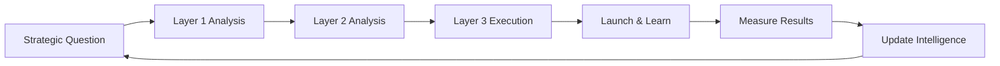

# **2 Introducing the Stack**

### **2.1 The Framework: Three Layers, Three Questions**

The Audience Intelligence Stack is built on a simple principle: **different strategic questions require different types of intelligence.**

Most marketing teams operate with a single, undifferentiated notion of "audience understanding." They collect data without a clear framework for what question each data point answers. Demographics, behaviors, affinities, and motivations are mixed together without recognizing that they serve fundamentally different strategic purposes.

The Audience Intelligence Stack separates audience understanding into three distinct layers, each with its own analytical methods, data requirements, and strategic applications:

| Layer                                | Meaning              | Core Question                       | Explanation                                                                                                                                                |
| ------------------------------------ | -------------------- | ----------------------------------- | ---------------------------------------------------------------------------------------------------------------------------------------------------------- |
| **Layer 3: Activation Intelligence** | **HOW (Tactical)**   | “How do we reach and move them?”    | Focuses on execution: channels, messaging, campaigns, offers, and timing. Turns insights into actions that persuade people to notice, care, and respond.   |
| **Layer 2: Psychographic Intelligence**    | **WHY (Analytical)** | “What do they care about and why?”  | Analyzes motivations, behaviors, and trends to reveal the drivers behind decisions. Not just what people do, but why they do it.                           |
| **Layer 1: Strategic Intelligence**  | **WHO (Strategic)**  | “Who are we really competing with?” | Defines the true competitive landscape (direct rivals, substitutes, the status quo, and internal constraints) to shape positioning and long-term strategy. |

**The architecture is deliberate:** Each layer builds on the one below. You can't effectively activate (Layer 3\) without understanding motivations (Layer 2). You can't understand which motivations matter without knowing who you're competing with and for whom (Layer 1).

### **2.2 Layer 1: Strategic Intelligence**

**The core question:** Who are we really competing with?

**What it reveals:**

* Which brands, creators, and platforms compete for your audience's attention  
* How much of your audience they reach (and how much of their audience you've captured)  
* Where you sit in the competitive landscape: symmetric competition, asymmetric threat, niche dominance, or minimal overlap  
* Which partnerships make strategic sense based on audience alignment

**Key metrics:**

* **Reach:** What % of your audience also engages with them?  
* **Penetration:** What % of their audience also engages with you?  
* **Affinity:** How much more likely is your audience to engage with them vs. the general population?

**Strategic applications:**

* Competitive prioritization (who to focus on, who to ignore)  
* Partnership screening (who has complementary vs. conflicting audiences)  
* Market positioning (where you actually sit vs. where you think you sit)  
* M\&A evaluation (which companies have strategically valuable audiences)

**Example insight:** "We thought we competed with Brand X because we're in the same category. But only 8% of our audience overlaps with theirs. We actually compete with Brand Y (42% overlap) even though they're in a different category."

### **2.3 Layer 2: Psychographic Intelligence**

**The core question:** Why do audiences make the choices they do?

**What it reveals:**

* What your audience cares about beyond your category  
* What motivations and values drive their decisions  
* How to segment your audience into meaningfully different groups  
* What cultural contexts and movements shape their worldview

**Key methods:**

* Cross-category affinity analysis (what else do they engage with?)  
* Psychographic clustering (what patterns emerge across interests?)  
* Motivational inference (why do these patterns exist?)  
* Segment identification (what distinct sub-groups exist?)

**Strategic applications:**

* Message development (what resonates with which segments)  
* Brand positioning (how to authentically align with audience values)  
* Content strategy (what themes and topics engage them)  
* Product development (what adjacent needs exist)

**Example insight:** "Our audience isn't just 'runners'. We have four segments: Dedicated Athletes (motivated by performance), Family Managers (motivated by health and balance), Comfort Seekers (motivated by pain relief), and Informed Citizens (motivated by evidence). Each needs different messaging."

### **2.4 Layer 3: Activation Intelligence**

**The core question:** How do we effectively reach and move them?

**What it reveals:**

* Which specific influencers will drive conversion (not just have large followings)  
* What content performs on which platforms for which segments  
* Where to allocate media budget for optimal ROI  
* How to sequence touchpoints for maximum conversion

**Key inputs:**

* Strategic Intelligence (who to target, who to avoid)  
* Psychographic Intelligence (what motivates them, how they segment)  
* Tactical performance data (what actually converts)

**Strategic applications:**

* Influencer selection (evaluate based on audience overlap \+ motivational alignment)  
* Channel prioritization (allocate budget based on where your specific audience converts)  
* Content strategy (create platform-specific, segment-tailored messaging)  
* Campaign architecture (sequence touchpoints to match decision process)

**Example insight:** "Influencer A has 850K followers but only 0.8% overlap with our audience and misaligned motivations. Influencer B has 120K followers but 38% overlap with perfect motivational fit. B will drive 6x more conversions despite 7x fewer followers."

### **2.5 Why the Layers Must Work Together**

Each layer alone provides value, but limited value:

**Strategic Intelligence only:**

* You know who to target and who to avoid  
* But you don't know what to say or why they'd choose you  
* Result: Right audience, wrong message

**Psychographic Intelligence only:**

* You understand motivations deeply  
* But you're targeting the wrong people or ignoring real competitive threats  
* Result: Great message, wrong audience

**Activation Intelligence only:**

* You're optimizing tactics efficiently  
* But without strategic or pattern foundation, you're optimizing the wrong things  
* Result: Efficient execution of flawed strategy

**All three together:**

* Strategic Intelligence: Target serious marathon runners, not casual fitness enthusiasts  
* Psychographic Intelligence: They're motivated by performance optimization and family balance, not just athletic achievement  
* Activation Intelligence: Partner with running coaches (not lifestyle influencers), create training integration content (not aspirational lifestyle), activate on Runner's World and marathon expos (not TikTok)  
* Result: Right audience \+ right message \+ right channels \= optimal conversion and customer quality

### **2.6 The Intelligence Cycle**

The stack isn't a one-time analysis. It's a continuous learning system:

Every activation generates new data that refines your intelligence:

* Which competitors are gaining overlap? (Update Strategic Intelligence)  
* What new patterns emerge in high-value customers? (Update Psychographic Intelligence)  
* Which channels and messages convert best? (Update Activation Intelligence)

**This is why intelligence compounds over time while data alone doesn't.** Each cycle makes the next cycle better informed.

### **2.7 What's Next**

The following sections explore each layer in detail:

**Section 3** dives deep into Strategic Intelligence with a complete worked example, showing how two "comfort footwear" brands that seem like competitors actually serve completely different audiences.

**Section 4** explores Psychographic Intelligence, revealing how to move from demographic understanding to psychographic insight and actionable segmentation.

**Section 5** demonstrates Activation Intelligence, showing why great tactics fail without strategic foundation and how to make intelligent tactical decisions.

**Section 6** integrates all three layers through a complete workflow example, showing how they work together to inform real strategic decisions from question to execution to learning.

By the end, you'll understand not just what the Audience Intelligence Stack is, but how to recognize intelligence-driven decisions vs. assumption-driven ones, and why that difference creates sustainable competitive advantage.

