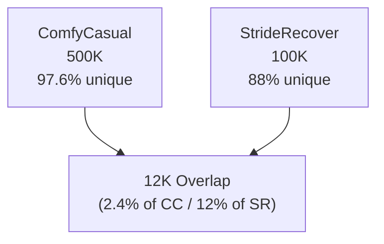
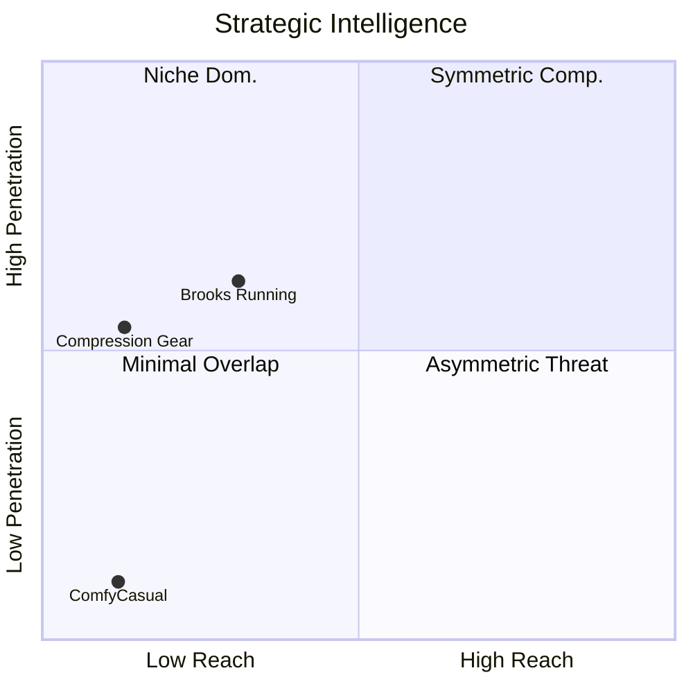

# **3 Layer 1 — Strategic Intelligence**

### **3.1 What Strategic Intelligence Answers**

Before we can understand what our audience wants or how to reach them, we need to understand where we actually sit in the competitive landscape. Strategic Intelligence answers the foundational questions that shape everything else:

* **Who are our real competitors?** Not the brands in our category, but the brands competing for our audience's attention and wallet.  
* **Where does our audience overlap with other brands?** Which brands touch our customers, and how much of their audience have we captured?  
* **How vulnerable are we to competitive threats?** Are competitors pulling our audience away, or are we operating in different markets?  
* **What does our competitive landscape actually look like?** Beyond market share charts and feature comparisons, what does the battlefield reveal?

These aren't questions about product features or pricing. They're questions about audience dynamics: who's actually fighting for the same people, and who just looks like they are.

### **3.2 Why Traditional Competitive Analysis Fails**

Most competitive analysis focuses on the wrong things.

Traditional frameworks compare:

* **Market share** (who sells more units)  
* **Product features** (who has better specs)  
* **Price positioning** (premium vs. value)  
* **Category membership** (we're both "athletic footwear" or "comfort brands")  
* **Distribution overlap** (we both sell on Amazon)

The assumption underlying all of this is: *we're competing for the same customers.*

But what if that assumption is wrong?

What if two brands that look like direct competitors — same category, similar products, overlapping price points, shared retail channels — are actually serving almost entirely different audiences with entirely different needs?

This is where Strategic Intelligence separates perception from reality.

### **3.3 The StrideRecover vs. ComfyCasual Case**

Let me show you what this looks like with a detailed example.

#### **The Setup: Perceived Competition**

Imagine you're the CMO of **StrideRecover**, a recovery-focused athletic footwear brand. Your products are foam-based slides and sandals with biomechanical arch support, positioned as "Active Recovery for Serious Athletes". Price point: $60-100. Your messaging emphasizes impact absorption, recovery benefits, and getting athletes back to training faster.

You're in a quarterly strategy meeting, reviewing your competitive landscape. The analysis shows:

**Market Category:** Comfort Footwear - Athletic/Casual  
**Key Competitors:**

1. ComfyCasual  
2. \[Other recovery brands\]  
3. \[Traditional athletic footwear\]

**ComfyCasual** is a massive player in all-day comfort footwear — foam clogs and slides in bold colors, highly customizable, positioned as "Comfort That Moves With You." They have 5x your marketing budget, celebrity endorsements, viral social media presence, and distribution everywhere.

The competitive logic seems airtight:

* Both brands make foam-based comfort footwear  
* Both emphasize "all-day comfort" in messaging  
* Both use similar materials and manufacturing processes  
* Both sell through Amazon, specialty retailers, and some big-box stores  
* Price points overlap significantly ($45-100 range)  
* Both target comfort-seeking consumers

Your board asks the obvious question: **"How do we compete with ComfyCasual? They're crushing us in brand awareness. Should we add more colors? Launch celebrity collaborations? Pivot our messaging to be more lifestyle-focused like theirs?"**

This is the moment where most brands make a critical strategic error.

They see category similarity and assume audience similarity. They see a bigger competitor with successful tactics and try to copy those tactics. They chase brand awareness and market share without understanding who they're actually fighting for.

Strategic Intelligence reveals something completely different.

#### **The Analysis: What the Data Actually Shows**

Let's examine the audience overlap using the three key metrics: **Reach, Penetration, and Affinity**.

**The basic numbers:**

* StrideRecover audience: 100,000 engaged followers (social platforms)  
* ComfyCasual audience: 500,000 engaged followers  
* People who engage with BOTH brands: 12,000

At first glance, 12,000 overlapping customers seems significant. That's a lot of people\! Surely this confirms they're competing for the same audience.

But let's apply the Strategic Intelligence framework.

**REACH: What percentage of StrideRecover's audience also engages with ComfyCasual?**

Calculation: 12,000 overlap ÷ 100,000 StrideRecover audience \= **12% reach**

Translation: ComfyCasual touches only 12% of StrideRecover's audience. That means **88% of StrideRecover's customers don't care about ComfyCasual at all.** They're not following them, not engaging with them, not considering them.

**PENETRATION: What percentage of ComfyCasual's audience also engages with StrideRecover?**

Calculation: 12,000 overlap ÷ 500,000 ComfyCasual audience \= **2.4% penetration**

Translation: StrideRecover has captured only 2.4% of ComfyCasual's massive audience. StrideRecover is **barely on their radar.** Despite being in the same category, StrideRecover isn't successfully converting ComfyCasual's customers.

**The strategic picture:**

This is **asymmetric non-competition.**

ComfyCasual isn't stealing StrideRecover's audience (only 12% overlap). StrideRecover isn't winning ComfyCasual's audience (only 2.4% penetration). They're operating in markets that happen to have a small intersection.

It's like saying Mercedes and Honda compete because some households own cars from both brands. The overlap exists, but they're fundamentally serving different audiences with different needs, different purchase criteria, and different use cases.

But the real insight - the *why* behind these numbers - comes from examining what each audience actually cares about.

#### **The Pattern Divergence: Who These Audiences Really Are**

When we analyze the **affinity patterns** - what each audience engages with far more than the general population - two completely different psychographic profiles emerge.

**StrideRecover Audience: The Active Family Manager**

This audience shows exceptionally high affinity for:

**Running Ecosystem:**

* Brooks Running: 31x affinity (31 times more likely to follow than the average person), 30.7% reach (30,700 people)  
* Saucony: 44x affinity, 18.2% reach (18,200 people)  
* HOKA ONE ONE: 55x affinity, 13.2% reach (13,200 people)  
* Boston Marathon: 20x affinity, 20.5% reach (20,500 people)  
* Runner's World magazine: 12x affinity, 30.7% reach (30,700 people)  
* Running Times: 37x affinity, 21.8% reach (21,800 people)

**Performance & Recovery:**

* Specialized sports nutrition brands: 83x affinity, 23.1% reach (23,100 people) — hydration, gels, recovery supplements  
* Performance tracking devices: 35x affinity, 18.7% reach (18,700 people) — GPS watches, heart rate monitors  
* Compression gear: 119x affinity, 12.7% reach (12,700 people)  
* Physical therapy and recovery content: 28x affinity, meaningful reach

**Wellness & Health:**

* Organic and natural foods: 8x affinity, 43.9% reach (43,900 people)  
* Vitamins and supplements: 6x affinity, 48% reach (48,000 people)  
* Whole Foods Market: 5x affinity, 30.1% reach (30,100 people)  
* Health-focused meal preparation: 15x+ affinity

**Demographics:**

* Age 35-55 (Gen X): 1.7x affinity, 47.5% reach  
* Married: 1.5x affinity, 61% reach  
* Has children: 1.5x affinity, 50.1% reach  
* Employed full-time: 1.2x affinity, 83.6% reach

**Lifestyle Indicators:**

* Premium home comfort brands — quality mattresses: 100x affinity, 15.3% reach (15,300 people)  
* Home goods: 60x affinity, 20.3% reach (20,300 people)  
* Family-oriented retailers: Target 4.2x affinity (32% reach), Amazon 3.8x affinity (39.8% reach)  
* Established news sources: New York Times 1.4x affinity (60.3% reach), Wall Street Journal 1.5x affinity (45.4% reach)

**Interpreting these patterns:**

The high-affinity, high-reach running brands (Brooks 31x at 30.7%, Saucony 44x at 18.2%) are defining characteristics: these aren't casual joggers. The extreme affinity for specialized recovery products (compression gear 119x, sports nutrition 83x) combined with meaningful reach numbers confirms this audience invests heavily in performance optimization.

The moderate-affinity but very high-reach items (Vitamins 6x at 48%, Organic foods 8x at 43.9%) show this wellness orientation isn't niche: it's pervasive across the audience.

The news consumption shows elevated but not extreme affinity (NYT 1.4x, WSJ 1.5x). These are ubiquitous brands where even modest affinity lift at high reach (60.3%, 45.4%) indicates a more informed, engaged demographic than average.

**Who are they?**  
Established adults (typically Gen X, married with children, working full-time) who are deeply committed to endurance athletics, particularly running. This isn't casual exercise. Running is identity-defining. They invest in specialized gear, track performance metrics, participate in marathons, consume running media, and structure their lives around training schedules.

**What motivates them?**  
Performance optimization and holistic wellness. They want to run faster, longer, and injury-free. They understand that recovery is part of performance: that what you do *after* the workout matters as much as the workout itself. They're willing to invest in products that deliver measurable benefits.

**What does "comfort" mean to them?**  
Comfort equals recovery. It means biomechanical support that reduces impact on joints, arch support that prevents plantar fasciitis, foam technology that accelerates muscle recovery. Comfort is functional, not casual. It's a tool for performance, not a lifestyle choice.

**ComfyCasual Audience: The Social-First Youth**

This audience shows exceptionally high affinity for:

**Entertainment & Pop Culture:**

* Taylor Swift: 1.7x affinity, meaningful reach  
* Disney properties: 3.5x affinity, strong engagement  
* Marvel: 2.5x affinity  
* YouTube personalities: 1.7x affinity, very high reach  
* MrBeast: 3.4x affinity  
* Gaming content and streamers: 2-3x affinity, high engagement

**Fast Food & Casual Dining:**

* McDonald's: 4.6x affinity, substantial reach  
* Domino's Pizza: 5.9x affinity  
* Taco Bell: 3.7x affinity  
* Chipotle: 4.7x affinity  
* Wendy's: 3.3x affinity

**Beverages & Snacks:**

* Pepsi: 5.5x affinity  
* Coca-Cola: 4.9x affinity  
* Doritos: 7.8x affinity  
* Reese's: 10x affinity  
* Energy drinks: 4-5x affinity

**Fashion & Self-Expression:**

* Fast fashion brands: 3-4x affinity  
* Sneaker culture - fashion-focused, not performance: 2-3x affinity  
* Beauty and makeup influencers: 2-4x affinity  
* TikTok fashion trends: high engagement

**Demographics:**

* Age 18-28 (Gen Z): 1.3x affinity, substantial proportion  
* Students: 1.5x affinity  
* Single: higher than average  
* Urban/suburban: higher than average

**Lifestyle Indicators:**

* Streaming entertainment platforms: Netflix 2-3x affinity, gaming streams 3x affinity  
* Social media natives: TikTok, Instagram-first behavior  
* Mobile gaming: 3x affinity  
* Music festivals and concerts: 2-3x affinity

**Interpreting these patterns:**

The moderate affinities (McDonald's 4.6x, Pepsi 5.5x, Disney 3.5x) at substantial reach indicate mainstream youth culture touchpoints: not niche interests, but elevated engagement with popular brands. The higher affinities for specific snacks (Doritos 7.8x, Reese's 10x) show more distinctive preferences within the broader casual consumption pattern.

The entertainment affinities (Taylor Swift 1.7x, YouTube 1.7x) appear modest, but these are extremely high base-rate brands. Even 1.7x affinity at high reach represents meaningful over-indexing for youth-oriented entertainment.

**Who are they?**  
Younger consumers (Gen Z, often students or early career) who are digitally native, pop-culture engaged, and lifestyle-focused. They're connected to trends, memes, celebrity culture, and peer networks. Social media isn't just a tool; it's their primary lens for experiencing the world.

**What motivates them?**  
Self-expression, social belonging, and cultural relevance. They want to signal identity, be part of conversations, express personality through what they wear and consume. Brands are badges of membership in cultural moments. Authenticity matters, but so does being current.

**What does "comfort" mean to them?**  
Comfort equals ease and versatility. It means all-day wearability for classes, hangouts, casual jobs, running errands. It means slip-on convenience, fun colors, customization that lets you express yourself. Comfort is casual, social, effortless. It's about feeling good while living your life, not optimizing recovery metrics.

#### **The Side-by-Side Reality**

Let me put this in stark relief:

| Dimension | StrideRecover Audience | ComfyCasual Audience |
| ----- | ----- | ----- |
| **Age** | Gen X (35-55), 1.7x affinity, 47.5% reach | Gen Z (18-28), 1.3x affinity |
| **Life Stage** | Married (1.5x, 61%), Children (1.5x, 50%), Employed (1.2x, 84%) | Students (1.5x), Single |
| **Top Brand Affinities** | Brooks Running (31x, 30.7%), Saucony (44x, 18.2%), Boston Marathon (20x, 20.5%), Sports nutrition (83x, 23.1%), Whole Foods (5x, 30.1%) | McDonald's (4.6x), Disney (3.5x), Taylor Swift (1.7x), Doritos (7.8x), Pepsi (5.5x) |
| **Core Motivation** | Performance optimization, health & recovery, family wellbeing | Self-expression & belonging, cultural relevance, social connection |
| **"Comfort" Definition** | Biomechanical support, recovery-enabling, injury prevention | All-day ease, versatile casualness, comfortable self-expression |
| **Media Consumption** | Runner's World (12x, 30.7%), NYT/WSJ (1.4-1.5x, 45-60%), fitness podcasts, training content | YouTube creators (1.7x), TikTok (high engagement), gaming streams, entertainment news |
| **Spending Patterns** | Premium performance gear, specialized nutrition, fitness tech, quality home goods | Fast food & casual dining, entertainment & streaming, fashion & beauty, social experiences |

**Audience Overlap:** Only 12% of StrideRecover audience / 2.4% of ComfyCasual audience

The same word, "**comfort**", means **completely different things** to these two groups.

For StrideRecover's audience, comfort is a functional attribute measured in impact absorption and recovery time.

For ComfyCasual's audience, comfort is an aesthetic and lifestyle attribute measured in versatility and self-expression.

#### **The Strategic Insight**

**StrideRecover and ComfyCasual are not competitors.**

They use similar materials. They occupy similar price points. They both market "comfort." But they serve fundamentally different audiences with fundamentally different needs:

* **StrideRecover \= Functional recovery for performance athletes**  
* **ComfyCasual \= Casual versatility for social-first youth**

The 12% audience overlap exists, but it's not competitive overlap. It exists because:

1. Some younger athletes wear ComfyCasual for casual, non-athletic occasions (they wouldn't wear recovery footwear to a concert)  
2. Some older casual wearers appreciate StrideRecover's comfort for everyday use (even if they're not training)  
3. Families buy both brands for different household members: parents wear StrideRecover, kids wear ComfyCasual

These are **different purchase occasions, different use cases, different decision criteria.** The overlap is incidental, not competitive.

#### **The Implications: What This Changes**

Understanding this fundamentally reshapes StrideRecover's strategy.

**What StrideRecover SHOULD do:**

✅ **Stop worrying about ComfyCasual's marketing budget.** They're playing a different game. Their brand awareness doesn't threaten your positioning.

✅ **Stop considering "fun colors and customization" to compete.** Your audience doesn't care about that. They care about recovery science and performance benefits.

✅ **Double down on recovery science and performance positioning.** This is your differentiation. Own it completely. Talk about impact absorption, biomechanics, injury prevention, getting back to training faster.

✅ **Focus competitive energy on other performance-recovery brands.** Your real threats are brands competing for the same serious athlete audience — other recovery footwear, compression gear, sports massage tools, premium athletic footwear.

✅ **Partner with running events, sports nutrition brands, fitness tech.** Your audience shows massive affinity for these brands at meaningful reach levels (Boston Marathon 20x at 20.5%, sports nutrition 83x at 23.1%, GPS devices 35x at 18.7%). These are natural, authentic partnerships.

✅ **Message to "active adults who take recovery seriously."** Not casual wearers. Not youth culture. Your core is established athletes (Gen X 1.7x at 47.5%, married 1.5x at 61%, children 1.5x at 50%) who understand that recovery is performance.

**What StrideRecover should NOT do:**

❌ **Chase ComfyCasual's youth market.** Wrong demographics (Gen Z vs. Gen X), wrong psychographics (pop culture vs. performance), wrong motivations (self-expression vs. optimization). You'll dilute your brand trying to appeal to an audience that doesn't value what you offer.

❌ **Add celebrity collaborations trying to compete on pop culture.** Your audience follows elite marathon runners (20-30x affinity), not pop stars (1.7x affinity). Stay authentic to your positioning.

❌ **Dilute recovery messaging to be more "lifestyle."** The moment you become vague about your purpose, you lose your competitive advantage with the serious athlete segment.

❌ **Compete on social media trends vs. performance content.** Your audience consumes training content, race recaps, recovery tips — not viral dances. They're on news platforms (NYT 1.4x at 60%, WSJ 1.5x at 45%) seeking information, not entertainment.

❌ **Lower prices to match their perceived competition.** Your audience has high disposable income (employed 1.2x at 84%) and will pay premium prices for proven performance benefits. They invest heavily in specialized gear (Brooks 31x, HOKA 55x). Price competition signals you don't believe in your value.

#### **The Competitive Landscape StrideRecover Actually Faces**

When you understand audience dynamics, the real competitive map emerges:

**Real threats (high overlap, high affinity, meaningful reach):**

* Other recovery-focused footwear brands competing for the same post-workout dollar  
* Compression gear brands (119x affinity at 12.7% reach) competing for recovery budget and athlete attention  
* Premium athletic footwear brands (Brooks 31x at 30.7%, Saucony 44x at 18.2%, HOKA 55x at 13.2%) competing for the serious athlete's primary spend  
* Physical therapy and wellness services offering alternative recovery solutions

**Partnership opportunities (complementary audiences, non-competitive):**

* Running shoe brands like Brooks and Saucony (31-44x affinity, 18-31% reach) -> your audiences are nearly identical, but you serve different needs (performance during vs. recovery after)  
* Sports nutrition brands (83x affinity at 23.1%) -> shared performance optimization mindset  
* Fitness tracking tech like Garmin (35x affinity at 18.7%) -> shared love of data and measurement  
* Marathon events (Boston 20x at 20.5%, Rock 'n' Roll 34x at 19.4%) -> direct access to your core concentrated audience

**Strategic whitespace (underserved audiences with potential):**

* "Everyday recovery" positioning for non-athletes who stand all day (nurses, teachers, retail workers) -> they need recovery but don't identify as athletes  
* Family recovery positioning for active parents (married 1.5x at 61%, children 1.5x at 50%) balancing fitness with family demands  
* Travel comfort for active adventurers who need recovery on the go

#### **The Counterfactual: What Would Have Happened**

Let's imagine the alternate timeline: what would have happened if StrideRecover's board, lacking Strategic Intelligence, decided to compete directly with ComfyCasual?

**The Misguided Strategy:**

* **Month 1:** Launch "StrideRecover Colors" line with bright, customizable options to match ComfyCasual's aesthetic  
* **Month 3:** Partner with a pop music influencer (2M followers, Gen Z audience, zero running affinity) for six-figure endorsement deal  
* **Month 6:** Run major "fun, casual comfort for everyone" campaign on TikTok with viral dance challenge  
* **Month 9:** See poor conversion rates despite high impressions; assume execution was wrong, not strategy  
* **Month 12:** Consider full rebrand to be more "lifestyle and fun" to capture youth market

**The Results:**

* **Brand confusion:** Are we recovery footwear or casual lifestyle? The positioning becomes muddy. Content mixes performance messaging with lifestyle aesthetics, satisfying neither audience.  
* **Core audience alienation:** Serious athletes (Gen X 1.7x at 47.5%, marathon runners 20-37x affinity at 20-22% reach) feel the brand isn't for them anymore. They see pop influencers instead of elite runners, casual lifestyle imagery instead of performance science. They switch to competitors who stayed focused on recovery.  
* **New audience doesn't convert:** Gen Z sees through inauthentic positioning. They want brands that genuinely understand their culture (McDonald's 4.6x, Disney 3.5x, Taylor Swift 1.7x), not performance brands trying to be cool. The pop influencer partnership feels forced, the TikTok campaign falls flat.  
* **Wasted marketing budget:** Six figures on wrong influencers (pop stars vs. marathon runners), wrong channels (TikTok vs. running media 12-37x affinity), wrong creative (fun lifestyle vs. recovery science) that doesn't resonate with anyone.  
* **Weakened competitive position:** Now vulnerable to actual recovery competitors who stayed focused while StrideRecover chased ghosts. Lost ground in running specialty retail, lost partnerships with marathon events, lost credibility with sports medicine professionals.

**The Actual Strategy (with Strategic Intelligence):**

StrideRecover's board sees the audience analysis and makes different choices:

* **Month 1:** Double down on "Active Recovery for Serious Athletes" positioning with renewed focus. Increase investment in recovery science content, biomechanics education.  
* **Month 3:** Partner with three elite marathon runners (affinity with audience: 20-30x at 15-20% reach) and two running coaches (42x affinity at 15.7%) who authentically use the product in training.  
* **Month 6:** Launch "The Science of Recovery" content series explaining biomechanics, featuring sports medicine experts. Distribute through Runner's World (12x affinity at 30.7%), running podcasts, and established news outlets (NYT 1.4x at 60%, WSJ 1.5x at 45%) where audience already consumes information.  
* **Month 9:** Become official recovery footwear partner of Boston Marathon (20x affinity at 20.5%); product visible at finish line recovery area, distributed in runner goodie bags, featured in pre-race recovery seminars.  
* **Month 12:** Expand into adjacent categories: travel recovery for active adventurers, home recovery premium slides (audience shows 100x affinity at 15.3% for premium mattresses, 60x at 20.3% for home goods), professional recovery positioning for healthcare workers (nurses, teachers: high-standing professions needing functional comfort).

**The Results:**

* **Brand clarity:** Everyone knows what StrideRecover is for. The positioning is sharp and defensible. "We're the recovery footwear for serious athletes who understand that recovery is performance."  
* **Core audience deepening:** Serious athletes see StrideRecover as essential equipment, not optional comfort. Brand loyalty increases from 60% to 78% repeat purchase rate. Net Promoter Score rises from \+45 to \+67.  
* **Strategic positioning strengthened:** Competitors can't easily attack because StrideRecover owns "recovery" in the minds of performance athletes. Sports medicine professionals recommend the product. Marathon events seek partnerships.  
* **Marketing spend optimized:** Every dollar goes to channels that over-index with the target audience (running media 12-37x affinity, marathon partnerships 20-34x affinity, sports nutrition co-marketing 83x affinity). Cost per acquisition drops 40% while customer lifetime value increases 30%.  
* **Natural expansion:** Growth comes from serving adjacent needs of the same psychographic audience (travel recovery, everyday recovery, professional recovery), not chasing different audiences entirely. Total addressable market expands from "marathon runners" (narrow) to "active adults who take recovery seriously" (broader but still focused).

### **3.4 The Broader Lesson**

The StrideRecover vs. ComfyCasual case illustrates the fundamental value of Strategic Intelligence: **Category labels hide more than they reveal.**

Traditional competitive analysis would have kept StrideRecover stuck in a false paradigm, wasting resources fighting a competitor that wasn't actually competing for their audience. Strategic Intelligence (using audience overlap metrics and affinity analysis) revealed the truth: **they're solving different problems with similar materials for fundamentally different people.**

This pattern repeats across every industry:

* Two "coffee brands" might serve completely different lifestyle segments (productivity hustle culture vs. artisan slow-living appreciation)  
* Two "productivity apps" might appeal to entirely different work styles (collaborative team coordination vs. solo deep-work focus)  
* Two "athletic apparel brands" might target different identities (fashion-athlete street culture vs. performance-athlete training obsession)

**The category is often a lie.** The audience dynamics tell the truth.

This is why Strategic Intelligence is the foundation of the Audience Intelligence Stack. Until you understand *who you're actually competing with* - not who sells similar products, but who's fighting for the same audience - you can't make sound strategic decisions about positioning, partnerships, messaging, or resource allocation.

And as we've seen, getting this wrong doesn't just waste marketing budget. It can fundamentally damage your brand by creating confusion about who you serve and why you exist. Every dollar spent chasing the wrong competitor is a dollar not spent deepening your relationship with your actual audience. Every message crafted to appeal to the wrong psychographic is a message that alienates your core.

Strategic Intelligence prevents this. It reveals the battlefield as it actually is, not as category definitions suggest it should be.

### **3.5 Understanding the Metrics: A Sophisticated View**

The Strategic Intelligence framework rests on three interconnected metrics. Understanding them properly requires moving beyond simple thresholds to contextual interpretation.

#### **REACH: Breadth of Overlap**

**Definition:** What percentage of YOUR audience also engages with THEM?

**Formula:** (Overlapping audience) ÷ (Your total audience) \= Reach %

**What it reveals:** How present they are in your audience's world. High reach means this brand/entity occupies space in your audience's attention, whether as competitor, complement, or cultural touchpoint.

**Context matters:** Reach alone doesn't tell you if the connection is meaningful. A brand might reach 40% of your audience simply because they reach 40% of *everyone* (Starbucks, Netflix, Amazon). To understand if this connection differentiates your audience, you need affinity.

**Example:**

* If 32% of your audience shops at Target, that's significant reach  
* But if Target reaches 28% of the general population, the affinity is only 1.14x  
* This suggests Target is a relevant channel but not a defining characteristic  
* Compare to: 20.5% of your audience follows Boston Marathon, but only 1% of general population does (20x affinity) — this is a defining characteristic despite lower absolute reach

#### **PENETRATION: Depth of Conquest**

**Definition:** What percentage of THEIR audience also engages with YOU?

**Formula:** (Overlapping audience) ÷ (Their total audience) \= Penetration %

**What it reveals:** How successfully you've captured their audience. High penetration means you're winning their customers.

**Size matters:** Penetration percentages must be evaluated alongside absolute audience sizes. Achieving 15% penetration into a competitor with 5 million audience members means you've captured 750,000 of their customers — strategically significant even though the percentage seems modest. Conversely, 60% penetration into a micro-brand with 5,000 audience members is only 3,000 people — less meaningful despite the impressive percentage.

**Example:**

* Small brand A (100K audience) achieves 15% penetration into mega-brand B (5M audience)  
* Absolute overlap: 750,000 people - this is huge strategic success  
* Same brand A achieves 60% penetration into micro-brand C (5K audience)  
* Absolute overlap: 3,000 people - impressive percentage but limited strategic impact

#### **AFFINITY: Intensity of Connection**

**Definition:** How much MORE likely is your audience to engage with something compared to the general population?

**Formula:** (% of your audience engaging) ÷ (% of general population engaging) \= Affinity multiplier

**What it reveals:** Whether a connection is signal or noise. Affinity accounts for base rates, separating "your audience likes this because everyone does" from "your audience disproportionately gravitates toward this."

**The critical nuance:** Affinity is mathematically bounded by base rates.

Consider two examples:

**Example 1: The Ubiquitous Brand**

Amazon reaches 85% of the general population.

If 90% of your audience uses Amazon:

Affinity \= 90% ÷ 85% \= 1.06x

Even though most of your audience uses Amazon, the affinity is low because 

most of EVERYONE uses Amazon. This isn't a differentiating characteristic.

Maximum possible affinity with Amazon: \~1.18x (if literally 100% of your audience used it)

Despite the low affinity, Amazon might still be strategically relevant, but for *channel and distribution strategy*, not for *audience differentiation*. The low affinity tells you this isn't what makes your audience unique.

**Example 2: The Niche Defining Brand**

A specialized running magazine reaches 0.5% of the general population.

If 25% of your audience follows this magazine:

Affinity \= 25% ÷ 0.5% \= 50x

This is a powerful signal. Your audience is 50 times more likely to engage 

with this brand than the average person. This defines who they are.

This high affinity, even at modest absolute reach (25%), reveals something fundamental about your audience's identity and interests.

**The lesson:** You cannot apply fixed thresholds ("5x is high affinity, 2x is moderate") without considering:

* **The base rate:** What percentage of the general population engages?  
* **The absolute numbers:** How many people are we talking about?  
* **Statistical confidence:** Is this pattern reliable or noise?

A brand with 40% general population penetration can never show high affinity with anyone, even if strategically important for channels or partnerships. A brand with 0.1% penetration can show 50x affinity based on a handful of your audience members. Impressive-sounding but potentially statistical noise.

#### **Combining Metrics: The Relevance Filter**

Sophisticated audience intelligence requires combining all three considerations to filter for signals that are both statistically robust and strategically meaningful.

**High Strategic Relevance requires:**

* ✅ **Elevated affinity** relative to base rate (typically \>1.5x, accounting for base rate constraints)  
* ✅ **Meaningful absolute reach** (typically \>5-10% of your audience, or \>5,000 people for audiences of 100K+)  
* ✅ **Statistical significance** (pattern is reliable, not chance: confidence interval excludes 1.0x)

**This filters out:**

* **Ubiquitous brands** with low affinity despite high reach (Amazon 1.06x, Google 1.08x, Starbucks 1.12x) - everyone uses them, so they don't differentiate your audience  
* **Tiny brands** with high affinity by chance (micro-influencer with 0.5% reach at 50x affinity based on 500 people) - interesting but potentially noise  
* **Statistically noisy patterns** (insufficient sample size, wide confidence intervals)

**Proper interpretation examples:**

HIGH STRATEGIC RELEVANCE: Sports nutrition brand

* 83x affinity (base rate: 0.28% general population)  
* 23% reach (23,000 people)  
* Statistical significance: p \< 0.001 → Defining characteristic: this audience is serious about performance nutrition in a way that separates them from 99%+ of population

MODERATE STRATEGIC RELEVANCE (ubiquitous brand, elevated reach): Target (major retailer)

* 1.5x affinity (base rate: 28% general population)  
* 32% reach (32,000 people)  
* Statistical significance: p \< 0.01 → Moderately elevated shopping behavior; relevant for channel strategy but not highly differentiating (everyone shops at Target, your audience just does slightly more)

MODERATE STRATEGIC RELEVANCE (niche brand, defining but small): Specialized running coach

* 42x affinity (base rate: 0.37% general population)  
* 15.7% reach (15,700 people)  
* Statistical significance: p \< 0.001 → Defining but not dominant; important for understanding audience values and potential partnerships, but not central to strategy

LOW STRATEGIC RELEVANCE (ubiquitous, minimal differentiation): Amazon

* 1.14x affinity (base rate: 35% general population)  
* 40% reach (40,000 people)  
* Statistical significance: p \= 0.03 → Statistically elevated but not meaningfully differentiating; everyone uses Amazon. Relevant for distribution strategy but tells us nothing about what makes this audience unique

LOW STRATEGIC RELEVANCE (high affinity but noise): Obscure micro-influencer

* 50x affinity (base rate: 0.01% general population)  
* 0.5% reach (500 people)  
* Statistical significance: p \= 0.12 (wide confidence interval) → High lift but very small absolute numbers and uncertain statistical pattern; likely noise or highly niche segment that's not strategically central; requires validation

The goal isn't to find the highest affinity scores or the highest reach percentages in isolation. **The goal is to find the connections that are both statistically robust and strategically meaningful** — patterns that reveal something important about competitive positioning, audience identity, or market opportunities.

#### **The Quadrant Framework: Integrating All Three Metrics**

When we combine reach, penetration, and affinity (filtered for relevance), four strategic positions emerge:

**Symmetric Competition (High Reach \+ High Penetration \+ High Affinity):**  

Both brands have meaningful, statistically significant, elevated-affinity presence in each other's audiences. You're genuinely fighting for the same people with the same needs.

*Example: Two premium coffee roasters*

- Brand A → Brand B: 45% reach, 1.8x affinity

- Brand B → Brand A: 38% reach, 1.7x affinity

- Shared affinity patterns: specialty coffee events 25x, barista competitions 18x, artisan food 12x

- *Strategic implication:* True direct competition requiring sharp differentiation on dimensions this specific audience cares about (sourcing philosophy, roasting style, brand values, community building)

**Asymmetric Threat (High Reach \+ Low Penetration \+ High Affinity):**  

They have meaningful, elevated-affinity presence in your audience, but you haven't captured theirs. They're successfully winning your customers while you struggle to win theirs.

*Example: Established brand vs. DTC upstart*

- Upstart → Established: 35% reach, 2.4x affinity (they're pulling your audience)

- Established → Upstart: 8% reach, 1.2x affinity (you're barely present in theirs)

- *Strategic implication:* Genuine competitive threat; must understand what the upstart offers that resonates (probably DTC convenience, modern brand values, community) and either match it or differentiate on dimensions they can't claim (heritage, performance credentials, scale)

**Niche Dominance (Low Reach \+ High Penetration \+ High Affinity):**  

You've captured a specific, high-affinity segment of their audience, even though they don't broadly reach yours. You own a niche within their broader market.

*Example: Specialized recovery brand vs. general athletic brand*

- You → Them: 50% penetration, 3.2x affinity (you've captured half their audience in your niche)

- Them → You: 10% reach, 1.1x affinity (they barely touch your specialized audience)

- *Strategic implication:* Protect and deepen your niche; you're winning a specific segment but vulnerable if they decide to target it directly; consider expansion to adjacent niches rather than head-to-head mass-market competition

**Minimal Overlap (Low Reach \+ Low Penetration \+ Low/Moderate Affinity):**  

Neither brand has meaningful, elevated-affinity presence in the other's audience when accounting for base rates and statistical significance. You're not competing for the same people.

*Example: StrideRecover vs. ComfyCasual*

- StrideRecover → ComfyCasual: 12% reach (but affinity analysis shows fundamentally different psychographics)

- ComfyCasual → StrideRecover: 2.4% penetration (minimal presence)

- Affinity patterns diverge completely: running 31-55x vs. fast food 4-6x, performance nutrition 83x vs. entertainment 2-4x

- *Strategic implication:* Not competitors despite category similarity; resource spent competing is wasted; focus on actual threats within your psychographic segment

### **3.6 Beyond the Single Example: The Framework Generalizes**

The StrideRecover vs. ComfyCasual case illustrated Minimal Overlap. But Strategic Intelligence reveals competitive positions across all four quadrants, each requiring different strategic responses. (See Appendix for detailed examples of Symmetric Competition, Asymmetric Threat, and Niche Dominance scenarios.)

What matters is that the framework — reach, penetration, affinity, filtered for relevance — applies universally:

- **Coffee brands** can discover they're serving productivity culture vs. artisan culture despite selling the same product

- **Productivity apps** can learn they're competing in "team collaboration" vs. "individual deep work" markets

- **Athletic apparel** can understand they're fighting for "fashion-athlete" vs. "performance-athlete" identities

The category label tells you where products sit on a shelf. Strategic Intelligence tells you where brands sit in the minds and lives of their audiences.

### **3.7 Strategic Intelligence in Practice**

Once you understand your competitive position through audience dynamics, specific strategic actions become clear:

**If you're in Symmetric Competition:**

- Differentiation is critical; price competition is dangerous

- Focus on dimensions that matter specifically to this audience

- Partnership opportunities are limited (you're fighting for same people)

- Monitor closely; they're your real threat

**If you face an Asymmetric Threat:**

- Understand urgently what they're doing right that you're not

- Defensive strategy to prevent further audience loss

- Consider whether to match their approach or differentiate sharply

- This is a genuine crisis requiring immediate strategic response

**If you have Niche Dominance:**

- Protect and deepen your position

- Consider expansion to adjacent niches (not mass market)

- Beware of the dominant player deciding to target your niche

- Leverage your specialized expertise and community

**If you have Minimal Overlap:**

- Stop wasting resources competing

- Refocus on actual threats within your psychographic segment

- Consider occasional partnership opportunities (non-competitive overlap)

- Confidently pursue distinct positioning

This is Strategic Intelligence. This is the foundation upon which everything else builds.

In the next section, we'll explore **Psychographic Intelligence**: once you know *who* you're competing with, you need to understand *why* audiences make the choices they do, and what deeper psychographic and behavioral patterns drive their decisions.

