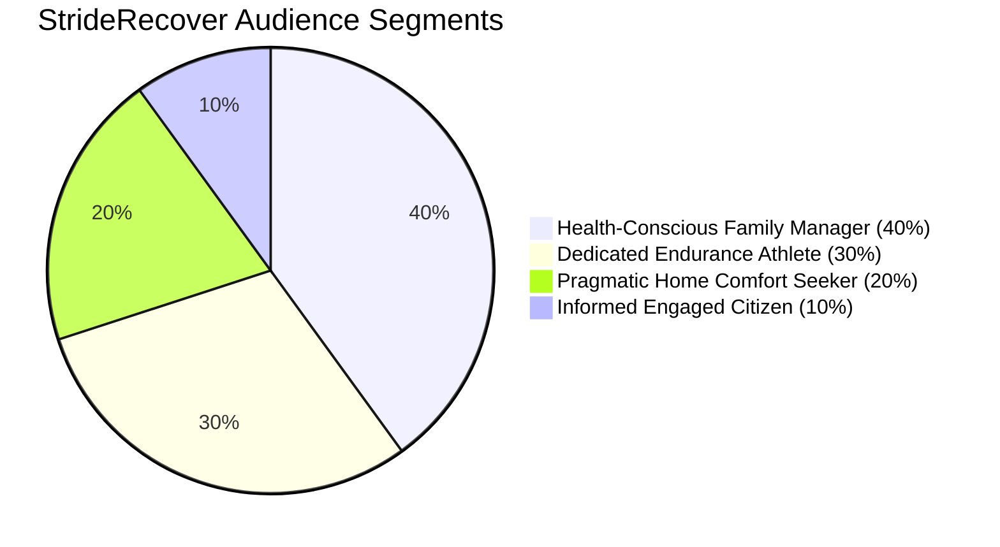

# **4 Layer 2 — Psychographic Intelligence**

---

### **4.1 What Psychographic Intelligence Answers**

Strategic Intelligence told us *who* we're competing with. Psychographic Intelligence tells us *why* audiences make the choices they do.

Once you understand your competitive position, you need to understand the audience itself — not just demographically (age, gender, location) or behaviorally (what they click, what they buy), but **psychographically**: what motivates them, what they value, how they see themselves, and why they gravitate toward certain brands and away from others.

Psychographic Intelligence answers a different set of questions:

* **What does this audience actually care about?** Beyond your category, what interests, values, and lifestyle choices define them?  
* **Why do they gravitate toward certain brands?** What underlying needs or identity expressions drive their choices?  
* **How can we segment this audience?** Are there distinct sub-groups with different motivations that require different approaches?  
* **What cultural contexts shape their decisions?** What movements, aesthetics, or communities influence how they think about your category?

These questions move us from the competitive battlefield (Layer 1\) to the psychological and cultural terrain that shapes how audiences perceive brands, make purchase decisions, and form loyalties.

---

### **4.2 Beyond Category Thinking**

Many brands make a fundamental error: they define their audience by their category.

**The category trap:**

* "We're a coffee company, so we need to understand coffee drinkers"  
* "We're athletic footwear, so our audience is athletes"  
* "We're a productivity app, so our audience wants to be productive"

This seems logical, but it's backwards. **Your audience isn't defined by your category. Your category is just one expression of their deeper values and lifestyle.**

Consider coffee:

* Some coffee drinkers cluster around **productivity and optimization** (coffee as fuel for hustle culture)  
* Others cluster around **artisan craftsmanship and slow living** (coffee as ritual and appreciation)  
* Others cluster around **social connection and community** (coffee as gathering place)  
* Others cluster around **health and wellness** (coffee as functional beverage with adaptogens)

Each cluster has completely different brand affinities, media consumption, purchase motivations, and messaging that resonates. They all "drink coffee," but they mean different things by it.

**The same pattern appears everywhere:**

* "Athletic footwear" encompasses performance athletes, fashion sneakerheads, comfort seekers, and casual active lifestyles  
* "Productivity apps" serve deep-work creatives, collaborative teams, optimization-obsessed executives, and overwhelmed parents  
* "Organic food" appeals to health-conscious families, environmental activists, culinary enthusiasts, and wellness influencers

**Category membership is a surface feature. Psychographic patterns are the deep structure.**

Psychographic Intelligence reveals this deep structure by examining what else audiences care about across all categories, not just yours.

---

### **4.3 The StrideRecover Audience: A Psychographic Intelligence Analysis**

Let's return to StrideRecover, the recovery-focused athletic footwear brand from Section 3\. We established through Strategic Intelligence that they're **not** competing with ComfyCasual — their audiences are fundamentally different. ComfyCasual serves Gen Z pop-culture-focused youth; StrideRecover serves Gen X performance-oriented adults.

But "Gen X performance-oriented adults" is still a demographic and behavioral description, not a psychographic understanding. Psychographic Intelligence goes deeper.

**The question:** Who are StrideRecover's customers, really? What drives them? What do they care about beyond recovery footwear?

---

#### **Step 1: Cross-Category Affinity Mapping**

We examine what StrideRecover's audience engages with across all categories — not just athletic footwear, but media, food, home goods, entertainment, causes, communities, and lifestyle choices.

**The affinity patterns form clusters:**

**Cluster 1: Performance & Optimization**

* Running brands: Brooks 31x at 30.7%, Saucony 44x at 18.2%, HOKA 55x at 13.2%  
* Running media: Runner's World 12x at 30.7%, Running Times 37x at 21.8%  
* Performance nutrition: Sports hydration 83x at 23.1%, energy gels/supplements  
* Tracking technology: Garmin 35x at 18.7%, GPS watches, heart rate monitors  
* Events: Boston Marathon 20x at 20.5%, Rock 'n' Roll Marathon 34x at 19.4%

**Pattern interpretation:** This isn't casual running. These are people who track splits, follow training programs, read running publications, participate in competitive events, and invest in specialized performance gear. Running is identity-defining, not just exercise.

---

**Cluster 2: Health & Wellness**

* Organic/natural foods: 8x at 43.9%  
* Vitamins & supplements: 6x at 48%  
* Whole Foods Market: 5x at 30.1%  
* Health-focused meal prep brands: 15x+ affinity  
* Physical therapy content: 28x affinity  
* Wellness coaching: meaningful engagement

**Pattern interpretation:** Health extends beyond fitness. This audience thinks holistically about nutrition, recovery, prevention, and long-term wellbeing. They see connections between diet, sleep, movement, and performance. They're willing to invest in premium health products and services.

---

**Cluster 3: Home & Family Comfort**

* Premium mattresses: 100x at 15.3%  
* Home goods: 60x at 20.3%  
* Home improvement content: 61x at 20.3%  
* Kitchen appliances: 73x at 20.7%  
* Family-oriented retailers: Target 4.2x at 32%, Whole Foods 5x at 30.1%

**Pattern interpretation:** Home is sanctuary. After demanding training or work, they prioritize comfort, quality, and creating a nurturing environment. They invest in products that support recovery and family wellbeing — quality sleep, efficient home management, comfortable living spaces.

---

**Cluster 4: Established Adult Life Stage**

* Married: 1.5x at 61%  
* Has children: 1.5x at 50.1%  
* Employed: 1.2x at 83.6%  
* Gen X: 1.7x at 47.5%  
* Baby Boomers: 1.7x at 25.6%

**Pattern interpretation:** This is an established life stage. They balance multiple responsibilities — career, family, personal fitness goals. They have disposable income but limited time. They make strategic choices about where to invest attention and resources.

---

**Cluster 5: Information & Civic Engagement**

* Major news sources: NYT 1.4x at 60.3%, WSJ 1.5x at 45.4%, Washington Post 1.5x at 50%  
* News aggregators: Associated Press 1.5x at 53%  
* Public radio: NPR-adjacent content  
* Financial services: interest in retirement planning, investment

**Pattern interpretation:** These aren't affinities driven by niche interests (note the modest 1.4-1.5x multipliers). But at very high reach (45-60%), even modest affinity elevation indicates engagement with quality information sources. This audience stays informed about news, business, and civic matters. They're educated, engaged citizens.

---

#### **Step 2: Synthesizing the Patterns**

These five clusters don't exist in isolation. They're facets of a coherent psychographic profile:

**The StrideRecover audience is "The Performance-Oriented Life Optimizer"**

**Identity:** They see themselves as people who take excellence seriously — whether in athletic performance, professional work, or family life. They believe in doing things right, investing in quality, and pursuing measurable improvement.

**Core values:**

* **Achievement through discipline:** Success comes from consistent effort and smart strategy  
* **Holistic optimization:** Performance in one area (running) requires excellence in all areas (nutrition, recovery, sleep)  
* **Quality over convenience:** Willing to pay more for products that deliver proven benefits  
* **Family as purpose:** Athletic pursuits aren't selfish; they model healthy living for children and maintain energy for family responsibilities  
* **Long-term thinking:** Investments today (recovery footwear, quality sleep, preventive health) pay off in sustained performance and longevity

**Motivations:**

* To perform at their best in athletic pursuits without injury  
* To balance multiple life demands (work, family, training) efficiently  
* To model healthy, active living for their children  
* To stay competitive and capable as they age  
* To find products and services that genuinely work, backed by science and credibility

**How they make decisions:**

* Research-driven: They read reviews, consult experts, understand the science  
* Community-influenced: They trust fellow serious athletes and coaches  
* Value-focused: Price matters less than proven effectiveness  
* Skeptical of marketing hype: They want evidence, not empty promises  
* Loyalty to brands that deliver: Once they trust a brand, they're loyal advocates

---

#### **Step 3: Platform-Specific Behavioral Patterns**

How this audience behaves varies by platform, revealing different facets:

**Twitter (1.8x affinity, 42.7% reach):**

* Follows running coaches, elite athletes, race organizations  
* Engages with training tips, race results, injury prevention content  
* Participates in running community discussions  
* Consumes news about athletics, health policy, scientific studies  
* **What this platform reveals:** Their interest in real-time information, expert perspectives, and community knowledge-sharing

**Pinterest (3.7x affinity, 21.9% reach):**

* Saves healthy recipes, meal prep ideas  
* Collects home organization and comfort content  
* Pins workout routines and recovery techniques  
* Engages with family activity ideas  
* **What this platform reveals:** Their planning and aspiration — they're actively curating ideas for how to optimize home life, nutrition, and family wellness

**Facebook (moderate engagement):**

* Joins running groups and local race communities  
* Participates in parent groups  
* Follows local news and community events  
* **What this platform reveals:** Their local community engagement and family focus

**Instagram (present but not defining):**

* Follows some elite athletes and running brands  
* Less engagement with lifestyle influencers or fashion  
* More engagement with functional, educational content  
* **What this platform reveals:** They use Instagram but aren't driven by aspirational lifestyle imagery; they seek practical value

**Traditional media (NYT 1.4x at 60.3%, WSJ 1.5x at 45.4%):**

* High reach with established news sources despite modest affinity  
* Indicates habitual news consumption, not just social media  
* **What this reveals:** They're established professionals who stay informed through traditional quality journalism

---

### **4.4 Segmenting the Audience: The Power of Sub-Groups**

Here's where Psychographic Intelligence becomes especially powerful: the StrideRecover audience isn't monolithic. Within the broader psychographic profile, distinct sub-segments emerge based on emphasis and priorities.

Identifying these sub-segments allows for **personalized messaging, targeted partnerships, and differentiated product offerings** - all serving the same core audience but addressing different motivational emphases.

---

#### **Sub-Segment 1: The Dedicated Endurance Athlete**

**Size:** \~30% of StrideRecover audience (\~30,000 people)

**Defining characteristics:**

* **Extremely high** affinity for competitive running (marathons 20x, elite runners 30x, running media 12-37x)  
* **Extremely high** affinity for performance gear and nutrition (sports hydration 83x, compression 119x, GPS tracking 35x)  
* Training is structured and data-driven  
* Participates in multiple races per year  
* May have running-specific social identity ("I'm a marathoner")

**Psychographic profile:**

* Running is central to their identity, not just a hobby  
* Motivated by performance improvement, PRs (personal records), competitive achievement  
* Values scientific approach to training (periodization, heart rate zones, recovery protocols)  
* Willing to invest significantly in anything that improves performance or prevents injury  
* Community is other serious runners, coaches, race participants

**What they need from StrideRecover:**

* Evidence that the product accelerates recovery and reduces injury risk  
* Validation from elite athletes and sports medicine professionals  
* Technical specifications (impact absorption rates, biomechanical support)  
* Integration into training programs (when to wear, how long, expected benefits)

**Ideal messaging:**

* "Faster recovery means more training volume. More training volume means better race day performance."  
* "The same SRfoam technology trusted by Boston Marathon runners to get back on the road faster."  
* Technical, performance-focused language

**Partnership opportunities:**

* Elite runners and coaches (Meb Keflezighi 30x, Kara Goucher 29x, Jeff Galloway 42x)  
* Marathon events (Boston 20x, Rock 'n' Roll 34x, NYC Marathon)  
* Running specialty retailers (Fleet Feet, local running stores)  
* Sports nutrition brands (Nuun 83x, Clif Bar 32x, GU Energy)  
* Performance tracking tech (Garmin 35x, Strava)

**Content that resonates:**

* Training plan integrations: "Recovery Week Protocol with StrideRecover"  
* Athlete testimonials: "How I Trained Through IT Band Syndrome with StrideRecover Recovery"  
* Scientific explainers: "The Biomechanics of Impact Absorption"  
* Race prep guides: "Your 16-Week Marathon Recovery Strategy"

---

#### **Sub-Segment 2: The Health-Conscious Family Manager**

**Size:** \~40% of StrideRecover audience (\~40,000 people)

**Defining characteristics:**

* **High** affinity for running but also high affinity for family-oriented brands and wellness  
* Married (1.5x at 61%), has children (1.5x at 50%)  
* **Strong** affinity for organic foods (8x), Whole Foods (5x), vitamins (6x), health-focused retailers  
* Balances personal fitness with family responsibilities  
* May run less competitively but consistently  
* Sees running as part of broader health and family wellbeing strategy

**Psychographic profile:**

* Running is self-care and stress management, not just performance  
* Motivated by staying healthy for family, modeling active living, managing stress  
* Values efficiency (limited time between work and family demands)  
* Makes holistic health decisions (nutrition, sleep, exercise all connected)  
* Community is other active parents, wellness-focused peers, school parent groups

**What they need from StrideRecover:**

* Recognition that recovery supports family life (being present, having energy for kids)  
* Products that fit seamlessly into busy schedules (easy on/off, versatile for home and errands)  
* Holistic wellness positioning (recovery is part of staying healthy for your family)  
* Practical benefits beyond athletic performance (all-day comfort, foot health)

**Ideal messaging:**

* "Your feet work hard all day — running, working, parenting. Give them the recovery they deserve."  
* "Recovery isn't selfish. It's how you show up fully for your family."  
* "From morning run to afternoon carpool to evening relaxation — StrideRecover supports every step."  
* Warmer, family-focused language

**Partnership opportunities:**

* Family wellness bloggers (Mom It Forward, Audrey McClelland)  
* Whole Foods (5x affinity, 30% reach) — in-store promotions  
* Target (4.2x affinity, 32% reach) — accessible premium positioning  
* Healthy meal prep brands (hello fresh, meal kit services popular with audience)  
* Home goods brands (premium mattresses 100x, home organization 60x)  
* Family-oriented running events (fun runs, Turkey Trots, family relay races)

**Content that resonates:**

* "How This Working Mom Trains for Marathons Without Sacrificing Family Time"  
* "Recovery Footwear for the Everyday Hero: Teachers, Nurses, Parents on Their Feet All Day"  
* "Building Healthy Habits Your Kids Will Model: The Active Family Playbook"  
* "Your Post-Run Recovery Routine (That Actually Fits Into Real Life)"

---

#### **Sub-Segment 3: The Pragmatic Home Comfort Seeker**

**Size:** \~20% of StrideRecover audience (\~20,000 people)

**Defining characteristics:**

* **Moderate** affinity for running (they run, but it's not identity-defining)  
* **Very high** affinity for home comfort products (mattresses 100x, home goods 60x, kitchen appliances 73x)  
* **Strong** affinity for efficient household management  
* Values comfort, relaxation, and ease after long workdays or standing professions  
* May be runners, but also healthcare workers, teachers, retail workers — anyone on their feet

**Psychographic profile:**

* Comfort is practical necessity, not luxury  
* Motivated by reducing pain, increasing daily quality of life, efficient home life  
* Values products that "just work" without complexity  
* May have foot pain from standing jobs, not just athletic stress  
* Community is professional peers (nurses, teachers), neighbors, practical product enthusiasts

**What they need from StrideRecover:**

* Positioning as "everyday recovery," not just post-workout  
* Recognition of foot fatigue from work (standing all day, hospital shifts, classroom teaching)  
* Emphasis on pain relief, arch support, joint protection  
* Versatility for home use (not just post-run, but all-day around the house)

**Ideal messaging:**

* "After 12-hour shifts on hospital floors, your feet deserve StrideRecover."  
* "All-day comfort for the people who keep the world running."  
* "From your morning commute to your evening couch — recovery starts at home."  
* Straightforward, practical language

**Partnership opportunities:**

* Healthcare organizations (nurse discounts, hospital wellness programs)  
* Teacher associations and education conferences  
* Retail worker programs  
* Home goods retailers (Bed Bath & Beyond, HomeGoods — where they shop for comfort)  
* Mattress brands (Serta 100x affinity) — "recovery from head to toe"  
* Hotels.com, travel brands (8x affinity) — "comfort on the go"

**Content that resonates:**

* "Why Nurses Are Switching to StrideRecover After Long Shifts"  
* "Teacher-Approved Footwear for Classroom Comfort"  
* "The Science of Standing: How the Right Footwear Reduces Daily Fatigue"  
* "Home Recovery Essentials: Creating Your Comfort Sanctuary"

---

#### **Sub-Segment 4: The Informed Engaged Citizen**

**Size:** \~10% of StrideRecover audience (\~10,000 people)

**Defining characteristics:**

* **Moderate to high** engagement with all previous clusters, but defined by **high information consumption**  
* **Strong** engagement with quality news (NYT 1.4x at 60%, WSJ 1.5x at 45%, Washington Post 1.5x at 50%)  
* **High** professional achievement (employed 1.2x at 84%, likely white-collar)  
* Values transparency, evidence, credibility  
* Makes informed decisions across all life domains (health, finance, purchases, civic participation)

**Psychographic profile:**

* Skeptical of marketing hype; wants proof  
* Motivated by making optimal decisions based on research and evidence  
* Values brands that are transparent about materials, manufacturing, values  
* Stays informed on health science, business, policy, culture  
* Community is other informed professionals, readers, civic-minded peers

**What they need from StrideRecover:**

* Transparency about product science and claims  
* Evidence from credible sources (sports medicine research, peer-reviewed studies)  
* Honest communication about what the product does and doesn't do  
* Corporate values alignment (sustainability, fair labor, community investment)

**Ideal messaging:**

* "Here's the science behind SRfoam: independent lab testing shows 37% more impact absorption than standard EVA foam."  
* "Recommended by sports medicine professionals for post-activity recovery."  
* "Transparent supply chain. Ethical manufacturing. Proven results."  
* Evidence-based, transparent language

**Partnership opportunities:**

* Credible media outlets (Runner's World 12x, Outside magazine 12x)  
* Universities and research institutions (for studies on recovery footwear efficacy)  
* Healthcare organizations and sports medicine clinics  
* Financial services (Consolidated Credit 71x) — professional demographic overlap  
* Corporate wellness programs at established companies

**Content that resonates:**

* "The Biomechanics of Recovery: What the Research Actually Shows"  
* "Behind the Product: How StrideRecover Is Made and Why It Matters"  
* "Fact vs. Fiction: What Recovery Footwear Can (and Can't) Do"  
* "Our Commitment to Sustainability: Materials, Manufacturing, and Impact"

---

### **4.5 Cross-Segment Strategic Insights**

These four sub-segments aren't mutually exclusive — individual customers often span multiple segments. But identifying the segments allows for strategic clarity:

**Product development:**

* **Core product** serves all segments (recovery foam technology)  
* **Product variations** serve specific segments:  
  * Performance line (technical, for Dedicated Endurance Athletes)  
  * Everyday comfort line (versatile, for Family Managers and Comfort Seekers)  
  * Professional line (work-specific, for Comfort Seekers in healthcare/education)

**Messaging architecture:**

* **Brand-level messaging:** "Active recovery for serious athletes" (broad, aspirational)  
* **Segment-specific messaging:**  
  * Dedicated Athletes: "Faster recovery, better performance"  
  * Family Managers: "Recovery that supports your whole life"  
  * Comfort Seekers: "All-day relief for feet that work hard"  
  * Informed Citizens: "Science-backed recovery technology"

**Partnership prioritization:**

* **Tier 1 (all segments):** Marathon events, major running brands (Brooks, Saucony), GPS tracking tech  
* **Tier 2 (specific segments):**  
  * Athletes: Elite runner partnerships, competitive race sponsorships  
  * Family Managers: Whole Foods promotions, family wellness influencers  
  * Comfort Seekers: Healthcare programs, home goods collaborations  
  * Informed Citizens: Research partnerships, transparency reports

**Content strategy:**

* **80% shared content** (recovery science, athlete stories, product education) serves all segments  
* **20% segment-specific content** (family wellness, professional comfort, competitive training) deepens engagement with specific groups

**Channel allocation:**

* **Universal channels:** Running media (Runner's World 12x at 30.7%), major retailers (Target 4.2x at 32%, Amazon 3.8x at 40%)  
* **Segment-specific channels:**  
  * Athletes: Competitive race expos, running specialty stores  
  * Family Managers: Whole Foods (5x at 30%), family-oriented digital spaces  
  * Comfort Seekers: Healthcare conferences, professional association partnerships  
  * Informed Citizens: Quality news outlets (NYT 1.4x at 60%, WSJ 1.5x at 45%)

---

### **4.6 Cultural Drivers & Trend Sensitivity**

Psychographic Intelligence reveals not just individual behaviors but cultural contexts that shape the audience.

**The StrideRecover audience exists within broader cultural movements:**

#### **Endurance Culture & Achievement Identity**

This audience participates in a cultural movement where endurance athletics (marathons, triathlons, ultra-running) signify personal excellence, discipline, and life mastery. Running isn't casual exercise; it's identity expression.

**Cultural markers:**

* Marathon bibs displayed as trophies  
* "26.2" and "13.1" car stickers as identity badges  
* Race photos as social media profile images  
* Training programs followed religiously  
* Running apparel worn as casual wear (signaling identity)

**Strategic implication for StrideRecover:** Position recovery footwear not as optional comfort but as **essential equipment for serious athletes** — part of the identity kit alongside GPS watches, compression gear, and race bibs.

---

#### **Wellness & Bio-Optimization Movement**

The audience over-indexes on organic foods (8x), vitamins (6x), sports nutrition (83x), and premium home goods (60-100x). They're participants in a broader wellness culture that sees health as something to be actively optimized, not passively maintained.

**Cultural markers:**

* Whole Foods shopping as values expression  
* Supplement stacks and nutrition protocols  
* Sleep tracking and recovery metrics  
* Biohacking content consumption  
* "Performance" applied to daily life, not just athletics

**Strategic implication:** Position StrideRecover within the holistic wellness narrative — **recovery is part of a complete optimization strategy**, alongside nutrition, sleep, and training. Partner with wellness brands, not just athletic brands.

---

#### **Family-Centric Active Living**

Married (1.5x at 61%) with children (1.5x at 50%), this audience models active living for their families. They participate in cultural conversations about work-life balance, parenting while maintaining personal goals, and raising healthy kids.

**Cultural markers:**

* Family race photos (Turkey Trots, fun runs)  
* "Fit parent" identity  
* Meal prep and healthy family eating  
* Home as sanctuary (premium mattresses 100x, home comfort 60x)  
* Balancing self-care with family responsibility

**Strategic implication:** Recovery isn't selfish self-care; it's **responsible self-maintenance that enables showing up fully for family**. Message around being present, having energy, modeling healthy behavior.

---

#### **Information & Civic Engagement**

High engagement with quality news sources (NYT 1.4x at 60%, WSJ 1.5x at 45%) indicates participation in informed citizenship culture. This audience values evidence, transparency, and credible information.

**Cultural markers:**

* News subscription as values expression  
* Research-driven decision making  
* Skepticism of marketing hype and viral trends  
* Corporate ethics and transparency expectations  
* Long-form content consumption

**Strategic implication:** Marketing must be **evidence-based and transparent**. Provide scientific backing, third-party validation, and honest communication. Avoid hyperbole and unsubstantiated claims.

---

### **4.7 Why Psychographic Intelligence Matters**

Strategic Intelligence (Layer 1\) told us StrideRecover doesn't compete with ComfyCasual. That's critical — it prevents wasting resources fighting the wrong battle.

But Psychographic Intelligence (Layer 2\) tells us what to do instead:

**Without Psychographic Intelligence:**

* "We serve runners who need recovery footwear"  
* Generic messaging about comfort and performance  
* Partnerships with any athletic brands  
* Undifferentiated content strategy

**With Psychographic Intelligence:**

* "We serve four distinct sub-segments within performance-oriented adults"  
* Tailored messaging for Dedicated Athletes vs. Family Managers vs. Comfort Seekers vs. Informed Citizens  
* Strategic partnerships (elite runners \+ family wellness bloggers \+ healthcare programs \+ research institutions)  
* Content strategy that serves 80% shared interests \+ 20% segment-specific needs  
* Product line extensions that address specific segment needs  
* Cultural positioning within endurance achievement, wellness optimization, and family-centric active living movements

**This is the difference between knowing your audience demographically and understanding them psychographically.**

---

### **4.8 From Patterns to Activation**

Psychographic Intelligence creates the foundation for Layer 3 (Activation Intelligence).

Now that we understand:

* **Who we're competing with** (Strategic Intelligence: not ComfyCasual; actual competitors are other performance-recovery brands)  
* **Why our audience makes choices** (Psychographic Intelligence: motivated by performance optimization, holistic wellness, family wellbeing, evidence-based decisions)  
* **What segments exist** (Psychographic Intelligence: four distinct sub-groups with different emphases)

We can make tactical decisions about:

* Which specific influencers to partner with (Activation Intelligence)  
* What content to create for which platforms (Activation Intelligence)  
* How to structure campaigns and messaging (Activation Intelligence)  
* Where to allocate media budget (Activation Intelligence)

But Layer 3 (Activation) only works if it's built on the foundation of Layers 1 and 2\. Tactics without strategy are just noise.

In the next section, we'll explore **Activation Intelligence** — how Strategic and Psychographic Intelligence enable precise, effective tactical execution.

