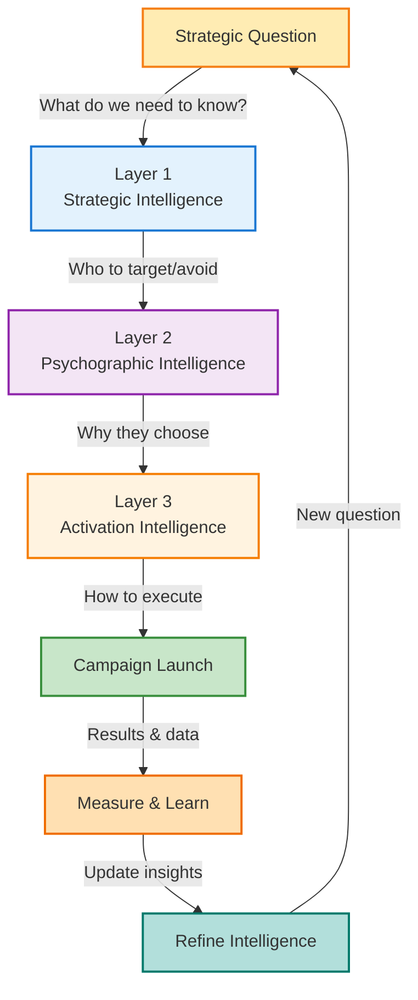

# **6 How the Layers Work Together**

### **6.1 The Integration Principle**

We've explored each layer of the Audience Intelligence Stack in depth:

* **Strategic Intelligence** reveals who you're competing with (and who you're not)  
* **Psychographic Intelligence** reveals why audiences make choices and what motivates them  
* **Activation Intelligence** reveals how to reach them effectively and drive action

But the real power emerges when all three layers work together in an integrated workflow. Each layer informs the next, and insights from activation feedback to refine strategic and pattern understanding.

**The stack isn't a linear process you complete once. It's a continuous intelligence system.**

This section shows how the layers integrate in practice, moving from strategic question to tactical execution to measurable results - and back to refined strategy.

### **6.2 The Complete Workflow: From Question to Action**

Let's walk through a complete intelligence cycle using a realistic scenario.

#### **Scenario: StrideRecover Considers Market Expansion**

**The strategic question:** Should StrideRecover expand beyond recovery footwear into adjacent product categories?

**The business context:**

* Core business (recovery slides/sandals) is healthy but growth is slowing  
* Leadership debates potential expansion: compression gear? sports nutrition? sleep products? broader comfort footwear?  
* $5M budget available for new product line  
* Need to decide: which category? why? how to launch?

**Without the Audience Intelligence Stack:**

* Leadership gut feeling: "Our customers care about recovery, so maybe compression gear?"  
* Market research: "The compression gear market is growing at 8% annually"  
* Competitive analysis: "Our competitors (Nike, Brooks) offer compression socks"  
* Decision: Launch compression line based on category logic and competitor moves  
* Risk: High. This is $5M based on assumptions, not audience intelligence.

**With the Audience Intelligence Stack:**

### **Step 1: Strategic Intelligence - Map the Expansion Landscape**

**Question:** Which adjacent categories already have high overlap and affinity with our audience?

**Method:** Analyze audience affinity and overlap across all potential adjacent categories, not just the ones we're considering.

**Analysis:**

CATEGORY ANALYSIS (StrideRecover audience of 100,000):

Compression Gear:  
\- PRO Compression: 119x affinity, 12.7% reach (12,700 people)  
\- Other compression brands: 80-100x affinity  
\- INSIGHT: Extremely high affinity but relatively low reach  
\- INTERPRETATION: Core segment (Dedicated Athletes) loves compression, but not   
  universal across all audience segments

Sports Nutrition:  
\- Nuun Hydration: 83x affinity, 23.1% reach (23,100 people)    
\- Clif Bar: 32x affinity, 16.2% reach (16,200 people)  
\- GU Energy, other gels/supplements: 40-80x affinity  
\- INSIGHT: Very high affinity with substantial reach  
\- INTERPRETATION: Broad interest across multiple segments

Running Apparel:  
\- Technical running apparel brands: 15-25x affinity, 25-35% reach  
\- INSIGHT: Moderate to high affinity, good reach  
\- INTERPRETATION: Already served by major players (Nike, Brooks, Under Armour)  
\- COMPETITIVE ASSESSMENT: Symmetric competition - hard to differentiate

Sleep/Home Recovery:  
\- Premium mattresses (Serta): 100x affinity, 15.3% reach (15,300 people)  
\- Home comfort products: 60x affinity, 20.3% reach (20,300 people)  
\- INSIGHT: Extremely high affinity with meaningful reach  
\- INTERPRETATION: "Recovery at home" resonates strongly

Wellness Services:  
\- Physical therapy content: 28x affinity, meaningful reach  
\- Massage/bodywork: 18x affinity  
\- INSIGHT: High affinity, services (not products)  
\- INTERPRETATION: Adjacent interest but different business model

Travel/Active Lifestyle:  
\- Hotels.com, travel planning: 8x affinity, meaningful reach  
\- Southwest Airlines: moderate affinity  
\- INSIGHT: Moderate affinity
\- INTERPRETATION: "Recovery on the go" could resonate

**Strategic Intelligence Output:**

**Top 3 expansion opportunities by audience overlap:**

1. **Sports Nutrition** (83x affinity at 23.1% reach - broadest appeal)  
2. **Home Recovery Products** (100x affinity at 15.3% reach - strongest affinity)  
3. **Compression Gear** (119x affinity at 12.7% reach - most passionate segment)

**Strategic Intelligence also reveals what to AVOID:**

* Running apparel: Symmetric competition with Nike, Brooks, Under Armour (high reach, high affinity, saturated market)  
* Generic wellness: Too broad, unclear positioning  
* Products without "recovery" angle: Misaligned with brand identity

**Initial verdict:** All three top options have merit, but for different strategic reasons. Need Psychographic Intelligence to understand WHY each resonates and which aligns with brand positioning.

### **Step 2: Psychographic Intelligence - Understand WHY Each Category Resonates**

**Question:** What motivations drive affinity for each category? Which segments care about each? How does each fit into audience's broader lifestyle and values?

**Analysis:**

#### **Sports Nutrition (Nuun 83x, Clif 32x):**

**Who cares:**

* Dedicated Endurance Athletes: 85x+ affinity (core segment)  
* Health-Conscious Family Managers: 40x affinity (strong secondary)  
* Informed Engaged Citizens: 35x affinity (evidence-based nutrition)

**Why they care:**

* **Performance optimization:** Hydration and fueling impact training quality and race performance  
* **Holistic wellness:** Nutrition is part of complete health system  
* **Evidence-based:** They research ingredients, trust science-backed formulations  
* **Convenience:** Busy lives require efficient nutrition solutions

**Cultural fit:**

* Aligns with "bio-optimization" movement audience participates in  
* Natural extension of "recovery is performance" positioning  
* Already purchasing these products (high category awareness)

**Brand positioning fit:**

* ✅ "Recovery" extends naturally to recovery nutrition (post-run hydration, recovery protein)  
* ✅ Science-backed positioning aligns with audience expectations  
* ✅ Complements footwear (buy both for complete recovery protocol)  
* ⚠️ Crowded market with established players (GU, Nuun, Clif)

#### **Home Recovery Products (Mattresses 100x, Home Comfort 60x):**

**Who cares:**

* Health-Conscious Family Managers: 110x affinity (primary segment)  
* Pragmatic Home Comfort Seekers: 125x affinity (secondary segment)  
* Dedicated Endurance Athletes: 65x affinity (recovery-focused subset)

**Why they care:**

* **Recovery extends to home:** Sleep is when body recovers most  
* **Holistic comfort:** "Recovery at home" after work, training, family demands  
* **Family wellbeing:** Create comfortable sanctuary for entire family  
* **Quality investment:** Willing to pay premium for products that improve daily life

**Cultural fit:**

* Aligns with "home as sanctuary" theme (premium mattresses 100x affinity)  
* Family-centric values (married 1.5x, children 1.5x at high reach)  
* "Active recovery" positioning extends to "home recovery"

**Brand positioning fit:**

* ✅ "Recovery" positioning translates to home environment  
* ✅ Less competition (not many "recovery home goods" brands)  
* ✅ Unique brand territory (recovery-focused vs. generic comfort)  
* ⚠️ Farther from core product (footwear → home goods is a leap)  
* ⚠️ May require different retail channels (home goods stores, online-only)

#### **Compression Gear (PRO Compression 119x):**

**Who cares:**

* Dedicated Endurance Athletes: 150x+ affinity (almost exclusively this segment)  
* Minimal interest from Family Managers or Comfort Seekers

**Why they care:**

* **Performance and recovery:** Compression aids blood flow, reduces soreness, speeds recovery  
* **Injury prevention:** Supports calves/shins during high-mileage training  
* **Evidence-based:** Sports medicine research supports compression for athletes  
* **Training tool:** Used during/after runs, essential gear for serious runners

**Cultural fit:**

* Deep fit with endurance culture and performance optimization  
* Part of "serious runner identity kit" (alongside GPS watch, recovery footwear)  
* Already purchasing (119x affinity means already-validated need)

**Brand positioning fit:**

* ✅ Perfect alignment with "performance recovery" positioning  
* ✅ Natural product adjacency (footwear \+ leg compression \= complete lower-body recovery)  
* ✅ Same retail channels (running specialty stores, sports retailers)  
* ✅ Same customer segment (Dedicated Athletes)  
* ⚠️ Serves narrow segment (only \~30% of audience)  
* ⚠️ Category commoditization (many compression brands, hard to differentiate)

**Psychographic Intelligence Output:**

**Strategic fit by segment:**

| Category | Dedicated Athletes | Family Managers | Comfort Seekers | Informed Citizens |
| ----- | ----- | ----- | ----- | ----- |
| Sports Nutrition | ✅✅✅ | ✅✅ | ✅ | ✅✅ |
| Home Recovery | ✅ | ✅✅✅ | ✅✅✅ | ✅ |
| Compression Gear | ✅✅✅ | ❌ | ❌ | ✅ |

**Motivation alignment:**

| Category | Performance Optimization | Holistic Wellness | Family Wellbeing | Evidence-Based |
| ----- | ----- | ----- | ----- | ----- |
| Sports Nutrition | ✅✅✅ | ✅✅ | ✅✅ | ✅✅✅ |
| Home Recovery | ✅✅ | ✅✅✅ | ✅✅✅ | ✅✅ |
| Compression Gear | ✅✅✅ | ✅ | ❌ | ✅✅✅ |

**Psychographic Intelligence verdict:**

* **Sports Nutrition:** Broadest appeal across segments and motivations  
* **Home Recovery:** Strong fit with Family Managers and Comfort Seekers (60% of audience)  
* **Compression Gear:** Perfect fit with Dedicated Athletes but narrow (30% of audience)

**The insight:** No single "best" answer. Each category serves different strategic goals:

* **Broaden:** Sports Nutrition (serve more segments)  
* **Deepen:** Compression Gear (own core segment completely)  
* **Differentiate:** Home Recovery (create unique brand territory)

**Now we need to test activation feasibility before making the final decision.**

### **Step 3: Activation Intelligence - Test Go-to-Market Feasibility**

**Question:** For each category, how would we actually launch and activate? What are the tactical requirements, costs, and likelihood of success?

**Analysis:**

#### **Sports Nutrition - Activation Assessment:**

**Required partnerships:**

* Co-pack manufacturer with sports nutrition expertise  
* Ingredient sourcing (electrolytes, proteins, natural sweeteners)  
* FDA/regulatory compliance for food products  
* Distribution (running stores, Amazon, Target)

**Marketing activation:**

* Influencers: Same influencers as footwear (@RunCoachKatie, @MarathonMindset)  
* Content: "Complete Recovery Protocol: Footwear \+ Hydration"  
* Channels: Runner's World, marathon expos, running specialty retail  
* Positioning: "Science-backed recovery nutrition from the recovery footwear experts"

**Competitive landscape:**

* Symmetric competition with Nuun, GU, Clif Bar (established players with loyal audiences)  
* Differentiation challenge: What makes StrideRecover nutrition different?  
* Price pressure: Nuun charges $7-8 per tube, margins are lower than footwear

**Investment required:**

* Product development: $500K (formulation, testing, packaging)  
* Manufacturing setup: $200K (co-pack minimums)  
* Inventory: $300K (initial production run)  
* Marketing: $1M (launch campaign)  
* **Total: $2M**

**Time to market:** 12-18 months (formulation, testing, FDA, production)

**Activation Intelligence verdict:**

* ✅ Marketing activation is straightforward (same channels, same influencers)  
* ⚠️ Competitive differentiation is challenging (crowded market)  
* ⚠️ Lower margins than footwear (potential revenue but less profitable)  
* ⚠️ Long development timeline (18 months to launch)

#### **Home Recovery Products - Activation Assessment:**

**Required partnerships:**

* Home goods manufacturers (pillows, blankets, ergonomic accessories)  
* Foam technology partner (extend SRfoam to home products?)  
* Distribution (Target, Amazon, potentially home goods retailers)

**Marketing activation:**

* Influencers: Different mix needed - family lifestyle bloggers, home/wellness influencers (new partnerships required)  
* Content: "Recovery Starts at Home: Creating Your Recovery Sanctuary"  
* Channels: Pinterest (3.7x affinity), Target, home goods publications  
* Positioning: "The recovery brand for your active life - from footwear to home"

**Competitive landscape:**

* Minimal overlap position: Few brands own "recovery home goods" (differentiated space)  
* Opportunity: Create new category (recovery-focused home comfort)  
* Risk: Education required (customers don't yet think about "home recovery products")

**Investment required:**

* Product development: $400K (multiple SKUs, testing)  
* Manufacturing partnerships: $300K  
* Inventory: $400K  
* Marketing: $1.5M (category education \+ launch)  
* **Total: $2.6M**

**Time to market:** 9-12 months (faster than nutrition due to fewer regulatory hurdles)

**Activation Intelligence verdict:**

* ✅ Unique positioning (create new category)  
* ⚠️ Requires new influencer partnerships (family/home vs. running-focused)  
* ⚠️ Education burden (customers need to understand "home recovery" concept)  
* ⚠️ Channel expansion (home goods retail is new for StrideRecover)  
* ✅ Faster to market than nutrition

#### **Compression Gear - Activation Assessment:**

**Required partnerships:**

* Compression fabric manufacturer  
* Sports medicine validation (clinical studies on efficacy)  
* Distribution (running specialty stores, Amazon, sports retailers)

**Marketing activation:**

* Influencers: Exact same as footwear (@RunCoachKatie, elite runners)  
* Content: "Complete Lower-Body Recovery: Footwear \+ Compression"  
* Channels: Runner's World, marathon expos, running specialty retail (identical to footwear)  
* Positioning: "The recovery brand for serious runners - from feet to legs"

**Competitive landscape:**

* Symmetric competition with PRO Compression, CEP, 2XU (established compression brands)  
* Differentiation challenge: Hard to claim unique technology (compression is compression)  
* Brand territory: "Complete recovery for runners" could work

**Investment required:**

* Product development: $300K (compression sock/sleeve designs, testing)  
* Manufacturing setup: $250K  
* Inventory: $250K  
* Marketing: $800K (leverage existing channels)  
* **Total: $1.6M**

**Time to market:** 6-9 months (simpler product, established manufacturing)

**Activation Intelligence verdict:**

* ✅✅ Easiest activation (same channels, same influencers, same audience)  
* ✅ Fastest to market (6-9 months)  
* ✅ Lowest investment ($1.6M vs. $2-2.6M for others)  
* ⚠️ Competitive differentiation is challenging (crowded market)  
* ⚠️ Only serves 30% of audience (Dedicated Athletes)  
* ✅ Natural bundle opportunity ("Buy recovery slides \+ compression socks, save 20%")

**Activation Intelligence Output:**

**Launch feasibility comparison:**

| Category | Investment | Time to Market | Activation Difficulty | Market Differentiation | Audience Breadth |
| ----- | ----- | ----- | ----- | ----- | ----- |
| Sports Nutrition | $2M | 12-18 mo | Medium | Low | High (70%+) |
| Home Recovery | $2.6M | 9-12 mo | High | High | Medium (60%) |
| Compression Gear | $1.6M | 6-9 mo | Low | Low | Low (30%) |

### **Step 4: Synthesizing All Three Layers - The Strategic Decision**

Now we integrate insights from all three layers:

**The options matrix:**

| Category | Strategic Intelligence | Psychographic Intelligence | Activation Intelligence | Overall Assessment |
| ----- | ----- | ----- | ----- | ----- |
| **Sports Nutrition** | ✅ Broad audience overlap (83x, 23.1%) | ✅ Fits multiple segments and motivations | ⚠️ Competitive, long timeline, lower margins | **Medium Priority** |
| **Home Recovery** | ✅ Strong affinity (100x, 15.3%) | ✅ Fits Family/Comfort segments well | ⚠️ Requires education, new channels | **Long-term Opportunity** |
| **Compression Gear** | ⚠️ High affinity but narrow reach (119x, 12.7%) | ⚠️ Only serves Dedicated Athletes | ✅✅ Easiest activation, fastest, lowest cost | **Quick Win** |

**The strategic recommendation (integrating all three layers):**

**Phase 1 (Year 1): Launch Compression Gear**

**Why:**

* **Activation feasibility:** Lowest risk, fastest time-to-market, leverages existing marketing channels and partnerships  
* **Strategic alignment:** Deepens relationship with core segment (Dedicated Athletes who drive brand credibility)  
* **Pattern fit:** Perfect alignment with performance/recovery motivation  
* **Financial prudence:** Lowest investment ($1.6M of $5M budget)  
* **Learning opportunity:** Test expansion before bigger bets

**Launch strategy:**

* Partner with @RunCoachKatie and @MarathonMindset for product development input (athlete-designed)  
* Position as "Complete Lower-Body Recovery System" (footwear \+ compression)  
* Bundle pricing: "Recovery Kit" (slides \+ compression socks, 20% off)  
* Launch at Boston Marathon expo (April) - optimal timing for spring race season  
* Distribution: Running specialty stores \+ Amazon

**Success metrics:**

* 15% of existing footwear customers purchase compression products within 12 months  
* $2.5M revenue Year 1 (break-even on investment)  
* Net Promoter Score: \+60 or higher (validates product quality)

**Phase 2 (Year 2-3): Expand to Sports Nutrition**

**Why:**

* **Strategic growth:** Serves broader audience (70%+ of segments)  
* **Pattern alignment:** Fits holistic wellness and performance optimization motivations  
* **Market validation:** If compression succeeds, brand has credibility to expand recovery positioning  
* **Activation advantage:** Can leverage compression \+ footwear customer base for nutrition launch (bundled recovery protocol)

**Launch strategy:**

* Develop recovery hydration product (post-run electrolyte drink) - narrower than full nutrition line  
* Position as "Third pillar of recovery: footwear, compression, hydration"  
* Use Year 1 data to identify super-users (bought both footwear \+ compression) - they're ideal early adopters for nutrition

**Phase 3 (Year 3+): Explore Home Recovery**

**Why:**

* **Strategic differentiation:** Create new category ("home recovery products")  
* **Pattern expansion:** Serve Family Managers and Comfort Seekers more deeply  
* **Brand evolution:** "Recovery" moves beyond athletics to "active life"  
* **Activation timing:** By Year 3, brand has established "recovery" authority through footwear \+ compression \+ nutrition

**Launch strategy:**

* Start narrow: Recovery-focused pillows or ergonomic home accessories (not full home goods line)  
* Position as "24/7 recovery ecosystem: training recovery \+ home recovery"  
* Test through limited drops or Kickstarter to validate demand before major investment

**Why this phased approach works (based on all three layers):**

**Strategic Intelligence:**

* Starts with core audience (compression for Dedicated Athletes), then expands to broader segments  
* Avoids attacking multiple markets simultaneously (focus resources)

**Psychographic Intelligence:**

* Deepens relationship with Dedicated Athletes (Phase 1), then serves Family Managers (Phase 3\)  
* Each phase reinforces "recovery" brand positioning

**Activation Intelligence:**

* Phase 1 leverages existing channels (low activation risk)  
* Phase 2 builds on Phase 1 success (cross-sell to compression customers)  
* Phase 3 explores new channels only after proving expansion model works

### **Step 5: Launch, Learn, Iterate - The Feedback Loop**

The intelligence stack isn't just about making one decision. It's a continuous system.

**After launching compression gear (Phase 1), new intelligence emerges:**

**Strategic Intelligence (updated):**

* Track: Do compression customers have higher lifetime value than footwear-only customers?  
* Monitor: Are compression products attracting new audience segments we didn't anticipate?  
* Assess: Has our competitive position shifted? (Do competitors respond?)

**Psychographic Intelligence (updated):**

* Analyze: What else do compression-buyers care about? (Their affinity patterns might reveal next opportunities)  
* Segment: Are there sub-segments within compression buyers? (Marathon runners vs. ultra-runners vs. triathletes?)  
* Learn: What content resonates with compression buyers vs. footwear-only buyers?

**Activation Intelligence (updated):**

* Optimize: Which channels drive highest compression conversion? (Is it different from footwear?)  
* Test: Do bundles outperform single-product purchases? (Should we always sell together?)  
* Refine: Which influencers drive compression sales vs. footwear sales?

**The feedback loop:**

* Phase 1 results inform Phase 2 decisions  
* If compression over-performs with Family Managers (unexpected), maybe prioritize home recovery over nutrition  
* If compression under-performs, reassess: Is it product quality? Pricing? Positioning? Or was Strategic Intelligence wrong about the opportunity?

**This is continuous intelligence, not one-time research.**

### **6.3 Cross-Layer Insights: What You Learn at the Intersections**

Some of the most valuable insights emerge at the **intersections** between layers:

#### **Strategic \+ Psychographic Intersection: "Who Cares About What"**

**Example insight from StrideRecover:**

Strategic Intelligence revealed that @FitLifeJenna's audience has minimal overlap with StrideRecover (0.8% reach, wrong audience).

But Psychographic Intelligence revealed *why* the overlap is low:

* Jenna's audience: Motivated by fashion, aesthetics, lifestyle aspiration  
* StrideRecover's audience: Motivated by performance, evidence, recovery science

**The intersection insight:** It's not just that they don't overlap (Strategic). It's that their motivations are fundamentally incompatible (Psychographic). Even if Jenna's followers discovered StrideRecover, they wouldn't convert because they don't value what StrideRecover offers.

**Strategic implication:** Don't just avoid Jenna - avoid *anyone* with similar audience psychographics, even if their follower counts are attractive.

#### **Psychographic \+ Activation Intersection: "Why Determines How"**

**Example insight from StrideRecover:**

Psychographic Intelligence revealed that Informed Engaged Citizens (10% of audience) value evidence, transparency, and credible sources.

Activation Intelligence revealed that this segment responds dramatically better to:

* Long-form educational content (vs. short social posts)  
* Third-party validation (sports medicine endorsements vs. athlete testimonials)  
* Technical specifications (impact absorption data vs. "feels great\!")

**The intersection insight:** Messaging tone and content format must match segment motivations. What works for Dedicated Athletes (athlete testimonials, race stories) actually *decreases* conversion for Informed Citizens (they see it as marketing hype).

**Activation implication:** Segment not just by demographics or interests, but by *how they evaluate products, and tailor content accordingly.

#### **Strategic \+ Activation Intersection: "Where to Compete Determines How to Win"**

**Example insight from StrideRecover:**

Strategic Intelligence revealed minimal overlap with ComfyCasual (not competing for same audience).

Activation Intelligence revealed that StrideRecover shouldn't activate on channels where ComfyCasual dominates:

* TikTok (ComfyCasual's Gen Z audience thrives here; StrideRecover's Gen X audience doesn't)  
* Celebrity influencer partnerships (ComfyCasual's audience values celebrity endorsement; StrideRecover's values expert credibility)

**The intersection insight:** Competitive positioning dictates channel strategy. If you're *not* competing with someone, don't copy their activation playbook even if it looks successful. They're optimizing for a different audience.

**Strategic \+ Activation implication:** Channel selection is a competitive weapon. Own channels your competitors ignore (Runner's World) rather than fighting in channels they dominate (TikTok).

### **6.4 When the Layers Conflict: How to Resolve**

Sometimes insights from different layers seem to contradict. Here's how to resolve:

**Scenario 1: Strategic Says Yes, Psychographic Says No**

**Example:**

* Strategic Intelligence: High audience overlap (30% reach, good affinity)  
* Psychographic Intelligence: Motivations don't align (they care about aesthetics, you offer function)

**Resolution:** Psychographic Intelligence wins. Overlap without motivational alignment leads to low conversion. You might get awareness, but not sales.

**Action:** Investigate further. Is there a sub-segment within the overlap that *does* have aligned motivations? If yes, target narrowly. If no, avoid.

**Scenario 2: Psychographic Says Yes, Activation Says No**

**Example:**

* *Psychographic Intelligence*: Perfect motivational alignment (they value recovery, performance, science)  
* *Activation Intelligence*: Can't reach them efficiently (no clear channels, prohibitive cost)

**Resolution:** Activation constraints are real. If you can't afford to reach them, motivational alignment doesn't matter.

**Action:** Creative activation solution. Can you reach them through owned channels (email, community) rather than paid? Can you partner with someone who already reaches them? If not, table this segment until you have budget.

**Scenario 3: Strategic and Psychographic Say Yes, Activation Says Yes, But Results Say No**

**Example:**

* All three layers predict success  
* Launch campaign  
* Conversion is poor despite strong traffic

**Resolution:** Your intelligence was incomplete. Something you didn't measure matters.

**Action:** Deep-dive investigation:

* Product-market fit: Does the product actually solve the problem you think it does?  
* Messaging: Is there a disconnect between what you're saying and what they're hearing?  
* Timing: Is there a lifecycle or seasonal factor you missed?  
* Price: Is the value perception misaligned with cost?  
* Hidden segment: Are you reaching a segment that looks right on paper but behaves differently?

**This is where intelligence becomes learning.** Failed activations aren't mistakes - they're new data. Update your Psychographic and Strategic Intelligence models based on what you learn.

### **6.5 The Intelligence Cycle: Strategy → Execution → Learning → Strategy**

The complete workflow is cyclical:
<!-- 
┌─────────────────────────────────────────────────────────────┐  
│                                                               │  
│  1\. STRATEGIC QUESTION                                       │  
│     "Should we expand into compression gear?"                │  
│                                                               │  
└────────────────────┬────────────────────────────────────────┘  
                     │  
                     ▼  
┌─────────────────────────────────────────────────────────────┐  
│                                                               │  
│  2\. LAYER 1: STRATEGIC INTELLIGENCE                          │  
│     \- Analyze audience overlap with compression category     │  
│     \- Result: 119x affinity, 12.7% reach                     │  
│     \- Verdict: Strong signal, but narrow segment             │  
│                                                               │  
└────────────────────┬────────────────────────────────────────┘  
                     │  
                     ▼  
┌─────────────────────────────────────────────────────────────┐  
│                                                               │  
│  3\. LAYER 2: Psychographic Intelligence                            │  
│     \- Why do they care about compression?                    │  
│     \- Which segments? (Dedicated Athletes primarily)         │  
│     \- How does it fit motivations? (Performance optimization)│  
│     \- Verdict: Perfect fit with core, limited to 30% of base│  
│                                                               │  
└────────────────────┬────────────────────────────────────────┘  
                     │  
                     ▼  
┌─────────────────────────────────────────────────────────────┐  
│                                                               │  
│  4\. LAYER 3: ACTIVATION INTELLIGENCE                         │  
│     \- How to launch? (Same channels, influencers)            │  
│     \- Investment required? ($1.6M, 6-9 months)               │  
│     \- Competitive dynamics? (Symmetric but manageable)       │  
│     \- Verdict: Low-risk, fast, leverages existing assets     │  
│                                                               │  
└────────────────────┬────────────────────────────────────────┘  
                     │  
                     ▼  
┌─────────────────────────────────────────────────────────────┐  
│                                                               │  
│  5\. DECISION & EXECUTION                                     │  
│     \- Decision: Launch compression gear (Phase 1\)            │  
│     \- Execute: Product dev, influencer partnerships, launch  │  
│     \- Timeline: 6-9 months to market                         │  
│                                                               │  
└────────────────────┬────────────────────────────────────────┘  
                     │  
                     ▼  
┌─────────────────────────────────────────────────────────────┐  
│                                                               │  
│  6\. MEASURE & LEARN                                          │  
│     \- Conversion: 18% of footwear customers buy compression  │  
│     \- Revenue: $3.2M Year 1 (exceeded target)                │  
│     \- NPS: \+72 (very high)                                   │  
│     \- Surprise: 22% of buyers are Family Managers, not       │  
│       just Dedicated Athletes                                │  
│                                                               │  
└────────────────────┬────────────────────────────────────────┘  
                     │  
                     ▼  
┌─────────────────────────────────────────────────────────────┐  
│                                                               │  
│  7\. UPDATE INTELLIGENCE                                      │  
│     \- Strategic: Compression has broader reach than expected │  
│     \- Psychographic: Family Managers care about compression for    │  
│       everyday recovery (not just athletic)                  │  
│     \- Activation: Pinterest drove 25% of Family Manager      │  
│       conversions (unexpected channel success)               │  
│                                                               │  
└────────────────────┬────────────────────────────────────────┘  
                     │  
                     ▼  
┌─────────────────────────────────────────────────────────────┐  
│                                                               │  
│  8\. NEW STRATEGIC QUESTION                                   │  
│     "Should we expand compression line to serve Family       │  
│      Managers with everyday recovery positioning?"           │  
│                                                               │  
└────────────────────┬────────────────────────────────────────┘  
                     │  
                     │

                     └──────► CYCLE REPEATS
-->

**The intelligence stack is a learning system, not a one-time analysis.**

### **6.6 The Complete Workflow Summary**

When all three layers work together:

**You start with strategic clarity:**

* Who to target (Strategic Intelligence)  
* Who to avoid (Strategic Intelligence)  
* Where you sit competitively (Strategic Intelligence)

**You build on psychographic understanding:**

* Why they choose (Psychographic Intelligence)  
* What motivates decisions (Psychographic Intelligence)  
* How to segment for personalization (Psychographic Intelligence)

**You execute with precision:**

* Which influencers will convert (Activation Intelligence)  
* What content will resonate (Activation Intelligence)  
* Where to allocate budget (Activation Intelligence)  
* How to sequence touchpoints (Activation Intelligence)

**You measure and learn:**

* What worked and what didn't (Activation results)  
* What surprised you (Psychographic updates)  
* Where new opportunities emerged (Strategic updates)

**You iterate:**

* Refine Strategic Intelligence (competitive position evolved)  
* Deepen Psychographic Intelligence (new segments discovered)  
* Optimize Activation Intelligence (channels/messages refined)

**This is the complete Audience Intelligence Stack in action.**

No single layer is sufficient. Each layer enables the next. Together, they create a continuous intelligence system that compounds over time.

The brands that win aren't those with the most data. They're the brands that transform data into strategic intelligence, strategic intelligence into pattern understanding, and pattern understanding into precise, effective action, and then learn from every activation to make the next cycle even better.

