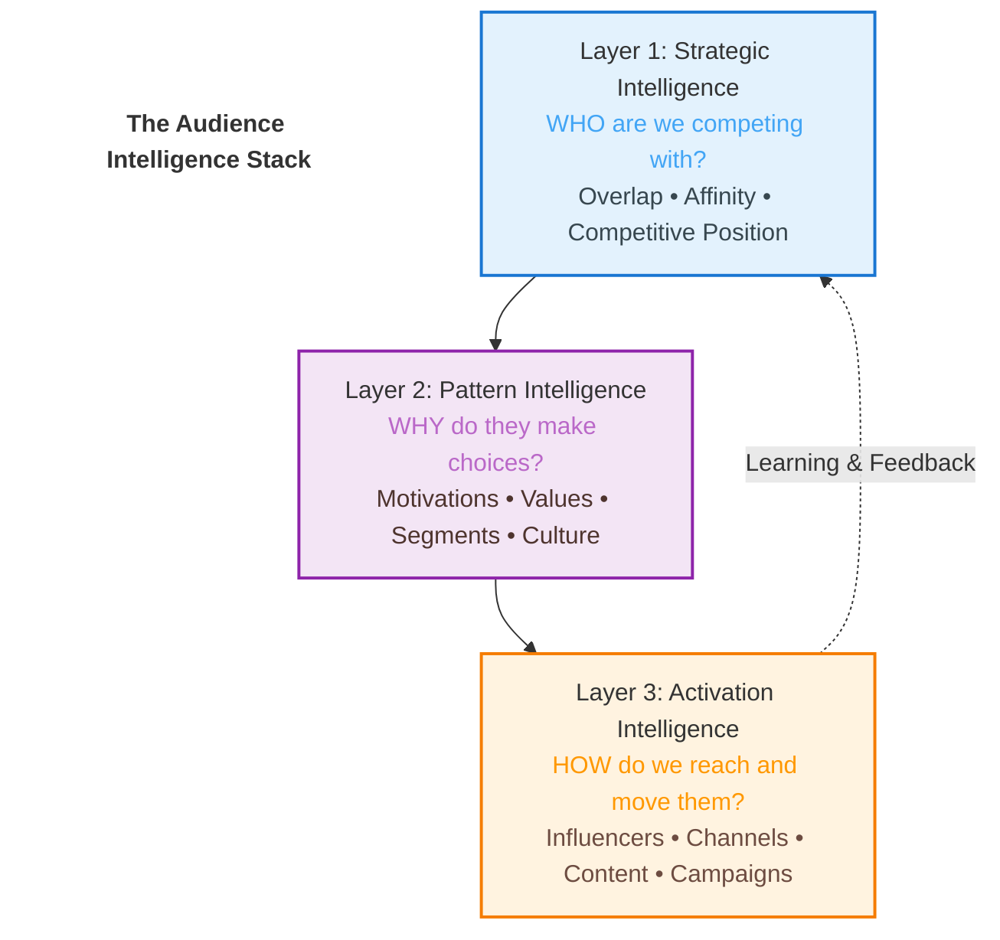

# The Audience Intelligence Stack

Every marketing team claims to "know their audience".

They have demographics: age, gender, location, income. They have behavioral data: clicks, conversions, time on site. They have segmentation models, persona documents, and customer journey maps.

But ask these same teams a few strategic questions, and the confidence evaporates:

**"Who are you actually competing with for this audience's attention?"**

Most will list category competitors: brands that sell similar products at similar price points through similar channels. But category membership is a poor proxy for competitive threat. Two "athletic footwear" brands might serve fundamentally different audiences with fundamentally different needs. One might compete more directly with compression gear brands than with other footwear companies.

**"Why does your audience choose certain brands over others?"**

The answers are usually superficial: "quality", "price", "convenience", "brand reputation." But these are attributes, not motivations. They don't explain why one audience gravitates toward performance optimization while another seeks casual self-expression. They don't reveal the psychographic patterns and cultural contexts that actually drive decisions.

**"Which influencer partnerships will authentically resonate and drive conversion?"**

Teams often choose based on vanity metrics: follower counts, engagement rates, cost per post. But a fitness influencer with 850,000 followers might generate terrible ROI if their audience doesn't overlap with yours or doesn't share your customers' motivations. Meanwhile, a specialized coach with 120,000 followers might drive 6x more conversions because their audience is strategically and psychographically aligned.

**The silence after these questions reveals something important: there's a gap between having data and having intelligence.**

Marketing teams are drowning in data. Website analytics, CRM systems, social media dashboards, survey platforms, market research reports - the volume is overwhelming. But data alone doesn't answer strategic questions. It doesn't reveal competitive dynamics, audience motivations, or tactical effectiveness.

**This is the Intelligence Gap**: the distance between raw data and actionable strategic insight.

This guide introduces a framework for closing that gap: **The Audience Intelligence Stack**, a three-layer approach that transforms audience data into strategic decisions, pattern understanding, and precise tactical execution.

It's not about having more data. It's about asking better questions and building the intelligence to answer them.

## Overview

The Audience Intelligence Stack consists of three layers, each answering different strategic questions:

- **Layer 1: Strategic Intelligence** - Who are you competing with? Who has your audience's attention?
- **Layer 2: Pattern Intelligence** - Why do audiences choose? What motivates their decisions?
- **Layer 3: Activation Intelligence** - How do you reach them effectively? What converts?

No single layer is sufficient. All three working together create sustainable competitive advantage.

## Reading Guide

**Quick overview:**
- Read the [Introduction](#) and [Introducing the Stack](02-introducing-the-stack/)

**Strategic foundations:**
- [The Intelligence Gap](01-the-intelligence-gap/)
- [Strategic Intelligence](03-strategic-intelligence/)
- [Pattern Intelligence](04-pattern-intelligence/)

**Complete framework:**
- Read all sections in order

**Practical implementation:**
- Jump to [How Layers Work Together](06-how-the-layers-work-together/)

## Table of Contents

1. [The Intelligence Gap](01-the-intelligence-gap/) - Understanding the problem
2. [Introducing the Stack](02-introducing-the-stack/) - The three-layer framework
3. [Strategic Intelligence](03-strategic-intelligence/) - Who are you competing with?
   [Strategic Intelligence Appendices](03a-strategic-intelligence-quadrant-examples/) - Strategic intelligence quadrant examples
4. [Pattern Intelligence](04-pattern-intelligence/) - Why do audiences choose?
5. [Activation Intelligence](05-activation-intelligence/) - How do you reach them?
6. [How the Layers Work Together](06-how-the-layers-work-together/) - Integration and workflow
7. [Conclusion](07-closing-the-intelligence-advantage/) - The intelligence advantage

---

*Last updated: January 2026*