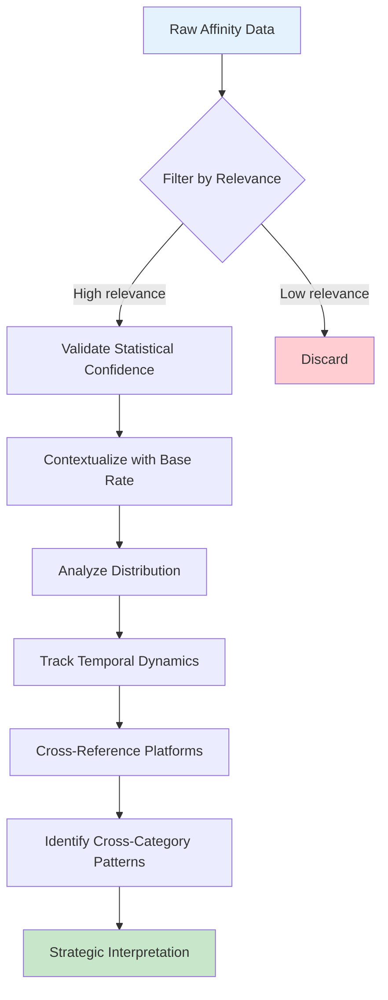

# Part 5: Advanced Metrics and Interpretations

## Beyond Basic Overlap: The Nuances That Matter

We've established the foundational metrics (reach, penetration, affinity) and their strategic interpretations through quadrant positioning. But real-world audience intelligence requires understanding subtleties that basic metrics can miss. This article explores advanced analytical techniques that separate surface-level data from deep strategic insight.

### 5.1 The Relevance Filter: Signal vs. Noise

Not all high-affinity signals are strategically meaningful. A brand might show 200x affinity with your audience, but if only 0.3% of your audience engages with it (300 people out of 100,000), the signal lacks statistical robustness and strategic impact.

**The relevance calculation combines multiple factors:**

```
Relevance Score = f(Affinity, Reach, Statistical Confidence, Base Rate)
```

Where:

- **Affinity** measures intensity of connection
- **Reach** provides absolute scale
- **Statistical confidence** ensures the pattern is real, not random
- **Base rate** contextualizes against general population

 High relevance requires elevated affinity at meaningful scale with statistical confidence. 

#### Example: Filtering Instagram Fitness Influencers

You're analyzing fitness influencers for partnership opportunities. Three candidates emerge:

<div class="grid-3"> <div>

**Influencer A**

- **Followers:** 2.5M
- **Your audience reach:** 0.4% (400 people)
- **Affinity:** 180x
- **Base rate:** 0.002% of general population

</div> <div>

**Influencer B**

- **Followers:** 350K
- **Your audience reach:** 18% (18,000 people)
- **Affinity:** 22x
- **Base rate:** 0.8% of general population

</div> <div>

**Influencer C**

- **Followers:** 120K
- **Your audience reach:** 31% (31,000 people)
- **Affinity:** 38x
- **Base rate:** 0.8% of general population

</div> </div>

**Initial reaction:** Influencer A has massive followers and astronomical affinity (180x). Seems like the obvious choice.

**Relevance filter reveals:**

**Influencer A:**

- Despite 180x affinity, only 400 people in your 100K audience follow them
- Confidence interval on 400-person sample is wide (±15%)
- Absolute impact: Even if partnership drives awareness to your entire audience, you're reaching only 0.002% of general population who care about this influencer
- **Relevance score:** Medium-low (high affinity doesn't compensate for tiny absolute numbers)

**Influencer B:**

- 18,000 people (18% of your audience) is substantial
- 22x affinity is strong (not as high as A, but significant)
- Statistical confidence is robust (sample size >10K)
- Base rate (0.8% of population) means this influencer has mainstream appeal
- **Relevance score:** High (meaningful scale with strong affinity)

**Influencer C:**

- 31,000 people (31% reach) is massive
- 38x affinity is very strong
- Excellent statistical confidence
- **Relevance score:** Very high (highest absolute numbers, strong affinity, perfect confidence)

 Partner with Influencer C (primary) and Influencer B (secondary). Ignore Influencer A despite impressive-looking metrics. 

**Why this matters:** Without the relevance filter, you might waste budget on Influencer A because "180x affinity" sounds amazing. The filter reveals that affinity without scale is strategically meaningless.

### 5.2 Statistical Confidence: When Patterns Are Real

Affinity scores can be misleading when sample sizes are small. A brand with 5x affinity based on 50 people might actually have true affinity anywhere from 2x to 12x (wide confidence interval). Meanwhile, 5x affinity based on 10,000 people has a much tighter confidence interval (4.8x to 5.2x).

**Confidence intervals grow with smaller samples:**

|Sample Size|Observed Affinity|95% Confidence Interval|
|---|---|---|
|50 people|5.0x|2.1x - 11.9x|
|500 people|5.0x|4.1x - 6.1x|
|5,000 people|5.0x|4.7x - 5.3x|
|50,000 people|5.0x|4.9x - 5.1x|

 Treat affinity scores as directional (not precise) when reach is below 5% or absolute numbers are below 1,000 people. 

#### Practical Application: Evaluating Niche Interests

Your running footwear brand audience shows these patterns:

**Ultra-marathon content:**

- Reach: 2.1% (2,100 people)
- Affinity: 87x
- Base rate: 0.024% of general population

**Trail running content:**

- Reach: 14.3% (14,300 people)
- Affinity: 19x
- Base rate: 0.75% of general population

**Road running content:**

- Reach: 38.7% (38,700 people)
- Affinity: 8.2x
- Base rate: 4.7% of general population

**Analysis:**

**Ultra-marathon (87x affinity, 2.1% reach):**

- High affinity suggests passionate niche
- BUT: Only 2,100 people, confidence interval is ±18x
- True affinity could be anywhere from 69x to 105x
- **Interpretation:** Directional signal of niche interest, but don't over-invest based on exact 87x number
- **Action:** Test content for this segment, but recognize uncertainty

**Trail running (19x affinity, 14.3% reach):**

- 14,300 people provides robust sample
- Confidence interval: ±2x (17x to 21x)
- **Interpretation:** Strong, reliable signal
- **Action:** Invest confidently in trail running content and partnerships

**Road running (8.2x affinity, 38.7% reach):**

- 38,700 people, extremely high confidence
- Confidence interval: ±0.3x (7.9x to 8.5x)
- **Interpretation:** Core audience characteristic, rock-solid signal
- **Action:** Foundation of content strategy

 Ultra-marathon's 87x affinity is less actionable than trail running's 19x affinity because of sample size. Don't let impressive-looking numbers override statistical reality. 

### 5.3 Base Rate Contextualization: Ubiquity vs. Differentiation

Affinity must be interpreted relative to how common something is in the general population. High affinity for something ubiquitous (Amazon, coffee, smartphones) is less strategically meaningful than moderate affinity for something niche.

**The base rate fallacy in audience analysis:**

Consider two brands your audience engages with:

<div class="grid-2"> <div>

**Amazon**

- Your audience reach: 92%
- General population: 85%
- Affinity: 1.08x
- **Interpretation:** Almost everyone uses Amazon; your audience is only slightly more likely

</div> <div>

**Specialty Running Store**

- Your audience reach: 28%
- General population: 1.2%
- Affinity: 23.3x
- **Interpretation:** Niche behavior; your audience is dramatically over-indexed

</div> </div>

**Which is more strategically revealing?**

Amazon tells you almost nothing (everyone uses it). The specialty running store tells you something fundamental about your audience's identity and shopping behavior.

 Low affinity for ubiquitous items is normal. High affinity for rare items is powerful differentiation. 

#### Comparative Base Rate Analysis

When comparing two audiences, base rate context becomes critical:

**Scenario:** You're comparing Brand A and Brand B audiences to understand differentiation.

**Interest in "Coffee":**

- Brand A audience: 88% reach, 1.03x affinity (base rate: 85%)
- Brand B audience: 91% reach, 1.07x affinity
- **Interpretation:** Both audiences drink coffee. Not differentiating.

**Interest in "Specialty Coffee Roasters":**

- Brand A audience: 34% reach, 28x affinity (base rate: 1.2%)
- Brand B audience: 2.1% reach, 1.75x affinity
- **Interpretation:** Brand A audience is coffee enthusiasts; Brand B audience is casual coffee drinkers. Highly differentiating.

**Interest in "Productivity Apps":**

- Brand A audience: 45% reach, 3.2x affinity (base rate: 14%)
- Brand B audience: 63% reach, 4.5x affinity
- **Interpretation:** Brand B audience over-indexes more on productivity than Brand A. Moderately differentiating.

**Interest in "Marathon Running":**

- Brand A audience: 23% reach, 38x affinity (base rate: 0.6%)
- Brand B audience: 0.4% reach, 0.67x affinity
- **Interpretation:** Brand A audience is deeply into endurance athletics; Brand B audience actively avoids it. Extremely differentiating.

 Always ask: "What percentage of the general population does this?" before interpreting affinity scores. 

### 5.4 Reach-Weighted Affinity: Balancing Intensity and Scale

Some strategic questions require balancing affinity intensity with absolute reach. "Reach-weighted affinity" combines both:

```
Reach-Weighted Affinity = Affinity × √(Reach)
```

The square root prevents reach from overwhelming affinity while still accounting for scale.

**Example: Influencer Selection**

Three influencers under consideration:

|Influencer|Reach|Affinity|Standard Rank|Reach-Weighted|RW Rank|
|---|---|---|---|---|---|
|Influencer A|2.1%|87x|1st (highest affinity)|12.6|3rd|
|Influencer B|31%|12x|3rd (lowest affinity)|66.8|1st|
|Influencer C|14%|22x|2nd|82.3|2nd|

**Interpretation:**

- **Standard affinity ranking** prioritizes Influencer A (87x), but tiny reach (2.1%) limits impact
- **Reach-weighted approach** reveals Influencer C (22x affinity at 14% reach) has best combination of intensity and scale
- **Influencer B** has massive reach but lower affinity, indicating less specialized fit

**Strategic decision:** Partner with Influencer C for core campaigns (best balance), use Influencer B for awareness campaigns (broad reach), test Influencer A for ultra-niche activation (passionate but small).

### 5.5 Temporal Dynamics: Tracking Movement Over Time

Static snapshots miss critical dynamics. Is a competitor gaining share of your audience or losing it? Is an interest growing or fading?

**Tracking competitor movement:**

mermaid

````mermaid
graph TD
    Q1["Q1 2025<br/>Competitor X<br/>Reach: 18%<br/>Penetration: 22%"] --> Q2["Q2 2025<br/>Reach: 21%<br/>Penetration: 24%"]
    Q2 --> Q3["Q3 2025<br/>Reach: 27%<br/>Penetration: 26%"]
    Q3 --> Q4["Q4 2025<br/>Reach: 31%<br/>Penetration: 28%"]
    
    style Q1 fill:#e3f2fd
    style Q2 fill:#bbdefb
    style Q3 fill:#90caf9
    style Q4 fill:#64b5f6
```

**Analysis:**

- **Q1:** Symmetric competition (both reach and penetration moderate)
- **Q2:** Slight increase in both dimensions
- **Q3:** Sharp increase in reach (18% → 27%), they're capturing more of your audience
- **Q4:** Continued growth, now clearly asymmetric threat

**Velocity matters:** A competitor at 18% reach might seem manageable, but if they're growing 9 percentage points per quarter, they'll be at 45%+ reach in two quarters. Early intervention is critical.


For fast-moving markets, track competitive dynamics quarterly. For stable markets, semi-annually may suffice.


#### Cohort-Based Movement Analysis

Track how different audience segments behave over time:

**Example:** You launch a new product targeted at "Dedicated Athletes" segment (30% of audience). Track quarterly:

| Quarter | % of Dedicated Athletes Using Product | % of Family Managers Using Product | % of Comfort Seekers Using Product |
|---------|---------------------------------------|-------------------------------------|-------------------------------------|
| Q1 Launch | 12% | 2% | 1% |
| Q2 | 18% | 4% | 2% |
| Q3 | 24% | 9% | 5% |
| Q4 | 28% | 15% | 11% |

**Insight:** Product is crossing segments. Initial hypothesis (only Dedicated Athletes would buy) was wrong. Family Managers and Comfort Seekers are discovering it. This should inform:
- Messaging expansion (not just performance-focused)
- Channel strategy (add family wellness platforms)
- Product roadmap (features that serve broader segments)

### 5.6 Multi-Platform Signal Integration

Twitter and Instagram follows reveal different aspects of audience behavior. Understanding when to combine or separate these signals is critical.

#### When to Keep Signals Separate

**Different behavioral contexts:**

<div class="grid-2">

<div>

**Twitter Behavior**
- News consumption
- Real-time conversations
- Professional identity
- Thought leadership

**Strategic use:** Identify news sources, professional interests, civic engagement, real-time trends

</div>

<div>

**Instagram Behavior**
- Visual inspiration
- Lifestyle aspiration
- Personal identity
- Community belonging

**Strategic use:** Identify aesthetic preferences, lifestyle interests, influencer relationships, visual culture

</div>

</div>

**Example: Political News Source**

A political news outlet might show:
- **Twitter:** 45% reach, 8.2x affinity (your audience actively follows for news)
- **Instagram:** 3.1% reach, 0.9x affinity (your audience doesn't follow on Instagram)

**Interpretation:** Your audience consumes this outlet on Twitter (news feed), not Instagram (inspiration feed). Don't assume cross-platform consistency.

**Action:** If partnering with this outlet, activate on Twitter (where your audience engages), not Instagram (where they don't).

#### When to Combine Signals

**Reinforcing patterns across platforms:**

If a brand shows high affinity on both Twitter AND Instagram, it's a stronger signal than high affinity on just one platform.

**Example: Running Brand**

- **Twitter:** 31% reach, 28x affinity
- **Instagram:** 34% reach, 32x affinity

**Interpretation:** This running brand is central to your audience's identity across contexts (news/community on Twitter, inspiration/lifestyle on Instagram).

**Combined signal strength:**
```
Combined Affinity = √(Twitter_Affinity × Instagram_Affinity)
Combined Affinity = √(28 × 32) = √896 ≈ 29.9x
````

**Action:** This is a tier-1 partnership opportunity. The cross-platform consistency indicates deep brand alignment.

 When affinity appears on both platforms at similar levels, the signal is more reliable and strategically valuable than single-platform affinity. 

#### Platform-Specific Jobs to Be Done

Different platforms serve different strategic questions:

<div class="quadrant-cards"> <div class="card symmetric">

**Twitter Intelligence**

- Competitive monitoring (who they follow for industry news)
- Thought leader identification (who influences their thinking)
- Real-time trends (what they're discussing now)
- Professional interests (career-related follows)

</div> <div class="card niche">

**Instagram Intelligence**

- Lifestyle segmentation (aesthetic and aspiration patterns)
- Influencer partnerships (visual content creators they trust)
- Brand affinity (products they showcase and celebrate)
- Cultural movements (communities they belong to)

</div> </div>

**Strategic principle:** Use Twitter for professional/informational intelligence, Instagram for lifestyle/aspirational intelligence.

### 5.7 Penetration Asymmetry Analysis

When reach and penetration are highly asymmetric, deeper analysis reveals strategic opportunities or threats.

#### High Reach, Low Penetration: One-Way Audience Flow

**Pattern:** A competitor has high reach into your audience (35%), but you have low penetration into theirs (4.2%).

**What this reveals:**

- They're successfully pulling your audience toward them
- You're not converting their audience in return
- Asymmetric threat scenario

**Diagnostic questions:**

1. **Why are they winning your customers?**
    - Better product? Better messaging? Better distribution?
    - Analyze affinity patterns of the overlapping 35% to understand what attracts them
2. **Why aren't you winning theirs?**
    - Awareness gap (they don't know you exist)?
    - Positioning mismatch (you're not relevant to their needs)?
    - Price/value perception issue?

**Example: DTC vs. Traditional Retail**

Traditional retail brand (you):

- Audience: 500K
- DTC competitor reaches: 35% of your audience (175K people)
- You reach: 4.2% of their audience (8,400 people out of 200K)

**Deep-dive analysis of the 175K overlap:**

What differentiates them from your core audience?

|Characteristic|Overlap Segment|Your Core Audience|Interpretation|
|---|---|---|---|
|Age|78% under 35|62% under 35|They're winning your younger customers|
|Shopping behavior|89% prefer online|54% prefer online|They're capturing digital-native shoppers|
|Price sensitivity|"Value" focused|"Quality" focused|They're winning on price messaging|
|Sustainability concerns|72% "very important"|41% "very important"|They're winning on values alignment|

**Strategic response:**

<div class="grid-2"> <div>

**Option 1: Defensive**

- Launch DTC channel to compete on convenience
- Emphasize sustainability credentials
- Target younger segment with values-driven messaging
- Risk: Confuses existing retail partnerships

</div> <div>

**Option 2: Differentiation**

- Double down on quality and heritage
- Own the "premium retail experience"
- Emphasize advantages they can't match
- Risk: Cedes younger, digital-native segment

</div> </div>

#### Low Reach, High Penetration: Niche Capture

**Pattern:** You reach only 12% of a competitor's audience, but you've captured 67% penetration of your own audience within their base.

**What this reveals:**

- You've successfully captured a high-value niche within their broader market
- This niche is highly loyal to you
- Opportunity to expand within similar niches

**Example: Specialty vs. Generalist**

You (specialty sleep optimization app):

- Audience: 80K users
- Generalist wellness platform: 2M users
- Your reach into their audience: 12% (240K of their users know you exist)
- Your penetration: 67% (your 80K users include 67% of the aware segment)

**Interpretation:**

- Of the 240K wellness platform users who know about you, 67% have chosen to use your specialized app
- This is extraordinary conversion (most awareness → trial → usage funnels are 5-15%)
- You've successfully captured users with serious sleep problems who need depth

**Strategic opportunity:**

 Rather than trying to compete broadly with the wellness platform, identify other specialized niches within their 2M users:

- Stress/anxiety optimization (sleep-adjacent)
- Shift workers (sleep scheduling challenges)
- New parents (sleep deprivation solutions)
- Athletes (recovery and sleep connection)

Each niche likely has similar conversion potential (60%+) once aware. 

### 5.8 Affinity Distribution Analysis

Average affinity scores can hide important variations. Distribution analysis reveals whether affinity is concentrated in a sub-segment or spread broadly.

**Two scenarios with same average affinity (15x):**

<div class="grid-2"> <div>

**Scenario A: Concentrated**

- 20% of audience: 60x affinity
- 80% of audience: 3.75x affinity
- Average: 15x

**Interpretation:** Small passionate niche, large indifferent majority

</div> <div>

**Scenario B: Distributed**

- 100% of audience: 15x affinity
- No variation

**Interpretation:** Uniformly elevated across entire audience

</div> </div>

**Strategic implications differ:**

- **Scenario A:** Target the 20% super-fans (60x affinity) with specialized messaging, but recognize limited scalability
- **Scenario B:** Scale broadly; the interest is universal across your audience

**Practical approach: Quartile analysis**

Divide your audience into quartiles by engagement level with a brand/interest:

|Quartile|% of Audience|Affinity|Interpretation|
|---|---|---|---|
|Top 25%|25%|48x|Super-fans, deeply engaged|
|Q2|25%|18x|Strong interest|
|Q3|25%|6x|Moderate interest|
|Bottom 25%|25%|1.2x|Minimal interest|

**Strategic decision:** If partnering with this brand, create tiered content:

- Premium tier for top 25% (48x affinity justifies investment)
- Mid-tier content for Q2 (18x affinity, still elevated)
- Skip Q3 and bottom 25% (insufficient differentiation)

### 5.9 Cross-Category Pattern Recognition

Some of the most powerful insights emerge from cross-category affinity patterns.

**Example: Running Brand Audience**

You analyze a running footwear brand's audience and discover unexpected cross-category affinities:

**Expected affinities (running ecosystem):**

- Marathon events: 38x
- Running magazines: 28x
- GPS watches: 31x
- Sports nutrition: 45x

**Unexpected affinities:**

- Premium mattresses: 87x (!)
- Home organization brands: 62x
- Meal prep services: 41x
- Financial planning content: 28x

**Pattern recognition:**

 This isn't just "people who run." This is "life optimizers who use running as one component of holistic self-improvement." 

**Strategic implications:**

1. **Expand brand positioning:** Not just "recovery footwear for runners" but "recovery solutions for life optimizers"
2. **Adjacent product opportunities:** Home recovery products (pillows, ergonomic accessories), meal planning for athletes, financial wellness for balanced life
3. **Partnership opportunities:** Mattress brands, meal prep services, financial planning apps (not just running brands)
4. **Content strategy:** Holistic wellness content, not just training tips

### 5.10 Putting It All Together: The Advanced Analysis Workflow

When conducting sophisticated audience intelligence analysis:

mermaid



**Step-by-step example:**



**Step 1: Check Relevance**

- Reach: 23% (23,000 people out of 100K audience)
- Affinity: 31x
- Base rate: 0.74% of general population
- **Verdict:** High relevance (substantial reach, strong affinity, niche but not too niche)

**Step 2: Validate Confidence**

- Sample size: 23,000 people
- Confidence interval: ±2.1x (affinity between 28.9x and 33.1x)
- **Verdict:** Robust confidence, actionable signal

**Step 3: Contextualize Base Rate**

- Only 0.74% of general population follows this influencer
- Your audience is 31x more likely = highly differentiating
- **Verdict:** Not ubiquitous, represents genuine audience characteristic

**Step 4: Analyze Distribution**

- Top quartile of your audience: 78x affinity
- Second quartile: 42x affinity
- Third quartile: 18x affinity
- Bottom quartile: 3.2x affinity
- **Verdict:** Concentrated in top 50% of audience (passionate segment exists)

**Step 5: Check Temporal Trend**

- 6 months ago: 18% reach, 28x affinity
- Today: 23% reach, 31x affinity
- **Verdict:** Growing influence (reach +5 pp, affinity +3x in 6 months)

**Step 6: Cross-Platform Validation**

- Twitter: 23% reach, 31x affinity (current analysis)
- Instagram: 27% reach, 34x affinity (slightly higher)
- **Verdict:** Consistent across platforms, strong signal

**Step 7: Cross-Category Pattern**

- Followers of this influencer also show high affinity for:
    - Performance nutrition brands (41x)
    - Marathon training content (38x)
    - Recovery-focused products (52x)
- **Verdict:** Audience alignment beyond just influencer (shared psychographic profile)

**Strategic Decision:**  Tier-1 partnership opportunity:

- High relevance, strong confidence, growing influence
- Cross-platform consistency validates signal
- Audience alignment extends beyond influencer to broader category interests
- Distribution analysis shows passionate top 50% (target tier-1 content at them, tier-2 at next 25%)

**Action:** Negotiate partnership, create tiered content strategy, track conversion metrics by audience quartile 



---

## Conclusion

Advanced metrics and interpretations transform raw audience data into actionable strategic intelligence. The key principles:

1. **Filter for relevance:** Affinity without scale is noise
2. **Validate confidence:** Small samples produce uncertain signals
3. **Contextualize base rates:** Ubiquity vs. differentiation matters
4. **Track temporal dynamics:** Static snapshots miss critical movements
5. **Separate and combine platform signals strategically:** Different platforms reveal different truths
6. **Analyze asymmetries:** Understand why audience flows are one-directional
7. **Examine distributions:** Averages hide important variations
8. **Recognize cross-category patterns:** The most powerful insights come from unexpected connections

These techniques separate sophisticated audience intelligence from basic data reporting. In Part 6, we'll explore how to apply these advanced interpretations to specific jobs-to-be-done, showing concrete examples of strategic decisions enabled by nuanced audience understanding.