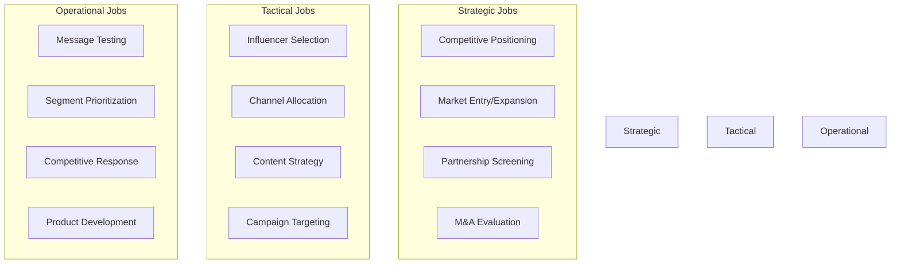

# Part 6: Jobs-to-be-Done Framework - Practical Applications

## From Intelligence to Action: Solving Real Strategic Problems

We've established the metrics, quadrant frameworks, and advanced interpretations. Now we translate that intelligence into specific strategic outcomes. This article organizes audience intelligence applications around the jobs decision-makers actually need to solve.

### 6.1 The Jobs-to-be-Done Structure

Different stakeholders have different questions. A CMO deciding on market positioning needs different intelligence than a partnerships manager evaluating collaboration opportunities or a media planner allocating budget.

**The framework organizes jobs by stakeholder and strategic question:**

Each job requires specific metrics, interpretations, and decision frameworks.

### 6.2 Strategic Jobs

#### Job 1: Competitive Positioning - "Where Should We Position Relative to Competitors?"

**The Challenge:**

Your brand sits in a crowded category. Leadership needs to decide: differentiate, compete head-on, or find whitespace?

**Intelligence Required:**

- Symmetric vs. asymmetric competitive dynamics
- Audience overlap patterns across all category players
- Psychographic differentiation opportunities
- Whitespace in competitive landscape



**Context:** Mid-tier athletic apparel brand with $50M annual revenue, competing against giants (Nike, Adidas) and DTC upstarts.

**Step 1: Map Competitive Landscape**

Analyze audience overlap with all major players:

|Competitor|Reach into Your Audience|Your Penetration into Theirs|Affinity|Quadrant Position|
|---|---|---|---|---|
|Nike|68%|3.1%|1.8x|Asymmetric Threat|
|Adidas|52%|2.8%|1.6x|Asymmetric Threat|
|Under Armour|41%|18%|2.4x|Symmetric Competition|
|Lululemon|23%|8.2%|3.1x|Asymmetric (moderate)|
|DTC Brand A|15%|31%|4.2x|Niche Dominance (yours)|
|DTC Brand B|28%|6.1%|2.8x|Asymmetric Threat (emerging)|

**Step 2: Identify Psychographic Differentiation**

Analyze what your audience cares about vs. competitors' audiences:

**Your audience distinctive affinities (vs. Nike/Adidas):**

- Sustainability brands: 18x (vs. 3.2x for Nike/Adidas)
- Ethical manufacturing content: 22x (vs. 2.1x)
- Community fitness groups: 12x (vs. 4.3x)
- Local running clubs: 28x (vs. 5.1x)

**Nike/Adidas audience distinctive affinities:**

- Professional sports leagues: 8.2x (vs. 3.1x for you)
- Celebrity athletes: 11x (vs. 2.3x)
- Fashion/streetwear: 6.5x (vs. 1.8x)
- Gaming/esports: 5.4x (vs. 0.9x)

**Interpretation:**

 You're not competing for the same audience as Nike/Adidas despite category similarity. They own "performance via celebrity/culture," you attract "performance via community/values." 

**Step 3: Find Whitespace**

Cross-reference all competitor audiences to find underserved segments:

**Segment Discovery:**

Within the broader "athletic apparel" market, identify audience clusters not strongly served by any player:

- **"Conscious Performance Athletes"** (23% of addressable market)
    - High sustainability concern (18x affinity)
    - Performance-focused but values-driven
    - Currently split between you (weak), Patagonia (outdoor, not athletic), and nobody
- **"Community Fitness Enthusiasts"** (31% of addressable market)
    - Local running clubs, CrossFit boxes, group training
    - Currently underserved by all major brands (Nike/Adidas too mass-market, DTC too online-only)

**Step 4: Strategic Positioning Decision**

 

**Option A: Compete Head-On with Nike/Adidas**

- Required: Massive marketing budget ($100M+)
- Competitive angle: Better performance technology
- **Risk:** Asymmetric competition, they outspend you 10:1
- **Likelihood of success:** Low

 

**Option B: Own "Conscious Performance" Whitespace**

- Required: Credible sustainability credentials + performance proof
- Competitive angle: "Performance that doesn't compromise values"
- **Opportunity:** 23% of market underserved, your audience already over-indexes 5.6x
- **Likelihood of success:** High

 

**Recommended Position:**

 **"Performance Apparel for the Conscious Athlete"**

- Differentiate from Nike/Adidas on values (sustainability, ethical manufacturing, community)
- Compete with Under Armour on performance credentials
- Capture "Conscious Performance Athletes" and "Community Fitness Enthusiasts" whitespace
- Avoid competing on celebrity/culture (Nike's strength) or pure price (DTC strength)

**Rationale:** Your audience already shows 5.6x higher affinity for this positioning vs. Nike/Adidas audiences. You're not creating a new position; you're owning one your audience already values. 

**Step 5: Validate with Competitive Response Scenarios**

**If Nike/Adidas respond:**

- They struggle with authenticity (hard to position $100B corporations as "community-focused")
- Their celebrity-athlete model conflicts with grassroots positioning
- Sustainability pivot would take 3-5 years to build credibility

**If DTC brands respond:**

- They lack your distribution (retail presence, scale)
- You have resources for better performance R&D
- You can out-invest them in community partnerships

**Defensibility:** High. This positioning leverages strengths competitors can't easily match.



**Key Metrics for This Job:**

- Reach and penetration across all competitors (quadrant mapping)
- Affinity pattern differentiation (psychographic gaps)
- Whitespace analysis (underserved segments)
- Competitive response probability (can they credibly attack your position?)

---

#### Job 2: Market Entry Validation - "Should We Enter This Adjacent Category?"

**The Challenge:**

Your brand considers expanding into an adjacent category. How do you validate demand without expensive market research?

**Intelligence Required:**

- Audience affinity for target category
- Overlap with successful players in that category
- Psychographic alignment with category motivations
- Competitive intensity in target space



**Context:** Recovery footwear brand (100K audience) considering launching compression socks/sleeves for athletes.

**Step 1: Validate Category Affinity**

Analyze your audience's engagement with compression gear category:

|Signal|Reach|Affinity|Interpretation|
|---|---|---|---|
|Compression gear brands (general)|18.3%|42x|Strong category interest|
|PRO Compression (leading brand)|12.7%|119x|Extremely high affinity with leader|
|CEP Compression|8.1%|87x|High affinity with premium brand|
|Generic compression socks|22.1%|12x|Broader but weaker interest|

**Interpretation:**

High affinity (42-119x) with specialized compression brands indicates your audience values performance compression, not just generic support. This is a genuine interest, not casual.

**Step 2: Assess Audience Overlap with Category Leaders**

|Competitor|Your Audience Reach|Your Penetration into Theirs|Strategic Position|
|---|---|---|---|
|PRO Compression|12.7%|31%|Niche Dominance (yours)|
|CEP Compression|8.1%|18%|Moderate overlap|
|2XU Compression|6.2%|9.1%|Low overlap|

**Interpretation:**

- You've already captured 31% of PRO Compression's audience (niche dominance)
- These are your most serious athletes (Dedicated Athletes segment)
- They're already buying compression elsewhere; you could serve them

**Step 3: Psychographic Alignment Check**

Why does your audience care about compression?

Cross-reference affinities:

**Compression users in your audience show:**

- Marathon training content: 67x affinity
- Recovery-focused nutrition: 52x affinity
- Sports medicine content: 41x affinity
- Performance optimization: 38x affinity

**Motivation alignment:**

 Your audience views compression the same way they view your footwear: as **performance recovery tools**, not fashion accessories. The psychographic alignment is perfect. 

**Step 4: Competitive Intensity Analysis**

Map competitive landscape in compression category:

 

**Established Players:**

- PRO Compression (symmetric competition likely)
- CEP (European premium, moderate competition)
- 2XU (Australian, minimal overlap)

**Market characteristics:**

- Moderate competition (not dominated by single giant)
- Multiple price tiers viable
- Technology differentiation possible

 

**Your Advantages:**

- Existing recovery footwear credibility
- Direct audience overlap (31% of PRO's audience)
- "Complete recovery system" positioning
- Retail distribution already established

**Risks:**

- Symmetric competition with PRO Compression
- Product development costs
- Manufacturing expertise gap

 

**Step 5: Quantify Opportunity**

**Addressable market within your audience:**

- 18.3% show strong compression interest (18,300 people)
- At $30 average order value, 25% conversion = $137,250 revenue
- With bundles (footwear + compression), potential $250K+ incremental

**Investment required:**

- Product development: $150K
- Manufacturing setup: $100K
- Marketing: $75K
- **Total: $325K**

**Decision Framework:**

 

**Go if:**

- Expected Year 1 revenue >$200K (achievable at 25% conversion)
- Can differentiate via technology or positioning
- Willing to accept symmetric competition with PRO
- "Complete recovery system" positioning resonates

 

**Don't go if:**

- Cannot achieve meaningful product differentiation
- Unwilling to invest in ongoing R&D
- Compression becomes distraction from core footwear
- Market research shows lower conversion potential

 

**Validation Checkpoints:**

Before full launch, validate assumptions:

1. **Survey overlap segment (12.7% who buy PRO Compression):**
    - Would you buy compression from [Recovery Footwear Brand]?
    - What would make you switch from current brand?
2. **Test bundle offer:**
    - To existing customers: "Recovery footwear + compression bundle, 20% off"
    - Measure interest/conversion
3. **Limited prototype run:**
    - 500-unit production
    - Sell to top 5% most engaged customers
    - Measure NPS and repeat purchase

**Recommended Decision:**

 **PROCEED with phased approach:**

**Phase 1 (3 months):** Validation

- Survey overlap segment
- Test bundle offer
- Limited prototype to top customers

**Phase 2 (6 months):** Limited launch if validation succeeds

- 5,000-unit production
- Target "Dedicated Athletes" segment only
- "Complete Recovery System" positioning

**Phase 3 (12 months):** Scale if Phase 2 hits targets

- Expand to broader segments
- Retail distribution
- Full marketing push

**Rationale:** High audience affinity (42-119x), strong overlap with category leaders (31% penetration), psychographic alignment (recovery mindset), and manageable competitive intensity justify entry. Phased approach mitigates risk. 



**Key Metrics for This Job:**

- Category affinity (do they care about this category?)
- Overlap with category leaders (are they already buying?)
- Psychographic alignment (why do they buy? does it match your brand?)
- Competitive intensity (how hard to win?)
- Market size within your audience (revenue potential)

---

#### Job 3: Partnership Screening - "Should We Partner with Brand X?"

**The Challenge:**

Another brand proposes a co-marketing partnership. How do you evaluate fit beyond surface-level appeal?

**Intelligence Required:**

- Audience overlap (do they reach your audience?)
- Psychographic alignment (do motivations match?)
- Competitive dynamics (are you actually competitors?)
- Brand values compatibility



**Context:** Fitness tracking app (250K users) receives partnership proposal from meal prep delivery service.

**Partnership Proposal:**

- Co-branded "Fitness + Nutrition" bundle
- Cross-promotion in both apps
- Shared content creation
- Revenue share on new customer acquisition

**Step 1: Audience Overlap Analysis**

|Metric|Measurement|
|---|---|
|Meal prep service audience|180K users|
|Overlap|47,000 users (both products)|
|Reach (your audience → theirs)|18.8% (47K / 250K)|
|Penetration (yours into theirs)|26.1% (47K / 180K)|
|Affinity|4.2x|

**Initial verdict:** Moderate overlap (18.8% reach), strong penetration (26.1%), elevated affinity (4.2x). Promising but requires deeper validation.

**Step 2: Psychographic Alignment Check**

Analyze the 47K overlap segment to understand shared motivations:

**What drives people who use both products?**

|Interest/Motivation|Overlap Segment Affinity|Your Core Audience|Their Core Audience|
|---|---|---|---|
|Performance optimization|28x|22x|18x|
|Holistic wellness|31x|18x|24x|
|Time efficiency|42x|28x|38x|
|Nutrition science|38x|12x|41x|

**Interpretation:**

 The overlap segment is highly motivated by **holistic optimization** and **time efficiency**. They view fitness and nutrition as integrated system, not separate activities. 

This is perfect alignment for partnership positioning: "Complete optimization system."

**Step 3: Competitive Dynamics Check**

Are you actually competitors or complementary?

**Budget competition test:**

Survey overlap segment:

- "When you started using [Meal Prep Service], did you reduce spending on [Fitness App]?"
    - Yes: 4%
    - No: 96%

**Time competition test:**

- "Do you use [Meal Prep Service] and [Fitness App] for the same purpose or different purposes?"
    - Same purpose: 2%
    - Different but related purposes: 98%

**Verdict:** Complementary, not competitive. They solve different problems in the same optimization journey.

**Step 4: Brand Values Compatibility**

Analyze both audiences' broader affinities:

 

**Your Audience Values:**

- Scientific approach: 18x affinity for research content
- Data-driven: 22x affinity for quantified self
- Performance: 28x affinity for athletic achievement
- Community: 12x affinity for fitness communities

 

**Their Audience Values:**

- Nutrition science: 41x affinity
- Sustainability: 28x affinity (organic, local sourcing)
- Convenience: 38x affinity for time-saving services
- Wellness: 24x affinity for holistic health

 

**Alignment check:**

 **Strong alignment:**

- Science/evidence-based approach (both high)
- Holistic wellness (both elevated)
- Performance optimization (complementary angles)

**Potential friction:**

- Sustainability: Their audience 28x, yours 8x
- Community: Your audience 12x, theirs 3x

**Resolution:** Position partnership around shared values (science, optimization), acknowledge different emphases. 

**Step 5: Partnership Value Quantification**

**For your fitness app:**

Potential to reach their non-overlapping audience:

- Their audience: 180K
- Already overlap: 47K
- Net new addressable: 133K
- If partnership drives 5% conversion: 6,650 new users
- At $15/month LTV over 12 months: $1.2M incremental revenue

**For meal prep service:**

Potential to reach your non-overlapping audience:

- Your audience: 250K
- Already overlap: 47K
- Net new addressable: 203K
- If partnership drives 3% conversion: 6,090 new customers
- At $120/month LTV over 6 months: $4.4M incremental revenue

**Value exchange assessment:**

They gain more absolute revenue potential ($4.4M vs. $1.2M), but you gain higher percentage growth (6,650 / 250K = 2.7% vs. 6,090 / 180K = 3.4%).

**Fair partnership structure:**

- Revenue share: 60/40 in their favor (reflects their higher absolute value)
- Marketing contribution: Equal investment in co-branded content
- Brand exposure: Equal prominence in all materials

**Step 6: Risk Assessment**

 

**Partnership Risks:**

- Brand dilution if messaging becomes too broad
- Dependency on their business stability
- Potential conflicts if either pivots strategy
- Customer confusion about value proposition

 

**Mitigation Strategies:**

- Clear partnership agreement (12-month pilot, renewable)
- Distinct positioning ("fitness" + "nutrition" = "complete system")
- Separate branding with co-branded elements
- Exit clauses if strategic direction diverges

 

**Decision Framework:**



**PROCEED if:**

- ✅ Audience overlap 15%+ (actual: 18.8%)
- ✅ Psychographic alignment strong (actual: excellent)
- ✅ Complementary, not competitive (actual: 96% see as different purposes)
- ✅ Values compatibility high (actual: strong on core dimensions)
- ✅ Quantified value >$1M for both parties (actual: yes)

**NEGOTIATE STRUCTURE:**

- 12-month pilot partnership
- 60/40 revenue share (reflects value asymmetry)
- Equal marketing investment
- Quarterly review of performance metrics
- Exit clause if conversion <2% for either party

**SUCCESS METRICS:**

- 5% conversion of addressable audience (6,650 new users for you)
- NPS >50 among partnership-acquired customers
- Retention >70% at 6 months
- Revenue attribution: $1.2M+ over 12 months 



**Key Metrics for This Job:**

- Audience overlap (reach and penetration)
- Psychographic alignment (shared motivations)
- Competitive vs. complementary dynamic
- Brand values compatibility
- Quantified value potential for both parties

---

### 6.3 Tactical Jobs

#### Job 4: Influencer Selection - "Which Influencers Should We Partner With?"

**The Challenge:**

You have budget for 3-5 influencer partnerships. Hundreds of potential candidates. How do you systematically evaluate beyond follower counts and engagement rates?

**Intelligence Required:**

- Audience overlap (do their followers match yours?)
- Psychographic alignment (do their followers share your audience's motivations?)
- Content-audience fit (does their content style match your brand?)
- Cost-effectiveness (ROI potential)



**Context:** Recovery footwear brand, $200K annual influencer budget, choosing 3-5 partners from 10 candidates.

**Step 1: Audience Overlap Scoring**

|Influencer|Followers|Your Audience Overlap|Reach|Affinity|Platform|
|---|---|---|---|---|---|
|A - Elite Marathon Runner|85K|28K|28%|42x|Instagram/Twitter|
|B - Fitness Lifestyle Blogger|420K|3.2K|3.2%|1.1x|Instagram|
|C - Running Coach|52K|19K|19%|51x|Twitter/YouTube|
|D - CrossFit Athlete|180K|8.1K|8.1%|6.2x|Instagram|
|E - Physical Therapist|28K|11K|11%|68x|Instagram/Twitter|
|F - Wellness Influencer|850K|12K|12%|0.2x|Instagram/TikTok|
|G - Ultra-Runner|34K|9.8K|9.8%|87x|Instagram|
|H - Sports Nutritionist|67K|14K|14%|38x|Instagram/Twitter|
|I - Casual Fitness Mom-Blogger|290K|2.1K|2.1%|0.9x|Instagram/Blog|
|J - Triathlete|95K|16K|16%|28x|Instagram/Twitter|

**Initial filtering (remove poor fits):**

 **Remove:**

- Influencer B (3.2% reach, 1.1x affinity - no audience alignment)
- Influencer F (0.2x affinity - wrong audience despite 12% reach)
- Influencer I (2.1% reach, 0.9x affinity - minimal overlap)

**Rationale:** Low reach AND low affinity indicate audience mismatch. Even if campaigns drive awareness, conversion will be poor. 

**Remaining candidates:**

|Influencer|Reach|Affinity|Combined Score|
|---|---|---|---|
|A - Elite Runner|28%|42x|High|
|C - Running Coach|19%|51x|High|
|D - CrossFit Athlete|8.1%|6.2x|Medium-Low|
|E - Physical Therapist|11%|68x|High|
|G - Ultra-Runner|9.8%|87x|High|
|H - Sports Nutritionist|14%|38x|High|
|J - Triathlete|16%|28x|Medium-High|

**Step 2: Psychographic Alignment Deep-Dive**

For top candidates, analyze their followers' motivations:

**Influencer A (Elite Marathon Runner) - Follower Profile:**

- Performance optimization: 52x affinity
- Competitive achievement: 48x affinity
- Training science: 38x affinity
- **Segment fit:** Dedicated Athletes (primary), Informed Citizens (secondary)

**Influencer C (Running Coach) - Follower Profile:**

- Training methodology: 61x affinity
- Injury prevention: 42x affinity
- Community support: 28x affinity
- **Segment fit:** Dedicated Athletes (primary), Health-Conscious Family Managers (secondary)

**Influencer E (Physical Therapist) - Follower Profile:**

- Injury recovery: 78x affinity
- Pain management: 68x affinity
- Biomechanics: 52x affinity
- **Segment fit:** All segments (broad appeal through recovery angle)

**Influencer G (Ultra-Runner) - Follower Profile:**

- Extreme endurance: 92x affinity
- Mental toughness: 58x affinity
- Adventure/exploration: 41x affinity
- **Segment fit:** Dedicated Athletes (niche subset - ultra-runners)

**Influencer H (Sports Nutritionist) - Follower Profile:**

- Nutrition science: 72x affinity
- Performance fueling: 48x affinity
- Holistic wellness: 38x affinity
- **Segment fit:** Dedicated Athletes, Health-Conscious Family Managers

**Step 3: Content-Brand Fit Analysis**

Review content style and brand safety:

|Influencer|Content Style|Brand Safety|Authenticity Score|
|---|---|---|---|
|A - Elite Runner|Race recaps, training logs, sponsor posts|High|8/10 (some over-promotion)|
|C - Running Coach|Educational, how-to, community Q&A|Very High|10/10 (pure value)|
|E - Physical Therapist|Educational, injury prevention, recovery tips|Very High|9/10 (occasionally promotional)|
|G - Ultra-Runner|Adventure storytelling, race docs, gear reviews|High|9/10 (authentic gear enthusiasm)|
|H - Sports Nutritionist|Meal prep, supplement guides, science explainers|High|8/10 (some supplement sponsorships)|

**Step 4: Cost-Effectiveness Assessment**

Estimate costs and ROI potential:

|Influencer|Estimated Cost|Reach|Cost per 1K Reach|Predicted Conversion|Cost per Acquisition|
|---|---|---|---|---|---|
|A - Elite Runner|$15K|28K|$536|12% (3,360)|$4.46|
|C - Running Coach|$8K|19K|$421|18% (3,420)|$2.34|
|E - Physical Therapist|$6K|11K|$545|22% (2,420)|$2.48|
|G - Ultra-Runner|$5K|9.8K|$510|15% (1,470)|$3.40|
|H - Sports Nutritionist|$10K|14K|$714|14% (1,960)|$5.10|

**Step 5: Portfolio Construction**

With $200K budget, construct optimal influencer portfolio:

 

**Tier 1: Core Partners (3 influencers, $60K total)**

These form the foundation - high reach, strong alignment, proven conversion:

**Influencer C - Running Coach** ($8K)

- Best cost-per-acquisition ($2.34)
- Broad segment appeal
- Educational content matches brand values

**Influencer E - Physical Therapist** ($6K)

- Highest psychographic alignment (recovery focus)
- Reaches all segments
- Strong authenticity

**Influencer A - Elite Runner** ($15K)

- Highest absolute reach (28K)
- Aspirational credibility
- Dedicated Athletes segment

 

**Tier 2: Niche Amplifiers (2 influencers, $25K total)**

Target specific segments or use cases:

**Influencer G - Ultra-Runner** ($5K)

- Reaches ultra-running niche (high passion, high loyalty)
- Authentic product integration
- Premium brand association

**Influencer H - Sports Nutritionist** ($10K)

- Holistic wellness positioning
- Reaches Health-Conscious Family Managers
- Nutrition-recovery connection

 

**Remaining budget allocation ($115K):**

- Micro-influencer program ($40K across 15-20 micro-influencers with 5K-15K followers each)
- Content production with Tier 1 partners ($30K for high-quality video/photo assets)
- Paid amplification of influencer content ($25K media spend)
- Testing budget ($20K for 3-month trial with 2 additional candidates)

**Expected Results:**

 

**Primary Metrics:**

- Total reach: ~95K people (overlap-adjusted)
- Predicted conversions: 12,630 (13.3% avg conversion)
- Cost per acquisition: $3.17 average
- Revenue at $75 AOV: $947,250
- ROI: 4.7x

 

**Secondary Benefits:**

- Content assets for owned channels
- Brand credibility via association
- Audience insights from influencer feedback
- Long-term relationship building

 

**Step 6: Success Measurement Framework**

**Track by influencer:**

- Attributed conversions (unique promo codes)
- Engagement rate on co-created content
- Audience growth from partnership
- NPS of acquired customers

**Track by segment:**

- Which segments convert best via which influencers?
- Segment-specific messaging effectiveness
- Long-term retention by acquisition source

**Quarterly review:**

- Renew top performers
- Replace underperformers
- Adjust budget allocation based on results

 **Selected Portfolio:**

**Tier 1 Core ($29K):**

- Running Coach ($8K) - best efficiency
- Physical Therapist ($6K) - best alignment
- Elite Runner ($15K) - best reach

**Tier 2 Niche ($15K):**

- Ultra-Runner ($5K) - niche credibility
- Sports Nutritionist ($10K) - holistic positioning

**Supporting Programs ($156K):**

- Micro-influencer network
- Content production
- Paid amplification
- Testing new partners

**Expected ROI:** 4.7x over 12 months 



**Key Metrics for This Job:**

- Audience overlap (reach and penetration)
- Psychographic alignment (follower motivations match yours)
- Content-brand fit (style and authenticity)
- Cost-effectiveness (cost per acquisition, ROI)
- Portfolio balance (coverage across segments and use cases)

---

#### Job 5: Channel Budget Allocation - "How Should We Split Our Media Budget?"

**The Challenge:**

You have a fixed media budget. Dozens of potential channels (social platforms, traditional media, events, retail partnerships). How do you allocate efficiently?

**Intelligence Required:**

- Channel effectiveness by segment
- Platform-specific audience behavior
- Cost-efficiency comparison
- Sequential touchpoint optimization



**Context:** Consumer health brand, 4 audience segments, $500K annual media budget to allocate across channels.

**Step 1: Map Audience Presence by Channel**

| Channel            | Segment A Reach | Segment B Reach | Segment C Reach | Segment D Reach | Weighted Avg Reach | Affinity |
| ------------------ | --------------- | --------------- | --------------- | --------------- | ------------------ | -------- |
| Instagram          | 78%             | 68%             | 45%             | 52%             | 64%                | 2.8x     |
| Facebook           | 52%             | 71%             | 68%             | 59%             | 63%                | 1.4x     |
| Twitter            | 41%             | 28%             | 18%             | 62%             | 35%                | 1.8x     |
| TikTok             | 12%             | 8%              | 4%              | 7%              | 8%                 | 0.6x     |
| YouTube            | 68%             | 72%             | 58%             | 64%             | 66%                |2.1x      |
| Podcasts           | 34%             | 42%             | 31%             | 58%             | 41%                | 3.2x     |
| Trade Magazines    | 28%             | 12%             | 8%              | 71%             | 28%                | 12x      |
| Events/Conferences | 18%             | 8%              | 6%              | 34%             | 16%                | 8.4x     |
| Streaming TV       | 58%             | 64%             | 72%             | 48%             | 61%                | 1.2x     |
| Retail Co-op | 42% | 58% | 68% | 31% | 51% | 4.1x |

**Initial observations:**

- Instagram, YouTube, Facebook have broad reach (60%+) but moderate affinity
- Trade magazines, podcasts have lower reach but very high affinity (12x, 3.2x)
- TikTok has low reach AND low affinity (wrong audience)

**Step 2: Segment-Specific Channel Performance**

Analyze which channels work best for which segments:

**Segment A (Performance Optimizers - 30% of audience):**

- Top channels: Instagram (78%), YouTube (68%), Podcasts (34%)
- High affinity: Trade magazines (12x), Events (8.4x)
- Conversion behavior: Research-heavy, needs proof before purchase

**Segment B (Family Managers - 40% of audience):**

- Top channels: Facebook (71%), YouTube (72%), Instagram (68%)
- High affinity: Retail co-op (4.1x - they shop in-store)
- Conversion behavior: Value-driven, needs convenience

**Segment C (Comfort Seekers - 20% of audience):**

- Top channels: Streaming TV (72%), Facebook (68%), Retail (68%)
- High affinity: Retail co-op (strong in-store preference)
- Conversion behavior: Impulse + need-based, needs visibility

**Segment D (Informed Citizens - 10% of audience):**

- Top channels: Twitter (62%), Trade magazines (71%), YouTube (64%)
- High affinity: Trade magazines (12x), Podcasts (3.2x)
- Conversion behavior: Evidence-driven, needs credibility

**Step 3: Cost-Efficiency Analysis**

Estimate cost per thousand impressions (CPM) and cost per acquisition (CPA) by channel:

|Channel|Est. CPM|Est. CPA|Reach Potential|Conversion Rate|
|---|---|---|---|---|
|Instagram|$8|$12|High|3.2%|
|Facebook|$6|$15|High|2.8%|
|Twitter|$7|$18|Medium|2.1%|
|YouTube|$12|$14|High|3.0%|
|Podcasts|$25|$22|Medium|4.1%|
|Trade Magazines|$40|$35|Low|5.8%|
|Events/Conferences|$150 per attendee|$120|Low|8.2%|
|Streaming TV|$18|$28|High|1.8%|
|Retail Co-op|$30 (per store per month)|$25|Medium|4.5%|

**Step 4: Portfolio Optimization Model**

Allocate budget to maximize conversions while covering all segments:

**Allocation Strategy:**

 

**Tier 1: Foundation Channels (60% = $300K)**

Broad reach, decent efficiency:

**YouTube ($120K)**

- 66% reach across all segments
- 3.0% conversion, $14 CPA
- Expected: 8,571 conversions

**Instagram ($100K)**

- 64% reach, strong with Segments A & B
- 3.2% conversion, $12 CPA
- Expected: 8,333 conversions

**Facebook ($80K)**

- 63% reach, strong with Segments B & C
- 2.8% conversion, $15 CPA
- Expected: 5,333 conversions

**Total Tier 1:** 22,237 conversions

 

**Tier 2: High-Affinity Channels (25% = $125K)**

Lower reach but higher conversion:

**Retail Co-op ($60K)**

- 51% reach, excellent for Segments B & C
- 4.5% conversion, $25 CPA
- Expected: 2,400 conversions

**Podcasts ($40K)**

- 41% reach, strong with Segments A & D
- 4.1% conversion, $22 CPA
- Expected: 1,818 conversions

**Trade Magazines ($25K)**

- 28% reach, dominant with Segment D
- 5.8% conversion, $35 CPA
- Expected: 714 conversions

**Total Tier 2:** 4,932 conversions

 

**Tier 3: Experimental/Niche (15% = $75K)**

Test and learn:

**Events/Conferences ($40K)**

- 16% reach, Segments A & D
- 8.2% conversion, $120 CPA
- Expected: 333 high-quality conversions

**Streaming TV ($35K)**

- 61% reach, brand awareness play
- 1.8% conversion, $28 CPA
- Expected: 1,250 conversions

**Testing Budget ($0K reserved separately)**

**Total Tier 3:** 1,583 conversions

 

**Total Expected Conversions:** 28,752 (blended CPA: $17.38)

**Step 5: Sequential Touchpoint Strategy**

Don't treat channels as independent. Design sequential journeys:

**Journey 1: "Research to Purchase" (Segment A & D)**

mermaid

**Journey 2: "Awareness to In-Store" (Segment B & C)**

mermaid

**Budget allocation must support these journeys, not just maximize single-channel efficiency.**

**Step 6: Measurement and Optimization Framework**

**Track by channel:**

- Direct conversions (last-touch attribution)
- Assisted conversions (multi-touch attribution)
- Brand lift studies (for awareness channels like Streaming TV)
- Cost per acquisition trends

**Track by segment:**

- Which segments convert via which channels?
- Channel mix optimization by segment
- Lifetime value by acquisition channel

**Quarterly rebalancing:**

- Shift budget from underperforming channels
- Increase investment in over-performing channels
- Test new channels with 5-10% of budget

 **$500K Total Media Budget:**

**Foundation (60% = $300K):**

- YouTube: $120K (broad reach, video content strength)
- Instagram: $100K (visual product showcase, Segments A & B)
- Facebook: $80K (Segments B & C, community building)

**High-Affinity (25% = $125K):**

- Retail Co-op: $60K (in-store visibility, Segments B & C conversion)
- Podcasts: $40K (depth and credibility, Segments A & D)
- Trade Magazines: $25K (authority building, Segment D)

**Experimental (15% = $75K):**

- Events: $40K (high-quality leads, Segments A & D)
- Streaming TV: $35K (brand awareness, mass reach)

**Expected Results:**

- 28,752 total conversions
- Blended CPA: $17.38
- Coverage across all segments
- Supporting sequential journeys 



**Key Metrics for This Job:**

- Channel reach by segment
- Channel affinity (how much over-indexed vs. general population)
- Cost-efficiency (CPM, CPA)
- Conversion rates by channel and segment
- Multi-touch attribution (sequential journey support)

---

This covers the first set of strategic and tactical jobs-to-be-done. Part 7 will continue with additional operational jobs (message testing, segment prioritization, competitive response, product development) and platform-specific applications (when to combine vs. separate Twitter and Instagram signals).