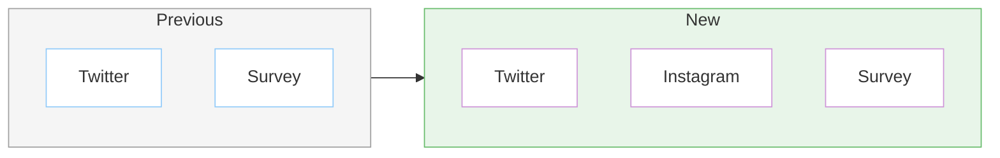
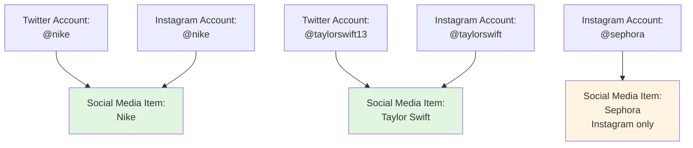
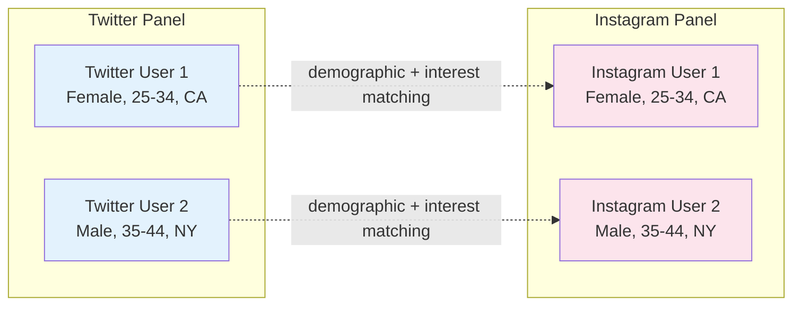
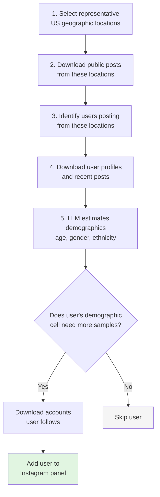
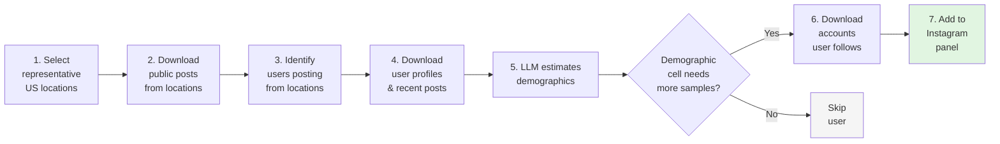
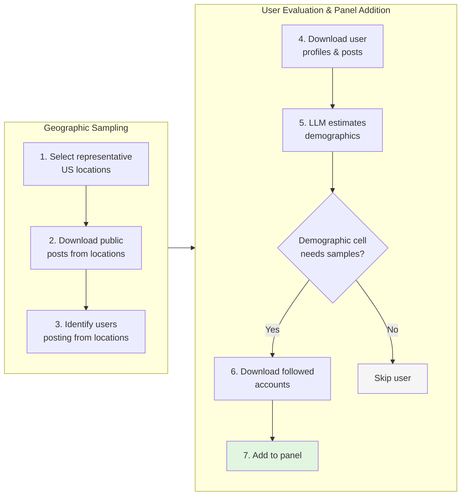
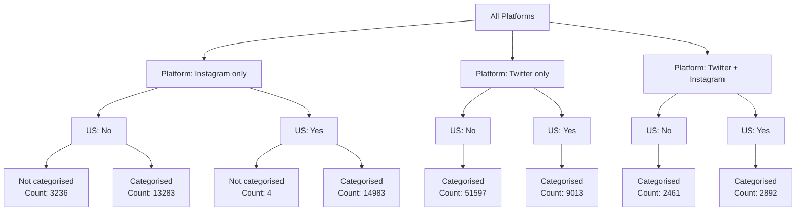

```mermaid
graph LR
    subgraph Previous
    direction TB
    P1[Twitter]
    P2[Survey]
    end

    subgraph New
    direction TB
    N1[Twitter]
    N2[Instagram]
    N3[Survey]
    end

    Previous --> New
    style Previous fill:#f5f5f5,stroke:#9e9e9e,stroke-width:1px
    style New fill:#e8f5e9,stroke:#66bb6a,stroke-width:1px

    style P1 fill:#ffffff,stroke:#90caf9
    style P2 fill:#ffffff,stroke:#90caf9
    style N1 fill:#ffffff,stroke:#ce93d8
    style N2 fill:#ffffff,stroke:#ce93d8
    style N3 fill:#ffffff,stroke:#ce93d8
```

```mermaid
graph TD
    A[Twitter Account:<br/>@nike] --> C[Social Media Item:<br/>Nike]
    B[Instagram Account:<br/>@nike] --> C
    D[Twitter Account:<br/>@taylorswift13] --> E[Social Media Item:<br/>Taylor Swift]
    F[Instagram Account:<br/>@taylorswift] --> E
    G[Instagram Account:<br/>@sephora] --> H[Social Media Item:<br/>Sephora<br/>Instagram only]
    style C fill:#e1f5e1
    style E fill:#e1f5e1
    style H fill:#fff4e1
```

```mermaid
graph LR
    subgraph Twitter Panel
    T1[Twitter User 1<br/>Female, 25-34, CA]
    T2[Twitter User 2<br/>Male, 35-44, NY]
    end
    
    subgraph Instagram Panel
    I1[Instagram User 1<br/>Female, 25-34, CA]
    I2[Instagram User 2<br/>Male, 35-44, NY]
    end
    
    T1 -.demographic + interest matching.-> I1
    T2 -.demographic + interest matching.-> I2
    
    style T1 fill:#e3f2fd
    style T2 fill:#e3f2fd
    style I1 fill:#fce4ec
    style I2 fill:#fce4ec
```

```mermaid
graph TD
    A[1. Select representative<br/>US geographic locations] --> B[2. Download public posts<br/>from these locations]
    B --> C[3. Identify users posting<br/>from these locations]
    C --> D[4. Download user profiles<br/>and recent posts]
    D --> E[5. LLM estimates demographics<br/>age, gender, ethnicity]
    E --> F{Does user's demographic<br/>cell need more samples?}
    F -->|Yes| G[Download accounts<br/>user follows]
    G --> H[Add user to<br/>Instagram panel]
    F -->|No| I[Skip user]
    
    style H fill:#e1f5e1
    style I fill:#f5f5f5
```

```mermaid
graph LR
    A[1. Select<br/>representative<br/>US locations] --> B[2. Download<br/>public posts<br/>from locations]
    B --> C[3. Identify<br/>users posting<br/>from locations]
    C --> D[4. Download<br/>user profiles<br/>& recent posts]
    D --> E[5. LLM estimates<br/>demographics]
    E --> F{Demographic<br/>cell needs<br/>more samples?}
    F -->|Yes| G[6. Download<br/>accounts<br/>user follows]
    G --> H[7. Add to<br/>Instagram<br/>panel]
    F -->|No| I[Skip<br/>user]
    
    style H fill:#e1f5e1
    style I fill:#f5f5f5
```

```mermaid
flowchart LR
    subgraph Phase1["Geographic Sampling"]
        direction TB
        A[1. Select representative<br/>US locations]
        B[2. Download public<br/>posts from locations]
        C[3. Identify users<br/>posting from locations]
        A --> B --> C
    end
    
    subgraph Phase2["User Evaluation & Panel Addition"]
        direction TB
        D[4. Download user<br/>profiles & posts]
        E[5. LLM estimates<br/>demographics]
        F{Demographic cell<br/>needs samples?}
        G[6. Download followed<br/>accounts]
        H[7. Add to panel]
        I[Skip user]
        D --> E --> F
        F -->|Yes| G --> H
        F -->|No| I
    end
    
    Phase1 --> Phase2
    
    style H fill:#e1f5e1
    style I fill:#f5f5f5
```

```mermaid
flowchart TD
    Root[All Platforms]

    Root --> I[Platform: Instagram only]
    Root --> T[Platform: Twitter only]
    Root --> TI[Platform: Twitter + Instagram]

    I --> I0[US: No]
    I --> I1[US: Yes]

    I0 --> I00[Not categorised<br/>Count: 3236]
    I0 --> I01[Categorised<br/>Count: 13283]

    I1 --> I10[Not categorised<br/>Count: 4]
    I1 --> I11[Categorised<br/>Count: 14983]

    T --> T0[US: No]
    T --> T1[US: Yes]

    T0 --> T01[Categorised<br/>Count: 51597]
    T1 --> T11[Categorised<br/>Count: 9013]

    TI --> TI0[US: No]
    TI --> TI1[US: Yes]

    TI0 --> TI01[Categorised<br/>Count: 2461]
    TI1 --> TI11[Categorised<br/>Count: 2892]
```
